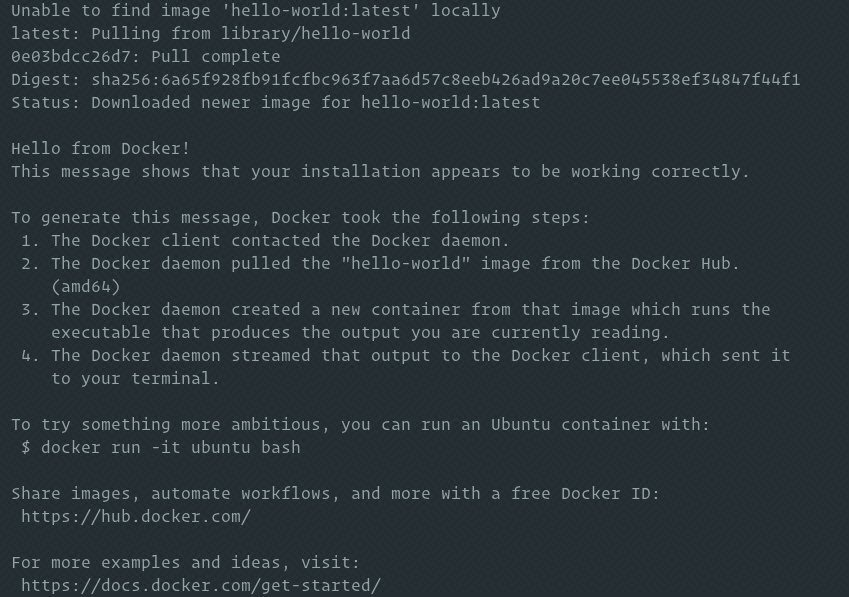

> **简介：** Docker 是一个开源的容器化平台，是现代软件开发，持续集成，持续交付的一部分。本文主要为大家讲解如何在 Ubuntu 上安装和使用 Docker。

Docker 是一个开源的容器化平台，你可以用它来构建，测试，并且作为可移动的容器去部署应用，这些容器可以在任何地方运行。一个容器表示一个应用的运行环境，并且包含软件运行所需要的所有依赖软件。
Docker 是现代软件开发，持续集成，持续交付的一部分。
本文将为大家介绍如何在 Ubuntu 上安装 Docker。
Docker 在标准的 Ubuntu 20.04 软件源中可用，但是可能不是最新的版本。我们将会从 Docker 的官方软件源中安装最新的 Docker 软件包。

### 一、安装 Docker

在 Ubuntu 上安装 Docker 非常方便。通过 Docker 软件源，导入 GPG key，就可以安装软件包。
首先，更新软件包索引，并且安装必要的依赖软件，来添加一个新的 HTTPS 软件源：

```shell
sudo apt update
sudo apt install apt-transport-https ca-certificates curl gnupg-agent software-properties-common
```

使用下面的 curl 导入源仓库的 GPG key：

```shell
curl -fsSL https://download.docker.com/linux/ubuntu/gpg | sudo apt-key add -
```

将 Docker APT 软件源添加到你的系统：

```shell
sudo add-apt-repository "deb [arch=amd64] https://download.docker.com/linux/ubuntu $(lsb_release -cs) stable"
```

现在，Docker 软件源被启用了，你可以安装软件源中任何可用的 Docker 版本。

a. 运行下面的命令来安装 Docker 最新版本。

```shell
sudo apt update
sudo apt install docker-ce docker-ce-cli containerd.io
```

1. 安装指定版本的Docker，首先列出 Docker 软件源中所有可用的版本：

```shell
sudo apt update
apt list -a docker-ce
```

可用的 Docker 版本将会在第二列显示。如下所示在官方 Docker 软件源中只有一个 Docker 版本（5:19.03.9~3-0~ubuntu-focal）可用：

```shell
docker-ce/focal 5:19.03.9~3-0~ubuntu-focal amd64
```

通过在软件包名后面添加版本`=<VERSION>`来安装指定版本：

```shell
sudo apt install docker-ce=<VERSION> docker-ce-cli=<VERSION> containerd.io
```

安装完成后，Docker 服务将会自动启动。输入下面的命令来验证：

```shell
sudo systemctl status docker
```

输出界面如下：

```shell
● docker.service - Docker Application Container Engine
     Loaded: loaded (/lib/systemd/system/docker.service; enabled; vendor preset: enabled)
     Active: active (running) since Thu 2020-05-21 14:47:34 UTC; 42s ago
...
```

当新的 Docker 发布时，你可以使用`sudo apt update && sudo apt upgrade`命令来升级 Docker 软件包。
你可以通过锁定Docker的版本来阻止 Docker 自动更新：

```
sudo apt-mark hold docker-ce
```

### 二、验证安装过程

想要验证 Docker 是否已经成功被安装，你可以执行`docker`命令，前面不需要加`sudo, 会自动运行一个测试容器:

```shell
docker container run hello-world
```

如果本地没有该镜像，该命令将会自动下载测试镜像，并在容器中运行，输出“Hello from Docker”后退出。

输出结果如下：



Docker将会在输出结果后停止运行。
默认情况下，Docker 从 Docker Hub 拉取镜像。它是一个云端服务，主要用来储存 公有和私有源中的 Docker 镜像。

### 三、卸载 Docker

在卸载 Docker 之前，你最好移除所有的容器，镜像，卷和网络。
运行下面的命令停止所有正在运行的容器，并且移除所有的 docker 对象:

```shell
docker container stop $(docker container ls -aq)
docker system prune -a --volumes
```

接下来你可以使用`apt命令`来卸载 Docker：

```shell
sudo apt purge docker-ce
sudo apt autoremove
```

