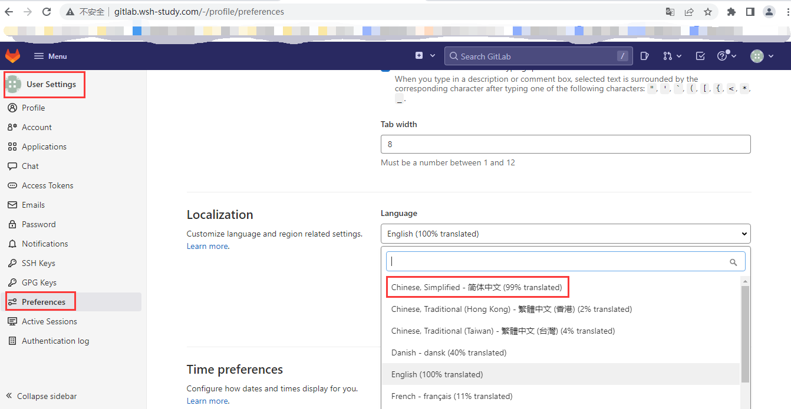
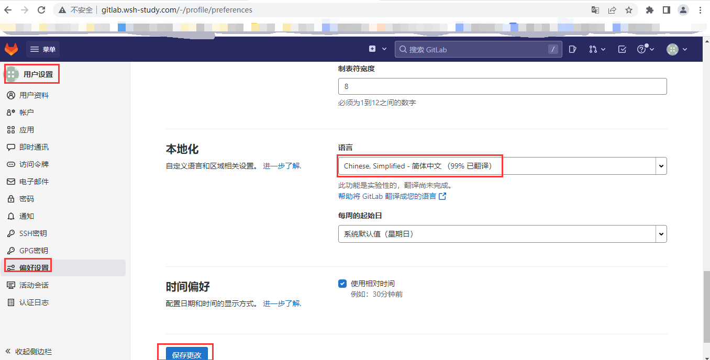

### 前言

  `gitlab`是我们国内非常好用的git仓库，但是他默认是英文版本的，很多小伙伴可能用不习惯，这里分享下他更改为中文版的办法。

### 操作

1、英文版本：登录后----setting----preferences----language---简体中文。然后别忘记刷新。

2、中文版本：登录后----设置----偏好设置----语言---简体中文。然后别忘记刷新。

