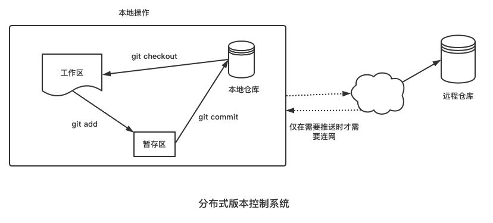
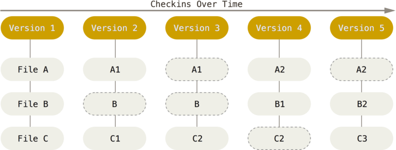

# 一文讲清Git的基础知识|Git简明教程

## 前言

对于程序员来说，`Git`应该是每天都要打交道的工具吧，但很多时候我们都只是停留在`git add`、`git push`、`git pull`等简单命令的使用上，又或者只是使用`GUI`工具(如`Sourcetree`等)点击操作而已，对Git并没有什么全面的了解，碰到问题可能需要不断上网查询。

因此，为了更好地使用Git，也为了让更全面地理解Git，就将对`Git`的学习总结为 **《 Git简明教程》** ，方便日后随时查阅，也希望对其他人有所帮助！

## Git是什么？

`Git`是一个 **分布式版本控制系统** ，而`SVN`、`CVS`等则为 **集中式版本控制系统** 。

### 分布式与集中式的区别

集中式版本控制系统的特点是需要远程服务器，如果无法连接远程服务器，我们所做的变更就无法提交，如下图所示：


而在分布式版本控制系统中，每个端都保存着仓库完整的信息，不用联网也可以查询到所有的变更历史、在本地进行commit、checkout等操作，仅当你需要将变更推送到远程仓库，才需要网络，如下图所示：



### Git有哪些特性

Git有以下几个特性：

#### 本地操作

大部分操作都在本地进行，不需要连网，本地保存着仓库的完整信息，如果远程仓库损坏，随时可以用本地仓库进行数据恢复。

#### 一个基于文件快照文件系统

Git与其他版本控制系统的其他不同之处在于Git对待数据的方式，Git就像一个小型的文件系统，在我们每次提交，对整个文件系统做一个快照。



#### 保证数据完整性

Git 中所有的数据在存储前使用哈希算法计算一个哈希值，只要内容一改变，哈希值就会发生，这样可以确保任何数据的改变都可以被Git察觉，进而保护数据的完整性。

#### 高效分支管理

一般的版本控制系统都支持分支管理，然而这些系统创建分支就是把整个系统复制一份而已，这对于大型项目来说，就很费时间了，而Git则完全不同，Git的分支是非常轻量级的，在Git中，分支的创建、删除、合并都非常快速，有时只是移动一个指针而已。


## 配置Git

刚开始使用Git时，需要配置一下Git环境，第一件事就是配置你的用户名和邮件地址，这里的用户名和邮箱地址会写入到你之后的每一次提交当中：

```shell
git config --global user.name "test"
git config --global user.email "test@example.com"
```

上面使用`git config`命令时，我们使用`--global`选项，表示该配置对所有的仓库都有效，实际上Git的配置有三个级别，对应的命令选项为`--global`，`--system`，`--local`，其中`--local`优先级最高，`--system`优化级最低。

### --system

表示对系统上所有用户的所有仓库都有效，对应的修改会保存在`/etc/gitconfig`文件中，由于是系统级别的配置，因此需要管理员权限才能操作。

```shell
git config --system user.name "test"
git config --system user.name "test@example.com"
```

### --global

表示对当前用户的所有仓库都有效，对应配置会保存在`~/.gitcofnig`或者`~/.config/git/config`文件中。

```shell
git config --global user.name "test"
git config --global user.name "test@example.com"
```

### --local

对当前仓库有效，对应的配置会保存在项目的`.git/config`文件当中。

```shell
git config --local user.name "test"
git config --local user.name "test@example.com"
```

可以使用以下命令查看不同级别配置文件的位置及相关配置:

```shell
git config --list --show-origin
```

## Git基本操作流程

1. 生成或者克隆一个仓库
2. 在工作区中修改文件。
3. 将你想要下次提交的更改选择性地暂存，这样只会将更改的部分添加到暂存区。
4. 提交更新，找到暂存区的文件，将快照永久性存储到 Git 目录。
5. 将提交推送到远程仓库。

这里有几个概念是我们学习Git必需要厘清的概念，即：`仓库（Repository）`、`工作区(workspace)`、`暂存区(Index，也称为索引)`、`远程仓库(Remote)`，它们之间的关系如下图所示：


### 怎么生成Git仓库

Git创建仓库有两种方式：

- 在本地初始化
- 克隆已经存在的远程仓库

#### 本地初始化

```shell
mkdir demo
cd demo
git int
```

或者不进入目录，直接对某个目录进行初始化：

```shell
git init demo
```

执行完上面的命令之后，我们便在demo目录中初始化了一个仓库，这时候Git默认帮我们创建一个名称为`master`或者`main`的分支。

#### 克隆已经存在的远程仓库

除了初始化空仓库之外，有时候我们需要参与一些已经进行的项目，这样的项目已经有存在的仓库了，这时候我们可以采用克隆的方式把远程仓库同步到我们本地目录，如：

```shell
git clone https://github.com/xxx/xxx
```

默认情况下，会把远程版本库的名称作为克隆到本地目录的名称，我们也可以自定义本地目录的名称，如：

```shell
git clone https://github.com/xxx/xxx demo
```

克隆后，默认也是进入一个`master`或者`main`的主分支，该分支会关联到我们克隆的远程服务器上的同名分支，我们也可以指定要克隆远程服务器的哪个分支：

```shell
git clone -b develop https://githbu.com/xxx/xxx demo
```

> 分支是Git中非常重要的内容，也是Git精华之所在，我们以后的文章再详细讲解！

### 区分工作区与仓库

经过上述步骤后，我们在demo目录中生成了一个仓库，这里有一点要注意的是，很多初学者往往把demo看作是仓库，其实demo目录下的`.git`才是仓库，而demo目录则是工作区。

工作区是我们操作文件的地方，我们添加、修改或删除文件都是在demo目录中进行的，而最终提交的数据是保存到`.git`目录中的，所以`.git`目录才是仓库，这个目录保留着整个仓库的所有信息。

### 区分工作区与暂存区

SVN或CVS的使用习惯是直接提交所修改的内容，而Git并不是这样的，在Git中，当我们在工作区对文件作出修改后，并不能直接提交，而是需要将文件添加到暂存区(Index或Stage)，

#### 将文件添加到暂存区

`git add`命令用于将文件添加到暂存区：

```shell
echo hello world >> README.md
git add README.md
```

除了一个一个地添加之外，`git add `命令也支持将全部修改一次性添加到暂存区，如：

```shell
git add --all
//或者
git add .
```

#### 将文件从暂存区中撤消

对于添加到暂存区的文件，也可以执行撤消操作，比如我们想将上面添加到暂存区的文件撤回工作区，可以这样做：

```shell
git restore --staged README.md
```

### 如何提交

把要提交的文件添加到暂存区后，如果想提交到仓库中，可使用`git commit`命令：

```shell
git commit
```

执行上面的命令后，会弹出一个vim编辑器窗口，我们可以在这个窗口编辑提交说明，编辑完成后保存退出就完成了一次提交了。

当然，也可以在`git commit`命令跟上`-m`选项来附带说明文字，这样可以直接提交：

```shell
git commit -m '提交说明'
```

虽然使用暂存区，可以让我们更好的挑选自己要提交的修改，但这样多一个步骤总是很烦人，所以Git支持在`git add`命令后跟上一个`-a`选项，这样可以直接跳过暂存区，直接将当前工作的修改提交到仓库中：

```shell
git commit -a -m "提交说明" 
```

不过，要注意的是，未跟踪的文件并不会直接被提交，还是需要添加到暂存区的。

### Git仓库文件的状态

从上面的操作中，我们可以看到，一个文件从创建到提交，经历了几个状态的变化，如下图所示：


总结如下：

- 刚创建的文件状态为`Untracked`，表示该文件还未被纳入Git的版本控制中。
- `git add`命令会文件添加到暂存区，此时文件的状态为`Staged`。
- 文件在暂存区被commit之后，状态则为`Unmodified`。
- `Unmodified`状态的文件被修改后则状态变为`Modified`。
- `git rm`命令会把文件从`Unmodified`变成`Untracked`。

### 远程仓库

到目前为止，我们的所有操作还是在本地进行的，当我们想把与仓库与别人共享，或者参与别人的项目时，这时候就需要连接远程仓库了。

> 远程仓库，并不一定说明该仓库一定要在互联网中的另一台服务器上，远程仓库也可以是你本机的另一个仓库

#### 查看远程仓库

如果想查看当前仓库关联到哪个远程仓库，可以使用下面的命令：

```shell
git remote -v
```

如果我们使用`git clone`命令克隆一个远程版本库，Git会帮我们将该远程仓库命名为`origin`。

#### 添加远程仓库

也可以自己添加当前仓库关联的远程仓库，比如下面我们添加一个名称为`foo`的仓库：

```shell
git remote add foo https://www.github.com/xxx/xxx
```

#### 向远程仓库推送

使用`git push`命令可以将本地的提交推送到远程仓库：

```shell
git push
```

执行上面命令的话，会推送当前所有分支，推送到远程仓库中同名的分支下，当然我们也可以推送到指定的分支，比如我们指定推送到`foo`的`develop`分支上：

```shell
git push foo develop
```

#### 同步远程仓库

如果别人向远程版本库推送了变更，而我们想同步到本地的仓库，可以使用`git fetch`将远程仓库的最新变更抓取回来：

```shell
git fetch 
```

同样，也可以指定抓取哪个分支：

```shell
git fetch foo develop
```

但是，执行`git fetch`后也只是把别人推送到远程仓库的变更拉回来而已，却并不会把变更合并到我们当前工作区，所以我们还需要自己手动执行合并命令：

```shell
git merge 
```

上面的命令没有指定合并哪个远程仓库分支，所以会默认合并当前分支所跟踪的远程分支，也可以指定合并哪个分支：

```shell
git merge foo develop
```

如果觉得执行`git fetch`和`git merge`比较麻烦的话，也可以使用`git pull`命令，这个命令在抓取远程仓库数据后，会自动执行合并：

```shell
git pull foo develop
```

## 小结

在这篇文章中，我们主要讲清楚了以下几个知识点：

- Git是什么？有哪些特性？
- 分布式版本控制系统与集中式版本控制系统的区别？
- 如何配置本机的Git环境？
- Git的基本操作流程，学习了Git的基本命令。
