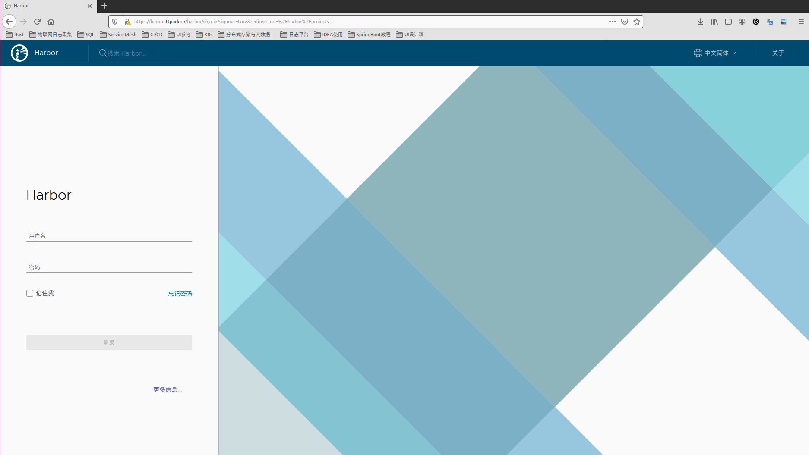
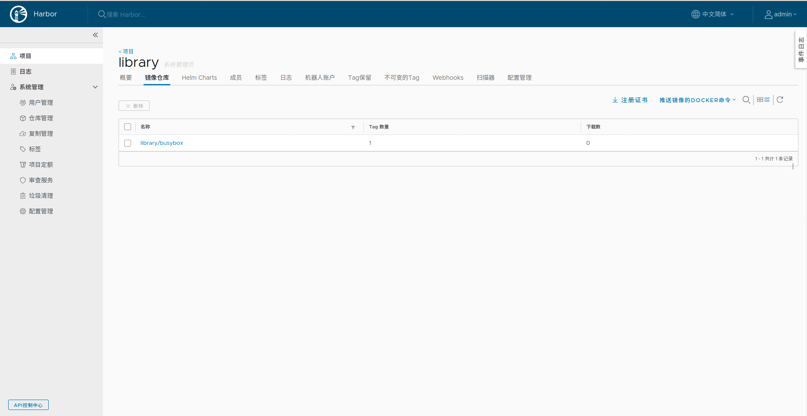

# 环境搭建

## 参考文档

1. [通过Helm搭建Docker镜像仓库Harbor](http://www.mydlq.club/article/66/)
2. [Kubernetes笔记－Harbor安装(CICD四)](https://blog.csdn.net/BigData_Mining/article/details/98169007)
3. [kubernetes实践：helm安装harbor](https://blog.51cto.com/wangpengtai/2418636?source=dra)
4. [Kubernets部署Harbor(最新版)](https://blog.51cto.com/kingda/2444261?source=dra)
5. [Harbor官网](https://goharbor.io/)

## 安装环境

* Kubernetes集群版本：1.15.3(1.10以上即可)
* Kubernetes Ingress Nginx版本：0.30
* Helm版本：2.16.2
* Harbor Helm版本：1.3.1
* Harbor版本：1.10.1
* Harbor访问方式：Ingress-Nginx
* 持久化存储：NFS
* 搭建日期：2020.3.21

## Harbor介绍

TODO: 增加Harbor的介绍和相关组件的初步介绍

## 准备环境

### 安装Helm

在进行后续步骤之前先按照[Helm软件包管理器环境搭建](../../Helm软件包管理器/环境搭建)在Kubernetes集群中部署好Helm2相关环境

### 创建命名空间

由于Harbor组件较多，这里我们新建一个Kubernetes Namespace专用于部署Harbor相关组件，这里创建的命名空间在稍后的`helm install`安装命令中会使用到：

```bash
kubectl create namespace harbor
```

### 安装持久化存储

Harbor需要使用Kubernetes持久化存储机制来存储Chart和镜像，本文档采用NFS存储后端。

#### 安装NFS服务器

先找一台具备一定存储容量的主机来搭建NFS服务器，Kubernetes集群能够访问到该NFS服务器即可。

```bash
# 安装服务器
apt install nfs-common nfs-kernel-server -y

# 配置服务器
# 在/etc/exports配置文件中增加如下行：
/data/k8s          *(insecure,rw,sync,no_root_squash)

# 启动服务器并设置开机自启动
systemctl enable nfs-kernel-server
systemctl start nfs-kernel-server
```

#### 安装NFS客户端

安装完成NFS服务器后我们切换到Kubernetes集群的客户端安装上，这里使用Helm进行安装：

```bash
helm install stable/nfs-client-provisioner \
     --name=harbor-storage \
     --set storageClass.name=harbor-data \
     --set nfs.server=172.31.10.252 --set nfs.path=/data/k8s
```

这里注意将`nfs.server`和`nfs.path`参数修改为安装NFS服务器时的参数值，安装完成后可以在Kubernetes Dashboard中看到名为`harbor-data`的StorageClass(存储类)。后面在Harbor的安装过程中可以使用这个存储类。

### 安装Ingress控制器

按照[部署Ingress-Nginx](../../部署Ingress-Nginx)在Kubernetes集群中部署好Ingress控制器。

Helm默认是启动ingress的方式暴露Harbor服务的，所以如果你没有提前安装ingress控制器的话，虽然不影响harbor正常运行但是你无法访问它。

## 配置项

可以参考[KKubernetes笔记－Harbor安装(CICD四)](https://blog.csdn.net/BigData_Mining/article/details/98169007)这篇文档来了解一下`Harbor Helm`的`values.yaml`配置。也可以访问[Harbor的Helm Hub地址](https://hub.helm.sh/charts/harbor/harbor)]来查看配置默认值。

TODO: 按照[官方文档](https://hub.helm.sh/charts/harbor/harbor)来完善关于配置项目的说明解释

### Harbor服务暴露方式

Harbor通过配置项 `expose.type` 来控制服务暴露方式，支持取值为`ingress`、`clusterIP`、`nodePort`、`loadBalancer` ，默认值为`ingress`，我们推荐采用默认方式来暴露服务。

### 外网访问地址

### 持久化存储

## 安装

先添加仓库并查看chart版本

```bash
# 添加仓库
root@tt-iot-test-master:~# helm repo add harbor https://helm.goharbor.io
root@tt-iot-test-master:~# helm repo update

# 查看版本
root@tt-iot-test-master:~# helm search harbor
NAME            CHART VERSION   APP VERSION DESCRIPTION
harbor/harbor   1.3.1           1.10.1      An open source trusted cloud native registry that stores,...
```

了解了重要配置项之后就可以进行准备安装了，因为大部分默认配置是不用修改的，所以这里采用`--set`传入参数的方式来进行覆盖配置，下面的Helm安装命令的参数需要如下要点：

* 使用`--name`和`--namespace`参数来指定安装名称和命名空间，便于管理
* 使用`harborAdminPassword`参数设置admin登录密码
* 使用`expose.ingress.hosts.core`和`externalURL`参数设置访问地址
* 把`persistence`下面所有服务的`storageClass`字段都设置为之前 **[安装NFS客户端](#nfs)** 时NFS的StorageClass名称
* 因为registry服务负责存储镜像所以分配更大一些的存储空间(默认为5Gi)，此大小根据实际情况分配大小即可

!!! note "externalURL的设置"
    我们首先需要将安装`Ingress Nginx`是暴露的节点IP绑定一个域名(例如：harbor.wsh-study.com)

```bash
helm install harbor/harbor --name tt-harbor --namespace harbor \
    --wait --timeout 1500 \
    --set harborAdminPassword=123456 \
    --set expose.ingress.hosts.core=harbor.wsh-study.com \
    --set expose.ingress.hosts.notary=notary.wsh-study.com \
    --set externalURL=https://harbor.wsh-study.com \
    --set persistence.persistentVolumeClaim.registry.storageClass=harbor-data \
    --set persistence.persistentVolumeClaim.registry.size=20Gi \
    --set persistence.persistentVolumeClaim.chartmuseum.storageClass=harbor-data \
    --set persistence.persistentVolumeClaim.jobservice.storageClass=harbor-data \
    --set persistence.persistentVolumeClaim.database.storageClass=harbor-data \
    --set persistence.persistentVolumeClaim.redis.storageClass=harbor-data
```

由于PV和PVC的自动创建工作比较耗时，所以导致很多Pod开始会报错，在这个期间`helm install`命令会等待执行完成，所以一定要有点耐心等待安装就绪(几分钟即可)。

## 验证

### Web管理页面

访问上面设置的访问地址：[https://harbor.wsh-study.com](https://harbor.wsh-study.com)和登录密码进行登录



### Docker命令行访问

现在我们需要在集群外的主机上面使用`docker`命令进行镜像仓库控制(登录/发布镜像/拉取镜像)，这也是使用我们的CI/CD环境在生产环境上使用Harbor的方式。

由于上面我们安装的时候通过Ingress来暴露的Harbor的服务，而且强制使用了HTTPS，所以如果我们要在终端中使用我们这里的私有仓库的话，就需要配置上相应的证书，否则Docker登录仓库时会出现如下错误：

```bash
root@VM-4-10-ubuntu:~# docker login -u admin harbor.wsh-study.com
Password:
Error response from daemon: Get https://harbor.wsh-study.com/v2/: x509: certificate signed by unknown authority
```

所以我们需要查询Kubernetes集群的`Harbor Ingress`的CA证书

```bash
# 注意：在集群主机上面执行如下命令

# 查看ingress名称
root@tt-iot-test-master:~# kubectl get ingress -n harbor
NAME                       HOSTS                               ADDRESS         PORTS     AGE
tt-harbor-harbor-ingress   harbor.wsh-study.com,notary.wsh-study.com   172.31.10.252   80, 443   43m

# 查询CA证书信息，输出的信息就是证书信息
root@tt-iot-test-master:~# kubectl get secret tt-harbor-harbor-ingress -n harbor -o jsonpath="{.data.ca\.crt}"|base64 --decode
-----BEGIN CERTIFICATE-----
MIIC9DCCAdygAwIBAgIQYxuPX3jB4zcyRjXAiTpDPzANBgkqhkiG9w0BAQsFADAU
MRIwEAYDVQQDEwloYXJib3ItY2EwHhcNMjAwMzIyMTIxMDE1WhcNMjEwMzIyMTIx
MDE1WjAUMRIwEAYDVQQDEwloYXJib3ItY2EwggEiMA0GCSqGSIb3DQEBAQUAA4IB
DwAwggEKAoIBAQDSNSaqTTCLteSJaAV5/kU/6vjLYjh41pYnG07SlhcYmR6SUXwy
+sqz3LBba3kB0GiLF1nzvUB59MVisRNgQg18+38g+HGZGyfgMBb8HnVQt9qXr/su
FEGaABzgdZfUQwydAnzg00pEziqqPjHqWo3rR270G2OL9zroQp3LWL6X6LkBX+A8
FqEJ6aADFYMvPv9D9KR5XTQfKLYKFTgSSITIFosCx7++gqIymFexTOhVpft045Uo
40sB1yS6hiYQzAEcdisI4lvkQZiTZSEJQtMjvFXT3Tzy6JebChcxUQJI9JNFOHJf
XMucWzYHOQZEz789ED8bagEYSLdPPL4Dirp3AgMBAAGjQjBAMA4GA1UdDwEB/wQE
AwICpDAdBgNVHSUEFjAUBggrBgEFBQcDAQYIKwYBBQUHAwIwDwYDVR0TAQH/BAUw
AwEB/zANBgkqhkiG9w0BAQsFAAOCAQEABkOBLyvVqjvpy3BtLqDWcp4ds4oLZx80
bWKJvVta9LpgEZvHrq359J3SiXC73LNFCqeJHWhOblZyVQn+yw4qZDBs5Hd4HzUD
CORFUKpCCqL8EdN9HwIuqILEdhp6ih05BJbg8MunIqmSlLOG0rYLblzd6vHQ0m0a
XuMmA6qC1vMjy6L8HUM/IcSNIpQPykY+F55oZPgTM8L8xNDxhAlpaKi9TwYvgVba
aXpeEOTjuRcDwoqCGpp+6daACzDvLWxmjsg5NZRU4yBSGp/sfX/qRcZ1s0280VVZ
Q6eIG0bchB7xuxDy22GC5PVIdJsGeJagkiraVIc7sD4gEeyGqNdk8A==
-----END CERTIFICATE-----
```

重新回到Docker命令行的集群外主机，执行如下指令：

```bash
# 创建存放CA证书的目录，最后的URL需要和登录仓库的URL一致
root@VM-4-10-ubuntu:~# mkdir -p /etc/docker/certs.d/harbor.wsh-study.com

# 在该目录下创建ca.crt文件，填充上面得到的证书信息

# 重启Docker，重新登录仓库就会正常
root@VM-4-10-ubuntu:~# systemctl restart docker
```

现在我们发布一个镜像到Harbor仓库

```bash
# 从Docker官方仓库拉取一个busybox镜像
root@VM-4-10-ubuntu:~# docker pull busybox

# 发布镜像到Harbor仓库，library是Harbor默认的目录
root@VM-4-10-ubuntu:~# docker tag busybox:latest harbor.wsh-study.com/library/busybox:latest

root@VM-4-10-ubuntu:~# docker push harbor.wsh-study.com/library/busybox:latest
The push refers to repository [harbor.wsh-study.com/library/busybox]
a6d503001157: Pushed
latest: digest: sha256:afe605d272837ce1732f390966166c2afff5391208ddd57de10942748694049d size: 527
```

发布成功之后在Web页面查看已上传的镜像，至此Harbor私有云镜像仓库就已经搭建完成了


