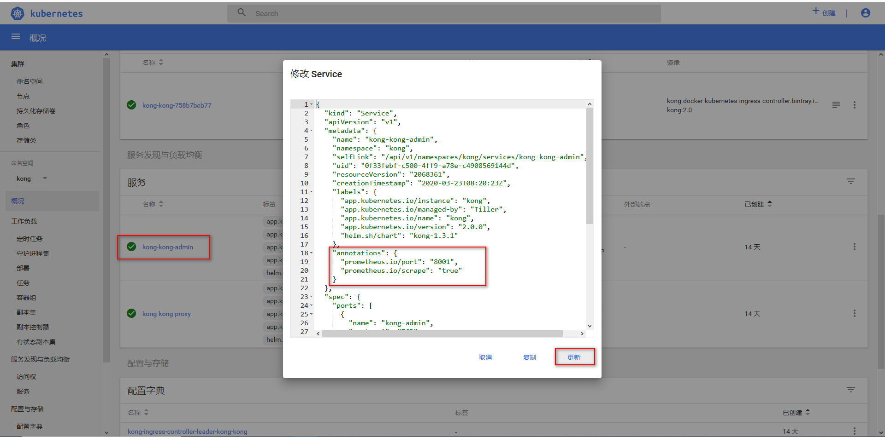
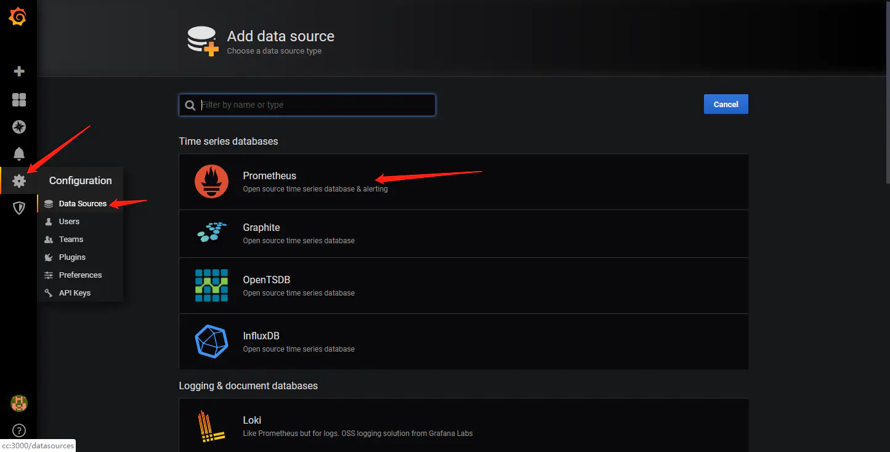
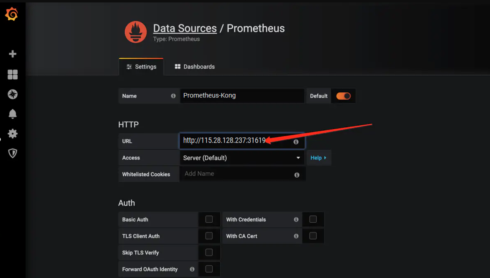
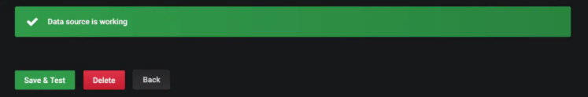
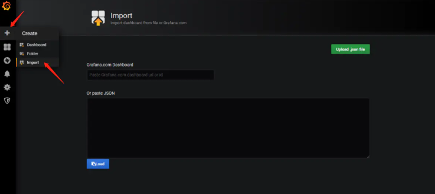
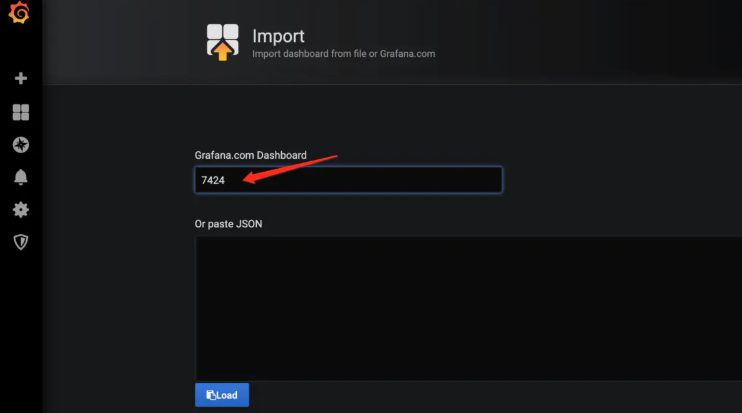
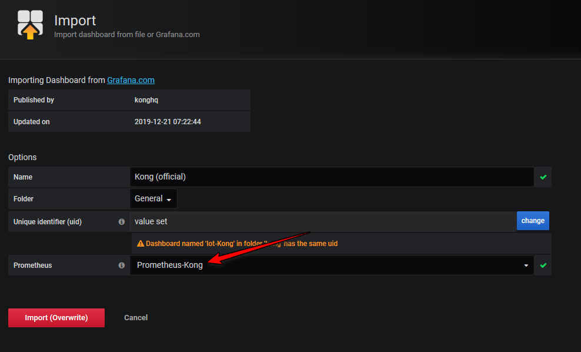
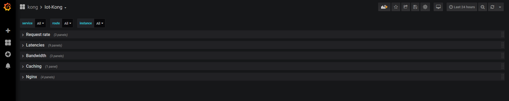
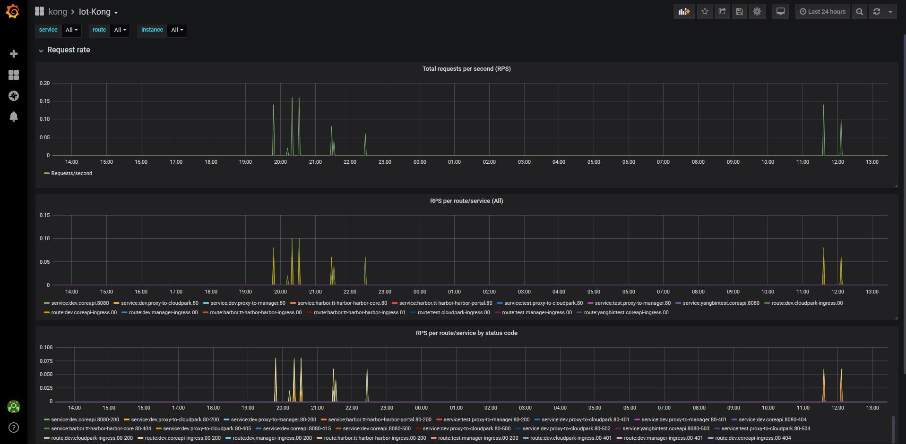

# 网关监控方案

## 参考文档

1. [kong集成Prometheus/Grafana Gitbub文档](https://github.com/Kong/kubernetes-ingress-controller/blob/master/docs/guides/prometheus-grafana.md)
2. [Grafana官方文档](https://grafana.com/docs/grafana/latest/guides/getting_started/)
3. [Grafana可视化模板](https://grafana.com/grafana/dashboards/7424)

## 安装环境

* Kubernetes集群版本：1.15.3
* Helm版本：2.16.2
* Kong Ingress Controller版本：0.7.1
* Kong版本：2.0.2(>=1.0.0)
* Prometheus版本：11.0.3
* Grafana版本： v6.2.5

## Prometheus和Grafana简介

Prometheus是一个基于HTTP协议的强大监控系统，这里作为Kong的一个数据收集和分析的插件，Grafana是用于数据展示的Dashboard，通过Prometheus，Grafana可以展示Kong的数据分析情况

## 安装Prometheus

### 创建PV

安装Prometheus需要创建以下PV，进行持久化存储

1. [prometgeus-alertmanager-pv.yaml](./assets/prometgeus-alertmanager-pv.yaml)
2. [prometgeus-server-pv.yaml](./assets/prometgeus-server-pv.yaml)
3. [prometgeus-pushgateway-pv.yaml](./assets/prometgeus-pushgateway-pv.yaml)

```bash
kubectl  apply -f prometgeus-alertmanager-pv.yaml
kubectl  apply -f prometgeus-server-pv.yaml
kubectl  apply -f prometgeus-pushgateway-pv.yaml
```

### 修改value文件

这里使用helm进行安装，根据官方的helm chart进行定制化修改,这里主要修改如下：

1. 将alertmanager、server、pushgateway的#storageClass修改为storageClass: "prometheus-data"

修改完成的[prometheus-value.yaml](./assets/prometheus-value.yaml)

### 部署Prometheus

```bash
helm install --name prometheus stable/prometheus --namespace monitoring --values prometheus-value.yaml --version 11.0.3 \
     --set  server.global.scrape_interval=10s  \  
     --set  server.service.type=NodePort
```

### 查看Prometheus部署

```bash
root@tt-iot-test-master:~/devEnv# kubectl get all -n monitoring
NAME                                                 READY   STATUS    RESTARTS   AGE
pod/prometheus-alertmanager-84d8d68cb8-4nzh4         2/2     Running   0          5d11h
pod/prometheus-kube-state-metrics-685dccc6d8-8km4f   1/1     Running   0          5d11h
pod/prometheus-node-exporter-2sj9v                   1/1     Running   0          5d11h
pod/prometheus-pushgateway-6b7fb95554-66hdh          1/1     Running   0          5d11h
pod/prometheus-server-797cc76f95-gjtjn               2/2     Running   0          5d11h

NAME                                    TYPE        CLUSTER-IP       EXTERNAL-IP   PORT(S)        AGE
service/prometheus-alertmanager         ClusterIP   10.111.130.232   <none>        80/TCP         5d11h
service/prometheus-kube-state-metrics   ClusterIP   10.107.231.22    <none>        8080/TCP       5d11h
service/prometheus-node-exporter        ClusterIP   None             <none>        9100/TCP       5d11h
service/prometheus-pushgateway          ClusterIP   10.103.74.128    <none>        9091/TCP       5d11h
service/prometheus-server               NodePort    10.98.179.164    <none>        80:31619/TCP   5d11h

NAME                                      DESIRED   CURRENT   READY   UP-TO-DATE   AVAILABLE   NODE SELECTOR   AGE
daemonset.apps/prometheus-node-exporter   1         1         1       1            1           <none>          5d11h

NAME                                            READY   UP-TO-DATE   AVAILABLE   AGE
deployment.apps/prometheus-alertmanager         1/1     1            1           5d11h
deployment.apps/prometheus-kube-state-metrics   1/1     1            1           5d11h
deployment.apps/prometheus-pushgateway          1/1     1            1           5d11h
deployment.apps/prometheus-server               1/1     1            1           5d11h

NAME                                                       DESIRED   CURRENT   READY   AGE
replicaset.apps/prometheus-alertmanager-84d8d68cb8         1         1         1       5d11h
replicaset.apps/prometheus-kube-state-metrics-685dccc6d8   1         1         1       5d11h
replicaset.apps/prometheus-pushgateway-6b7fb95554          1         1         1       5d11h
replicaset.apps/prometheus-server-797cc76f95               1         1         1       5d11h
```

### 将Kong和Prometheus关联

登录K8s修改kong-admin的yaml，添加以下配置


```bash
"annotations": {
      "prometheus.io/port": "8001",
      "prometheus.io/scrape": "true"
    }
```

### 安装Prometheus插件

```bash
$ echo 'apiVersion: configuration.konghq.com/v1
kind: KongPlugin
metadata:
  name: prometheus
  labels:
    global: "true"  # 设置为全局属性，每个进入Kubernetes集群的请求都会在prometheus进行追踪
plugin: prometheus
' | kubectl apply -f -
kongplugin.configuration.konghq.com/prometheus created
```

## 安装Grafana

这里公用云平台的Grafana，部署这里忽略
TODO: 安装Grafana

## Grafana可视化Prometheus数据

### 添加数据源

登录[云平台的Grafana](http://grafana.wsh-study.com/?orgId=1)，进行数据源添加





测试保存



### 添加可视化模板

这里采用官方推荐模板7424，导入模板，输入模板id：7424




保存后，切换到dashboard页进行查看

### 查看dashboard




## 设置监控

TODO:设置监控报警