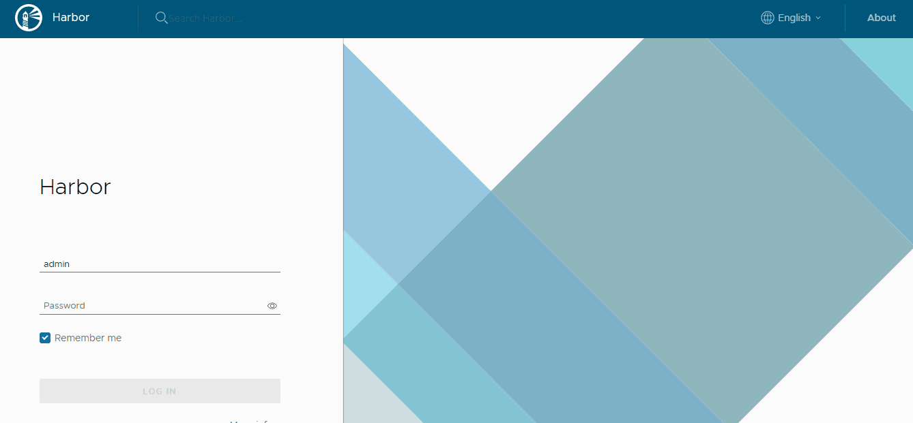
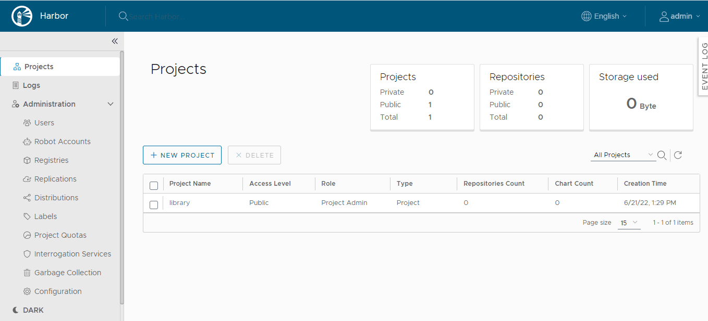
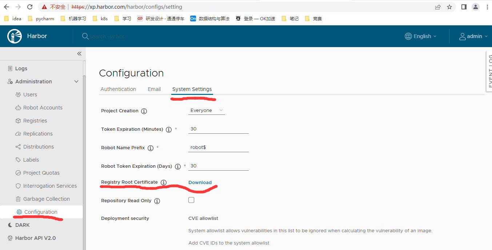

### Kubernetes 集群仓库 harbor Helm3 部署
一、简介
Harbor 是一个用于存储和分发 Docker 镜像的企业级 Registry 服务器，通过添加一些企业必需的功能特性，例如安全、标识和管理等，扩展了开源 Docker Distribution。作为一个企业级私有 Registry 服务器，Harbor 提供了更好的性能和安全。提升用户使用 Registry 构建和运行环境传输镜像的效率。
二、先决条件
* Kubernetes 1.12+
* Helm 2.12+ 或 Helm 3.0-beta3 +
* 集群有默认的动态存储可用
* 使用 StorageClass 提供 PV 动态存储

三、准备环境
**1、系统环境**
* kubernetes 版本：1.18.5
* Nginx Ingress 版本：2.2.8
* Harbor Chart 版本：1.4.2
* Harbor 版本：2.0.2
* Helm 版本：3.2.4
* 持久化存储驱动：NFS

2、核实动态存储
确认默认 StorageClass:
```shell
root@k8s-master1:~# kubectl get storageclass
NAME                    PROVISIONER   RECLAIMPOLICY   VOLUMEBINDINGMODE   ALLOWVOLUMEEXPANSION   AGE
nfs-storage (default)   nfs-client    Delete          Immediate           false                  219d
```
**3、安装 Helm3**

[Helm3部署安装](https://note.youdao.com/web/#/file/WEB85f4165808f90ea2cf5ab2cc38b3b614/markdown/WEB1713e25fb0d886459b437782eefab51b/)

**4、创建 Namespace**
由于 Harbor 组件较多，一般我们会采取新建一个 Namespace 专用于部署 Harbor 相关组件，输入下面命令创建名为 harbor
```shell
kubectl create namespace harbor
```

四、创建自定义证书
安装 Harbor 我们会默认使用 HTTPS 协议，需要 TLS 证书，如果我们没用自己设定自定义证书文件，那么 Harbor 将自动创建证书文件，不过这个有效期只有一年时间，所以这里我们生成自签名证书，为了避免频繁修改证书，将证书有效期为 100 年，操作如下：
**1、生成证书文件：**
下面执行步骤时，需要输入一些证书信息，其中 Common Name 必须要设置为和你要给 Harbor 的域名保持一致，如 Common Name (eg, your name or your server's hostname) []:**xp.harbor.com**。
```shell
# 获得证书
openssl req -newkey rsa:4096 -nodes -sha256 -keyout ca.key -x509 -days 3650 -out ca.crt

# 生成证书签名请求
openssl req -newkey rsa:4096 -nodes -sha256 -keyout tls.key -out tls.csr

# 生成证书
openssl x509 -req -days 36500 -in tls.csr -CA ca.crt -CAkey ca.key -CAcreateserial -out tls.crt
```

**2、生成 secret 对象**
创建 Kubernetes 的 Secret 资源，且将证书文件导入：
```shell
kubectl create secret generic xp-harbor-tls --from-file=tls.crt --from-file=tls.key --from-file=ca.crt -n harbor
```
查看是否创建成功：
```shell
kubectl get secret xp-harbor-tls -n harbor
```
可以观察到：

```shell
root@k8s-master1:~# kubectl get secret xp-harbor-tls  -n harbor
NAME            TYPE     DATA   AGE
xp-harbor-tls   Opaque   3      8h
```

五、安装 Harbor
1.  首先下载 Harbor Chart 包到要安装的集群上：
```shell
 git clone https://github.com/goharbor/harbor-helm
```
2.  切换到我们需要安装的分支，比如我们这里使用 1.0.0分支：
```shell
 cd harbor-helm
 git checkout 1.0.0
```
3. 安装 Helm Chart
包最重要的当然是values.yaml文件了，我们可以通过覆盖该文件中的属性来改变配置：

```yaml
expose:
  # Set how to expose the service. Set the type as "ingress", "clusterIP", "nodePort" or "loadBalancer"
  # and fill the information in the corresponding section
  type: ingress
  tls:
    # Enable TLS or not.
    # Delete the "ssl-redirect" annotations in "expose.ingress.annotations" when TLS is disabled and "expose.type" is "ingress"
    # Note: if the "expose.type" is "ingress" and TLS is disabled,
    # the port must be included in the command when pulling/pushing images.
    # Refer to https://github.com/goharbor/harbor/issues/5291 for details.
    enabled: true
    # The source of the tls certificate. Set as "auto", "secret"
    # or "none" and fill the information in the corresponding section
    # 1) auto: generate the tls certificate automatically
    # 2) secret: read the tls certificate from the specified secret.
    # The tls certificate can be generated manually or by cert manager
    # 3) none: configure no tls certificate for the ingress. If the default
    # tls certificate is configured in the ingress controller, choose this option
    certSource: auto
    auto:
      # The common name used to generate the certificate, it's necessary
      # when the type isn't "ingress"
      commonName: ""
    secret:
      # The name of secret which contains keys named:
      # "tls.crt" - the certificate
      # "tls.key" - the private key
      secretName: "xp-harbor-tls"
      # The name of secret which contains keys named:
      # "tls.crt" - the certificate
      # "tls.key" - the private key
      # Only needed when the "expose.type" is "ingress".
      notarySecretName: "xp-harbor-tls"
  ingress:
    hosts:
      core: xp.harbor.com
      notary: notary.harbor.com
    # set to the type of ingress controller if it has specific requirements.
    # leave as `default` for most ingress controllers.
    # set to `gce` if using the GCE ingress controller
    # set to `ncp` if using the NCP (NSX-T Container Plugin) ingress controller
    controller: default
    ## Allow .Capabilities.KubeVersion.Version to be overridden while creating ingress
    kubeVersionOverride: ""
    className: ""
    annotations:
      # note different ingress controllers may require a different ssl-redirect annotation
      # for Envoy, use ingress.kubernetes.io/force-ssl-redirect: "true" and remove the nginx lines below
      ingress.kubernetes.io/ssl-redirect: "true"
      ingress.kubernetes.io/proxy-body-size: "0"
      nginx.ingress.kubernetes.io/ssl-redirect: "true"
      nginx.ingress.kubernetes.io/proxy-body-size: "0"
    notary:
      # notary ingress-specific annotations
      annotations: {}
      # notary ingress-specific labels
      labels: {}
    harbor:
      # harbor ingress-specific annotations
      annotations: {}
      # harbor ingress-specific labels
      labels: {}
  clusterIP:
    # The name of ClusterIP service
    name: harbor
    # Annotations on the ClusterIP service
    annotations: {}
    ports:
      # The service port Harbor listens on when serving HTTP
      httpPort: 80
      # The service port Harbor listens on when serving HTTPS
      httpsPort: 443
      # The service port Notary listens on. Only needed when notary.enabled
      # is set to true
      notaryPort: 4443
  nodePort:
    # The name of NodePort service
    name: harbor
    ports:
      http:
        # The service port Harbor listens on when serving HTTP
        port: 80
        # The node port Harbor listens on when serving HTTP
        nodePort: 30002
      https:
        # The service port Harbor listens on when serving HTTPS
        port: 443
        # The node port Harbor listens on when serving HTTPS
        nodePort: 30003
      # Only needed when notary.enabled is set to true
      notary:
        # The service port Notary listens on
        port: 4443
        # The node port Notary listens on
        nodePort: 30004
  loadBalancer:
    # The name of LoadBalancer service
    name: harbor
    # Set the IP if the LoadBalancer supports assigning IP
    IP: ""
    ports:
      # The service port Harbor listens on when serving HTTP
      httpPort: 80
      # The service port Harbor listens on when serving HTTPS
      httpsPort: 443
      # The service port Notary listens on. Only needed when notary.enabled
      # is set to true
      notaryPort: 4443
    annotations: {}
    sourceRanges: []

# The external URL for Harbor core service. It is used to
# 1) populate the docker/helm commands showed on portal
# 2) populate the token service URL returned to docker/notary client
#
# Format: protocol://domain[:port]. Usually:
# 1) if "expose.type" is "ingress", the "domain" should be
# the value of "expose.ingress.hosts.core"
# 2) if "expose.type" is "clusterIP", the "domain" should be
# the value of "expose.clusterIP.name"
# 3) if "expose.type" is "nodePort", the "domain" should be
# the IP address of k8s node
#
# If Harbor is deployed behind the proxy, set it as the URL of proxy
externalURL: https://xp.harbor.com

# The internal TLS used for harbor components secure communicating. In order to enable https
# in each components tls cert files need to provided in advance.
internalTLS:
  # If internal TLS enabled
  enabled: false
  # There are three ways to provide tls
  # 1) "auto" will generate cert automatically
  # 2) "manual" need provide cert file manually in following value
  # 3) "secret" internal certificates from secret
  certSource: "auto"
  # The content of trust ca, only available when `certSource` is "manual"
  trustCa: ""
  # core related cert configuration
  core:
    # secret name for core's tls certs
    secretName: ""
    # Content of core's TLS cert file, only available when `certSource` is "manual"
    crt: ""
    # Content of core's TLS key file, only available when `certSource` is "manual"
    key: ""
  # jobservice related cert configuration
  jobservice:
    # secret name for jobservice's tls certs
    secretName: ""
    # Content of jobservice's TLS key file, only available when `certSource` is "manual"
    crt: ""
    # Content of jobservice's TLS key file, only available when `certSource` is "manual"
    key: ""
  # registry related cert configuration
  registry:
    # secret name for registry's tls certs
    secretName: ""
    # Content of registry's TLS key file, only available when `certSource` is "manual"
    crt: ""
    # Content of registry's TLS key file, only available when `certSource` is "manual"
    key: ""
  # portal related cert configuration
  portal:
    # secret name for portal's tls certs
    secretName: ""
    # Content of portal's TLS key file, only available when `certSource` is "manual"
    crt: ""
    # Content of portal's TLS key file, only available when `certSource` is "manual"
    key: ""
  # chartmuseum related cert configuration
  chartmuseum:
    # secret name for chartmuseum's tls certs
    secretName: ""
    # Content of chartmuseum's TLS key file, only available when `certSource` is "manual"
    crt: ""
    # Content of chartmuseum's TLS key file, only available when `certSource` is "manual"
    key: ""
  # trivy related cert configuration
  trivy:
    # secret name for trivy's tls certs
    secretName: ""
    # Content of trivy's TLS key file, only available when `certSource` is "manual"
    crt: ""
    # Content of trivy's TLS key file, only available when `certSource` is "manual"
    key: ""

ipFamily:
  # ipv6Enabled set to true if ipv6 is enabled in cluster, currently it affected the nginx related component
  ipv6:
    enabled: true
  # ipv4Enabled set to true if ipv4 is enabled in cluster, currently it affected the nginx related component
  ipv4:
    enabled: true

# The persistence is enabled by default and a default StorageClass
# is needed in the k8s cluster to provision volumes dynamically.
# Specify another StorageClass in the "storageClass" or set "existingClaim"
# if you already have existing persistent volumes to use
#
# For storing images and charts, you can also use "azure", "gcs", "s3",
# "swift" or "oss". Set it in the "imageChartStorage" section
persistence:
  enabled: true
  # Setting it to "keep" to avoid removing PVCs during a helm delete
  # operation. Leaving it empty will delete PVCs after the chart deleted
  # (this does not apply for PVCs that are created for internal database
  # and redis components, i.e. they are never deleted automatically)
  resourcePolicy: "keep"
  persistentVolumeClaim:
    registry:
      # Use the existing PVC which must be created manually before bound,
      # and specify the "subPath" if the PVC is shared with other components
      existingClaim: ""
      # Specify the "storageClass" used to provision the volume. Or the default
      # StorageClass will be used (the default).
      # Set it to "-" to disable dynamic provisioning
      storageClass: "nfs-storage"
      subPath: ""
      accessMode: ReadWriteOnce
      size: 5Gi
      annotations: {}
    chartmuseum:
      existingClaim: ""
      storageClass: "nfs-storage"
      subPath: ""
      accessMode: ReadWriteOnce
      size: 5Gi
      annotations: {}
    jobservice:
      existingClaim: ""
      storageClass: "nfs-storage"
      subPath: ""
      accessMode: ReadWriteOnce
      size: 1Gi
      annotations: {}
    # If external database is used, the following settings for database will
    # be ignored
    database:
      existingClaim: ""
      storageClass: "nfs-storage"
      subPath: ""
      accessMode: ReadWriteOnce
      size: 1Gi
      annotations: {}
    # If external Redis is used, the following settings for Redis will
    # be ignored
    redis:
      existingClaim: ""
      storageClass: "nfs-storage"
      subPath: ""
      accessMode: ReadWriteOnce
      size: 1Gi
      annotations: {}
    trivy:
      existingClaim: ""
      storageClass: "nfs-storage"
      subPath: ""
      accessMode: ReadWriteOnce
      size: 5Gi
      annotations: {}
  # Define which storage backend is used for registry and chartmuseum to store
  # images and charts. Refer to
  # https://github.com/docker/distribution/blob/master/docs/configuration.md#storage
  # for the detail.
  imageChartStorage:
    # Specify whether to disable `redirect` for images and chart storage, for
    # backends which not supported it (such as using minio for `s3` storage type), please disable
    # it. To disable redirects, simply set `disableredirect` to `true` instead.
    # Refer to
    # https://github.com/docker/distribution/blob/master/docs/configuration.md#redirect
    # for the detail.
    disableredirect: false
    # Specify the "caBundleSecretName" if the storage service uses a self-signed certificate.
    # The secret must contain keys named "ca.crt" which will be injected into the trust store
    # of registry's and chartmuseum's containers.
    # caBundleSecretName:

    # Specify the type of storage: "filesystem", "azure", "gcs", "s3", "swift",
    # "oss" and fill the information needed in the corresponding section. The type
    # must be "filesystem" if you want to use persistent volumes for registry
    # and chartmuseum
    type: filesystem
    filesystem:
      rootdirectory: /storage
      #maxthreads: 100
    azure:
      accountname: accountname
      accountkey: base64encodedaccountkey
      container: containername
      #realm: core.windows.net
    gcs:
      bucket: bucketname
      # The base64 encoded json file which contains the key
      encodedkey: base64-encoded-json-key-file
      #rootdirectory: /gcs/object/name/prefix
      #chunksize: "5242880"
    s3:
      region: us-west-1
      bucket: bucketname
      #accesskey: awsaccesskey
      #secretkey: awssecretkey
      #regionendpoint: http://myobjects.local
      #encrypt: false
      #keyid: mykeyid
      #secure: true
      #skipverify: false
      #v4auth: true
      #chunksize: "5242880"
      #rootdirectory: /s3/object/name/prefix
      #storageclass: STANDARD
      #multipartcopychunksize: "33554432"
      #multipartcopymaxconcurrency: 100
      #multipartcopythresholdsize: "33554432"
    swift:
      authurl: https://storage.myprovider.com/v3/auth
      username: username
      password: password
      container: containername
      #region: fr
      #tenant: tenantname
      #tenantid: tenantid
      #domain: domainname
      #domainid: domainid
      #trustid: trustid
      #insecureskipverify: false
      #chunksize: 5M
      #prefix:
      #secretkey: secretkey
      #accesskey: accesskey
      #authversion: 3
      #endpointtype: public
      #tempurlcontainerkey: false
      #tempurlmethods:
    oss:
      accesskeyid: accesskeyid
      accesskeysecret: accesskeysecret
      region: regionname
      bucket: bucketname
      #endpoint: endpoint
      #internal: false
      #encrypt: false
      #secure: true
      #chunksize: 10M
      #rootdirectory: rootdirectory

imagePullPolicy: IfNotPresent

# Use this set to assign a list of default pullSecrets
imagePullSecrets:
#  - name: docker-registry-secret
#  - name: internal-registry-secret

# The update strategy for deployments with persistent volumes(jobservice, registry
# and chartmuseum): "RollingUpdate" or "Recreate"
# Set it as "Recreate" when "RWM" for volumes isn't supported
updateStrategy:
  type: RollingUpdate

# debug, info, warning, error or fatal
logLevel: info

# The initial password of Harbor admin. Change it from portal after launching Harbor
harborAdminPassword: "Harbor12345"

# The name of the secret which contains key named "ca.crt". Setting this enables the
# download link on portal to download the CA certificate when the certificate isn't
# generated automatically
caSecretName: ""

# The secret key used for encryption. Must be a string of 16 chars.
secretKey: "not-a-secure-key"

# The proxy settings for updating trivy vulnerabilities from the Internet and replicating
# artifacts from/to the registries that cannot be reached directly
proxy:
  httpProxy:
  httpsProxy:
  noProxy: 127.0.0.1,localhost,.local,.internal
  components:
    - core
    - jobservice
    - trivy

# Run the migration job via helm hook
enableMigrateHelmHook: false

# The custom ca bundle secret, the secret must contain key named "ca.crt"
# which will be injected into the trust store for chartmuseum, core, jobservice, registry, trivy components
# caBundleSecretName: ""

## UAA Authentication Options
# If you're using UAA for authentication behind a self-signed
# certificate you will need to provide the CA Cert.
# Set uaaSecretName below to provide a pre-created secret that
# contains a base64 encoded CA Certificate named `ca.crt`.
# uaaSecretName:

# If service exposed via "ingress", the Nginx will not be used
nginx:
  image:
    repository: goharbor/nginx-photon
    tag: v2.5.1
  # set the service account to be used, default if left empty
  serviceAccountName: ""
  # mount the service account token
  automountServiceAccountToken: false
  replicas: 1
  revisionHistoryLimit: 10
  # resources:
  #  requests:
  #    memory: 256Mi
  #    cpu: 100m
  nodeSelector: {}
  tolerations: []
  affinity: {}
  ## Additional deployment annotations
  podAnnotations: {}
  ## The priority class to run the pod as
  priorityClassName:

portal:
  image:
    repository: goharbor/harbor-portal
    tag: v2.5.1
  # set the service account to be used, default if left empty
  serviceAccountName: ""
  # mount the service account token
  automountServiceAccountToken: false
  replicas: 1
  revisionHistoryLimit: 10
  # resources:
  #  requests:
  #    memory: 256Mi
  #    cpu: 100m
  nodeSelector: {}
  tolerations: []
  affinity: {}
  ## Additional deployment annotations
  podAnnotations: {}
  ## The priority class to run the pod as
  priorityClassName:

core:
  image:
    repository: goharbor/harbor-core
    tag: v2.5.1
  # set the service account to be used, default if left empty
  serviceAccountName: ""
  # mount the service account token
  automountServiceAccountToken: false
  replicas: 1
  revisionHistoryLimit: 10
  ## Startup probe values
  startupProbe:
    enabled: true
    initialDelaySeconds: 10
  # resources:
  #  requests:
  #    memory: 256Mi
  #    cpu: 100m
  nodeSelector: {}
  tolerations: []
  affinity: {}
  ## Additional deployment annotations
  podAnnotations: {}
  # Secret is used when core server communicates with other components.
  # If a secret key is not specified, Helm will generate one.
  # Must be a string of 16 chars.
  secret: ""
  # Fill the name of a kubernetes secret if you want to use your own
  # TLS certificate and private key for token encryption/decryption.
  # The secret must contain keys named:
  # "tls.crt" - the certificate
  # "tls.key" - the private key
  # The default key pair will be used if it isn't set
  secretName: ""
  # The XSRF key. Will be generated automatically if it isn't specified
  xsrfKey: ""
  ## The priority class to run the pod as
  priorityClassName:
  # The time duration for async update artifact pull_time and repository
  # pull_count, the unit is second. Will be 10 seconds if it isn't set.
  # eg. artifactPullAsyncFlushDuration: 10
  artifactPullAsyncFlushDuration:

jobservice:
  image:
    repository: goharbor/harbor-jobservice
    tag: v2.5.1
  replicas: 1
  revisionHistoryLimit: 10
  # set the service account to be used, default if left empty
  serviceAccountName: ""
  # mount the service account token
  automountServiceAccountToken: false
  maxJobWorkers: 10
  # The logger for jobs: "file", "database" or "stdout"
  jobLoggers:
    - file
    # - database
    # - stdout
  # The jobLogger sweeper duration (ignored if `jobLogger` is `stdout`)
  loggerSweeperDuration: 14 #days

  # resources:
  #   requests:
  #     memory: 256Mi
  #     cpu: 100m
  nodeSelector: {}
  tolerations: []
  affinity: {}
  ## Additional deployment annotations
  podAnnotations: {}
  # Secret is used when job service communicates with other components.
  # If a secret key is not specified, Helm will generate one.
  # Must be a string of 16 chars.
  secret: ""
  ## The priority class to run the pod as
  priorityClassName:

registry:
  # set the service account to be used, default if left empty
  serviceAccountName: ""
  # mount the service account token
  automountServiceAccountToken: false
  registry:
    image:
      repository: goharbor/registry-photon
      tag: v2.5.1
    # resources:
    #  requests:
    #    memory: 256Mi
    #    cpu: 100m
  controller:
    image:
      repository: goharbor/harbor-registryctl
      tag: v2.5.1

    # resources:
    #  requests:
    #    memory: 256Mi
    #    cpu: 100m
  replicas: 1
  revisionHistoryLimit: 10
  nodeSelector: {}
  tolerations: []
  affinity: {}
  ## Additional deployment annotations
  podAnnotations: {}
  ## The priority class to run the pod as
  priorityClassName:
  # Secret is used to secure the upload state from client
  # and registry storage backend.
  # See: https://github.com/docker/distribution/blob/master/docs/configuration.md#http
  # If a secret key is not specified, Helm will generate one.
  # Must be a string of 16 chars.
  secret: ""
  # If true, the registry returns relative URLs in Location headers. The client is responsible for resolving the correct URL.
  relativeurls: false
  credentials:
    username: "harbor_registry_user"
    password: "harbor_registry_password"
    # Login and password in htpasswd string format. Excludes `registry.credentials.username`  and `registry.credentials.password`. May come in handy when integrating with tools like argocd or flux. This allows the same line to be generated each time the template is rendered, instead of the `htpasswd` function from helm, which generates different lines each time because of the salt.
    # htpasswdString: $apr1$XLefHzeG$Xl4.s00sMSCCcMyJljSZb0 # example string
  middleware:
    enabled: false
    type: cloudFront
    cloudFront:
      baseurl: example.cloudfront.net
      keypairid: KEYPAIRID
      duration: 3000s
      ipfilteredby: none
      # The secret key that should be present is CLOUDFRONT_KEY_DATA, which should be the encoded private key
      # that allows access to CloudFront
      privateKeySecret: "my-secret"
  # enable purge _upload directories
  upload_purging:
    enabled: true
    # remove files in _upload directories which exist for a period of time, default is one week.
    age: 168h
    # the interval of the purge operations
    interval: 24h
    dryrun: false

chartmuseum:
  enabled: true
  # set the service account to be used, default if left empty
  serviceAccountName: ""
  # mount the service account token
  automountServiceAccountToken: false
  # Harbor defaults ChartMuseum to returning relative urls, if you want using absolute url you should enable it by change the following value to 'true'
  absoluteUrl: false
  image:
    repository: goharbor/chartmuseum-photon
    tag: v2.5.1
  replicas: 1
  revisionHistoryLimit: 10
  # resources:
  #  requests:
  #    memory: 256Mi
  #    cpu: 100m
  nodeSelector: {}
  tolerations: []
  affinity: {}
  ## Additional deployment annotations
  podAnnotations: {}
  ## The priority class to run the pod as
  priorityClassName:
  ## limit the number of parallel indexers
  indexLimit: 0

trivy:
  # enabled the flag to enable Trivy scanner
  enabled: true
  image:
    # repository the repository for Trivy adapter image
    repository: goharbor/trivy-adapter-photon
    # tag the tag for Trivy adapter image
    tag: v2.5.1
  # set the service account to be used, default if left empty
  serviceAccountName: ""
  # mount the service account token
  automountServiceAccountToken: false
  # replicas the number of Pod replicas
  replicas: 1
  # debugMode the flag to enable Trivy debug mode with more verbose scanning log
  debugMode: false
  # vulnType a comma-separated list of vulnerability types. Possible values are `os` and `library`.
  vulnType: "os,library"
  # severity a comma-separated list of severities to be checked
  severity: "UNKNOWN,LOW,MEDIUM,HIGH,CRITICAL"
  # ignoreUnfixed the flag to display only fixed vulnerabilities
  ignoreUnfixed: false
  # insecure the flag to skip verifying registry certificate
  insecure: false
  # gitHubToken the GitHub access token to download Trivy DB
  #
  # Trivy DB contains vulnerability information from NVD, Red Hat, and many other upstream vulnerability databases.
  # It is downloaded by Trivy from the GitHub release page https://github.com/aquasecurity/trivy-db/releases and cached
  # in the local file system (`/home/scanner/.cache/trivy/db/trivy.db`). In addition, the database contains the update
  # timestamp so Trivy can detect whether it should download a newer version from the Internet or use the cached one.
  # Currently, the database is updated every 12 hours and published as a new release to GitHub.
  #
  # Anonymous downloads from GitHub are subject to the limit of 60 requests per hour. Normally such rate limit is enough
  # for production operations. If, for any reason, it's not enough, you could increase the rate limit to 5000
  # requests per hour by specifying the GitHub access token. For more details on GitHub rate limiting please consult
  # https://developer.github.com/v3/#rate-limiting
  #
  # You can create a GitHub token by following the instructions in
  # https://help.github.com/en/github/authenticating-to-github/creating-a-personal-access-token-for-the-command-line
  gitHubToken: ""
  # skipUpdate the flag to disable Trivy DB downloads from GitHub
  #
  # You might want to set the value of this flag to `true` in test or CI/CD environments to avoid GitHub rate limiting issues.
  # If the value is set to `true` you have to manually download the `trivy.db` file and mount it in the
  # `/home/scanner/.cache/trivy/db/trivy.db` path.
  skipUpdate: false
  # The offlineScan option prevents Trivy from sending API requests to identify dependencies.
  #
  # Scanning JAR files and pom.xml may require Internet access for better detection, but this option tries to avoid it.
  # For example, the offline mode will not try to resolve transitive dependencies in pom.xml when the dependency doesn't
  # exist in the local repositories. It means a number of detected vulnerabilities might be fewer in offline mode.
  # It would work if all the dependencies are in local.
  # This option doesn’t affect DB download. You need to specify skipUpdate as well as offlineScan in an air-gapped environment.
  offlineScan: false
  # The duration to wait for scan completion
  timeout: 5m0s
  resources:
    requests:
      cpu: 200m
      memory: 512Mi
    limits:
      cpu: 1
      memory: 1Gi
  nodeSelector: {}
  tolerations: []
  affinity: {}
  ## Additional deployment annotations
  podAnnotations: {}
  ## The priority class to run the pod as
  priorityClassName:

notary:
  enabled: true
  server:
    # set the service account to be used, default if left empty
    serviceAccountName: ""
    # mount the service account token
    automountServiceAccountToken: false
    image:
      repository: goharbor/notary-server-photon
      tag: v2.5.1
    replicas: 1
    # resources:
    #  requests:
    #    memory: 256Mi
    #    cpu: 100m
    nodeSelector: {}
    tolerations: []
    affinity: {}
    ## Additional deployment annotations
    podAnnotations: {}
    ## The priority class to run the pod as
    priorityClassName:
  signer:
    # set the service account to be used, default if left empty
    serviceAccountName: ""
    # mount the service account token
    automountServiceAccountToken: false
    image:
      repository: goharbor/notary-signer-photon
      tag: v2.5.1
    replicas: 1
    # resources:
    #  requests:
    #    memory: 256Mi
    #    cpu: 100m
    nodeSelector: {}
    tolerations: []
    affinity: {}
    ## Additional deployment annotations
    podAnnotations: {}
    ## The priority class to run the pod as
    priorityClassName:
  # Fill the name of a kubernetes secret if you want to use your own
  # TLS certificate authority, certificate and private key for notary
  # communications.
  # The secret must contain keys named ca.crt, tls.crt and tls.key that
  # contain the CA, certificate and private key.
  # They will be generated if not set.
  secretName: ""

database:
  # if external database is used, set "type" to "external"
  # and fill the connection informations in "external" section
  type: internal
  internal:
    # set the service account to be used, default if left empty
    serviceAccountName: ""
    # mount the service account token
    automountServiceAccountToken: false
    image:
      repository: goharbor/harbor-db
      tag: v2.5.1
    # The initial superuser password for internal database
    password: "changeit"
    # The size limit for Shared memory, pgSQL use it for shared_buffer
    # More details see:
    # https://github.com/goharbor/harbor/issues/15034
    shmSizeLimit: 512Mi
    # resources:
    #  requests:
    #    memory: 256Mi
    #    cpu: 100m
    nodeSelector: {}
    tolerations: []
    affinity: {}
    ## The priority class to run the pod as
    priorityClassName:
    initContainer:
      migrator: {}
      # resources:
      #  requests:
      #    memory: 128Mi
      #    cpu: 100m
      permissions: {}
      # resources:
      #  requests:
      #    memory: 128Mi
      #    cpu: 100m
  external:
    host: "192.168.0.1"
    port: "5432"
    username: "user"
    password: "password"
    coreDatabase: "registry"
    notaryServerDatabase: "notary_server"
    notarySignerDatabase: "notary_signer"
    # "disable" - No SSL
    # "require" - Always SSL (skip verification)
    # "verify-ca" - Always SSL (verify that the certificate presented by the
    # server was signed by a trusted CA)
    # "verify-full" - Always SSL (verify that the certification presented by the
    # server was signed by a trusted CA and the server host name matches the one
    # in the certificate)
    sslmode: "disable"
  # The maximum number of connections in the idle connection pool per pod (core+exporter).
  # If it <=0, no idle connections are retained.
  maxIdleConns: 100
  # The maximum number of open connections to the database per pod (core+exporter).
  # If it <= 0, then there is no limit on the number of open connections.
  # Note: the default number of connections is 1024 for postgre of harbor.
  maxOpenConns: 900
  ## Additional deployment annotations
  podAnnotations: {}

redis:
  # if external Redis is used, set "type" to "external"
  # and fill the connection informations in "external" section
  type: internal
  internal:
    # set the service account to be used, default if left empty
    serviceAccountName: ""
    # mount the service account token
    automountServiceAccountToken: false
    image:
      repository: goharbor/redis-photon
      tag: v2.5.1
    # resources:
    #  requests:
    #    memory: 256Mi
    #    cpu: 100m
    nodeSelector: {}
    tolerations: []
    affinity: {}
    ## The priority class to run the pod as
    priorityClassName:
  external:
    # support redis, redis+sentinel
    # addr for redis: <host_redis>:<port_redis>
    # addr for redis+sentinel: <host_sentinel1>:<port_sentinel1>,<host_sentinel2>:<port_sentinel2>,<host_sentinel3>:<port_sentinel3>
    addr: "192.168.0.2:6379"
    # The name of the set of Redis instances to monitor, it must be set to support redis+sentinel
    sentinelMasterSet: ""
    # The "coreDatabaseIndex" must be "0" as the library Harbor
    # used doesn't support configuring it
    coreDatabaseIndex: "0"
    jobserviceDatabaseIndex: "1"
    registryDatabaseIndex: "2"
    chartmuseumDatabaseIndex: "3"
    trivyAdapterIndex: "5"
    password: ""
  ## Additional deployment annotations
  podAnnotations: {}

exporter:
  replicas: 1
  revisionHistoryLimit: 10
# resources:
#  requests:
#    memory: 256Mi
#    cpu: 100m
  podAnnotations: {}
  serviceAccountName: ""
  # mount the service account token
  automountServiceAccountToken: false
  image:
    repository: goharbor/harbor-exporter
    tag: v2.5.1
  nodeSelector: {}
  tolerations: []
  affinity: {}
  cacheDuration: 23
  cacheCleanInterval: 14400
  ## The priority class to run the pod as
  priorityClassName:

metrics:
  enabled: false
  core:
    path: /metrics
    port: 8001
  registry:
    path: /metrics
    port: 8001
  jobservice:
    path: /metrics
    port: 8001
  exporter:
    path: /metrics
    port: 8001
  ## Create prometheus serviceMonitor to scrape harbor metrics.
  ## This requires the monitoring.coreos.com/v1 CRD. Please see
  ## https://github.com/prometheus-operator/prometheus-operator/blob/master/Documentation/user-guides/getting-started.md
  ##
  serviceMonitor:
    enabled: false
    additionalLabels: {}
    # Scrape interval. If not set, the Prometheus default scrape interval is used.
    interval: ""
    # Metric relabel configs to apply to samples before ingestion.
    metricRelabelings: []
      # - action: keep
      #   regex: 'kube_(daemonset|deployment|pod|namespace|node|statefulset).+'
      #   sourceLabels: [__name__]
    # Relabel configs to apply to samples before ingestion.
    relabelings: []
      # - sourceLabels: [__meta_kubernetes_pod_node_name]
      #   separator: ;
      #   regex: ^(.*)$
      #   targetLabel: nodename
      #   replacement: $1
      #   action: replace

trace:
  enabled: false
  # trace provider: jaeger or otel
  # jaeger should be 1.26+
  provider: jaeger
  # set sample_rate to 1 if you wanna sampling 100% of trace data; set 0.5 if you wanna sampling 50% of trace data, and so forth
  sample_rate: 1
  # namespace used to differentiate different harbor services
  # namespace:
  # attributes is a key value dict contains user defined attributes used to initialize trace provider
  # attributes:
  #   application: harbor
  jaeger:
    # jaeger supports two modes:
    #   collector mode(uncomment endpoint and uncomment username, password if needed)
    #   agent mode(uncomment agent_host and agent_port)
    endpoint: http://hostname:14268/api/traces
    # username:
    # password:
    # agent_host: hostname
    # export trace data by jaeger.thrift in compact mode
    # agent_port: 6831
  otel:
    endpoint: hostname:4318
    url_path: /v1/traces
    compression: false
    insecure: true
    timeout: 10s
```
4.  部署Harbor
```shell
helm install -name harbor -f values.yaml . --namespace harbor
```

5.  安装完成后，我们核实下安装情况：
```shell
root@k8s-master1:~# kubectl get deployment -n harbor
NAME                   READY   UP-TO-DATE   AVAILABLE   AGE
harbor-chartmuseum     1/1     1            1           8h
harbor-core            1/1     1            1           8h
harbor-jobservice      1/1     1            1           8h
harbor-notary-server   1/1     1            1           8h
harbor-notary-signer   1/1     1            1           8h
harbor-portal          1/1     1            1           8h
harbor-registry        1/1     1            1           8h
root@k8s-master1:~# kubectl get pods -n harbor
NAME                                    READY   STATUS    RESTARTS   AGE
harbor-chartmuseum-55495cfc4c-ncv88     1/1     Running   0          8h
harbor-core-5846bfb7-57nkh              1/1     Running   0          8h
harbor-database-0                       1/1     Running   0          8h
harbor-jobservice-9d7f876cc-mk5vl       1/1     Running   0          8h
harbor-notary-server-5f8fdb5b6d-8tsf7   1/1     Running   1          8h
harbor-notary-signer-74cc7db6-nkvjl     1/1     Running   1          8h
harbor-portal-5c9475bd4d-5k9js          1/1     Running   0          8h
harbor-redis-0                          1/1     Running   0          8h
harbor-registry-5d654d88fb-wrng5        2/2     Running   0          8h
harbor-trivy-0                          1/1     Running   0          8h
```
6.  Host 配置域名
接下来配置 Hosts，客户端想通过域名访问服务，必须要进行 DNS 解析，由于这里没有 DNS 服务器进行域名解析，所以修改 hosts 文件将 Harbor 指定节点的 IP 和自定义 host 绑定。

需要将域名的 DNS 指向任意 node 服务器地址
```shell
root@k8s-master1:~# cat /etc/hosts
127.0.0.1       localhost
127.0.1.1       k8s-master1

# The following lines are desirable for IPv6 capable hosts
::1     ip6-localhost ip6-loopback
fe00::0 ip6-localnet
ff00::0 ip6-mcastprefix
ff02::1 ip6-allnodes
ff02::2 ip6-allrouters
192.168.31.71 k8s-master1
192.168.31.72 k8s-node1
192.168.31.73 k8s-node2
192.168.31.71 xp.harbor.com
```
7.  访问 harbor

    输入地址 https://xp.harbor.com 访问 Harbor 仓库。
* 用户：admin
* 密码：Harbor12345 (在安装配置中自定义的密码)

进入后可以看到 Harbor 的管理后台：


8.  服务器配置镜像仓库
**1、下载 Harbor 证书**
由于 Harbor 是基于 Https 的，故而需要提前配置 tls 证书，进入：Harobr主页->配置管理->系统配置->镜像库根证书

**2、服务器 Docker 中配置 Harbor 证书**
然后进入服务器，在服务器上 /etc/docker 目录下创建 certs.d 文件夹，然后在 certs.d 文件夹下创建 Harobr 域名文件夹，可以输入下面命令创建对应文件夹：
```shell
mkdir -p /etc/docker/certs.d/xp.harbor.com
```
然后再在/etc/docker/certs.d/xp.harbor.com 目录下上传上面的 ca 证书文件。
**3、登录 Harbor 仓库**
只有登录成功后才能将镜像推送到镜像仓库，所以配置完证书后尝试登录，测试是否能够登录成功：

如果提示 ca 证书错误，则重建检测证书配置是否有误。
```shell
root@k8s-master1:~# cat /etc/hosts
127.0.0.1       localhost
127.0.1.1       k8s-master1

# The following lines are desirable for IPv6 capable hosts
::1     ip6-localhost ip6-loopback
fe00::0 ip6-localnet
ff00::0 ip6-mcastprefix
ff02::1 ip6-allnodes
ff02::2 ip6-allrouters
192.168.31.71 k8s-master1
192.168.31.72 k8s-node1
192.168.31.73 k8s-node2
192.168.31.71 xp.harbor.com
```
```shell
docker login -u admin -p Harbor12345 xp.harbor.com
```

9.  服务器配置 Helm Chart 仓库
**1、配置 Helm 证书**
跟配置 Docker 仓库一样，配置 Helm 仓库也得提前配置证书，上传 ca 签名到目录 
[见为Ubuntu系统导入根证书](https://note.youdao.com/web/#/file/WEB85f4165808f90ea2cf5ab2cc38b3b614/markdown/WEBd9c6fb98ec74fd129d3fcb9b6570feb3/)
2、添加 Helm 仓库
添加 Helm 仓库:
```shell
helm repo add myrepo --username=admin --password=Harbor12345 https://xp.harbor.com/chartrepo/library
```
* `-username：harbor仓库用户名`
* `-password：harbor仓库密码`
* `-ca-file：指向ca.crt证书地址`
* `chartrepo：如果是chart仓库地址，中间必须加 chartrepo`
* `library：仓库的项目名称`

查看仓库列表：
```shell
root@k8s-master1:~# helm repo list
NAME    URL
stable  http://mirror.azure.cn/kubernetes/charts
aliyun  https://kubernetes.oss-cn-hangzhou.aliyuncs.com/charts
harbor  https://helm.goharbor.io
myrepo  https://xp.harbor.com/chartrepo/library
```
六、测试功能
**1、推送与拉取 Docker 镜像**
这里为了测试推送镜像，先下载一个用于测试的 helloworld 小镜像，然后推送到 xp.harbor.com 仓库：
```shell
# 拉取 Helloworld 镜像
docker pull hello-world:latest

# 将下载的镜像使用 tag 命令改变镜像名
docker tag hello-world:latest xp.harbor.com/library/hello-world:latest

# 推送镜像到镜像仓库
docker push xp.harbor.com/library/hello-world:latest
```
将之前的下载的镜像删除，然后测试从 xp.harbor.com 下载镜像进行测试：
```shell
# 删除之前镜像
docker rmi hello-world:latest
docker rmi hello-world:latest xp.harbor.com/library/hello-world:latest

# 测试从 `xp.harbor.com` 下载新镜像
docker pull xp.harbor.com/library/hello-world:latest
```
**2、推送与拉取 Chart**
Helm 要想推送 Chart 到 Helm 仓库，需要提前安装上传插件：
[helm离线安装helm-push插件](https://note.youdao.com/web/#/file/recent/markdown/WEBbec1b08420cee932b05d6381757558a8/)

```shell

# 然后创建一个测试的 Chart 进行推送测试：
helm create hello

# 打包chart，将chart打包成tgz格式
helm package hello

# 推送 chart 进行测试
helm cm-push hello-0.1.0.tgz myrepo

Pushing hello-0.1.0.tgz to myrepo...
```
