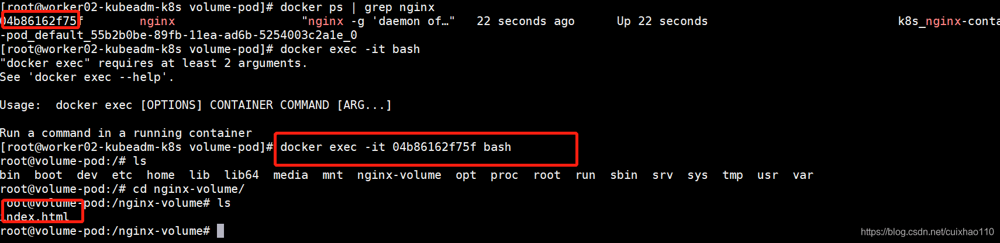
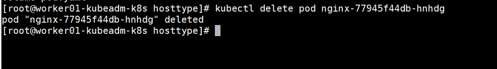

# 一文带你深入了解K8S持久化存储解决方案

# 1. 前言

经过上一篇K8S实战部署SpringBoot项目的解读，我相信很多老铁都已经对K8S部署项目有了一个初步的认识，我们了解了K8S的Ingress网络，但简单的SpringBoot项目部署只是K8S使用的基础，我们使用K8S另一个绕不开的话题就是K8S持久化存储。什么是持久化存储？ For Example: 我们做系统迁移，要把原来的服务迁移到K8S中，系统用的Mysql数据库，也要迁移到K8S，我们知道，K8S运行的是一个一个Pod，K8S对Pod自动化管理，一个Pod挂了，另外一个Pod就会马上拉起来，假如运行Mysql的Pod挂了，马上重新拉起来，那原来Pod中存储的数据还会存在吗？或者说新拉起来的Pod会进行数据恢复吗？答案是：NO! 如果没有持久化存储，那兄弟，你真正的做到了从删库到跑路！从这样一个真实的场景，我们应该认识到K8S持久化存储的重要性，可以说，没有持久化技术，K8S就没有任何发展的前景！今天，我就深入的和大家聊一聊K8S中做持久化存储的几种解决方案，并用实操让大家玩转K8S！话不多说，撸起袖子，干就完了！
***这里没有任何马后炮套话，只有粗暴的干货。写大家看得懂、用得着、赚得到的文章是唯一宗旨！***

# 2. Storage

2.1. Volume
官方定义：On-disk files in a Container are ephemeral, which presents some problems for non-trivial applications when running in Containers. First, when a Container crashes, kubelet will restart it, but the files will be lost - the Container starts with a clean state. Second, when running Containers together in a Pod it is often necessary to share files between those Containers. The Kubernetes Volume abstraction solves both of these problems.
容器中的磁盘上文件是短暂的，这给在容器中运行的非平凡应用程序带来了一些问题。首先，当一个容器崩溃时，kubelet将重新启动它，但文件将丢失-容器以一个干净的状态开始。其次，在Pod中一起运行容器时，常常需要在这些容器之间共享文件。Kubernetes卷抽象解决了这两个问题。

## 2.2. Host类型volume实战

假如我们来设计K8S的Storage 方案，我们会怎么做？如果你想到了这样一个解决方案：在Pod所在的宿主机上，我有一个数据存储目录，和Mysql Pod的数据存储目录做一下关联，让后者共享宿主机的存储目录，那在Pod挂掉之后，重新拉取还是同样的共享目录，那数据不久能恢复了？这样听起来是不是和docker的 -v 设置目录挂载有异曲同工之妙！那我们来实操一下！

### 2.2.1. 创建Nginx Pod的yaml文件

我们首先创建一个nginx的pod的yaml文件，volumeMounts 定义了pod内的存储目录是根目录的nginx-volume文件夹下，volumes 定义了的挂载类型是hostPath ， 目录是 /tmp/volume-pod，我们都是有经验的开发人员，我想这个文件应该很好理解。

```shell
apiVersion: v1
kind: Pod
metadata:
  name: volume-pod
spec:
  containers:
  - name: nginx-container
    image: nginx
    ports:
    - containerPort: 80
    volumeMounts:
    - name: volume-pod
      mountPath: /nginx-volume
  volumes:
  - name: volume-pod
    hostPath:
      path: /tmp/volume-pod
```

我们在集群中master节点保存这个yaml文件，起名字为`volume-pod.yaml`,然后执行

```shell
kubectl apply -f volume-pod.yaml
```

然后查看详细信息,我们发现它在worker02节点创建了pod。

```shell
kubectl get pod -o wide
```


### 2.2.2. 验证

接下来就是验证：我们要查看worker02节点和pod内目录是否进行了关联
宿主机：


Pod内：


果然，宿主机和Pod内都存在！那么接下来我们验证一下，我在宿主机这个目录建个文件，Pod内会不会出现这个文件。我在宿主机上建了一个 index.html文件，在Pod查看。


果然，同步了！
那接下来，我们删除Pod，重新拉起一个Pod,看会不会还存在这个index.html文件



果然，index.html存在！

重点来了： 这种共享宿主机存储的方法似乎可以解决Mysql数据库数据恢复的场景，我们似乎可以万事大吉了！But，有的老铁会问：如果我得宿主机挂了怎么办？或者Pod没有在上一次节点上拉起，而是在新的节点上拉起，那数据都不在一个宿主机上，还恢复个锤子！ 听起来有点儿道理啊，确实存在这个问题那怎么解决呢？还是那句话 ：总有”好事者”替我们解决了这个问题！

## 2.3. PersistentVolumes

[官方文档](https://kubernetes.io/docs/concepts/storage/persistent-volumes/)

既然Host类型的持久化存储无法解决节点宕机或者pod在另外的机器上拉起导致数据无法恢复的Bug，那我们就应该思考一个问题：既然我无法在宿主机持久化，那我在集群之外的服务器上存储数据，让我的Pod关联到这个数据存储服务器上，同时我对这个数据存储服务器做高可用，岂不美哉？ 此处应该有掌声，三分钟！
想法很好，那我们来介绍一下K8S给我们的解决方案： PersistentVolumes 简称PV
PV 是什么？它是一种插件，它能够支持多种数据存储服务器，通过PV，我们能在K8S集群中，把我们的数据持久化到外部的服务器中。下图是PV能够支持的数据存储服务类型

我们可以看到，它能支持这么多种数据存储服务，那我们来实战一下：选择NFS来作为我们的数据存储服务。

### 2.3.1. NFS服务器搭建

**NFS** 是什么？ **nfs(network file system)** 网络文件系统，是FreeBSD支持的文件系统中的一种，允许网络中的计算机之间通过TCP/IP网络共享资源

1. 找一台centos 7机器，执行以下脚本，搭建 NFS服务器：

```shell
    # 安装nfs
    yum install -y nfs-utils
    # 创建nfs目录
    mkdir -p /nfs/data/
    mkdir -p /nfs/data/mysql
    # 授予权限
    chmod -R 777 /nfs/data
    # 编辑export文件
    vi /etc/exports
    /nfs/data *(rw,no_root_squash,sync)
    # 使得配置生效
    exportfs -r
    # 查看生效
    exportfs
    # 启动rpcbind、nfs服务
    systemctl restart rpcbind && systemctl enable rpcbind
    systemctl restart nfs && systemctl enable nfs
    # 查看rpc服务的注册情况
    rpcinfo -p localhost
    # showmount测试
    showmount -e ip(ip地址)
```

2. 在K8S集群所有节点上安装NFS客户端

```shell
	yum -y install nfs-utils
	systemctl start nfs && systemctl enable nfs
```

### 2.3.2. PV定义

NFS 服务器有了，那我们如何让PV和NFC关联上呢？看下面代码：

```shell
# 定义PV
apiVersion: v1
kind: PersistentVolume
metadata:
  name: nginx-pv
spec:
  accessModes:
    - ReadWriteMany
  capacity:
    storage: 2Gi    
  nfs:
    path: /nfs/data/nginx     
    server: 10.6.229.62
```

PV也作为一种K8S的资源，被K8S管理，所以它的定义肯定也是yaml。上述代码我们定义了一个nginx-pv，accessModes权限是ReadWriteMany读写权限，capacity storage 定义了2G的存储空间，挂载目录是/nfs/data/nginx，NFS 服务器IP是10.6.229.62，好了，我们这样就定义了一个PV。
**定义完了我们就能用了吗？**

**我们考虑一个问题：** 假如你作为这一块儿的设计者，每次想使用外部存储服务，都要自己创建一个PV，这样做麻烦吗？一个公司中不仅有开发，还有运维，如果我们想用外部存储服务，直接告诉运维，让运维给我们在K8S中准备一些PV，我们自己挑选着用，这岂不是方便很多。

所以，“好事者” 想的比较周到。我们的PV是和外部的服务器相连，Pod是不能使用的，我们要用另外一种叫做PersistentVolumeClaim 简称 PVC 的资源来连接PV，我们的Pod连接PVC 就可以使用了。类似于消息中间件的生产者和消费者的关系。PV是生产者，PVC是消费者。

## 2.4. PersistentVolumeClaim

[官方文档](https://kubernetes.io/docs/concepts/storage/persistent-volumes/#persistentvolumeclaims)

**PVC定义：**

```shell
# 定义PVC，用于消费PV
apiVersion: v1
kind: PersistentVolumeClaim
metadata:
  name: nginx-pvc
spec:
  accessModes:
    - ReadWriteMany
  resources:
    requests:
      storage: 2Gi
```

简单明了，我定义一个名字叫 nginx-pvc的PVC，权限是ReadWriteMany读写权限，需要的存储空间是 2G。
那我们思考一个问题：PV，PVC我们都定义好了，我们在PVC定义中并没有看到和PV绑定的相关配置，那他们两个是怎么绑定的呢？
其实，内部是配对是这样的：通过PVC定义的 accessModes 读写权限，和storage定义的2G内存，PVC会自动找到符合这些配置的PV进行绑定。一个PV被PVC绑定后，不能被别的PVC绑定。

## 2.5. PV、PVC实战

我们还来定义一个**Nginx** **Pod**，使用**PV**，**PVC**，**NFS**来做持久化存储。

```shell
# 定义PV
apiVersion: v1
kind: PersistentVolume
metadata:
  name: nginx-pv
spec:
  accessModes:
    - ReadWriteMany
  capacity:
    storage: 2Gi    
  nfs:
    path: /nfs/data/nginx     
    server: 10.6.229.62 
    
---
# 定义PVC，用于消费PV
apiVersion: v1
kind: PersistentVolumeClaim
metadata:
  name: nginx-pvc
spec:
  accessModes:
    - ReadWriteMany
  resources:
    requests:
      storage: 2Gi
  
---
# 定义Pod，指定需要使用的PVC
apiVersion: apps/v1beta1
kind: Deployment
metadata:
  name: nginx
spec:
  selector:
    matchLabels: 
      app: nginx
  template:
    metadata:
      labels:
        app: nginx
    spec:
      containers:
      - image: nginx
        name: nginx
        ports:
        - containerPort: 80
        volumeMounts:
        - name: nginx-persistent-storage
          mountPath: /usr/share/nginx/html
      volumes:
      - name: nginx-persistent-storage
        persistentVolumeClaim:
          claimName: nginx-pvc
```

我们可以看到 使用 persistentVolumeClaim:claimName: nginx-pvc 定义了我我们要使用名字为nginx-pvc的 PVC。
注意：我们在NFS服务器上定义的路径是/nfs/data/nginx 首先我们需要去 nfs/data下创建 nginx的文件夹，不然你的pod是启动不起来的，这个坑我替大家踩了！
接下来，在master节点上启动。

```shell
kubectl apply -f nginx-pv-demo.yaml 
```

查看**PV,PVC**

```shell
kubectl get pv,pvc
```


查看**pod**

```shell
kubectl get pod -o wide
```


我们发现，Nginx Pod创建成功了，它在worker01节点启动了。那接下来就是要验证。

**验证：**

1. 我在pod中数据存储目录创建一个index.html，然后到nfs服务器上岸看有没有。


2. 我在nfs中数据存储目录创建一个hello.html，然后到pod中看有没有。


3. 我把pod删了，重新拉起之后看有没有index.html，hello.html文件。




结论： 全部验证成功！此处应该有掌声，5分钟！
重点又来了： 作为一个开发人员，我想要用一个持久性存储服务，要写PV，PVC，如果我的需求多了，那维护起来似乎有点儿麻烦了，尽管我们的PV可以让运维事先准备很多供我们挑选，但是如果没有我们的需要的怎么办？这种手动管理的做法是不是有点儿low! 我们都是有经验的开发人员，我的意思是：假如我们有一个模板，我想要多少资源，我直接在模板里配置好，启动的时候自动给我创建对应的资源，运维也不用需要太关注PV，那岂不是挺好的？K8S能有这种机制吗？答案是yes!

k8s部署动态卷见 [Kubernetes 中部署 NFS Provisioner 为 NFS 提供动态分配卷](https://note.youdao.com/web/#/file/WEB85f4165808f90ea2cf5ab2cc38b3b614/markdown/WEB5dcef163d15d26ec28abbd67da890f5a/)