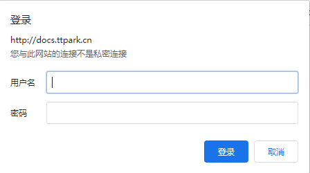

# 配置nginx认证

## 参考文档

[nginx 用户登录认证](https://blog.csdn.net/endzhi/article/details/88931176)
[如何在Ubuntu上通过Nginx设置HTTP认证](https://www.ucloud.cn/yun/23432.html)

## 简介

    本文档主要记录为http://docs.wsh-study.com 这个网站进行用户登录限制，这里使用nginx登录认证模块；

## 环境
    Ubuntu 16.04
    nginx

## 使用模块    
    ngx_http_auth_basic_module ：实现让用户只有输入正确的用户名密码才允许访问web内容

## 安装步骤

测试是否已经安装htpasswd，htpasswd命令找不到需要安装对应的包，这里采用apache2-utils

```bash
root@iZ28fcqvfh3Z:~# htpasswd -h
root@iZ28fcqvfh3Z:~# apt-get install apache2-utils
```

安装完成之后，测试命令是否可用

```bash
root@iZ28fcqvfh3Z:~# htpasswd -h
htpasswd: illegal option -- h
Usage:
	htpasswd [-cimBdpsDv] [-C cost] passwordfile username
	htpasswd -b[cmBdpsDv] [-C cost] passwordfile username password

	htpasswd -n[imBdps] [-C cost] username
	htpasswd -nb[mBdps] [-C cost] username password
 -c  Create a new file.
 -n  Don't update file; display results on stdout.
 -b  Use the password from the command line rather than prompting for it.
 -i  Read password from stdin without verification (for script usage).
 -m  Force MD5 encryption of the password (default).
 -B  Force bcrypt encryption of the password (very secure).
 -C  Set the computing time used for the bcrypt algorithm
     (higher is more secure but slower, default: 5, valid: 4 to 31).
 -d  Force CRYPT encryption of the password (8 chars max, insecure).
 -s  Force SHA encryption of the password (insecure).
 -p  Do not encrypt the password (plaintext, insecure).
 -D  Delete the specified user.
 -v  Verify password for the specified user.
On other systems than Windows and NetWare the '-p' flag will probably not work.
The SHA algorithm does not use a salt and is less secure than the MD5 algorithm.
```

通过htpasswd命令生成密码数据库文件并创建用户与密码

!!! note 因为我们的服务器http://docs.wsh-study.com对应的nginx.conf文件为/etc/nginx/conf.d/下的docs.conf，故将授权认证放在该目录下

```bash
root@iZ28fcqvfh3Z:~# htpasswd -bc /etc/nginx/conf.d/passwd.db  admin  admin
```

查看通过htpasswd生成的密码为加密格式

```bash
root@iZ28fcqvfh3Z:/etc/nginx/conf.d# cat /etc/nginx/conf.d/passwd.db
admin:$apr1$Kv8gYfGE$LXwygXto8DNuDAtV2Hbs9/
```

nginx增加auth_basic和auth_basic_user_file两项配置,这里我们配置/etc/nginx/conf.d/下的docs.conf

```bash
root@iZ28fcqvfh3Z:/etc/nginx/conf.d# cat docs.conf 
server {
    listen   80;
    server_name docs.wsh-study.com;

    location / {
        ssi on;
        root   html;
        index  index.html index.htm;
        auth_basic "User Authentication";    ## 认证弹窗提示语
        auth_basic_user_file /etc/nginx/conf.d/passwd.db; ## 密码文件路径
    }
}
```

检查配置

```bash
root@iZ28fcqvfh3Z:/etc/nginx/conf.d# nginx -t
nginx: the configuration file /etc/nginx/nginx.conf syntax is ok
nginx: configuration file /etc/nginx/nginx.conf test is successful
```

重新载入配置

```bash
root@iZ28fcqvfh3Z:/etc/nginx/conf.d# /etc/init.d/nginx -s reload
# 或者直接重启nginx
root@iZ28fcqvfh3Z:/etc/nginx/conf.d# service nginx restart
```

浏览器访问测试

输入访问路径：http://docs.wsh-study.com/Iot/
弹出登录认证,输入账号密码，完成登录



认证失败或者未认证提示“401 Authorization Required”


## htpasswd使用方式

增加用户

!!!note 不能有c, 重置密码库文件才带c。

```bash
htpasswd -b /etc/nginx/conf.d/passwd.db  admin  123456    
```

修改用户密码

```bash 
htpasswd -b /etc/nginx/conf.d/passwd.db  admin  123eee 
```

删除用户。

* 方式1   
htpasswd -D   /usr/local/nginx/passwd.db   admin

* 方式2   
编辑密码库文件，删除用户行

问题总结

1. 在检查配置出现如下错误，是编码出错，由于部分配置实在windows上使用txt编辑，然后粘贴到文件，编码方式有问题，手动编辑即可；

```bash
nginx: [emerg] unknown directive "auth_basic_user_file /etc/nginx/conf.d/passwd.db" in /etc/nginx/conf.d/docs.conf:10
nginx: configuration file /etc/nginx/nginx.conf test failed
```

2.在加载配置或者重启nginx出错,通过查询状态，出现端口占用，使用sudo fuser -k 80/tcp，关闭占用的端口，然后重新重启；

```bash
root@iZ28fcqvfh3Z:/etc/nginx# systemctl restart nginx
Job for nginx.service failed because the control process exited with error code. See "systemctl status nginx.service" and "journalctl -xe" for details.
root@iZ28fcqvfh3Z:/etc/nginx# systemctl status nginx.service
бё nginx.service - A high performance web server and a reverse proxy server
   Loaded: loaded (/lib/systemd/system/nginx.service; disabled; vendor preset: enabled)
   Active: failed (Result: exit-code) since Tue 2020-03-03 16:17:09 CST; 16s ago
     Docs: man:nginx(8)
  Process: 2608 ExecStart=/usr/sbin/nginx -g daemon on; master_process on; (code=exited, status=1/FAILURE)
  Process: 2604 ExecStartPre=/usr/sbin/nginx -t -q -g daemon on; master_process on; (code=exited, status=0/S

Mar 03 16:17:08 iZ28fcqvfh3Z nginx[2608]: nginx: [emerg] bind() to 0.0.0.0:8090 failed (98: Address already 
Mar 03 16:17:08 iZ28fcqvfh3Z nginx[2608]: nginx: [emerg] bind() to 0.0.0.0:80 failed (98: Address already in
Mar 03 16:17:09 iZ28fcqvfh3Z nginx[2608]: nginx: [emerg] bind() to 0.0.0.0:443 failed (98: Address already i
Mar 03 16:17:09 iZ28fcqvfh3Z nginx[2608]: nginx: [emerg] bind() to 0.0.0.0:8090 failed (98: Address already 
Mar 03 16:17:09 iZ28fcqvfh3Z nginx[2608]: nginx: [emerg] bind() to 0.0.0.0:80 failed (98: Address already in
Mar 03 16:17:09 iZ28fcqvfh3Z nginx[2608]: nginx: [emerg] still could not bind()
Mar 03 16:17:09 iZ28fcqvfh3Z systemd[1]: nginx.service: Control process exited, code=exited status=1
Mar 03 16:17:09 iZ28fcqvfh3Z systemd[1]: Failed to start A high performance web server and a reverse proxy s
Mar 03 16:17:09 iZ28fcqvfh3Z systemd[1]: nginx.service: Unit entered failed state.
Mar 03 16:17:09 iZ28fcqvfh3Z systemd[1]: nginx.service: Failed with result 'exit-code'.

root@iZ28fcqvfh3Z:/etc/nginx# sudo fuser -k 80/tcp
80/tcp:               1173  1175  1177  1178  1179
```