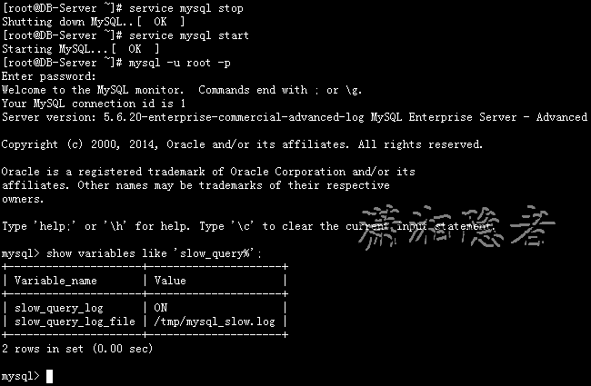
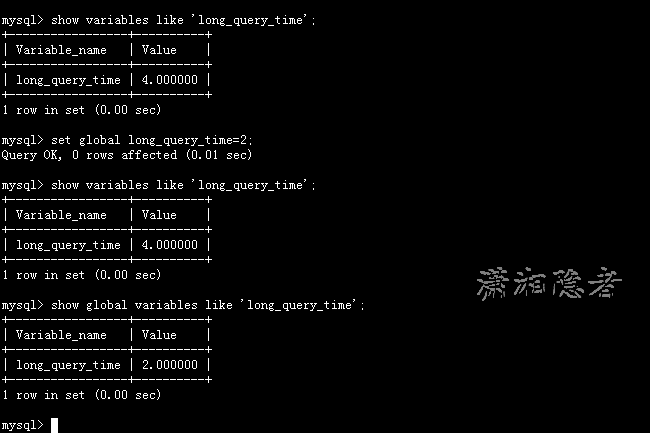
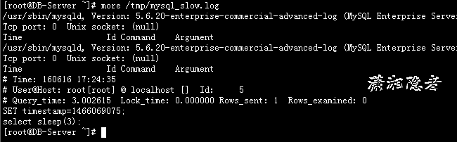

## 如何开启慢Sql日志

**慢查询日志概念**

MySQL的慢查询日志是MySQL提供的一种日志记录，它用来记录在MySQL中响应时间超过阀值的语句，具体指运行时间超过long_query_time值的SQL，则会被记录到慢查询日志中。long_query_time的默认值为10，意思是运行10S以上的语句。默认情况下，Mysql数据库并不启动慢查询日志，需要我们手动来设置这个参数，当然，如果不是调优需要的话，一般不建议启动该参数，因为开启慢查询日志会或多或少带来一定的性能影响。慢查询日志支持将日志记录写入文件，也支持将日志记录写入数据库表。

官方文档，关于慢查询的日志介绍如下（部分资料，具体参考官方相关链接）：

`The slow query log consists of SQL statements that took more than long_query_time seconds to execute and required at least min_examined_row_limit rows to be examined. The minimum and default values of long_query_time are 0 and 10, respectively. The value can be specified to a resolution of microseconds. For logging to a file, times are written including the microseconds part. For logging to tables, only integer times are written; the microseconds part is ignored.`

`By default, administrative statements are not logged, nor are queries that do not use indexes for lookups. This behavior can be changed usinglog_slow_admin_statements and log_queries_not_using_indexes, as described later.`

**慢查询日志相关参数**

MySQL 慢查询的相关参数解释：

MySQL 慢查询的相关参数解释：

`slow_query_log`  ：是否开启慢查询日志，1表示开启，0表示关闭。

`log-slow-queries` ：旧版（5.6以下版本）MySQL数据库慢查询日志存储路径。可以不设置该参数，系统则会默认给一个缺省的文件host_name-slow.log

`slow-query-log-file`：新版（5.6及以上版本）MySQL数据库慢查询日志存储路径。可以不设置该参数，系统则会默认给一个缺省的文件host_name-slow.log

`long_query_time` ：慢查询阈值，当查询时间多于设定的阈值时，记录日志。

`log_queries_not_using_indexes`：未使用索引的查询也被记录到慢查询日志中（可选项）。

`log_output`：日志存储方式。log_output='FILE'表示将日志存入文件，默认值是'FILE'。log_output='TABLE'表示将日志存入数据库，这样日志信息就会被写入到mysql.slow_log表中。MySQL数据库支持同时两种日志存储方式，配置的时候以逗号隔开即可，如：log_output='FILE,TABLE'。日志记录到系统的专用日志表中，要比记录到文件耗费更多的系统资源，因此对于需要启用慢查询日志，又需要能够获得更高的系统性能，那么建议优先记录到文件。

**慢查询日志配置**

默认情况下slow_query_log的值为OFF，表示慢查询日志是禁用的，可以通过设置slow_query_log的值来开启，如下所示：

```shell
mysql> show variables  like '%slow_query_log%';
+---------------------+-----------------------------------------------+
| Variable_name       | Value                                         |
+---------------------+-----------------------------------------------+
| slow_query_log      | OFF                                           |
| slow_query_log_file | /home/WDPM/MysqlData/mysql/DB-Server-slow.log |
+---------------------+-----------------------------------------------+
2 rows in set (0.00 sec)
 
mysql> set global slow_query_log=1;
Query OK, 0 rows affected (0.09 sec)
 
mysql> show variables like '%slow_query_log%';
+---------------------+-----------------------------------------------+
| Variable_name       | Value                                         |
+---------------------+-----------------------------------------------+
| slow_query_log      | ON                                            |
| slow_query_log_file | /home/WDPM/MysqlData/mysql/DB-Server-slow.log |
+---------------------+-----------------------------------------------+
2 rows in set (0.00 sec)
 
mysql> 
```

使用set global slow_query_log=1开启了慢查询日志只对当前数据库生效，如果MySQL重启后则会失效。如果要永久生效，就必须修改配置文件my.cnf（其它系统变量也是如此）。例如如下所示：

```shell
mysql> show variables like 'slow_query%';
+---------------------+-----------------------------------------------+
| Variable_name       | Value                                         |
+---------------------+-----------------------------------------------+
| slow_query_log      | OFF                                           |
| slow_query_log_file | /home/WDPM/MysqlData/mysql/DB-Server-slow.log |
+---------------------+-----------------------------------------------+
2 rows in set (0.01 sec)
 
mysql> 
```


修改my.cnf文件，增加或修改参数slow_query_log 和slow_query_log_file后，然后重启MySQL服务器，如下所示

`slow_query_log =1`

`slow_query_log_file=/tmp/mysql_slow.log`



```shell
mysql> show variables like 'slow_query%';
+---------------------+---------------------+
| Variable_name       | Value               |
+---------------------+---------------------+
| slow_query_log      | ON                  |
| slow_query_log_file | /tmp/mysql_slow.log |
+---------------------+---------------------+
2 rows in set (0.00 sec)
 
mysql> 
```

关于慢查询的参数slow_query_log_file ，它指定慢查询日志文件的存放路径，系统默认会给一个缺省的文件host_name-slow.log（如果没有指定参数slow_query_log_file的话）

```shell
mysql> show variables like 'slow_query_log_file';
+---------------------+-----------------------------------------------+
| Variable_name       | Value                                         |
+---------------------+-----------------------------------------------+
| slow_query_log_file | /home/WDPM/MysqlData/mysql/DB-Server-slow.log |
+---------------------+-----------------------------------------------+
1 row in set (0.00 sec)
```

那么开启了慢查询日志后，什么样的SQL才会记录到慢查询日志里面呢？ 这个是由参数long_query_time控制，默认情况下long_query_time的值为10秒，可以使用命令修改，也可以在my.cnf参数里面修改。关于运行时间正好等于long_query_time的情况，并不会被记录下来。也就是说，在mysql源码里是判断大于long_query_time，而非大于等于。从MySQL 5.1开始，long_query_time开始以微秒记录SQL语句运行时间，之前仅用秒为单位记录。如果记录到表里面，只会记录整数部分，不会记录微秒部分。

```shell
mysql> show variables like 'long_query_time%';
+-----------------+-----------+
| Variable_name   | Value     |
+-----------------+-----------+
| long_query_time | 10.000000 |
+-----------------+-----------+
1 row in set (0.00 sec)
 
mysql> set global long_query_time=4;
Query OK, 0 rows affected (0.00 sec)
 
mysql> show variables like 'long_query_time';
+-----------------+-----------+
| Variable_name   | Value     |
+-----------------+-----------+
| long_query_time | 10.000000 |
+-----------------+-----------+
1 row in set (0.00 sec)
```

如上所示，我修改了变量long_query_time，但是查询变量long_query_time的值还是10，难道没有修改到呢？注意：使用命令 set global long_query_time=4修改后，需要重新连接或新开一个会话才能看到修改值。你用show variables like 'long_query_time'查看是当前会话的变量值，你也可以不用重新连接会话，而是用show global variables like 'long_query_time'; 如下所示：



在MySQL里面执行下面SQL语句，然后我们去检查对应的慢查询日志，就会发现类似下面这样的信息。

```shell
mysql> select sleep(3);
+----------+
| sleep(3) |
+----------+
|        0 |
+----------+
1 row in set (3.00 sec)
 
[root@DB-Server ~]# more /tmp/mysql_slow.log
/usr/sbin/mysqld, Version: 5.6.20-enterprise-commercial-advanced-log (MySQL Enterprise Server - Advanced Edition (Commercial)). started with:
Tcp port: 0  Unix socket: (null)
Time                 Id Command    Argument
/usr/sbin/mysqld, Version: 5.6.20-enterprise-commercial-advanced-log (MySQL Enterprise Server - Advanced Edition (Commercial)). started with:
Tcp port: 0  Unix socket: (null)
Time                 Id Command    Argument
# Time: 160616 17:24:35
# User@Host: root[root] @ localhost []  Id:     5
# Query_time: 3.002615  Lock_time: 0.000000 Rows_sent: 1  Rows_examined: 0
SET timestamp=1466069075;
select sleep(3);
```



log_output 参数是指定日志的存储方式。log_output='FILE'表示将日志存入文件，默认值是'FILE'。log_output='TABLE'表示将日志存入数据库，这样日志信息就会被写入到mysql.slow_log表中。MySQL数据库支持同时两种日志存储方式，配置的时候以逗号隔开即可，如：log_output='FILE,TABLE'。日志记录到系统的专用日志表中，要比记录到文件耗费更多的系统资源，因此对于需要启用慢查询日志，又需要能够获得更高的系统性能，那么建议优先记录到文件。

```shell
mysql> show variables like '%log_output%';
+---------------+-------+
| Variable_name | Value |
+---------------+-------+
| log_output    | FILE  |
+---------------+-------+
1 row in set (0.00 sec)
 
mysql> set global log_output='TABLE';
Query OK, 0 rows affected (0.00 sec)
 
mysql> show variables like '%log_output%';
+---------------+-------+
| Variable_name | Value |
+---------------+-------+
| log_output    | TABLE |
+---------------+-------+
1 row in set (0.00 sec)
 
mysql> select sleep(5) ;
+----------+
| sleep(5) |
+----------+
|        0 |
+----------+
1 row in set (5.00 sec)
 
mysql> 
 
mysql> select * from mysql.slow_log;
+---------------------+---------------------------+------------+-----------+-----------+---------------+----+----------------+-----------+-----------+-----------------+-----------+
| start_time          | user_host                 | query_time | lock_time | rows_sent | rows_examined | db | last_insert_id | insert_id | server_id | sql_text        | thread_id |
+---------------------+---------------------------+------------+-----------+-----------+---------------+----+----------------+-----------+-----------+-----------------+-----------+
| 2016-06-16 17:37:53 | root[root] @ localhost [] | 00:00:03   | 00:00:00  |         1 |             0 |    |              0 |         0 |         1 | select sleep(3) |         5 |
| 2016-06-16 21:45:23 | root[root] @ localhost [] | 00:00:05   | 00:00:00  |         1 |             0 |    |              0 |         0 |         1 | select sleep(5) |         2 |
+---------------------+---------------------------+------------+-----------+-----------+---------------+----+----------------+-----------+-----------+-----------------+-----------+
2 rows in set (0.00 sec)
 
mysql> 
```

系统变量log-queries-not-using-indexes：未使用索引的查询也被记录到慢查询日志中（可选项）。如果调优的话，建议开启这个选项。另外，开启了这个参数，其实使用full index scan的sql也会被记录到慢查询日志。

This option does not necessarily mean that no index is used. For example, a query that uses a full index scan uses an index but would be logged because the index would not limit the number of rows.

```shell
mysql> show variables like 'log_queries_not_using_indexes';
+-------------------------------+-------+
| Variable_name                 | Value |
+-------------------------------+-------+
| log_queries_not_using_indexes | OFF   |
+-------------------------------+-------+
1 row in set (0.00 sec)
 
mysql> set global log_queries_not_using_indexes=1;
Query OK, 0 rows affected (0.00 sec)
 
mysql> show variables like 'log_queries_not_using_indexes';
+-------------------------------+-------+
| Variable_name                 | Value |
+-------------------------------+-------+
| log_queries_not_using_indexes | ON    |
+-------------------------------+-------+
1 row in set (0.00 sec)
 
mysql> 
```

系统变量log_slow_admin_statements表示是否将慢管理语句例如ANALYZE TABLE和ALTER TABLE等记入慢查询日志

```shell
mysql> show variables like 'log_slow_admin_statements';
+---------------------------+-------+
| Variable_name             | Value |
+---------------------------+-------+
| log_slow_admin_statements | OFF   |
+---------------------------+-------+
1 row in set (0.00 sec)
 
mysql> 
```

另外，如果你想查询有多少条慢查询记录，可以使用系统变量。

```shell
mysql> show global status like '%Slow_queries%';
+---------------+-------+
| Variable_name | Value |
+---------------+-------+
| Slow_queries  | 2104  |
+---------------+-------+
1 row in set (0.00 sec)
 
mysql> 
```

**日志分析工具 mysqldumpslow**

在生产环境中，如果要手工分析日志，查找、分析SQL，显然是个体力活，MySQL提供了日志分析工具mysqldumpslow

查看mysqldumpslow的帮助信息：

```shell
[root@DB-Server ~]# mysqldumpslow --help
Usage: mysqldumpslow [ OPTS... ] [ LOGS... ]
 
Parse and summarize the MySQL slow query log. Options are
 
  --verbose    verbose
  --debug      debug
  --help       write this text to standard output
 
  -v           verbose
  -d           debug
  -s ORDER     what to sort by (al, at, ar, c, l, r, t), 'at' is default
                al: average lock time
                ar: average rows sent
                at: average query time
                 c: count
                 l: lock time
                 r: rows sent
                 t: query time  
  -r           reverse the sort order (largest last instead of first)
  -t NUM       just show the top n queries
  -a           don't abstract all numbers to N and strings to 'S'
  -n NUM       abstract numbers with at least n digits within names
  -g PATTERN   grep: only consider stmts that include this string
  -h HOSTNAME  hostname of db server for *-slow.log filename (can be wildcard),
               default is '*', i.e. match all
  -i NAME      name of server instance (if using mysql.server startup script)
  -l           don't subtract lock time from total time
```

-s, 是表示按照何种方式排序，

> c: 访问计数
>
> l: 锁定时间
>
> r: 返回记录
>
> t: 查询时间
>
> al:平均锁定时间
>
> ar:平均返回记录数
>
> at:平均查询时间

-t, 是top n的意思，即为返回前面多少条的数据；

-g, 后边可以写一个正则匹配模式，大小写不敏感的；

比如

得到返回记录集最多的10个SQL。

`mysqldumpslow -s r -t 10 /database/mysql/mysql06_slow.log`

得到访问次数最多的10个SQL

`mysqldumpslow -s c -t 10 /database/mysql/mysql06_slow.log`

得到按照时间排序的前10条里面含有左连接的查询语句。

`mysqldumpslow -s t -t 10 -g “left join” /database/mysql/mysql06_slow.log`

另外建议在使用这些命令时结合 | 和more 使用 ，否则有可能出现刷屏的情况。

`mysqldumpslow -s r -t 20 /mysqldata/mysql/mysql06-slow.log | more`