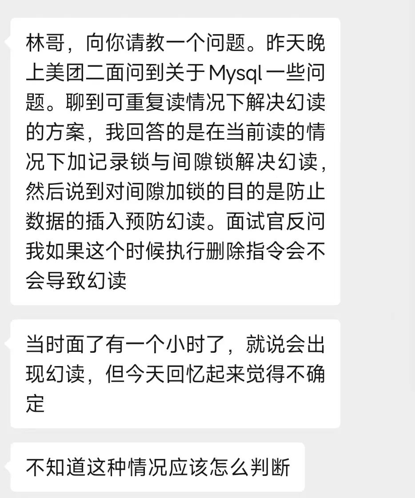
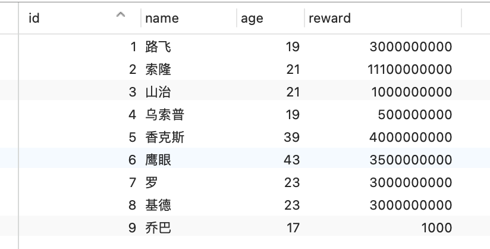
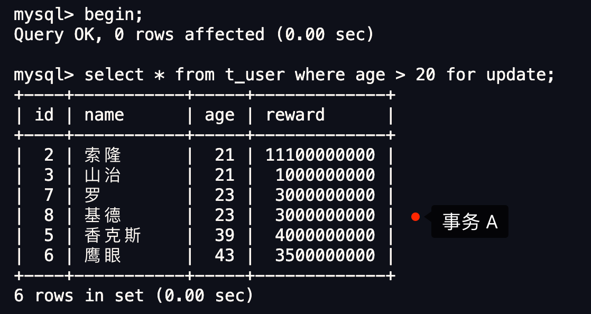
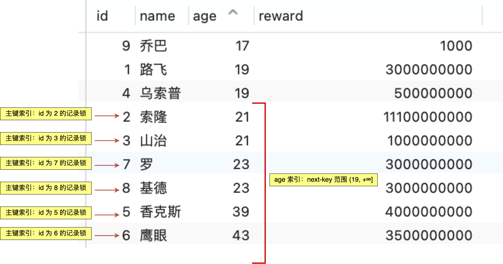
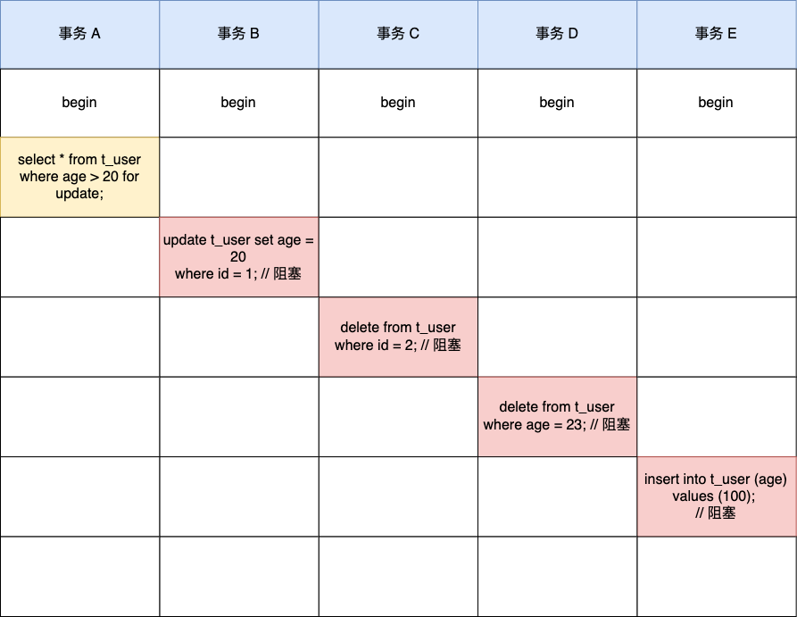

# MySQL记录锁加间隙锁可以防止删除操作而导致的幻读吗

昨天有位读者在美团二面的时候，被问到关于幻读的问题：



面试官反问的大概意思是， **MySQL 记录锁+间隙锁可以防止删除操作而导致的幻读吗？**  

答案是可以的。

接下来，通过几个小实验来证明这个结论吧，顺便再帮大家复习一下记录锁+间隙锁。

## 什么是幻读？

首先来看看 MySQL 文档是怎么定义幻读（Phantom Read）的:

 ***The so-called phantom problem occurs within a transaction when the same query produces different sets of rows at different times. For example, if a SELECT is executed twice, but returns a row the second time that was not returned the first time, the row is a “phantom” row.** * 

翻译：当同一个查询在不同的时间产生不同的结果集时，事务中就会出现所谓的幻象问题。例如，如果 SELECT 执行了两次，但第二次返回了第一次没有返回的行，则该行是“幻像”行。

举个例子，假设一个事务在 T1 时刻和 T2 时刻分别执行了下面查询语句，途中没有执行其他任何语句：

```sql
SELECT * FROM t_test WHERE id > 100;
```

只要 T1 和 T2 时刻执行产生的结果集是不相同的，那就发生了幻读的问题，比如：

- T1 时间执行的结果是有 5 条行记录，而 T2 时间执行的结果是有 6 条行记录，那就发生了幻读的问题。
- T1 时间执行的结果是有 5 条行记录，而 T2 时间执行的结果是有 4 条行记录，也是发生了幻读的问题。

> MySQL 是怎么解决幻读的？

MySQL InnoDB 引擎的默认隔离级别虽然是「可重复读」，但是它很大程度上避免幻读现象（并不是完全解决了，详见这篇[文章 ](https://xiaolincoding.com/mysql/transaction/phantom.html)），解决的方案有两种：

- 针对 **快照读** （普通 select 语句），是 **通过 MVCC 方式解决了幻读** ，因为可重复读隔离级别下，事务执行过程中看到的数据，一直跟这个事务启动时看到的数据是一致的，即使中途有其他事务插入了一条数据，是查询不出来这条数据的，所以就很好了避免幻读问题。
- 针对 **当前读** （select ... for update 等语句），是 **通过 next-key lock（记录锁+间隙锁）方式解决了幻读** ，因为当执行 select ... for update 语句的时候，会加上 next-key lock，如果有其他事务在 next-key lock 锁范围内插入了一条记录，那么这个插入语句就会被阻塞，无法成功插入，所以就很好了避免幻读问题。

## 实验验证

接下来，来验证「 MySQL 记录锁+间隙锁 **可以防止** 删除操作而导致的幻读问题」的结论。

实验环境：MySQL 8.0 版本，可重复读隔离级。

现在有一张用户表（t_user），表里 **只有一个主键索引** ，表里有以下行数据：



现在有一个 A 事务执行了一条查询语句，查询到年龄大于 20 岁的用户共有 6 条行记录。


然后， B 事务执行了一条删除 id = 2 的语句：


此时，B 事务的删除语句就陷入了 **等待状态** ，说明是无法进行删除的。

因此，MySQL 记录锁+间隙锁 **可以防止** 删除操作而导致的幻读问题。

### 加锁分析

问题来了，A 事务在执行 select ... for update 语句时，具体加了什么锁呢？

我们可以通过 `select * from performance_schema.data_locks\G;` 这条语句，查看事务执行 SQL 过程中加了什么锁。

输出的内容很多，共有 11 行信息，我删减了一些不重要的信息：


从上面输出的信息可以看到，共加了两种不同粒度的锁，分别是：

- 表锁（`LOCK_TYPE: TABLE`）：X 类型的意向锁；
- 行锁（`LOCK_TYPE: RECORD`）：X 类型的 next-key 锁；

这里我们重点关注「行锁」，图中 `LOCK_TYPE` 中的 `RECORD` 表示行级锁，而不是记录锁的意思：

- 如果 LOCK_MODE 为 `X`，说明是 next-key 锁；
- 如果 LOCK_MODE 为 `X, REC_NOT_GAP`，说明是记录锁；
- 如果 LOCK_MODE 为 `X, GAP`，说明是间隙锁；

然后通过 `LOCK_DATA` 信息，可以确认 next-key 锁的范围，具体怎么确定呢？

- 根据我的经验，如果 LOCK_MODE 是 next-key 锁或者间隙锁，那么  **LOCK_DATA 就表示锁的范围最右值** ，而锁范围的最左值为 LOCK_DATA 的上一条记录的值。

因此，此时事务 A 在主键索引（`INDEX_NAME : PRIMARY`）上加了 10 个 next-key 锁，如下：

- X 型的 next-key 锁，范围：(-∞, 1]
- X 型的 next-key 锁，范围：(1, 2]
- X 型的 next-key 锁，范围：(2, 3]
- X 型的 next-key 锁，范围：(3, 4]
- X 型的 next-key 锁，范围：(4, 5]
- X 型的 next-key 锁，范围：(5, 6]
- X 型的 next-key 锁，范围：(6, 7]
- X 型的 next-key 锁，范围：(7, 8]
- X 型的 next-key 锁，范围：(8, 9]
- X 型的 next-key 锁，范围：(9, +∞]

 **这相当于把整个表给锁住了，其他事务在对该表进行增、删、改操作的时候都会被阻塞** 。

只有在事务 A 提交了事务，事务 A 执行过程中产生的锁才会被释放。

> 为什么只是查询年龄 20 岁以上行记录，而把整个表给锁住了呢？

这是因为事务 A 的这条查询语句是 **全表扫描，锁是在遍历索引的时候加上的，并不是针对输出的结果加锁** 。


因此， **在线上在执行 update、delete、select ... for update 等具有加锁性质的语句，一定要检查语句是否走了索引，如果是全表扫描的话，会对每一个索引加 next-key 锁，相当于把整个表锁住了** ，这是挺严重的问题。

> 如果对 age 建立索引，事务 A 这条查询会加什么锁呢？

接下来，我 **对 age 字段建立索引** ，然后再执行这条查询语句：



接下来，继续通过 `select * from performance_schema.data_locks\G;` 这条语句，查看事务执行 SQL 过程中加了什么锁。

具体的信息，我就不打印了，我直接说结论吧。

 **因为表中有两个索引，分别是主键索引和 age 索引，所以会分别对这两个索引加锁。**  

主键索引会加如下的锁：

- X 型的记录锁，锁住 id = 2 的记录；
- X 型的记录锁，锁住 id = 3 的记录；
- X 型的记录锁，锁住 id = 5 的记录；
- X 型的记录锁，锁住 id = 6 的记录；
- X 型的记录锁，锁住 id = 7 的记录；
- X 型的记录锁，锁住 id = 8 的记录；

分析 age 索引加锁的范围时，要先对 age 字段进行排序。 

age 索引加的锁：

- X 型的 next-key lock，锁住 age 范围 (19, 21] 的记录；
- X 型的 next-key lock，锁住 age 范围 (21, 21] 的记录；
- X 型的 next-key lock，锁住 age 范围 (21, 23] 的记录；
- X 型的 next-key lock，锁住 age 范围 (23, 23] 的记录；
- X 型的 next-key lock，锁住 age 范围 (23, 39] 的记录；
- X 型的 next-key lock，锁住 age 范围 (39, 43] 的记录；
- X 型的 next-key lock，锁住 age 范围 (43, +∞] 的记录；

化简一下， **age 索引 next-key 锁的范围是 (19, +∞]。**  

可以看到，对 age 字段建立了索引后，查询语句是索引查询，并不会全表扫描，因此 **不会把整张表给锁住** 。


总结一下，在对 age 字段建立索引后，事务 A 在执行下面这条查询语句后，主键索引和 age 索引会加下图中的锁。



事务 A 加上锁后，事务 B、C、D、E 在执行以下语句都会被阻塞。



## 总结

在 MySQL 的可重复读隔离级别下，针对当前读的语句会对 **索引** 加记录锁+间隙锁，这样可以避免其他事务执行增、删、改时导致幻读的问题。

有一点要注意的是，在执行 update、delete、select ... for update 等具有加锁性质的语句，一定要检查语句是否走了索引，如果是全表扫描的话，会对每一个索引加 next-key 锁，相当于把整个表锁住了，这是挺严重的问题。
