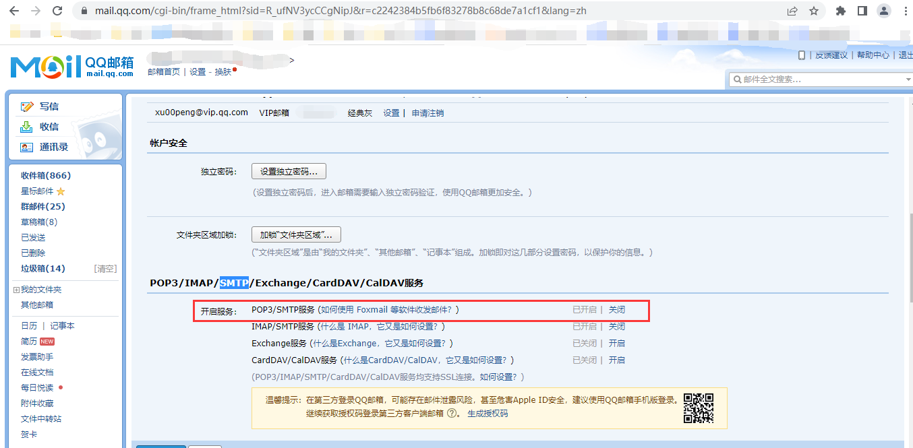
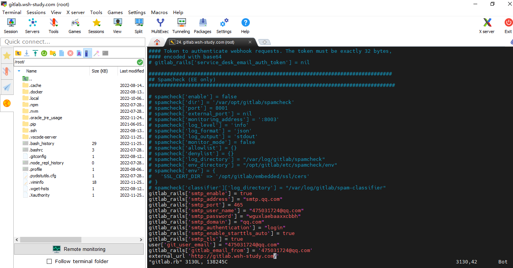
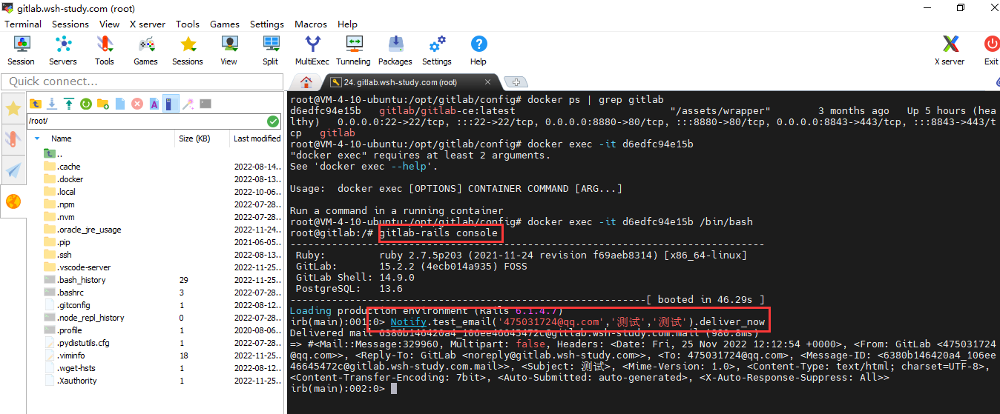

### 一、配置邮箱服务的用途

当有合并请求时，账号注册，修改密码时，可通过邮件通知 ，邮件验证 ，邮件修改实现

### 二、配置步骤

#### **1、开启`QQ`邮箱的`SMTP`服务**

设置-->账户-->`smtp`-->密保验证-->验证成功后返回授权码。保存好授权码



#### 2、修改 `gitlab` 配置

（1）**进入配置文件**

```shell
vim /opt/gitlab/config/gitlab.rb
```

（2）**修改配置文件**

可以在文件中查找这些内容进行修改，由于这些内容是注释的，也可以直接添加

```shell
gitlab_rails['smtp_enable'] = true
gitlab_rails['smtp_address'] = "smtp.qq.com"
gitlab_rails['smtp_port'] = 465
gitlab_rails['smtp_user_name'] = "475031724@qq.com"
gitlab_rails['smtp_password'] = "wguxlaebaaxxcbbh"
gitlab_rails['smtp_domain'] = "qq.com"
gitlab_rails['smtp_authentication'] = "login"
gitlab_rails['smtp_enable_starttls_auto'] = true
gitlab_rails['smtp_tls'] = true
user['git_user_email'] = "475031724@qq.com"
gitlab_rails['gitlab_email_from'] = '475031724@qq.com'
external_url 'http://gitlab.wsh-study.com/'
```



**（3）更新设置**

```shell
gitlab-ctl reconfigure
```

**（4）测试邮件服务是否正常**

打开gitlab控制台

```shell
gitlab-rails console
```

发送邮件

```shell
Notify.test_email('接收方邮件地址','邮件标题','邮件内容').deliver_now
```




