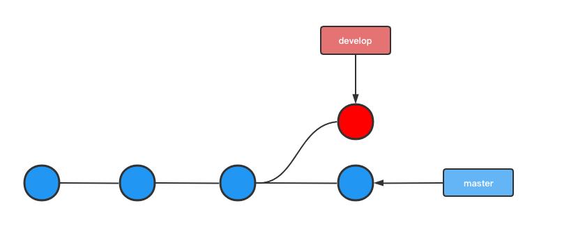
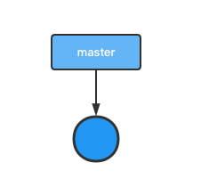
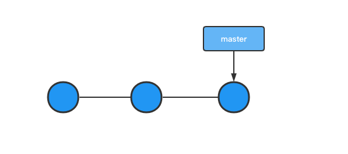
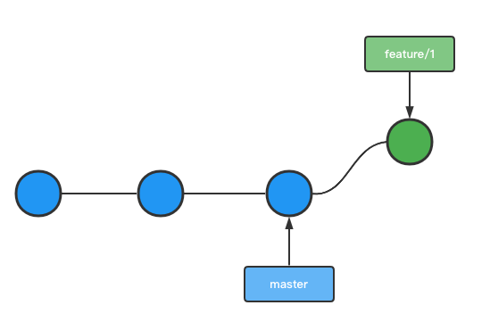
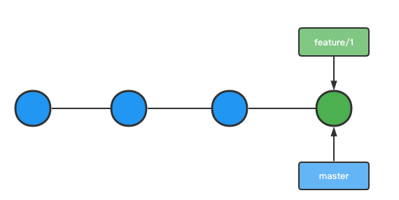
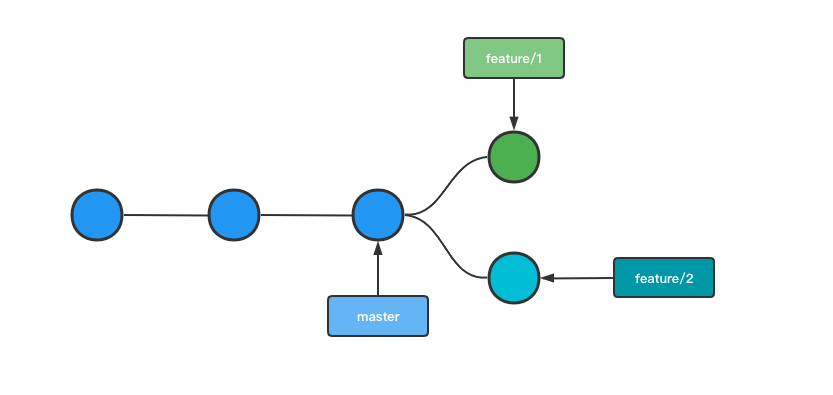
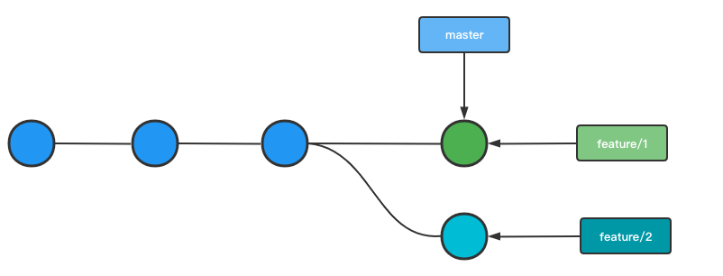
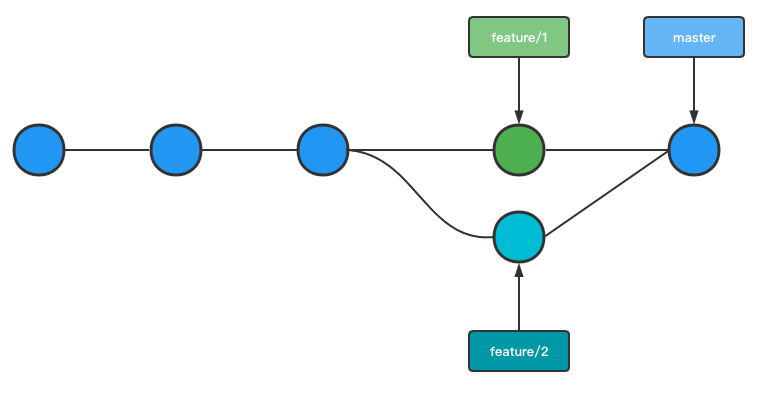
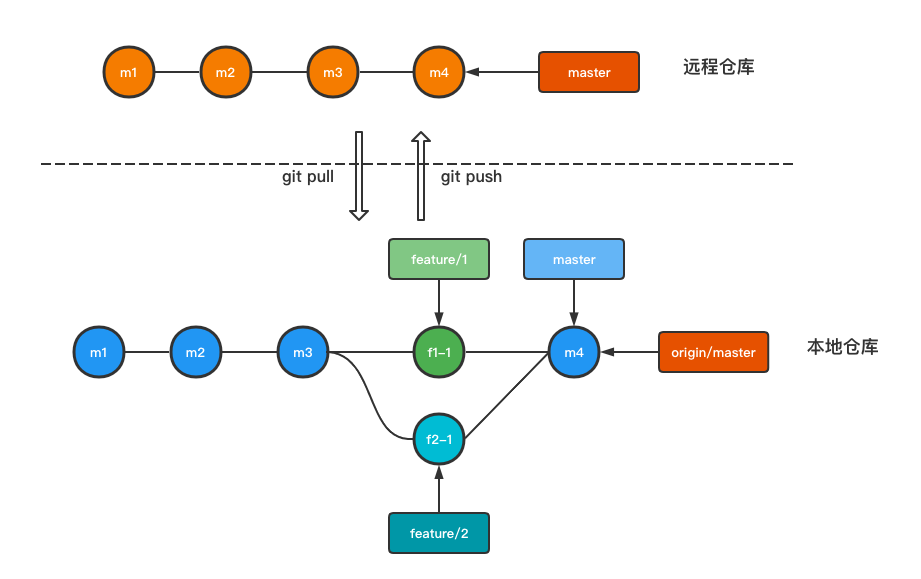
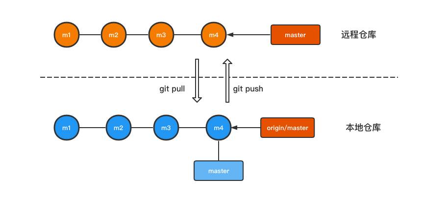

# 写给自己的Git分支使用备忘指南

分支模型是Git的必杀技，也是Git最强大的地方，掌握Git分支的使用，也就是学到Git的精髓。

## Git分支的本质

 **分支的本质就是一个引用(指针)，是对提交(commit)的引用** 。

Git会使用`SHA-1`哈希算法给每次提交生成一个40位个哈希值(`commit id`)，如下所示，这个值是唯一的，只要我们修改文件再提交，产生的`commit id`都不一样：

```shell
1bcb7ac5ac6444c1fd360345fba553b51021d53b
```

每次的`commit`都包含一个指向前一个`commit`的指针，这些`commit`连起来就是一条我们提交的时间线了。

分支就是指向某个`commit`的指针，不同分叉代表不同的分支走向，不同分支也可以指向同一个`commit`，如下图所示：



`Git`仓库还有个叫`HEAD`的指针，`HEAD`指向当前工作区所在的分支，当我们切换分支时，`HEAD`就会指向我们所切换的分支，比如在下面的示意图中，我们把分支从`master`切换到`develop`，`HEAD`也随之改变。


## 分支的基本操作

为了更好地学习Git分支的知识，在这篇文章中，我们以一个从零开始的项目来详细讲解Git分支的使用。

### 初始化仓库

首先初始化一个空的仓库，命令如下：

```shell
$ git init demo
```

创建好项目并初始化仓库后，`Git`默认会帮我们创建一个名为`master`，如果你是通过命令行来操作的，应该可以看到类似下面图片的命令行提示符：


### 创建仓库

现在我们开始在`master`分支上添加文件，并提交我们的修改：

```shell
# 创建文件
$ echo "Hello Git!" > hello.html
# 添加到暂存区
$ git add hello.html
# 提交修改
$ git commit -m 'new file hello.html'
```

执行`git commit`命令后，产生了一个commit记录，master分支指该commit，此时分支状态如下图所示：



当然，我们也可以多commit几次，假设我们再多提交两次，那么此时`master`分支指向最新的commit，分支状态如下图所示：



### 创建分支

Git的分支管理功能命令为：`git branch`。

现在假设我们要在项目中开发一个新功能，按正常开发流程，我们需要基于`master`分支创建一个新的功能分支，在`git branch`命令后直接跟上分支名即可：

```shell
$ git branch feature/1
```

执行后，我们就创建了一个名为`feature/1`的分支。

### 切换分支

不过，在创建分支后，Git并没有帮我们切换到`feature/1`上，切换分支的命令为`git checkout`:

```shell
$ git checkout feature/1
```

`git checkout`也可以在分支不存在时，直接创建并切换，只要跟上`-b`选项即可：

```shell
$ git checkout -b feature/1
```

注意，`git checkout`命令跟上选项`-b`的话，如果要切换的分支已经存在的话，则会报错，此时要去掉`-b`选项。

切换到`feature/1`分支之后，新增一个文件并提交：

```shell
# 创建文件
$ echo "This is feature 1" > feature1.html
# 添加到暂存区
$ git add feature1.html
# 提交修改
$ git commit -m 'new file feature1.html'
```

此时仓库各个分支状态如下图所示：



### 查看分支

直接运行`git branch`命令可以查看当前仓库的分支:

```shell
$ git branch
* feature/1
  master
```

输出结果中，有的分支名前面有*号，表示当前检出的分支，也是`HEAD`指针指向的分支。

跟上`-v`选项后，可以查看所有分支的最后一次提交的`commit Id`和提交时我们输入的说明文字：

```shell
$ git branch -v
* feature/1 69d618f new file feature1.html
  master    ac02f4c new file hello.html
```

`--merged`选项可以查看已经合并的分支：

```shell
$ git branch --merged
```

`--no-merged`选项可以查看未合并的分支：

```shell
$ git branch --no-merged
```

### 合并分支

在进行分支合并时，一般会出现三种情况：快进合并(`Fast-forward`)、正常分支合并和分支冲突；下面我们一一讨论。

#### 快进合并

假设现在我们已经`feature/1`分支上完成了功能开发，那接下来就是将`feature/1`分支合并`master`上了，Git的分支合并命令为:`git merge`：

```shell
# 切换到master分支
$ git checkout master
# 将feature/1分支合并到master
$ git merge feature/1

Updating ac02f4c..69d618f
Fast-forward
 feature1.html | 1 +
 1 file changed, 1 insertion(+)
 create mode 100644 feature1.html
```

合并完成后，可以看到输出的信息有`Fast-forward`的提示文字，说明此次合并模式为：`快进合并`。因为`feature/1`分支是`master`分支的基础上创建的，两个分支之间没有出现分叉，因此Git在合并`feature/1`到`master`时，只需要将`master`指向`feature/1`分支指向的`commit id`即可，所以称为`快进合并`，如下图所示：



#### 正常分支合并

为了更好模拟正常分支合并的情况，现在让我们回到`feature/1`分支未合并到`master`时的状态，然后再切到`master`分支，基于`master`分支创建`feature/2`分支，此时情况如下图所示：



接着再将`feature/1`分支合并到`master`分上(快进合并)，如下图所示，`master`分支和`feature/2`分支出现分叉，出现不同的走向：



这时将`feature/2`合并到`master`，`Git`不会再采用快进合并的方式，而是将`feature/2`的提交与`master`的提交整合在一起，并产生一个新的提交，如下图所示：

```shell
$ git merge feature/2
```


#### 解决冲突

如果合并分支时出现冲突，处理方式也不一样的，现在我们假设`feature/2`分支与`feature/1`都修改了`home.html`文件的同一行，且`feature/1`已合并到`master`了，情况与上面的正常分支合并类似，不同的是`feature/1`与`feature/2`都改了同一个文件，并产生冲突：


此时再将`feature/2`合并到`master`，Git会提示我们合并产生冲突了，需要手动解决：

```shell
$ git checkout master
$ git merge feature/2
Auto-merging hello.html
CONFLICT (content): Merge conflict in hello.html
Automatic merge failed; fix conflicts and then commit the result.
```

冲突的内容会同时出在文件里，此时如果我们用`git status`查看工作区状态，Git会显示`both modified`文本来提示该文件被两个分支改过：

```shell
$ git status
On branch master
You have unmerged paths.
  (fix conflicts and run "git commit")
  (use "git merge --abort" to abort the merge)

Unmerged paths:
  (use "git add <file>..." to mark resolution)
 both modified:   hello.html

no changes added to commit (use "git add" and/or "git commit -a")
```

打开文件，可以发现冲突的代码已被<<<<<<<和=======隔开了，有`HEAD`标签表示是当前分支master的修改(是从feature修改后合并过来的)，=======下面的则是我们要合并的分支的代码。

```shell
Hello Git
<<<<<<< HEAD
This commit is from feature/1
=======
the commit is from feature/2
>>>>>>> feature/2
```

我们要自己决定冲突内容的去留，修改之后保存文件再commit即可，产生一个新的commit，此时master指向最新的commit。

```shell
$ git add .
$ git commit -m '合并冲突文件'
```

如下图所示，发生冲突后我们自己手动合并然后提交，其分支走向与上面的正常合并情况类似：



### 删除分支

对于已经合并到master的分支，可以删除了，删除分支同样用`git branch`命令，跟上`-d`选项与分支名即可：

```shell
$ git branch -d feature/1
```

对于还未合并的分支，使用`-d`选项无法删除，Git会提示该分支未合并，如果坚持要强制删除的话，使用`-D`选项进行强制删除：

```shell
$ git branch -D feature/2
```

### 查看提交历史

当我们在仓库中多次提交，创建多个分支后，你可能需要对目前整个仓库分支与提交点的关系进行梳理，也就是查看我们的提交历史：

```shell
$ git log
```

上面命令未跟参数的情况下，会按顺序输出我们的提交日志，跟上`-p`或`--patch`选项，可以查看每次提交的差异，后面的数字表示要显示的日志数量：

```shell
$ git log -p -3
```

## 远程分支

上面的所有操作，都是在本地完成的，仓库也是存储在我们本地，如果团队的其他小伙伴想参与这个项目，该怎么办呢？

最好的办法就是把我们的仓库推送到一个团队内共享的远程仓库，具体要怎么做呢？

### 远程仓库设置

首先当然需要有一个远程仓库，假设我们在Github创建一个了仓库，其地址为：`https://github.com/test/test`，Git关于远程仓库设置的命令为：`git remote`。

```shell
$ git remote origin https://github.com/test/test
```

这里我们将远程仓库名称为设置为`origin`，这个名字并没有什么特殊含义，你也可以设置其他名称，而且，一个仓库可以设置多个远程仓库，所以除了Github，你也可以再设置一个存储在`Gitee`的仓库。

有了远程仓库，就可以将本地的提交推送到远程仓库了，使用`git push`命令：

```shell
# -u选项用于设置本地的当前分支跟踪的远程分支
$ git push -u origin master 
```

这样，我们就将本地`master`分支同步推送到远程仓库的`master`分支上了，此时本地及远程仓库分支状态如下图所示：



现在我们将视角切换我们团队中另一个小伙伴 **小A** 这里，让 **小A** 参与到项目中来，因为我们已经创建了远程仓库，所以 **小A** 只需要将远程仓库克隆到他的电脑可以了：

```shell
$ git clone https://github.com/test/test
```

因为是通过克隆的方式生成的本地仓库，所以`Git`会自动将远程仓库命名为`origin`，此时在小A的电脑中，其本地与远程分支关系状态如下图所示：



上面的示意图中，我们看到在本地仓库中有个名称为`origin/master`的分支名，这个是远程仓库分支在本地的引用，其命名规则为 **远程仓库名+远程分支名** ，因为我们把远程仓库名为`origin`，因此这个分支完整名称就是`origin/master`，注意，这个分支我们无法修改，只能与远程仓库的分支进行同步。

### 基于远程仓库的协作过程

好了，既然团队中的其他小伙伴参与项目中来了，那么接下来就是基于共享远程仓库进行协作开发了，具体来说就是将团队中的人把自己的提交推送到远程仓库，或者同步其他人推送到远程仓库的提交。

#### 推送与同步

在Git中，`git push`命令用于将分支推送到远程分支。

我们在前面已经使用`git push`命令了，这个命令的本质是将当前分支的所有commit发给远程仓库的指定分支，远程仓库收到commit之后，将commit合并到指定的分支当中去。

`git push`的用法如下：

```shell
# 未指定推送分支，如果没有设置当前本地分支跟踪的远程分支，则无法推送
$ git push
# 跟上-u选项后，会自动设置当前本地分支跟踪该远程分支，之后就可以直接使用`git push`而不需要指定分支了。
$ git push -u origin master
```

有时候我们的推送并不一定成功的，这是为什么呢？如果我们推送的远程分支上有比我们本地更新的提交，那么此时就无法推送成功，需要将远程分支的最新提交同步到我们本地，然后再推送。

Git同步抓取远程分支提交的命令为:`git fetch`：

```shell
$ git fetch origin master
```

调用`git fetch`之后，仅仅只是把远程分支同步到本地远程分支(`每个远程分支在我们本地都有一个引用`)而已，还没合并到本地的分支，因此还要再调用合并命令：

```shell
$ git merge origin master
```

如果觉得每次同步都要执两条命令，那么就用`git pull`命令吧，这个命令相当于同时执行`git fetch`和`git merge`。

```shell
$ git pull origin master
```

从上面的演示可以看出，当我们通过`git fetch`命令把远程分支同步到本地`origin/master`分支后，接下来的步骤与本地分支合并类似，就是把`origin/master`合并到`master`而已，这个合并的过程一样会出现快进合并、正常分支合并、分支冲突这三种我们之前已经讨论的情况，解决的方法也是一样的。

#### 存储工作区文件(stash)

某个工作日， **小A** 正在本地自己的分支上开发新功能，突然线上出现一个bug需要马上修复，小A不得不切换到master分支并同步线上master分支的代码。

但是A因为功能未开发完成，所以并没有将工作目录中的文件提交到功能分支，切换master分支后，功能分支相关的文件还在工作目录里，如果这些文件中跟线上master分支有冲突，那就没办法同步远程仓库的master上的代码了。

有什么办法可以切换到master时，不让功能分支的文件出现`master`分支的工作目录下，且不用将未完成的代码提交功能分支呢？

`git stash`就派上用场，`git stash`命令可以把当前工作的文件暂时存储到某个独立的地方，把工作区清理干净，避免未完成的修改对临时变更产生影响：

```shell
$ git stash
```

> 注意，`git stash`与`git add`命令把文件添加暂存区完全不同。

当小A完成了主线上bug的修复后，要再回到功能分支上开发，执行下面的命令就可以把之前存储的文件调出来，继续功能开发：

```shell
$ git stash pop
```

#### 撤消操作

在使用Git的时候，难免需要撤消之前的操作，大概有以下几种情况：

##### 文件回到提交状态

假如我们本地临时调试修改了某个已提交的文件，那么这个文件就变成已修改的状态，但我们并不想提交这个修改，因此调试完成后，就得把文件恢复到改动之前，`git restore`命令就派上用场了：

```shell
$ git restore 文件名
```

##### 从暂存区撤回文件

我们知道`git add`命令可以帮我们把修改的文件添加到暂存区，如果发现添加错了，怎么办？同样是使用`git restore`命令，但需要跟上`--staged`选顶：

```shell
git restore --staged 文件名
```

##### 修改提交

如果暂存区的文件已经提交了，却发现有代码写错了或者对提交说明不满意，想修改，但又不再提交，而是想要修改刚刚的提交，可以吗？

可以，把要改的文件改好之前添加到暂存区，然后重新执行`git commit`，但要跟上`--amind`选项，表示要修正上一个提交：

```shell
$ git commit --amend 
```

##### 本地回退到某个版本

如果我们不仅仅只是修改刚刚的提交，而是要抛弃整个提交，回到上个提次，也是可以做到的，命令如下：

```shell
$ git reset --hard HEAD^
```

`HEAD`表示指向当前分支最新的commit，`HEAD^`则表示相对于当前commit的上一个commit：

`git reset`命令不仅可以回到上一个commit，实际上，这个命令后面参数为`commit id`，因此可以使用这个命令回到任意一个`commit`：

```shell
$ git reset --hard a23s93
```

所以，如果我们回到之前的提交点后，如果知道记住了后面的提交点的哈希值，也可以调用`git reset`命令回到那个点。

##### 远程仓库回退

如果某个commit已经被我们push到远程仓库了，但却发现有代码写错了，想撤消，可以做到吗？这要分两种情况来分析：

 **第一种情况：**  

如果是你一个人维护的仓库或者团队中没人基于你推送的分支上开发，也就是说你的撤消推送到这个分支的操作不会影响其他人，那么在本地回退到某个commit之后，再执行`git push --force` 强制推送到远程仓库即可。

```shell
$ git reset --hard HEAD^
# -f 或 --force
$ git push --force
```

 **第二种情况：**  

如果你要回退的分支上已经有团队中其他人的最新提交，那千万不要在本地回滚后强制推送，因为很可能把其他人的提交给覆盖掉，这时候就只能正常修改，然后再提交版本了。

## 小结

至此，洋洋洒洒，4000多字的长文，总结下来就以下三个方面：

1. Git分支的本质是仓库所有提交串起来的时间线中某个`commit`的引用，就是指向commit的一个指针，这也是Git分支管理高效的原因吧，就是移动指针而已。
2. 在本地仓库中，知道了如何管理分支，包括分支的创建、删除、合并、冲突解决、查看提交日志等知识。
3. 当本地仓库与远程仓库关联，这时候由于是团队协作，情况可能要复杂一些，我们要知道如何推送，同步其他人提交的代码，以及如何撤消自己的误操作。
