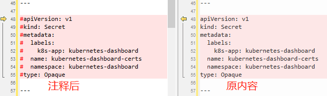
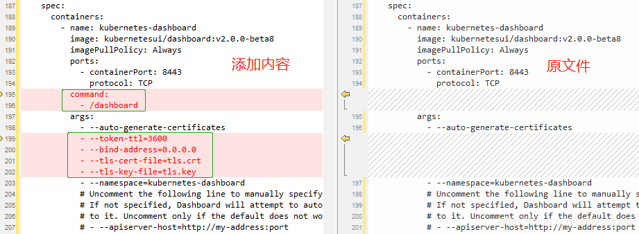
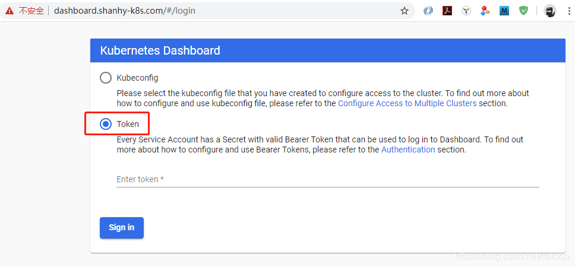
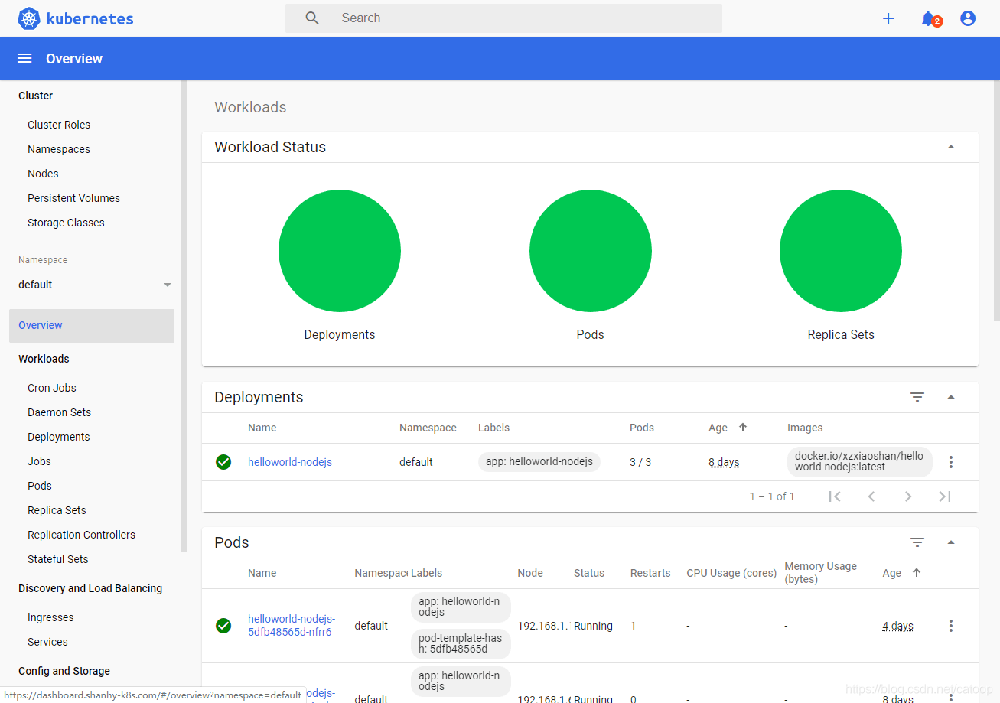
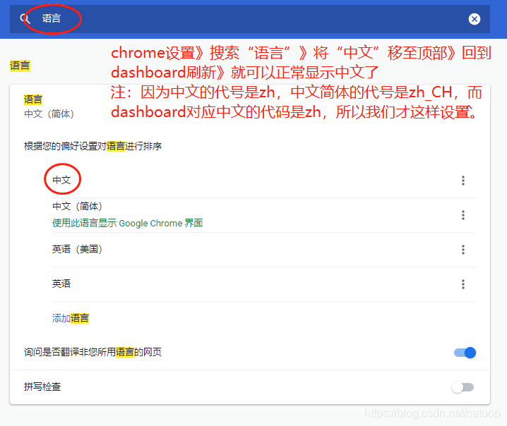

# k8s通过ingress部署dashboard

**一、dashboard总配置文件下载**

​	官网地址：https://kubernetes.io/docs/tasks/access-application-cluster/web-ui-dashboard/

```shell
wget -O kubernetes-dashboard.yaml https://raw.githubusercontent.com/kubernetes/dashboard/v2.0.0-beta8/aio/deploy/recommended.yaml
```

**二、配置文件修改**

1、将这段注释掉，下面我们使用自己手工签发的TLS证书并手工创建Secret



2、修改容器启动参数



其中 auto-generate-certificates 不能注释，因为我看到过有帖子说要注释掉（这个参数不仅仅是自动证书的开关，还是总的HTTPS的开关，当我们手工配置了证书后，容器不会自动生成）。

另外两个tls参数指定的是被挂载到容器中的证书的名字，下面我们使用 tls secret 处理的证书，通过配置mountPath: /certs可以得知被挂载到容器的/certs目录中，其名字为tls.crt和tls.key（为什么叫这2个名字或者是否可以配置其他名字，请继续往下看）。

**三、tls证书制作**

1、证书制作

```shell
# 生成证书请求的key
openssl genrsa -out dashboard.key 2048
# 生成证书请求
openssl req -days 3650 -new -key dashboard.key -out dashboard.csr -subj /C=CN/ST=JiangSu/L=NanJing/O=Shanhy/OU=Shanhy/CN=*.shanhy-k8s.com
# 生成自签证书（证书文件 dashboard.crt 和私钥 dashboad.key）
openssl x509 -req -in dashboard.csr -signkey dashboard.key -out dashboard.crt
# 查看证书信息
openssl x509 -in dashboard.crt -text -noout
```

2、创建 kubernetes-dashboard-certs（因为我们把原来的注释掉了，所以这里手工创建）

```shell
# 创建 namespace
kubectl create namespace kubernetes-dashboard
# 创建 secret
kubectl create secret tls kubernetes-dashboard-certs -n kubernetes-dashboard --key dashboard.key --cert dashboard.crt
```

**四、命令启动服务**

应用主配置文件一键启动

```shell
kubectl apply -f kubernetes-dashboard.yaml
```

启动后，查看一下 service、pod、secret 的信息内容确认结果。

**五、配置ingress方式访问**

创建文件 ingress-nginx-kubernetes-dashboard.yaml

```shell
apiVersion: networking.k8s.io/v1beta1 # for versions before 1.14 use extensions/v1beta1
kind: Ingress
metadata:
  name: ingress-nginx-kubernetes-dashboard
  namespace: kubernetes-dashboard
  annotations:
    kubernetes.io/ingress.class: "nginx"
    # 开启use-regex，启用path的正则匹配 
    nginx.ingress.kubernetes.io/use-regex: "true"
    nginx.ingress.kubernetes.io/rewrite-target: /
    nginx.ingress.kubernetes.io/ssl-redirect: "true"
    #nginx.ingress.kubernetes.io/secure-backends: "true" //好像是版本0.20.0发布后被删除，请使用下面这行
    nginx.ingress.kubernetes.io/backend-protocol: "HTTPS"
spec:
  tls:
  - hosts:
    - shanhy-k8s.com
    - "*.shanhy-k8s.com"
    secretName: kubernetes-dashboard-certs
  rules:
  - host: dashboard.shanhy-k8s.com
    http:
      paths:
      - path: /
        backend:
          serviceName: kubernetes-dashboard
          servicePort: 443
```

其中 secretName 就使用我们上面手工创建的 kubernetes-dashboard-certs

然后发布配置：

```shell
kubectl apply -f ingress-nginx-kubernetes-dashboard.yaml
```

**六、浏览器登录访问**

将 dashboard.shanhy-k8s.com 配置到本机 hosts 中，对应 kubectl get ingree -A 中看到的IP地址。然后打开浏览器访问 https://dashboard.shanhy-k8s.com，打开页面



其中Token的获取命令为：

```shell
kubectl -n kubernetes-dashboard describe secret $(kubectl -n kubernetes-dashboard get secret | grep kubernetes-dashboard-token | awk '{print $1}')
```

输入获取的命令，就可以登录进入了。

此时还不能高兴的太早，你会发现等进入后啥都不显示，右上角的小铃铛上的提醒数字在一直增长。

打开浏览器debug模式，你会发现Network网络请求响应的都是 forbidden 403 这样的错误。

**七、解决forbidden 403问题**

这个错误是绑定的角色没有权限导致的，最简单的办法再创一个管理员角色 [戳这里了解K8S RBAC介绍](https://shanhy.blog.csdn.net/article/details/104967560)。

1、创建配置文件 kubernetes-dashboard-rbac.yaml

```shell
apiVersion: v1
kind: ServiceAccount
metadata:
  name: admin-user
  namespace: kubernetes-dashboard

---

apiVersion: rbac.authorization.k8s.io/v1
kind: ClusterRoleBinding
metadata:
  name: admin-user
roleRef:
  apiGroup: rbac.authorization.k8s.io
  kind: ClusterRole
  name: cluster-admin
subjects:
- kind: ServiceAccount
  name: admin-user
  namespace: kubernetes-dashboard
```

运行配置文件内容，并获取 admin-user 的  Token（admin-user不是固定值你随便起什么名字)：

```shell
kubectl apply -f kubernetes-dashboard-rbac.yaml
kubectl -n kubernetes-dashboard describe secret $(kubectl -n kubernetes-dashboard get secret | grep admin-user-token | awk '{print $1}')
```

退出登录，用新创建的 admin-user 的 token 进行登录，**精彩完美呈现~~**



**八、彩蛋 —— 中文设置**

Kubernetes Dashboard 2.0 已经支持中文界面了，但是你需要做一下浏览器设置，如下图：



其他浏览器，同理设置语言 zh 优先即可。