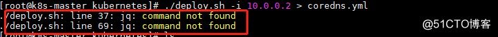
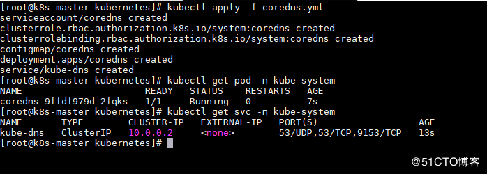
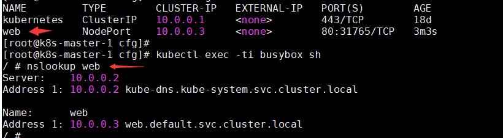

# kubernetes二进制部署coredns

* 下载配置文件

  [下载](http://note.youdao.com/s/dRgH8vNV)

* 使用dns服务器ip(10.0.0.2)部署coredns



这样会生成一个coredns的yaml

* 使用coredns.yaml部署coredns



* 验证coredns
  * 部署busybox

```shell
cat > busybox.yaml <<'EOF'
apiVersion: v1
kind: Pod
metadata:
  name: busybox
  namespace: default
spec:
  dnsPolicy: ClusterFirst
  containers:
  - name: busybox
    image: busybox:1.28.4
    command:
      - sleep
      - "3600"
    imagePullPolicy: IfNotPresent
  restartPolicy: Always
EOF

kubectl apply -f busybox.yaml
```

* 验证是否安装成功



* k8s coredns部署失败问题排查

K8S CoreDNS部署失败，查看错误日志，
`kubectl logs -f coredns-56f56989d6-krs6h -n kube-system`

提示如下：

`plugin/loop: Loop (127.0.0.1:55953 -> :1053) detected for zone ".", see https://coredns.io/plugins/loop#troubleshooting. Query: "HINFO 4547991504243258144.3688648895315093531."
`

这种一情况,一般是因为主机dns未正确配置导致,配置下主机 的dns地址就可以接近。

ubuntu环境下修改dns见[Ubuntu Server 修改 DNS](https://note.youdao.com/web/#/file/8CE1210E39E047CFAD8207C2C8005F38/markdown/WEB9253d28a88d7123bcd2e3f86b0eea4b6/)

