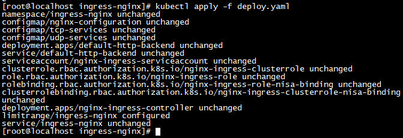
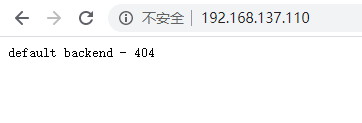

# 通过Ingress-nginx暴露service给外部网络访

* **创建Ingress的yaml描述文件**
  

 首先创建ingress-nginx的文件目录（后面创建的ingress相关的文件都在这里面，便于维护）

```shell
mkdir ingress-nginx
```

* 创建一个名称为deploy.yaml，内容如下

```shell
注：
1.这个yaml描述文件有点长，简单描述一下，里面主要创建了一个ingress-nginx的命名空间，
nginx-ingress-controller的Deployment对象以及最后面创建ingress-nginx的Service，Service配置映射的端口
2.我安装的k8s版本是1.18.0
```

```shell

apiVersion: v1
kind: Namespace
metadata:
  name: ingress-nginx
  labels:
    app.kubernetes.io/name: ingress-nginx
    app.kubernetes.io/part-of: ingress-nginx
---
kind: ConfigMap
apiVersion: v1
metadata:
  name: nginx-configuration
  namespace: ingress-nginx
  labels:
    app.kubernetes.io/name: ingress-nginx
    app.kubernetes.io/part-of: ingress-nginx
---
kind: ConfigMap
apiVersion: v1
metadata:
  name: tcp-services
  namespace: ingress-nginx
  labels:
    app.kubernetes.io/name: ingress-nginx
    app.kubernetes.io/part-of: ingress-nginx
---
kind: ConfigMap
apiVersion: v1
metadata:
  name: udp-services
  namespace: ingress-nginx
  labels:
    app.kubernetes.io/name: ingress-nginx
    app.kubernetes.io/part-of: ingress-nginx
---
apiVersion: apps/v1
kind: Deployment
metadata:
  name: default-http-backend
  labels:
    app: default-http-backend
  namespace: ingress-nginx
spec:
  replicas: 1
  selector:
    matchLabels:
      app: default-http-backend
  template:
    metadata:
      labels:
       app: default-http-backend
    spec:
      terminationGracePeriodSeconds: 60
      containers:
      - name: default-http-backend
        image:  registry.cn-qingdao.aliyuncs.com/kubernetes_xingej/defaultbackend-amd64:1.5      #建议提前在node节点下载镜像；
        livenessProbe:
          httpGet:
            path: /healthz
            port: 8080
            scheme: HTTP
          initialDelaySeconds: 30
          timeoutSeconds: 5
        ports:
        - containerPort: 8080
        resources:
         # 这里调整了cpu和memory的大小，可能不同集群限制的最小值不同，看部署失败的原因就清楚
          limits:
            cpu: 100m
            memory: 100Mi
          requests:
            cpu: 100m
            memory: 100Mi
---
apiVersion: v1
kind: Service
metadata:
  name: default-http-backend
  # namespace: ingress-nginx
  namespace: ingress-nginx
  labels:
    app: default-http-backend
spec:
  ports:
  - port: 80
    targetPort: 8080
  selector:
    app: default-http-backend
---
apiVersion: v1
kind: ServiceAccount
metadata:
  name: nginx-ingress-serviceaccount
  namespace: ingress-nginx
  labels:
    app.kubernetes.io/name: ingress-nginx
    app.kubernetes.io/part-of: ingress-nginx
---
apiVersion: rbac.authorization.k8s.io/v1beta1
kind: ClusterRole
metadata:
  name: nginx-ingress-clusterrole
  labels:
    app.kubernetes.io/name: ingress-nginx
    app.kubernetes.io/part-of: ingress-nginx
rules:
  - apiGroups:
      - ""
    resources:
      - configmaps
      - endpoints
      - nodes
      - pods
      - secrets
    verbs:
      - list
      - watch
  - apiGroups:
      - ""
    resources:
      - nodes
    verbs:
      - get
  - apiGroups:
      - ""
    resources:
      - services
    verbs:
      - get
      - list
      - watch
  - apiGroups:
      - ""
    resources:
      - events
    verbs:
      - create
      - patch
  - apiGroups:
      - "extensions"
      - "networking.k8s.io"
    resources:
      - ingresses
    verbs:
      - get
      - list
      - watch
  - apiGroups:
      - "extensions"
      - "networking.k8s.io"
    resources:
      - ingresses/status
    verbs:
      - update
---
apiVersion: rbac.authorization.k8s.io/v1beta1
kind: Role
metadata:
  name: nginx-ingress-role
  namespace: ingress-nginx
  labels:
    app.kubernetes.io/name: ingress-nginx
    app.kubernetes.io/part-of: ingress-nginx
rules:
  - apiGroups:
      - ""
    resources:
      - configmaps
      - pods
      - secrets
      - namespaces
    verbs:
      - get
  - apiGroups:
      - ""
    resources:
      - configmaps
    resourceNames:
      # Defaults to "<election-id>-<ingress-class>"
      # Here: "<ingress-controller-leader>-<nginx>"
      # This has to be adapted if you change either parameter
      # when launching the nginx-ingress-controller.
      - "ingress-controller-leader-nginx"
    verbs:
      - get
      - update
  - apiGroups:
      - ""
    resources:
      - configmaps
    verbs:
      - create
  - apiGroups:
      - ""
    resources:
      - endpoints
    verbs:
      - get
---
apiVersion: rbac.authorization.k8s.io/v1beta1
kind: RoleBinding
metadata:
  name: nginx-ingress-role-nisa-binding
  namespace: ingress-nginx
  labels:
    app.kubernetes.io/name: ingress-nginx
    app.kubernetes.io/part-of: ingress-nginx
roleRef:
  apiGroup: rbac.authorization.k8s.io
  kind: Role
  name: nginx-ingress-role
subjects:
  - kind: ServiceAccount
    name: nginx-ingress-serviceaccount
    namespace: ingress-nginx
---
apiVersion: rbac.authorization.k8s.io/v1beta1
kind: ClusterRoleBinding
metadata:
  name: nginx-ingress-clusterrole-nisa-binding
  labels:
    app.kubernetes.io/name: ingress-nginx
    app.kubernetes.io/part-of: ingress-nginx
roleRef:
  apiGroup: rbac.authorization.k8s.io
  kind: ClusterRole
  name: nginx-ingress-clusterrole
subjects:
  - kind: ServiceAccount
    name: nginx-ingress-serviceaccount
    namespace: ingress-nginx
---
apiVersion: apps/v1
kind: Deployment
metadata:
  name: nginx-ingress-controller
  namespace: ingress-nginx
  labels:
    app.kubernetes.io/name: ingress-nginx
    app.kubernetes.io/part-of: ingress-nginx
spec:
  replicas: 2
  selector:
    matchLabels:
      app.kubernetes.io/name: ingress-nginx
      app.kubernetes.io/part-of: ingress-nginx
  template:
    metadata:
      labels:
        app.kubernetes.io/name: ingress-nginx
        app.kubernetes.io/part-of: ingress-nginx
      annotations:
        prometheus.io/port: "10254"
        prometheus.io/scrape: "true"
    spec:
      # wait up to five minutes for the drain of connections
      terminationGracePeriodSeconds: 300
      serviceAccountName: nginx-ingress-serviceaccount
      nodeSelector:
        kubernetes.io/os: linux
      containers:
        - name: nginx-ingress-controller
          image: suisrc/ingress-nginx:0.30.0   #建议提前在node节点下载镜像；
          args:
            - /nginx-ingress-controller
            - --default-backend-service=$(POD_NAMESPACE)/default-http-backend
            - --configmap=$(POD_NAMESPACE)/nginx-configuration
            - --tcp-services-configmap=$(POD_NAMESPACE)/tcp-services
            - --udp-services-configmap=$(POD_NAMESPACE)/udp-services
            - --publish-service=$(POD_NAMESPACE)/ingress-nginx
            - --annotations-prefix=nginx.ingress.kubernetes.io
          securityContext:
            allowPrivilegeEscalation: true
            capabilities:
              drop:
                - ALL
              add:
                - NET_BIND_SERVICE
            # www-data -> 101
            runAsUser: 101
          env:
            - name: POD_NAME
              valueFrom:
                fieldRef:
                  fieldPath: metadata.name
            - name: POD_NAMESPACE
              valueFrom:
                fieldRef:
                  fieldPath: metadata.namespace
          ports:
            - name: http
              containerPort: 80
              protocol: TCP
            - name: https
              containerPort: 443
              protocol: TCP
          livenessProbe:
            failureThreshold: 3
            httpGet:
              path: /healthz
              port: 10254
              scheme: HTTP
            initialDelaySeconds: 10
            periodSeconds: 10
            successThreshold: 1
            timeoutSeconds: 10
          readinessProbe:
            failureThreshold: 3
            httpGet:
              path: /healthz
              port: 10254
              scheme: HTTP
            periodSeconds: 10
            successThreshold: 1
            timeoutSeconds: 10
          lifecycle:
            preStop:
              exec:
                command:
                  - /wait-shutdown
---
apiVersion: v1
kind: LimitRange
metadata:
  name: ingress-nginx
  namespace: ingress-nginx
  labels:
    app.kubernetes.io/name: ingress-nginx
    app.kubernetes.io/part-of: ingress-nginx
spec:
  limits:
  - min:
      memory: 90Mi
      cpu: 100m
    type: Container
---
apiVersion: v1
kind: Service
metadata:
  name: ingress-nginx
  namespace: ingress-nginx
  labels:
    app.kubernetes.io/name: ingress-nginx
    app.kubernetes.io/part-of: ingress-nginx
spec:
  type: NodePort
  ports:
    - name: http
      port: 80
      targetPort: 80
      protocol: TCP
      # HTTP
      nodePort: 80
    - name: https
      port: 443
      targetPort: 443
      protocol: TCP
     # HTTPS
      nodePort: 443
  selector:
    app.kubernetes.io/name: ingress-nginx
    app.kubernetes.io/part-of: ingress-nginx
```

* **查看创建好的pods、service、命令空间、Deployment**

    * 运行yaml文件

    ```shell
     kubectl apply -f deploy.yaml
    ```
  

  *  运行完后我们可以看到已经在ingress-nginx命名空间下创建了类型为NodePort的Service（节点开放端口80、443）、Ingress-Controller的pod


这时候我们通过节点IP+80端口访问一下,可以看到已经有提示404了，说明已经暴露80端口给外部访问了，提示404，这个因为当前ingress-nginx服务现在还没有后端服务

