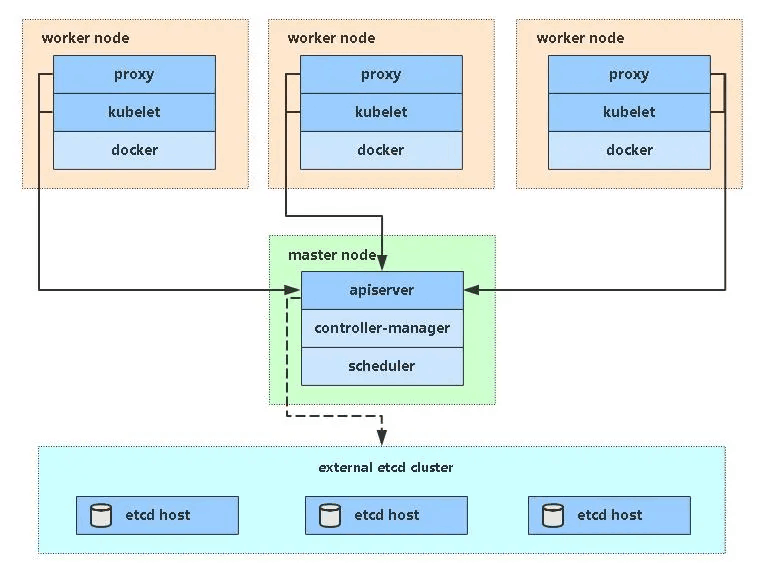
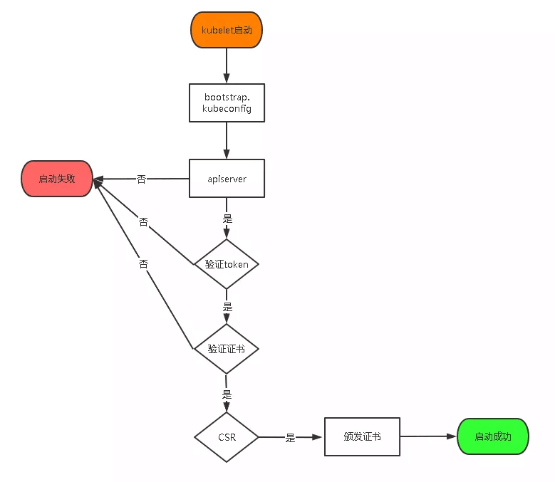
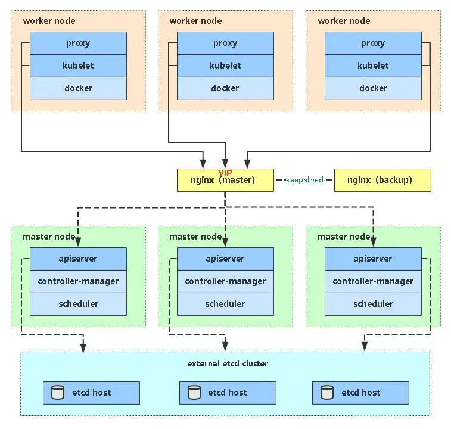
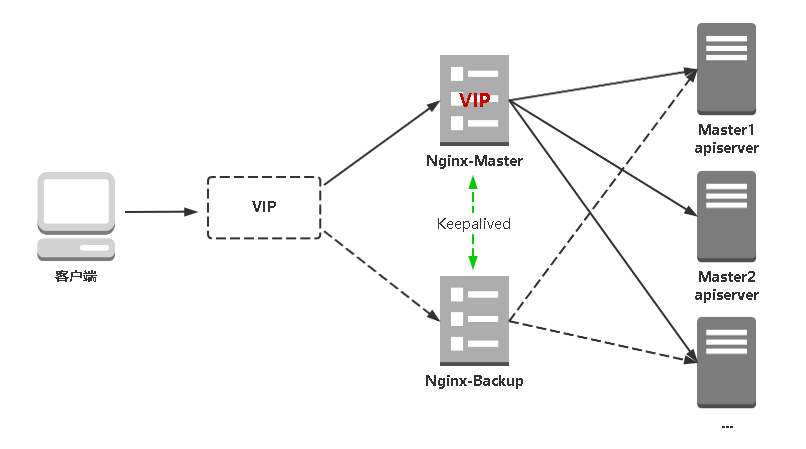

## 部署一套完整的Kubernetes高可用集群（上）

## 一、前置知识点 

### 1.1 生产环境可部署Kubernetes集群的两种方式

目前生产部署Kubernetes集群主要有两种方式：

- kubeadm

Kubeadm是一个K8s部署工具，提供kubeadm init和kubeadm join，用于快速部署Kubernetes集群。

官方地址：https://kubernetes.io/docs/reference/setup-tools/kubeadm/kubeadm/

- 二进制包

从github下载发行版的二进制包，手动部署每个组件，组成Kubernetes集群。

Kubeadm降低部署门槛，但屏蔽了很多细节，遇到问题很难排查。如果想更容易可控，推荐使用二进制包部署Kubernetes集群，虽然手动部署麻烦点，期间可以学习很多工作原理，也利于后期维护。

### 1.2 安装要求

在开始之前，部署Kubernetes集群机器需要满足以下几个条件：

- 一台或多台机器，操作系统 CentOS7.x-86_x64
- 硬件配置：2GB或更多RAM，2个CPU或更多CPU，硬盘30GB或更多
- 集群中所有机器之间网络互通
- 可以访问外网，需要拉取镜像，如果服务器不能上网，需要提前下载镜像并导入节点
- 禁止swap分区

### 1.3 准备环境

软件环境：

| 软件       | 版本                   |
| ---------- | ---------------------- |
| 操作系统   | CentOS7.8_x64 （mini） |
| Docker     | 19-ce                  |
| Kubernetes | 1.18                   |

服务器整体规划：

| 角色                    | IP                                  | 组件                                                         |
| ----------------------- | ----------------------------------- | ------------------------------------------------------------ |
| k8s-master1             | 192.168.31.71                       | kube-apiserver，kube-controller-manager，kube-scheduler，etcd |
| k8s-master2             | 192.168.31.74                       | kube-apiserver，kube-controller-manager，kube-scheduler      |
| k8s-node1               | 192.168.31.72                       | kubelet，kube-proxy，docker ，etcd                             |
| k8s-node2               | 192.168.31.73                       | kubelet，kube-proxy，docker，etcd                            |
| Load Balancer（Master） | 192.168.31.81 ，192.168.31.88 (VIP) | Nginx L4                                                     |
| Load Balancer（Backup） | 192.168.31. 82                      | Nginx L4                                                     |

须知：考虑到有些朋友电脑配置较低，这么多虚拟机跑不动，所以这一套高可用集群分两部分实施，先部署一套单Master架构（192.168.31.71/72/73），再扩容为多Master架构（上述规划），顺便熟悉下Master扩容流程。

单Master架构图：



单Master服务器规划：

| 角色       | IP            | 组件                                                         |
| ---------- | ------------- | ------------------------------------------------------------ |
| k8s-master | 192.168.31.71 | kube-apiserver，kube-controller-manager，kube-scheduler，etcd |
| k8s-node1  | 192.168.31.72 | kubelet，kube-proxy，docker，etcd                            |
| k8s-node2  | 192.168.31.73 | kubelet，kube-proxy，docker，etcd                            |

### 1.4 操作系统初始化配置

```
# 关闭防火墙
systemctl stop firewalld
systemctl disable firewalld

# 关闭selinux
sed -i 's/enforcing/disabled/' /etc/selinux/config  # 永久
setenforce 0  # 临时

# 关闭swap
swapoff -a  # 临时
sed -ri 's/.*swap.*/#&/' /etc/fstab    # 永久

# 根据规划设置主机名
hostnamectl set-hostname <hostname>

# 在master添加hosts
cat >> /etc/hosts << EOF
192.168.31.71 k8s-master
192.168.31.72 k8s-node1
192.168.31.73 k8s-node2
EOF

# 将桥接的IPv4流量传递到iptables的链
cat > /etc/sysctl.d/k8s.conf << EOF
net.bridge.bridge-nf-call-ip6tables = 1
net.bridge.bridge-nf-call-iptables = 1
EOF
sysctl --system  # 生效

# 时间同步
yum install ntpdate -y
ntpdate time.windows.com
```

## 二、部署Etcd集群

Etcd 是一个分布式键值存储系统，Kubernetes使用Etcd进行数据存储，所以先准备一个Etcd数据库，为解决Etcd单点故障，应采用集群方式部署，这里使用3台组建集群，可容忍1台机器故障，当然，你也可以使用5台组建集群，可容忍2台机器故障。

| 节点名称 | IP            |
| -------- | ------------- |
| etcd-1   | 192.168.31.71 |
| etcd-2   | 192.168.31.72 |
| etcd-3   | 192.168.31.73 |

> 注：为了节省机器，这里与K8s节点机器复用。也可以独立于k8s集群之外部署，只要apiserver能连接到就行。

### 2.1 准备cfssl证书生成工具

cfssl是一个开源的证书管理工具，使用json文件生成证书，相比openssl更方便使用。

找任意一台服务器操作，这里用Master节点。

```
wget https://pkg.cfssl.org/R1.2/cfssl_linux-amd64
wget https://pkg.cfssl.org/R1.2/cfssljson_linux-amd64
wget https://pkg.cfssl.org/R1.2/cfssl-certinfo_linux-amd64
chmod +x cfssl_linux-amd64 cfssljson_linux-amd64 cfssl-certinfo_linux-amd64
mv cfssl_linux-amd64 /usr/local/bin/cfssl
mv cfssljson_linux-amd64 /usr/local/bin/cfssljson
mv cfssl-certinfo_linux-amd64 /usr/bin/cfssl-certinfo
```

### 2.2 生成Etcd证书

#### 1. 自签证书颁发机构（CA）

创建工作目录：

```
mkdir -p ~/TLS/{etcd,k8s}

cd TLS/etcd
```

自签CA：

```
cat > ca-config.json << EOF
{
  "signing": {
    "default": {
      "expiry": "87600h"
    },
    "profiles": {
      "www": {
         "expiry": "87600h",
         "usages": [
            "signing",
            "key encipherment",
            "server auth",
            "client auth"
        ]
      }
    }
  }
}
EOF

cat > ca-csr.json << EOF
{
    "CN": "etcd CA",
    "key": {
        "algo": "rsa",
        "size": 2048
    },
    "names": [
        {
            "C": "CN",
            "L": "Beijing",
            "ST": "Beijing"
        }
    ]
}
EOF
```

生成证书：

```
cfssl gencert -initca ca-csr.json | cfssljson -bare ca -

ls *pem
ca-key.pem  ca.pem
```

#### 2. 使用自签CA签发Etcd HTTPS证书

创建证书申请文件：

```
cat > server-csr.json << EOF
{
    "CN": "etcd",
    "hosts": [
    "192.168.31.71",
    "192.168.31.72",
    "192.168.31.73"
    ],
    "key": {
        "algo": "rsa",
        "size": 2048
    },
    "names": [
        {
            "C": "CN",
            "L": "BeiJing",
            "ST": "BeiJing"
        }
    ]
}
EOF
```

> 注：上述文件hosts字段中IP为所有etcd节点的集群内部通信IP，一个都不能少！为了方便后期扩容可以多写几个预留的IP。

生成证书：

```
cfssl gencert -ca=ca.pem -ca-key=ca-key.pem -config=ca-config.json -profile=www server-csr.json | cfssljson -bare server

ls server*pem
server-key.pem  server.pem
```

### 2.3 从Github下载二进制文件

下载地址：https://github.com/etcd-io/etcd/releases/download/v3.4.9/etcd-v3.4.9-linux-amd64.tar.gz

### 2.4 部署Etcd集群

以下在节点1上操作，为简化操作，待会将节点1生成的所有文件拷贝到节点2和节点3.

#### 1. 创建工作目录并解压二进制包

```
mkdir /opt/etcd/{bin,cfg,ssl} -p
tar zxvf etcd-v3.4.9-linux-amd64.tar.gz
mv etcd-v3.4.9-linux-amd64/{etcd,etcdctl} /opt/etcd/bin/
```

#### 2. 创建etcd配置文件

```
cat > /opt/etcd/cfg/etcd.conf << EOF
#[Member]
ETCD_NAME="etcd-1"
ETCD_DATA_DIR="/var/lib/etcd/default.etcd"
ETCD_LISTEN_PEER_URLS="https://192.168.31.71:2380"
ETCD_LISTEN_CLIENT_URLS="https://192.168.31.71:2379"
#[Clustering]
ETCD_INITIAL_ADVERTISE_PEER_URLS="https://192.168.31.71:2380"
ETCD_ADVERTISE_CLIENT_URLS="https://192.168.31.71:2379"
ETCD_INITIAL_CLUSTER="etcd-1=https://192.168.31.71:2380,etcd-2=https://192.168.31.72:2380,etcd-3=https://192.168.31.73:2380"
ETCD_INITIAL_CLUSTER_TOKEN="etcd-cluster"
ETCD_INITIAL_CLUSTER_STATE="new"
EOF
```

- ETCD_NAME：节点名称，集群中唯一
- ETCD_DATA_DIR：数据目录
- ETCD_LISTEN_PEER_URLS：集群通信监听地址
- ETCD_LISTEN_CLIENT_URLS：客户端访问监听地址
- ETCD_INITIAL_ADVERTISE_PEER_URLS：集群通告地址
- ETCD_ADVERTISE_CLIENT_URLS：客户端通告地址
- ETCD_INITIAL_CLUSTER：集群节点地址
- ETCD_INITIAL_CLUSTER_TOKEN：集群Token
- ETCD_INITIAL_CLUSTER_STATE：加入集群的当前状态，new是新集群，existing表示加入已有集群

#### 3. systemd管理etcd

```
cat > /usr/lib/systemd/system/etcd.service << EOF
[Unit]
Description=Etcd Server
After=network.target
After=network-online.target
Wants=network-online.target
[Service]
Type=notify
EnvironmentFile=/opt/etcd/cfg/etcd.conf
ExecStart=/opt/etcd/bin/etcd \
--cert-file=/opt/etcd/ssl/server.pem \
--key-file=/opt/etcd/ssl/server-key.pem \
--peer-cert-file=/opt/etcd/ssl/server.pem \
--peer-key-file=/opt/etcd/ssl/server-key.pem \
--trusted-ca-file=/opt/etcd/ssl/ca.pem \
--peer-trusted-ca-file=/opt/etcd/ssl/ca.pem \
--logger=zap
Restart=on-failure
LimitNOFILE=65536
[Install]
WantedBy=multi-user.target
EOF
```

#### 4. 拷贝刚才生成的证书

把刚才生成的证书拷贝到配置文件中的路径：

```
cp ~/TLS/etcd/ca*pem ~/TLS/etcd/server*pem /opt/etcd/ssl/
```

#### 5. 启动并设置开机启动

```
systemctl daemon-reload
systemctl start etcd
systemctl enable etcd
```

#### 6. 将上面节点1所有生成的文件拷贝到节点2和节点3

```
scp -r /opt/etcd/ root@192.168.31.72:/opt/
scp /usr/lib/systemd/system/etcd.service root@192.168.31.72:/usr/lib/systemd/system/
scp -r /opt/etcd/ root@192.168.31.73:/opt/
scp /usr/lib/systemd/system/etcd.service root@192.168.31.73:/usr/lib/systemd/system/
```

然后在节点2和节点3分别修改etcd.conf配置文件中的节点名称和当前服务器IP：

```
vi /opt/etcd/cfg/etcd.conf
#[Member]
ETCD_NAME="etcd-1"   # 修改此处，节点2改为etcd-2，节点3改为etcd-3
ETCD_DATA_DIR="/var/lib/etcd/default.etcd"
ETCD_LISTEN_PEER_URLS="https://192.168.31.71:2380"   # 修改此处为当前服务器IP
ETCD_LISTEN_CLIENT_URLS="https://192.168.31.71:2379" # 修改此处为当前服务器IP

#[Clustering]
ETCD_INITIAL_ADVERTISE_PEER_URLS="https://192.168.31.71:2380" # 修改此处为当前服务器IP
ETCD_ADVERTISE_CLIENT_URLS="https://192.168.31.71:2379" # 修改此处为当前服务器IP
ETCD_INITIAL_CLUSTER="etcd-1=https://192.168.31.71:2380,etcd-2=https://192.168.31.72:2380,etcd-3=https://192.168.31.73:2380"
ETCD_INITIAL_CLUSTER_TOKEN="etcd-cluster"
ETCD_INITIAL_CLUSTER_STATE="new"
```

最后启动etcd并设置开机启动，同上。

#### 7. 查看集群状态

```
ETCDCTL_API=3 /opt/etcd/bin/etcdctl --cacert=/opt/etcd/ssl/ca.pem --cert=/opt/etcd/ssl/server.pem --key=/opt/etcd/ssl/server-key.pem --endpoints="https://192.168.31.71:2379,https://192.168.31.72:2379,https://192.168.31.73:2379" endpoint health

https://192.168.31.71:2379 is healthy: successfully committed proposal: took = 8.154404ms
https://192.168.31.73:2379 is healthy: successfully committed proposal: took = 9.044117ms
https://192.168.31.72:2379 is healthy: successfully committed proposal: took = 10.000825ms
```

如果输出上面信息，就说明集群部署成功。如果有问题第一步先看日志：/var/log/message 或 journalctl -u etcd

## 三、安装Docker(每个节点都需要安装)

下载地址：https://download.docker.com/linux/static/stable/x86_64/docker-19.03.9.tgz

以下在所有节点操作。这里采用二进制安装，用yum安装也一样。

### 3.1 解压二进制包

```
tar zxvf docker-19.03.9.tgz
mv docker/* /usr/bin
```

### 3.2 systemd管理docker

```
cat > /usr/lib/systemd/system/docker.service << EOF
[Unit]
Description=Docker Application Container Engine
Documentation=https://docs.docker.com
After=network-online.target firewalld.service
Wants=network-online.target
[Service]
Type=notify
ExecStart=/usr/bin/dockerd
ExecReload=/bin/kill -s HUP $MAINPID
LimitNOFILE=infinity
LimitNPROC=infinity
LimitCORE=infinity
TimeoutStartSec=0
Delegate=yes
KillMode=process
Restart=on-failure
StartLimitBurst=3
StartLimitInterval=60s
[Install]
WantedBy=multi-user.target
EOF
```

### 3.3 创建配置文件

```
mkdir /etc/docker
cat > /etc/docker/daemon.json << EOF
{
   "registry-mirrors": ["https://jdmhby24.mirror.aliyuncs.com"]
}
EOF
```

- registry-mirrors 阿里云镜像加速器

### 3.4 启动并设置开机启动

```
systemctl daemon-reload
systemctl start docker
systemctl enable docker
```

## 四、部署Master Node

> 如果你在学习中遇到问题或者文档有误可联系阿良~ 微信: init1024

### 4.1 生成kube-apiserver证书

#### 1. 自签证书颁发机构（CA）

```
cd TLS/k8s
cat > ca-config.json << EOF
{
  "signing": {
    "default": {
      "expiry": "87600h"
    },
    "profiles": {
      "kubernetes": {
         "expiry": "87600h",
         "usages": [
            "signing",
            "key encipherment",
            "server auth",
            "client auth"
        ]
      }
    }
  }
}
EOF
cat > ca-csr.json << EOF
{
    "CN": "kubernetes",
    "key": {
        "algo": "rsa",
        "size": 2048
    },
    "names": [
        {
            "C": "CN",
            "L": "Beijing",
            "ST": "Beijing",
            "O": "k8s",
            "OU": "System"
        }
    ]
}
EOF
```

生成证书：

```
cfssl gencert -initca ca-csr.json | cfssljson -bare ca -

ls *pem
ca-key.pem  ca.pem
```

#### 2. 使用自签CA签发kube-apiserver HTTPS证书

创建证书申请文件：

```
cd TLS/k8s
cat > server-csr.json << EOF
{
    "CN": "kubernetes",
    "hosts": [
      "10.0.0.1",
      "127.0.0.1",
      "192.168.31.71",
      "192.168.31.72",
      "192.168.31.73",
      "192.168.31.74",
      "192.168.31.81",
      "192.168.31.82",
      "192.168.31.88",
      "kubernetes",
      "kubernetes.default",
      "kubernetes.default.svc",
      "kubernetes.default.svc.cluster",
      "kubernetes.default.svc.cluster.local"
    ],
    "key": {
        "algo": "rsa",
        "size": 2048
    },
    "names": [
        {
            "C": "CN",
            "L": "BeiJing",
            "ST": "BeiJing",
            "O": "k8s",
            "OU": "System"
        }
    ]
}
EOF
```

> 注：上述文件hosts字段中IP为所有Master/LB/VIP IP，一个都不能少！为了方便后期扩容可以多写几个预留的IP。

生成证书：

```
cfssl gencert -ca=ca.pem -ca-key=ca-key.pem -config=ca-config.json -profile=kubernetes server-csr.json | cfssljson -bare server

ls server*pem
server-key.pem  server.pem
```

### 4.2 从Github下载二进制文件

下载地址： https://github.com/kubernetes/kubernetes/blob/master/CHANGELOG/CHANGELOG-1.18.md#v1183

> 注：打开链接你会发现里面有很多包，下载一个server包就够了，包含了Master和Worker Node二进制文件。

### 4.3 解压二进制包

```
mkdir -p /opt/kubernetes/{bin,cfg,ssl,logs} 
tar zxvf kubernetes-server-linux-amd64.tar.gz
cd kubernetes/server/bin
cp kube-apiserver kube-scheduler kube-controller-manager /opt/kubernetes/bin
cp kubectl /usr/bin/
```

### 4.4 部署kube-apiserver

#### 1. 创建配置文件

```
cat > /opt/kubernetes/cfg/kube-apiserver.conf << EOF
KUBE_APISERVER_OPTS="--logtostderr=false \\
--v=2 \\
--log-dir=/opt/kubernetes/logs \\
--etcd-servers=https://192.168.31.71:2379,https://192.168.31.72:2379,https://192.168.31.73:2379 \\
--bind-address=192.168.31.71 \\
--secure-port=6443 \\
--advertise-address=192.168.31.71 \\
--allow-privileged=true \\
--service-cluster-ip-range=10.0.0.0/24 \\
--enable-admission-plugins=NamespaceLifecycle,LimitRanger,ServiceAccount,ResourceQuota,NodeRestriction \\
--authorization-mode=RBAC,Node \\
--enable-bootstrap-token-auth=true \\
--token-auth-file=/opt/kubernetes/cfg/token.csv \\
--service-node-port-range=0-65535 \\
--kubelet-client-certificate=/opt/kubernetes/ssl/server.pem \\
--kubelet-client-key=/opt/kubernetes/ssl/server-key.pem \\
--tls-cert-file=/opt/kubernetes/ssl/server.pem  \\
--tls-private-key-file=/opt/kubernetes/ssl/server-key.pem \\
--client-ca-file=/opt/kubernetes/ssl/ca.pem \\
--service-account-key-file=/opt/kubernetes/ssl/ca-key.pem \\
--etcd-cafile=/opt/etcd/ssl/ca.pem \\
--etcd-certfile=/opt/etcd/ssl/server.pem \\
--etcd-keyfile=/opt/etcd/ssl/server-key.pem \\
--audit-log-maxage=30 \\
--audit-log-maxbackup=3 \\
--audit-log-maxsize=100 \\
--audit-log-path=/opt/kubernetes/logs/k8s-audit.log"
EOF
```

> 注：上面两个\ \ 第一个是转义符，第二个是换行符，使用转义符是为了使用EOF保留换行符。

- –logtostderr：启用日志
- —v：日志等级
- –log-dir：日志目录
- –etcd-servers：etcd集群地址
- –bind-address：监听地址
- –secure-port：https安全端口
- –advertise-address：集群通告地址
- –allow-privileged：启用授权
- –service-cluster-ip-range：Service虚拟IP地址段
- –enable-admission-plugins：准入控制模块
- –authorization-mode：认证授权，启用RBAC授权和节点自管理
- –enable-bootstrap-token-auth：启用TLS bootstrap机制
- –token-auth-file：bootstrap token文件
- –service-node-port-range：Service nodeport类型默认分配端口范围
- –kubelet-client-xxx：apiserver访问kubelet客户端证书
- –tls-xxx-file：apiserver https证书
- –etcd-xxxfile：连接Etcd集群证书
- –audit-log-xxx：审计日志

#### 2. 拷贝刚才生成的证书

把刚才生成的证书拷贝到配置文件中的路径：

```
cp ~/TLS/k8s/ca*pem ~/TLS/k8s/server*pem /opt/kubernetes/ssl/
```

#### 3. 启用 TLS Bootstrapping 机制

TLS Bootstraping：Master apiserver启用TLS认证后，Node节点kubelet和kube-proxy要与kube-apiserver进行通信，必须使用CA签发的有效证书才可以，当Node节点很多时，这种客户端证书颁发需要大量工作，同样也会增加集群扩展复杂度。为了简化流程，Kubernetes引入了TLS bootstraping机制来自动颁发客户端证书，kubelet会以一个低权限用户自动向apiserver申请证书，kubelet的证书由apiserver动态签署。所以强烈建议在Node上使用这种方式，目前主要用于kubelet，kube-proxy还是由我们统一颁发一个证书。

TLS bootstraping 工作流程：



创建上述配置文件中token文件：

```
cat > /opt/kubernetes/cfg/token.csv << EOF
c47ffb939f5ca36231d9e3121a252940,kubelet-bootstrap,10001,"system:node-bootstrapper"
EOF
```

格式：token，用户名，UID，用户组

token也可自行生成替换：

```
head -c 16 /dev/urandom | od -An -t x | tr -d ' '
```

#### 4. systemd管理apiserver

```
cat > /usr/lib/systemd/system/kube-apiserver.service << EOF
[Unit]
Description=Kubernetes API Server
Documentation=https://github.com/kubernetes/kubernetes
[Service]
EnvironmentFile=/opt/kubernetes/cfg/kube-apiserver.conf
ExecStart=/opt/kubernetes/bin/kube-apiserver \$KUBE_APISERVER_OPTS
Restart=on-failure
[Install]
WantedBy=multi-user.target
EOF
```

#### 5. 启动并设置开机启动

```
systemctl daemon-reload
systemctl start kube-apiserver
systemctl enable kube-apiserver
```

#### 6. 授权kubelet-bootstrap用户允许请求证书

```
kubectl create clusterrolebinding kubelet-bootstrap \
--clusterrole=system:node-bootstrapper \
--user=kubelet-bootstrap
```

### 4.5 部署kube-controller-manager

#### 1. 创建配置文件

```
cat > /opt/kubernetes/cfg/kube-controller-manager.conf << EOF
KUBE_CONTROLLER_MANAGER_OPTS="--logtostderr=false \\
--v=2 \\
--log-dir=/opt/kubernetes/logs \\
--leader-elect=true \\
--master=127.0.0.1:8080 \\
--bind-address=127.0.0.1 \\
--allocate-node-cidrs=true \\
--cluster-cidr=10.244.0.0/16 \\
--service-cluster-ip-range=10.0.0.0/24 \\
--cluster-signing-cert-file=/opt/kubernetes/ssl/ca.pem \\
--cluster-signing-key-file=/opt/kubernetes/ssl/ca-key.pem  \\
--root-ca-file=/opt/kubernetes/ssl/ca.pem \\
--service-account-private-key-file=/opt/kubernetes/ssl/ca-key.pem \\
--experimental-cluster-signing-duration=87600h0m0s"
EOF
```

- –master：通过本地非安全本地端口8080连接apiserver。
- –leader-elect：当该组件启动多个时，自动选举（HA）
- –cluster-signing-cert-file/–cluster-signing-key-file：自动为kubelet颁发证书的CA，与apiserver保持一致

#### 2. systemd管理controller-manager

```
cat > /usr/lib/systemd/system/kube-controller-manager.service << EOF
[Unit]
Description=Kubernetes Controller Manager
Documentation=https://github.com/kubernetes/kubernetes
[Service]
EnvironmentFile=/opt/kubernetes/cfg/kube-controller-manager.conf
ExecStart=/opt/kubernetes/bin/kube-controller-manager \$KUBE_CONTROLLER_MANAGER_OPTS
Restart=on-failure
[Install]
WantedBy=multi-user.target
EOF
```

#### 3. 启动并设置开机启动

```
systemctl daemon-reload
systemctl start kube-controller-manager
systemctl enable kube-controller-manager
```

### 4.6 部署kube-scheduler

#### 1. 创建配置文件

```
cat > /opt/kubernetes/cfg/kube-scheduler.conf << EOF
KUBE_SCHEDULER_OPTS="--logtostderr=false \
--v=2 \
--log-dir=/opt/kubernetes/logs \
--leader-elect \
--master=127.0.0.1:8080 \
--bind-address=127.0.0.1"
EOF
```

- –master：通过本地非安全本地端口8080连接apiserver。
- –leader-elect：当该组件启动多个时，自动选举（HA）

#### 2. systemd管理scheduler

```
cat > /usr/lib/systemd/system/kube-scheduler.service << EOF
[Unit]
Description=Kubernetes Scheduler
Documentation=https://github.com/kubernetes/kubernetes
[Service]
EnvironmentFile=/opt/kubernetes/cfg/kube-scheduler.conf
ExecStart=/opt/kubernetes/bin/kube-scheduler \$KUBE_SCHEDULER_OPTS
Restart=on-failure
[Install]
WantedBy=multi-user.target
EOF
```

#### 3. 启动并设置开机启动

```
systemctl daemon-reload
systemctl start kube-scheduler
systemctl enable kube-scheduler
```

#### 4. 查看集群状态

所有组件都已经启动成功，通过kubectl工具查看当前集群组件状态：

```
kubectl get cs
NAME                 STATUS    MESSAGE             ERROR
scheduler            Healthy   ok                  
controller-manager   Healthy   ok                  
etcd-2               Healthy   {"health":"true"}   
etcd-1               Healthy   {"health":"true"}   
etcd-0               Healthy   {"health":"true"}  
```

如上输出说明Master节点组件运行正常。

## 五、部署Worker Node

> 如果你在学习中遇到问题或者文档有误可联系阿良~ 微信: init1024

下面还是在Master Node上操作，即同时作为Worker Node

### 5.1 创建工作目录并拷贝二进制文件

在所有worker node创建工作目录：

```
mkdir -p /opt/kubernetes/{bin,cfg,ssl,logs} 
```

从master节点拷贝：

```
cd kubernetes/server/bin
cp kubelet kube-proxy /opt/kubernetes/bin   # 本地拷贝
```

### 5.2 部署kubelet

#### 1. 创建配置文件

```
cat > /opt/kubernetes/cfg/kubelet.conf << EOF
KUBELET_OPTS="--logtostderr=false \\
--v=2 \\
--log-dir=/opt/kubernetes/logs \\
--hostname-override=k8s-master1 \\
--network-plugin=cni \\
--kubeconfig=/opt/kubernetes/cfg/kubelet.kubeconfig \\
--bootstrap-kubeconfig=/opt/kubernetes/cfg/bootstrap.kubeconfig \\
--config=/opt/kubernetes/cfg/kubelet-config.yml \\
--cert-dir=/opt/kubernetes/ssl \\
--pod-infra-container-image=lizhenliang/pause-amd64:3.0"
EOF
```

- –hostname-override：显示名称，集群中唯一
- –network-plugin：启用CNI
- –kubeconfig：空路径，会自动生成，后面用于连接apiserver
- –bootstrap-kubeconfig：首次启动向apiserver申请证书
- –config：配置参数文件
- –cert-dir：kubelet证书生成目录
- –pod-infra-container-image：管理Pod网络容器的镜像

#### 2. 配置参数文件

```
cat > /opt/kubernetes/cfg/kubelet-config.yml << EOF
kind: KubeletConfiguration
apiVersion: kubelet.config.k8s.io/v1beta1
address: 0.0.0.0
port: 10250
readOnlyPort: 10255
cgroupDriver: cgroupfs
clusterDNS:
- 10.0.0.2
clusterDomain: cluster.local 
failSwapOn: false
authentication:
  anonymous:
    enabled: false
  webhook:
    cacheTTL: 2m0s
    enabled: true
  x509:
    clientCAFile: /opt/kubernetes/ssl/ca.pem 
authorization:
  mode: Webhook
  webhook:
    cacheAuthorizedTTL: 5m0s
    cacheUnauthorizedTTL: 30s
evictionHard:
  imagefs.available: 15%
  memory.available: 100Mi
  nodefs.available: 10%
  nodefs.inodesFree: 5%
maxOpenFiles: 1000000
maxPods: 110
EOF
```

#### 3. 生成bootstrap.kubeconfig文件

```
KUBE_APISERVER="https://192.168.31.71:6443" # apiserver IP:PORT
TOKEN="c47ffb939f5ca36231d9e3121a252940" # 与token.csv里保持一致

# 生成 kubelet bootstrap kubeconfig 配置文件
kubectl config set-cluster kubernetes \
  --certificate-authority=/opt/kubernetes/ssl/ca.pem \
  --embed-certs=true \
  --server=${KUBE_APISERVER} \
  --kubeconfig=bootstrap.kubeconfig
kubectl config set-credentials "kubelet-bootstrap" \
  --token=${TOKEN} \
  --kubeconfig=bootstrap.kubeconfig
kubectl config set-context default \
  --cluster=kubernetes \
  --user="kubelet-bootstrap" \
  --kubeconfig=bootstrap.kubeconfig
kubectl config use-context default --kubeconfig=bootstrap.kubeconfig
```

拷贝到配置文件路径：

```
cp bootstrap.kubeconfig /opt/kubernetes/cfg
```

#### 4. systemd管理kubelet

```
cat > /usr/lib/systemd/system/kubelet.service << EOF
[Unit]
Description=Kubernetes Kubelet
After=docker.service
[Service]
EnvironmentFile=/opt/kubernetes/cfg/kubelet.conf
ExecStart=/opt/kubernetes/bin/kubelet \$KUBELET_OPTS
Restart=on-failure
LimitNOFILE=65536
[Install]
WantedBy=multi-user.target
EOF
```

#### 5. 启动并设置开机启动

```
systemctl daemon-reload
systemctl start kubelet
systemctl enable kubelet
```

### 5.3 批准kubelet证书申请并加入集群

```
# 查看kubelet证书请求
kubectl get csr
NAME                                                   AGE    SIGNERNAME                                    REQUESTOR           CONDITION
node-csr-uCEGPOIiDdlLODKts8J658HrFq9CZ--K6M4G7bjhk8A   6m3s   kubernetes.io/kube-apiserver-client-kubelet   kubelet-bootstrap   Pending

# 批准申请
kubectl certificate approve node-csr-uCEGPOIiDdlLODKts8J658HrFq9CZ--K6M4G7bjhk8A

# 查看节点
kubectl get node
NAME         STATUS     ROLES    AGE   VERSION
k8s-master   NotReady   <none>   7s    v1.18.3
```

> 注：由于网络插件还没有部署，节点会没有准备就绪 NotReady

### 5.4 部署kube-proxy

#### 1. 创建配置文件

```
cat > /opt/kubernetes/cfg/kube-proxy.conf << EOF
KUBE_PROXY_OPTS="--logtostderr=false \\
--v=2 \\
--log-dir=/opt/kubernetes/logs \\
--config=/opt/kubernetes/cfg/kube-proxy-config.yml"
EOF
```

#### 2. 配置参数文件

```
cat > /opt/kubernetes/cfg/kube-proxy-config.yml << EOF
kind: KubeProxyConfiguration
apiVersion: kubeproxy.config.k8s.io/v1alpha1
bindAddress: 0.0.0.0
metricsBindAddress: 0.0.0.0:10249
clientConnection:
  kubeconfig: /opt/kubernetes/cfg/kube-proxy.kubeconfig
hostnameOverride: k8s-master1
clusterCIDR: 10.0.0.0/24
EOF
```

#### 3. 生成kube-proxy.kubeconfig文件

生成kube-proxy证书：

```
# 切换工作目录
cd TLS/k8s

# 创建证书请求文件
cat > kube-proxy-csr.json << EOF
{
  "CN": "system:kube-proxy",
  "hosts": [],
  "key": {
    "algo": "rsa",
    "size": 2048
  },
  "names": [
    {
      "C": "CN",
      "L": "BeiJing",
      "ST": "BeiJing",
      "O": "k8s",
      "OU": "System"
    }
  ]
}
EOF

# 生成证书
cfssl gencert -ca=ca.pem -ca-key=ca-key.pem -config=ca-config.json -profile=kubernetes kube-proxy-csr.json | cfssljson -bare kube-proxy

ls kube-proxy*pem
kube-proxy-key.pem  kube-proxy.pem
```

生成kubeconfig文件：

```
KUBE_APISERVER="https://192.168.31.71:6443"

kubectl config set-cluster kubernetes \
  --certificate-authority=/opt/kubernetes/ssl/ca.pem \
  --embed-certs=true \
  --server=${KUBE_APISERVER} \
  --kubeconfig=kube-proxy.kubeconfig
kubectl config set-credentials kube-proxy \
  --client-certificate=./kube-proxy.pem \
  --client-key=./kube-proxy-key.pem \
  --embed-certs=true \
  --kubeconfig=kube-proxy.kubeconfig
kubectl config set-context default \
  --cluster=kubernetes \
  --user=kube-proxy \
  --kubeconfig=kube-proxy.kubeconfig
kubectl config use-context default --kubeconfig=kube-proxy.kubeconfig
```

拷贝到配置文件指定路径：

```
cp kube-proxy.kubeconfig /opt/kubernetes/cfg/
```

#### 4. systemd管理kube-proxy

```
cat > /usr/lib/systemd/system/kube-proxy.service << EOF
[Unit]
Description=Kubernetes Proxy
After=network.target
[Service]
EnvironmentFile=/opt/kubernetes/cfg/kube-proxy.conf
ExecStart=/opt/kubernetes/bin/kube-proxy \$KUBE_PROXY_OPTS
Restart=on-failure
LimitNOFILE=65536
[Install]
WantedBy=multi-user.target
EOF
```

#### 5. 启动并设置开机启动

```
systemctl daemon-reload
systemctl start kube-proxy
systemctl enable kube-proxy
```

### 5.5 部署CNI网络与calico网络插件

#### 部署CNI网络

先准备好CNI二进制文件：

下载地址：https://github.com/containernetworking/plugins/releases/download/v0.8.6/cni-plugins-linux-amd64-v0.8.6.tgz

解压二进制包并移动到默认工作目录：

```
mkdir -p /opt/cni/bin
tar zxvf cni-plugins-linux-amd64-v0.8.6.tgz -C /opt/cni/bin
```

#### 部署calico网络插件

**1.下载配置文件** 

```shell
mkdir -p /opt/k8s/work
wget https://docs.projectcalico.org/manifests/calico.yaml
```

**2.修改配置**

```shell
# 下载完后还需要修改里面定义Pod网络（CALICO_IPV4POOL_CIDR），与前面kubeadm init命令中使用的--pod-network-cidr选项指定的一样
3672             - name: CALICO_IPV4POOL_CIDR
3673               value: "10.0.0.0/24"
```

**3.应用配置清单部署网卡插件**

```shell
kubectl apply -f  calico.yaml
```

**4. 查看calico运行状态**

```shell
[root@k8s-master1 cni]# kubectl get pods -n kube-system -o wide
NAME                                       READY   STATUS    RESTARTS   AGE     IP              NODE          NOMINATED NODE   READINESS GATES
calico-kube-controllers-65d7476764-q9tz7   1/1     Running   0          2m35s   10.0.0.129      k8s-master1   <none>           <none>
calico-node-tdbxz                          1/1     Running   0          2m35s   192.168.31.71   k8s-master1   <none>           <none>

```

**5. 验证master节点是否已就绪**

```shell
kubectl get nodes
NAME           STATUS   ROLES                  AGE     VERSION
k8s-master1   Ready    control-plane,master   4h41m   v1.18.3
```

部署好网络插件，Node准备就绪。

### 5.6 授权apiserver访问kubelet

```
cat > apiserver-to-kubelet-rbac.yaml << EOF
apiVersion: rbac.authorization.k8s.io/v1
kind: ClusterRole
metadata:
  annotations:
    rbac.authorization.kubernetes.io/autoupdate: "true"
  labels:
    kubernetes.io/bootstrapping: rbac-defaults
  name: system:kube-apiserver-to-kubelet
rules:
  - apiGroups:
      - ""
    resources:
      - nodes/proxy
      - nodes/stats
      - nodes/log
      - nodes/spec
      - nodes/metrics
      - pods/log
    verbs:
      - "*"
---
apiVersion: rbac.authorization.k8s.io/v1
kind: ClusterRoleBinding
metadata:
  name: system:kube-apiserver
  namespace: ""
roleRef:
  apiGroup: rbac.authorization.k8s.io
  kind: ClusterRole
  name: system:kube-apiserver-to-kubelet
subjects:
  - apiGroup: rbac.authorization.k8s.io
    kind: User
    name: kubernetes
EOF

kubectl apply -f apiserver-to-kubelet-rbac.yaml
```

### 5.7 新增加Worker Node

#### 1. 拷贝已部署好的Node相关文件到新节点（Master节点上执行）

在master节点将Worker Node涉及文件拷贝到新节点192.168.31.72/73

```
scp -r /opt/kubernetes root@192.168.31.72:/opt/

scp -r /usr/lib/systemd/system/{kubelet,kube-proxy}.service root@192.168.31.72:/usr/lib/systemd/system

scp -r /opt/cni/ root@192.168.31.72:/opt/

scp /opt/kubernetes/ssl/ca.pem root@192.168.31.72:/opt/kubernetes/ssl
```

#### 2. 删除kubelet证书和kubeconfig文件（工作节点上执行）

```
rm -rf /opt/kubernetes/cfg/kubelet.kubeconfig 
rm -rf /opt/kubernetes/ssl/kubelet*
```

> 注：这几个文件是证书申请审批后自动生成的，每个Node不同，必须删除重新生成。

#### 3. 修改主机名（工作节点上执行）

```
vi /opt/kubernetes/cfg/kubelet.conf
--hostname-override=k8s-node1

vi /opt/kubernetes/cfg/kube-proxy-config.yml
hostnameOverride: k8s-node1
```

#### 4. 启动并设置开机启动（工作节点上执行）

```
systemctl daemon-reload
systemctl start kubelet
systemctl enable kubelet
systemctl start kube-proxy
systemctl enable kube-proxy
```

#### 5. 在Master上批准新Node kubelet证书申请

```
kubectl get csr
NAME                                                   AGE   SIGNERNAME                                    REQUESTOR           CONDITION
node-csr-4zTjsaVSrhuyhIGqsefxzVoZDCNKei-aE2jyTP81Uro   89s   kubernetes.io/kube-apiserver-client-kubelet   kubelet-bootstrap   Pending

kubectl certificate approve node-csr-4zTjsaVSrhuyhIGqsefxzVoZDCNKei-aE2jyTP81Uro
```

#### 6. 查看Node状态

```
kubectl get node
NAME         STATUS     ROLES    AGE   VERSION
k8s-master   Ready      <none>   65m   v1.18.3
k8s-node1    Ready      <none>   12m   v1.18.3
k8s-node2    Ready      <none>   81s   v1.18.3
```

Node2（192.168.31.73 ）节点同上。记得修改主机名！

## 六、部署CoreDNS

见 [kubernetes二进制部署coredns](https://note.youdao.com/web/#/file/WEB85f4165808f90ea2cf5ab2cc38b3b614/markdown/WEBea85991187a3999d6009ea2ea6bb3bb0/)

## 七、部署Ingress Controller

见 [通过Ingress-nginx暴露service给外部网络访](https://note.youdao.com/web/#/file/WEB85f4165808f90ea2cf5ab2cc38b3b614/markdown/WEB3566c437bf381fd001b8e8bf153cb4fd/)

## 八、部署k8s Dashboard

见 [k8s通过ingress部署dashboard](https://note.youdao.com/web/#/file/WEB85f4165808f90ea2cf5ab2cc38b3b614/markdown/WEB0a064045d702dfb5d67dccdfdc67f126/)

## 九、高可用架构（扩容多Master架构）

Kubernetes作为容器集群系统，通过健康检查+重启策略实现了Pod故障自我修复能力，通过调度算法实现将Pod分布式部署，并保持预期副本数，根据Node失效状态自动在其他Node拉起Pod，实现了应用层的高可用性。

针对Kubernetes集群，高可用性还应包含以下两个层面的考虑：Etcd数据库的高可用性和Kubernetes Master组件的高可用性。而Etcd我们已经采用3个节点组建集群实现高可用，本节将对Master节点高可用进行说明和实施。

Master节点扮演着总控中心的角色，通过不断与工作节点上的Kubelet进行通信来维护整个集群的健康工作状态。如果Master节点故障，将无法使用kubectl工具或者API做任何集群管理。

Master节点主要有三个服务kube-apiserver、kube-controller-mansger和kube-scheduler，其中kube-controller-mansger和kube-scheduler组件自身通过选择机制已经实现了高可用，所以Master高可用主要针对kube-apiserver组件，而该组件是以HTTP API提供服务，因此对他高可用与Web服务器类似，增加负载均衡器对其负载均衡即可，并且可水平扩容。

根据服务器整体规划，这次我们高可用涉及的三台服务器（橙色字体）：

| 角色                    | IP                                  | 组件                                                         |
| ----------------------- | ----------------------------------- | ------------------------------------------------------------ |
| k8s-master1             | 192.168.31.71                       | kube-apiserver，kube-controller-manager，kube-scheduler，etcd |
| k8s-master2             | 192.168.31.74                       | kube-apiserver，kube-controller-manager，kube-scheduler      |
| k8s-node1               | 192.168.31.72                       | kubelet，kube-proxy，docker etcd                             |
| k8s-node2               | 192.168.31.73                       | kubelet，kube-proxy，docker，etcd                            |
| Load Balancer（Master） | 192.168.31.81 ，192.168.31.88 (VIP) | Nginx L4                                                     |
| Load Balancer（Backup） | 192.168.31. 82                      | Nginx L4                                                     |

多Master架构图：



### 9.1 安装Docker

同上，不再赘述。

### 9.2 部署Master2 Node（192.168.31.74）

Master2 与已部署的Master1所有操作一致。所以我们只需将Master1所有K8s文件拷贝过来，再修改下服务器IP和主机名启动即可。

#### 1. 创建etcd证书目录

在Master2创建etcd证书目录：

```shell
mkdir -p /opt/etcd/ssl
```

#### 2. 拷贝文件（Master1操作）

拷贝Master1上所有K8s文件和etcd证书到Master2：

```shell
scp -r /opt/kubernetes root@192.168.31.74:/opt
scp -r /opt/cni/ root@192.168.31.74:/opt
scp -r /opt/etcd/ssl root@192.168.31.74:/opt/etcd
scp /usr/lib/systemd/system/kube* root@192.168.31.74:/usr/lib/systemd/system
scp /usr/bin/kubectl  root@192.168.31.74:/usr/bin
```

#### 3. 删除证书文件

删除kubelet证书和kubeconfig文件：

```shell
rm -f /opt/kubernetes/cfg/kubelet.kubeconfig
rm -f /opt/kubernetes/ssl/kubelet*
```

#### 4. 修改配置文件IP和主机名

修改apiserver、kubelet和kube-proxy配置文件为本地IP：

```shell
vi /opt/kubernetes/cfg/kube-apiserver.conf
...
--bind-address=192.168.31.74 \
--advertise-address=192.168.31.74 \
...

vi /opt/kubernetes/cfg/kubelet.conf
--hostname-override=k8s-master2

vi /opt/kubernetes/cfg/kube-proxy-config.yml
hostnameOverride: k8s-master2
```

#### 5. 启动设置开机启动

```shell
systemctl daemon-reload
systemctl start kube-apiserver
systemctl start kube-controller-manager
systemctl start kube-scheduler
systemctl start kubelet
systemctl start kube-proxy
systemctl enable kube-apiserver
systemctl enable kube-controller-manager
systemctl enable kube-scheduler
systemctl enable kubelet
systemctl enable kube-proxy
```

#### 6. 查看集群状态

```shell
kubectl get cs
NAME                 STATUS    MESSAGE             ERROR
scheduler            Healthy   ok
controller-manager   Healthy   ok
etcd-1               Healthy   {"health":"true"}   
etcd-2               Healthy   {"health":"true"}   
etcd-0               Healthy   {"health":"true"}
```

#### 7. 批准kubelet证书申请

```shell
kubectl get csr
NAME                                                   AGE   SIGNERNAME                                    REQUESTOR           CONDITION
node-csr-JYNknakEa_YpHz797oKaN-ZTk43nD51Zc9CJkBLcASU   85m   kubernetes.io/kube-apiserver-client-kubelet   kubelet-bootstrap   Pending

kubectl certificate approve node-csr-JYNknakEa_YpHz797oKaN-ZTk43nD51Zc9CJkBLcASU

kubectl get node
NAME          STATUS   ROLES    AGE   VERSION
k8s-master    Ready    <none>   34h   v1.18.3
k8s-master2   Ready    <none>   83m   v1.18.3
k8s-node1     Ready    <none>   33h   v1.18.3
k8s-node2     Ready    <none>   33h   v1.18.3
```

### 9.3 部署Nginx负载均衡器

kube-apiserver高可用架构图：



- Nginx是一个主流Web服务和反向代理服务器，这里用四层实现对apiserver实现负载均衡。
- Keepalived是一个主流高可用软件，基于VIP绑定实现服务器双机热备，在上述拓扑中，Keepalived主要根据Nginx运行状态判断是否需要故障转移（偏移VIP），例如当Nginx主节点挂掉，VIP会自动绑定在Nginx备节点，从而保证VIP一直可用，实现Nginx高可用。

#### 1. 安装软件包（主/备）

```shell
 yum install epel-release -y
 yum install nginx keepalived -y
```

#### 2. Nginx配置文件（主/备一样）

```shell
cat > /etc/nginx/nginx.conf << "EOF"
user nginx;
worker_processes auto;
error_log /var/log/nginx/error.log;
pid /run/nginx.pid;

include /usr/share/nginx/modules/*.conf;

events {
    worker_connections 1024;
}

# 四层负载均衡，为两台Master apiserver组件提供负载均衡
stream {

    log_format  main  '$remote_addr $upstream_addr - [$time_local] $status $upstream_bytes_sent';

    access_log  /var/log/nginx/k8s-access.log  main;

    upstream k8s-apiserver {
       server 192.168.31.71:6443;   # Master1 APISERVER IP:PORT
       server 192.168.31.74:6443;   # Master2 APISERVER IP:PORT
    }
    
    server {
       listen 6443;
       proxy_pass k8s-apiserver;
    }
}

http {
    log_format  main  '$remote_addr - $remote_user [$time_local] "$request" '
                      '$status $body_bytes_sent "$http_referer" '
                      '"$http_user_agent" "$http_x_forwarded_for"';

    access_log  /var/log/nginx/access.log  main;

    sendfile            on;
    tcp_nopush          on;
    tcp_nodelay         on;
    keepalive_timeout   65;
    types_hash_max_size 2048;

    include             /etc/nginx/mime.types;
    default_type        application/octet-stream;

    server {
        listen       80 default_server;
        server_name  _;

        location / {
        }
    }
}
EOF
```

#### 3. keepalived配置文件（Nginx Master）

```shell
cat > /etc/keepalived/keepalived.conf << EOF
global_defs {
   notification_email {
     acassen@firewall.loc
     failover@firewall.loc
     sysadmin@firewall.loc
   }
   notification_email_from Alexandre.Cassen@firewall.loc
   smtp_server 127.0.0.1
   smtp_connect_timeout 30
   router_id NGINX_MASTER
}
vrrp_script check_nginx {
    script "/etc/keepalived/check_nginx.sh"
}
vrrp_instance VI_1 {
    state MASTER
    interface ens33
    virtual_router_id 51 # VRRP 路由 ID实例，每个实例是唯一的
    priority 100    # 优先级，备服务器设置 90
    advert_int 1    # 指定VRRP 心跳包通告间隔时间，默认1秒
    authentication {
        auth_type PASS
        auth_pass 1111
    }
    # 虚拟IP
    virtual_ipaddress {
        192.168.31.88/24
    }
    track_script {
        check_nginx
    }
}
EOF
```

- vrrp_script：指定检查nginx工作状态脚本（根据nginx状态判断是否故障转移）
- virtual_ipaddress：虚拟IP（VIP）

检查nginx状态脚本：

```shell
cat > /etc/keepalived/check_nginx.sh  << "EOF"
#!/bin/bash
count=$(ps -ef |grep nginx |egrep -cv "grep|$$")

if [ "$count" -eq 0 ];then
    exit 1
else
    exit 0
fi
EOF
chmod +x /etc/keepalived/check_nginx.sh
```

#### 4. keepalived配置文件（Nginx Backup）

```shell
cat > /etc/keepalived/keepalived.conf << EOF
global_defs {
   notification_email {
     acassen@firewall.loc
     failover@firewall.loc
     sysadmin@firewall.loc
   }
   notification_email_from Alexandre.Cassen@firewall.loc
   smtp_server 127.0.0.1
   smtp_connect_timeout 30
   router_id NGINX_BACKUP
}
vrrp_script check_nginx {
    script "/etc/keepalived/check_nginx.sh"
}
vrrp_instance VI_1 {
    state BACKUP
    interface ens33
    virtual_router_id 51 # VRRP 路由 ID实例，每个实例是唯一的
    priority 90
    advert_int 1
    authentication {
        auth_type PASS
        auth_pass 1111
    }
    virtual_ipaddress {
        192.168.31.88/24
    }
    track_script {
        check_nginx
    }
}
EOF
```

上述配置文件中检查nginx运行状态脚本：

```shell
cat > /etc/keepalived/check_nginx.sh  << "EOF"
#!/bin/bash
count=$(ps -ef |grep nginx |egrep -cv "grep|$$")

if [ "$count" -eq 0 ];then
    exit 1
else
    exit 0
fi
EOF
chmod +x /etc/keepalived/check_nginx.sh
```

> 注：keepalived根据脚本返回状态码（0为工作正常，非0不正常）判断是否故障转移。

#### 5. 启动并设置开机启动

```shell
systemctl daemon-reload
systemctl start nginx
systemctl start keepalived
systemctl enable nginx
systemctl enable keepalived
```

#### 6. 查看keepalived工作状态

```shell
ip a
1: lo: <LOOPBACK,UP,LOWER_UP> mtu 65536 qdisc noqueue state UNKNOWN group default qlen 1000
    link/loopback 00:00:00:00:00:00 brd 00:00:00:00:00:00
    inet 127.0.0.1/8 scope host lo
       valid_lft forever preferred_lft forever
    inet6 ::1/128 scope host
       valid_lft forever preferred_lft forever
2: ens33: <BROADCAST,MULTICAST,UP,LOWER_UP> mtu 1500 qdisc pfifo_fast state UP group default qlen 1000
    link/ether 00:0c:29:04:f7:2c brd ff:ff:ff:ff:ff:ff
    inet 192.168.31.80/24 brd 192.168.31.255 scope global noprefixroute ens33
       valid_lft forever preferred_lft forever
    inet 192.168.31.88/24 scope global secondary ens33
       valid_lft forever preferred_lft forever
    inet6 fe80::20c:29ff:fe04:f72c/64 scope link
       valid_lft forever preferred_lft forever
```

可以看到，在ens33网卡绑定了192.168.31.88 虚拟IP，说明工作正常。

#### 7. Nginx+Keepalived高可用测试

关闭主节点Nginx，测试VIP是否漂移到备节点服务器。

```shell
在Nginx Master执行 pkill nginx
在Nginx Backup，ip addr命令查看已成功绑定VIP。
```

#### 8. 访问负载均衡器测试

找K8s集群中任意一个节点，使用curl查看K8s版本测试，使用VIP访问：

```shell
curl -k https://192.168.31.88:6443/version
{
  "major": "1",
  "minor": "18",
  "gitVersion": "v1.18.3",
  "gitCommit": "2e7996e3e2712684bc73f0dec0200d64eec7fe40",
  "gitTreeState": "clean",
  "buildDate": "2020-05-20T12:43:34Z",
  "goVersion": "go1.13.9",
  "compiler": "gc",
  "platform": "linux/amd64"
}
```

可以正确获取到K8s版本信息，说明负载均衡器搭建正常。该请求数据流程：curl -> vip(nginx) -> apiserver

通过查看Nginx日志也可以看到转发apiserver IP：

```shell
tail /var/log/nginx/k8s-access.log -f
192.168.31.81 192.168.31.71:6443 - [30/May/2020:11:15:10 +0800] 200 422
192.168.31.81 192.168.31.74:6443 - [30/May/2020:11:15:26 +0800] 200 422
```

到此还没结束，还有下面最关键的一步。

### 7.4 修改所有Worker Node连接LB VIP

试想下，虽然我们增加了Master2和负载均衡器，但是我们是从单Master架构扩容的，也就是说目前所有的Node组件连接都还是Master1，如果不改为连接VIP走负载均衡器，那么Master还是单点故障。

因此接下来就是要改所有Node组件配置文件，由原来192.168.31.71修改为192.168.31.88（VIP）：

| 角色        | IP            |
| ----------- | ------------- |
| k8s-master1 | 192.168.31.71 |
| k8s-master2 | 192.168.31.74 |
| k8s-node1   | 192.168.31.72 |
| k8s-node2   | 192.168.31.73 |

也就是通过kubectl get node命令查看到的节点。

在上述所有Worker Node执行：

```shell
sed -i 's#192.168.31.71:6443#192.168.31.88:6443#' /opt/kubernetes/cfg/*
systemctl restart kubelet
systemctl restart kube-proxy
```

检查节点状态：

```shell
kubectl get node
NAME          STATUS   ROLES    AGE    VERSION
k8s-master    Ready    <none>   34h    v1.18.3
k8s-master2   Ready    <none>   101m   v1.18.3
k8s-node1     Ready    <none>   33h    v1.18.3
k8s-node2     Ready    <none>   33h    v1.18.3
```

至此，一套完整的 Kubernetes 高可用集群就部署完成了！