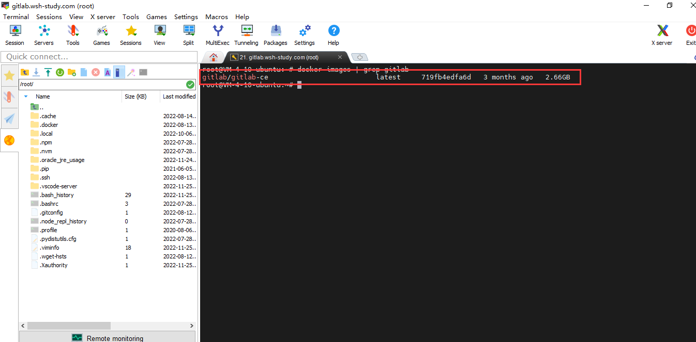
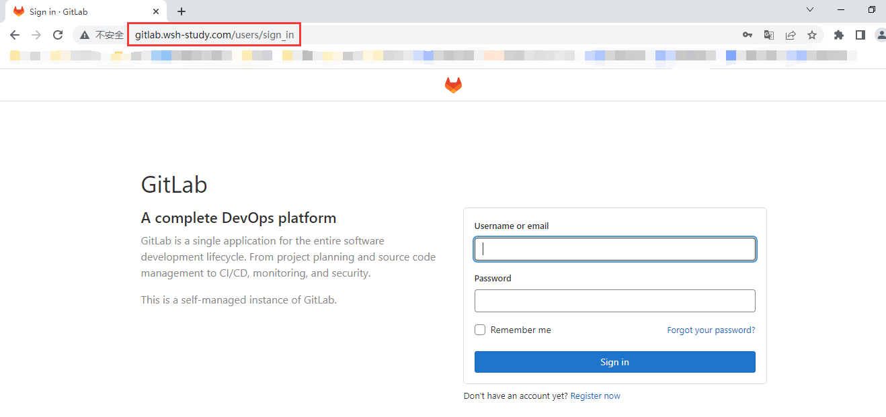
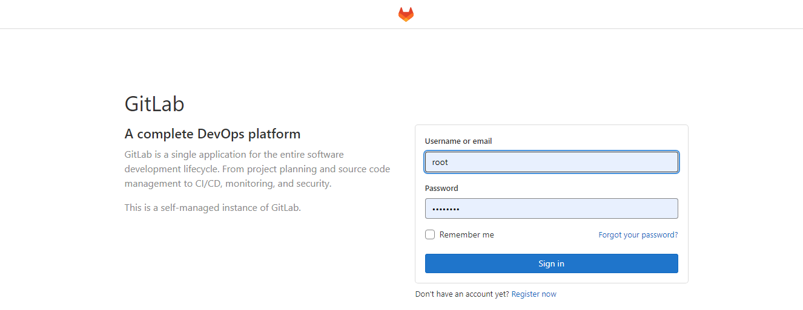
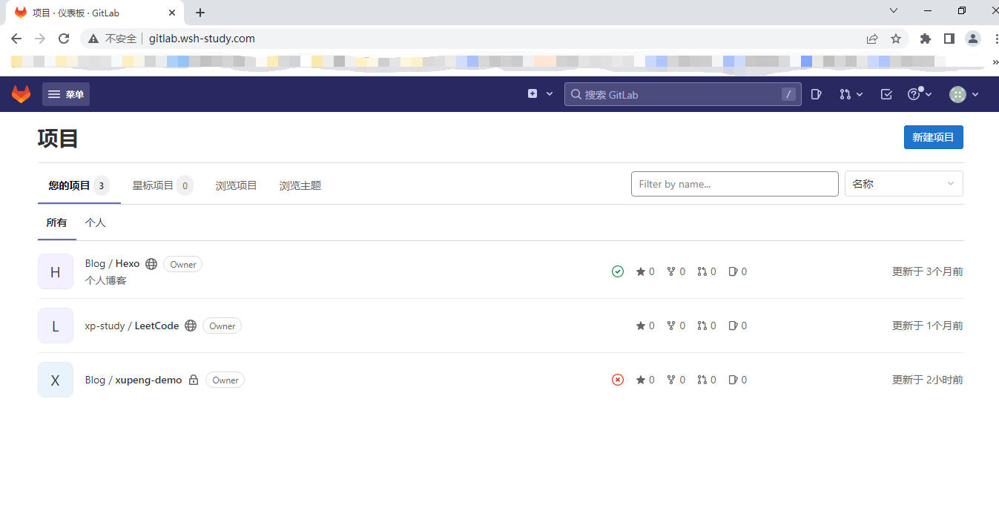

### 概述

`GitLab`是一个用于仓库管理系统的开源项目，使用Git作为代码管理工具，并在此基础上搭建起来的Web服务。
`GitLab`和`GitHub`一样是仓库管理系统，不一样的是GitLab可以自己搭建，自己或企业内部使用。

### 环境准备

- Linux系统
- docker
- docker-compose

### 硬件要求

**CPU**

- **4 核**是**推荐**的最小核数，最多支持 500 个用户
- 8核最多支持1000个用户

**RAM**

- 4GB RAM是所需的最小内存大小，最多可支持 500 个用户
- 8GB RAM 支持多达 1000 个用户

### 安装

GitLab Docker]镜像可以以多种方式运行：

- 使用 Docker 引擎
- 使用 Docker-compose

#### 1.docker引擎安装gitlab

拉取镜像，目前2022年5月，gitlab/gitlab-ce最新版docker镜像2.66GB（有点大可以提前下载）



下载并启动 GitLab 容器，并发布访问 SSH、HTTP 和 HTTPS 所需的端口。所有 GitLab 数据都将存储为 `/opt/gitlab`

```shell
docker run --detach \
  --hostname gitlab.wsh-study.com \
  --publish 8443:443 --publish 8880:80 --publish 22:22 \
  --name gitlab \
  --restart always \
  --volume /opt/gitlab/config:/etc/gitlab \
  --volume /opt/gitlab/data:/var/opt/gitlab \
  --volume /opt/gitlab/backups:/var/opt/gitlab/backups \
  gitlab/gitlab-ce:latest 
```

| 本地位置                 | 容器位置                   | 用法                     |
| --------------------    | -----------------         | ------------------------ |
| `/opt/gitlab/data`      | `/var/opt/gitlab`         | 用于存储应用程序数据     |
| `/opt/gitlab/backups`   | `/var/opt/gitlab/backups` | 用于备份数据             |
| `/opt/gitlab/config`    | `/etc/gitlab`             | 用于存储 GitLab 配置文件 |

- GitLab初始化启动过程需要很长时间，您可以通过logs方式跟踪此过程：

```shell
docker logs -ft gitlab
```

启动容器后配置nginx代理

```shell
server {
        listen       80;
        #listen 443 ssl;
        server_name gitlab.wsh-study.com;
        root         /usr/share/nginx/html;
        #ssl_certificate cert/gitlab.nanfangzhe.cn/gitlab.nanfangzhe.cn_bundle.crt;
        #ssl_certificate_key cert/gitlab.nanfangzhe.cn/gitlab.nanfangzhe.cn.key;
        include /etc/nginx/default.d/*.conf;
        location ^~ {
                proxy_set_header HOST $host;
                proxy_set_header X-Forwarded-Proto $scheme;
                proxy_set_header X-Real-IP $remote_addr;
                proxy_set_header X-Forwarded-For $proxy_add_x_forwarded_for;
                proxy_pass http://127.0.0.1:8880;
        }
    }

```

之后浏览器访问`gitlab.wsh-study.com` 即可。



这里GitLab 默认创建root用户和密码。

默认root用户 密码查询：

```shell
docker exec -it gitlab grep 'Password:' /etc/gitlab/initial_root_password
```

输入root用户（管理员）和密码登录：



