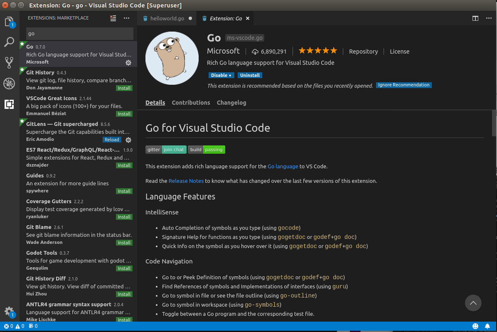
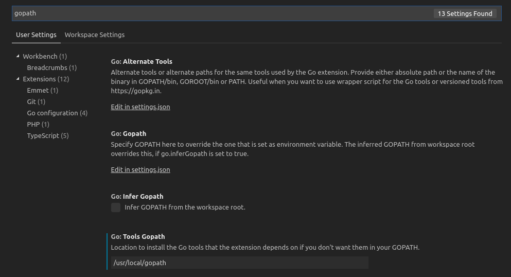

# Go语言Ubuntu开发环境搭建

## 参考文档

1. [Go语言官方编译指南(需翻墙访问)](https://golang.org/doc/install/source)
2. [GVM-Go 的多版本管理工具，使用介绍](https://dryyun.com/2018/11/28/how-to-use-gvm/)
3. [Go-kit 微服务入门指南](https://www.jianshu.com/p/cffe039fa060)
4. [最终，为什么选择go-kit](https://www.jianshu.com/p/0c34a75569b1)
5. [Go 语言多版本管理工具 g（推荐）](https://www.fdevops.com/2020/12/30/g-19427)

## 开发环境介绍

* 主机操作系统：Ubuntu16.04 64位
* 目标平台：armv7或x86_64
* Go版本：1.16.3

## 方案Go多版本解决方案

g的官方地址为：[https://github.com/voidint/g](https://github.com/voidint/g)

### 安装

安装需要先清空之前和Go语言相关的环境变量，打开 `/etc/bash.bashrc`，屏蔽原有环境变量增加新的环境变量【重启终端后生效】

```bash
# set go env(base g)
export GOROOT=/root/.g/go
export PATH=/root/.g/go/bin:$PATH
export G_MIRROR=https://golang.google.cn/dl/
```

下载相应系统的二进制安装包：[https://github.com/voidint/g/releases](https://github.com/voidint/g/releases)，在这里我们选择`g1.2.0.linux-amd64.tar.gz`，将压缩包内的执行文件放置到系统目录 `/usr/local/bin` 下

### 使用

```bash
# 查询可供安装的Go版本
g ls-remote

# 下载安装指定版本的Go(未启用)
g install 1.16.3

# 查询已经下载安装的Go版本
g ls

# 启用指定版本的Go
g use 1.16.3

# 卸载删除指定版本的Go
g uninstall 1.16.3
```

### 增加交叉编译和CGO支持

一般情况下通过g下载安装的Go版本都支持交叉编译，可以执行例如 `GOOS=linux GOARCH=arm GOARM=7 go build helloworld.go` 的编译命令

当需要同时使用CGO和交叉编译时需要手动指定交叉编译器，例如：

```bash
GOOS=linux GOARCH=arm GOARM=7 CGO_ENABLED=1 CC=arm-poky-linux-gnueabi-gcc go build helloworld.go
```

## 开启Go Modules和私有代码仓库

```bash
go env -w GO111MODULE=on
go env -w GOPROXY=https://goproxy.cn,direct
go env -w GOPRIVATE=gitlab.wsh-study.com
go env -w GOINSECURE=gitlab.wsh-study.com
```

## 验证Go是否安装完成

``` bash
go version
# 正常情况会输出如下内容
go version go1.16.3 linux/amd64
```

## 编译简单程序

新建helloworld.go

``` go
package main

import "fmt"

func main() {
    fmt.Println("Hello world")
}
```

编译X86_64版本应用程序

```bash
go build helloworld.go
```

编译ARM版本应用程序

```bash
GOOS=linux GOARCH=arm GOARM=7 go build helloworld.go
```

编译完成之后在当前目录下会生成helloworld，将此文件上传到目标文件系统上执行测试。

至此便已经完成了Go语言在Ubuntu开发环境的基础安装。

## 解决Github访问慢的问题

在Go语言的开发过程中会出现`go get`github.com相关代码仓库慢的问题，可以通过修改hosts文件来加速访问

hosts文件位置如下：

* windows: C:\Windows\System32\drivers\etc\hosts
* ubuntu: /etc/hosts

在hosts文件中增加如下内容：

```txt
140.82.114.9        codeload.github.com
140.82.113.4        github.com
151.101.185.194     github.global.ssl.fastly.net
52.216.64.123       s3.amazonaws.com
52.216.110.91       github-cloud.s3.amazonaws.com
```

更新DNS缓存

```bash
# 在Ubuntu操作系统下
sudo /etc/init.d/networking restart

# 在Windows操作系统下
ipconfig /flushdns
```

## 搭建VSCode下的Go开发环境

### 安装Go语言插件

打开vscode,按下`ctrl + shift + x`,进入Vscode扩展工具下载界面，输入go查询，安装如下图所示工具：



### 配置Go语言相关设置

因为上面提供的GoPath压缩包已经存放了Go语言插件需要的所有工具，所以只需要设置一下插件的配置路径即可正常使用(无需重复安装)，如下图所示：

`File` -> `Preferences` -> `Settings`



设置好Tool GoPath 路径后重启VSCode生效

## 设置Gitlab代码仓库集成

在Go语言开发过程中经常会用到 `go get` 命令下载源码，为了方便在Gitlab上开发 **公共库** 可以使用 `go get` 拉取代码仓库

首先需要进行设置环境变量

在`/etc/bash.bashrc`新增如下行，重启终端生效

```bash
export GIT_TERMINAL_PROMPT=1
```

拉取指令如下：

``` bash
# 必须使用-insecure，因为gitlab服务器暂时还没有支持https
go get -insecure gitlab.wsh-study.com/Device/Tool
```
