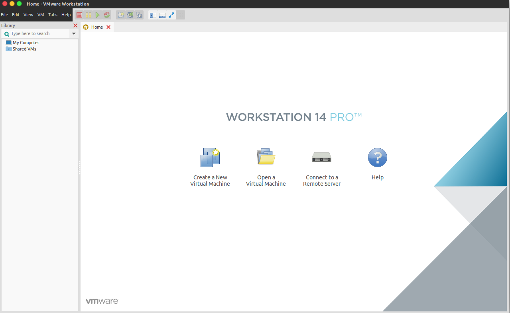
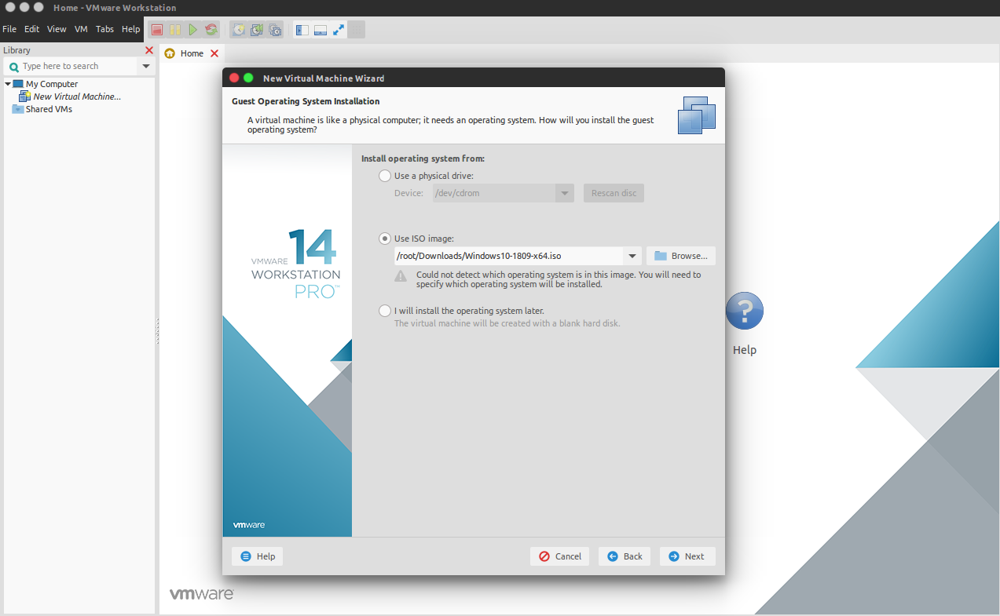
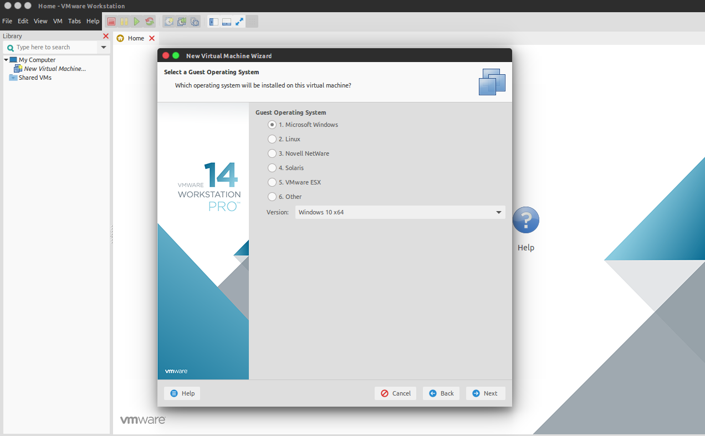
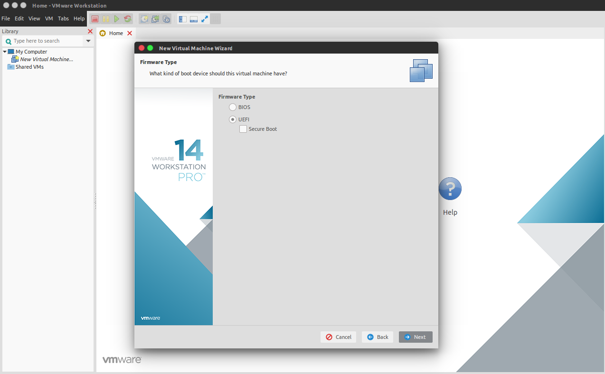
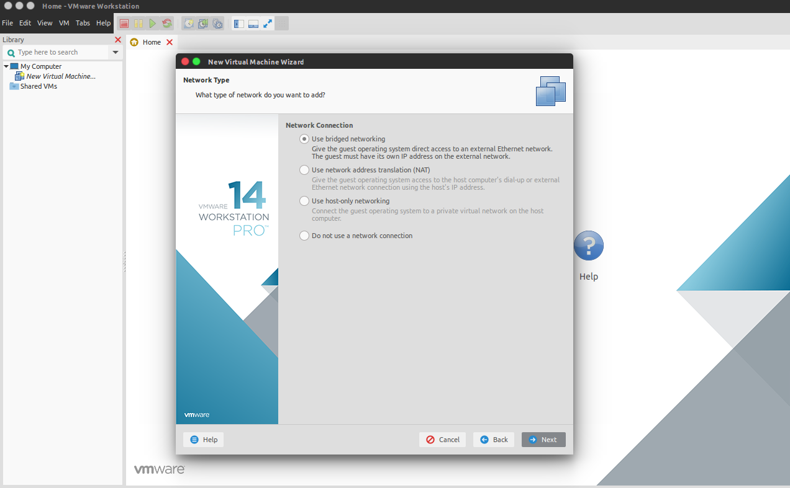
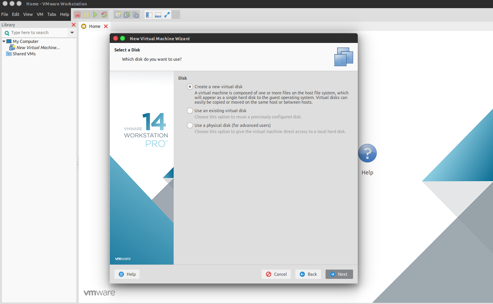
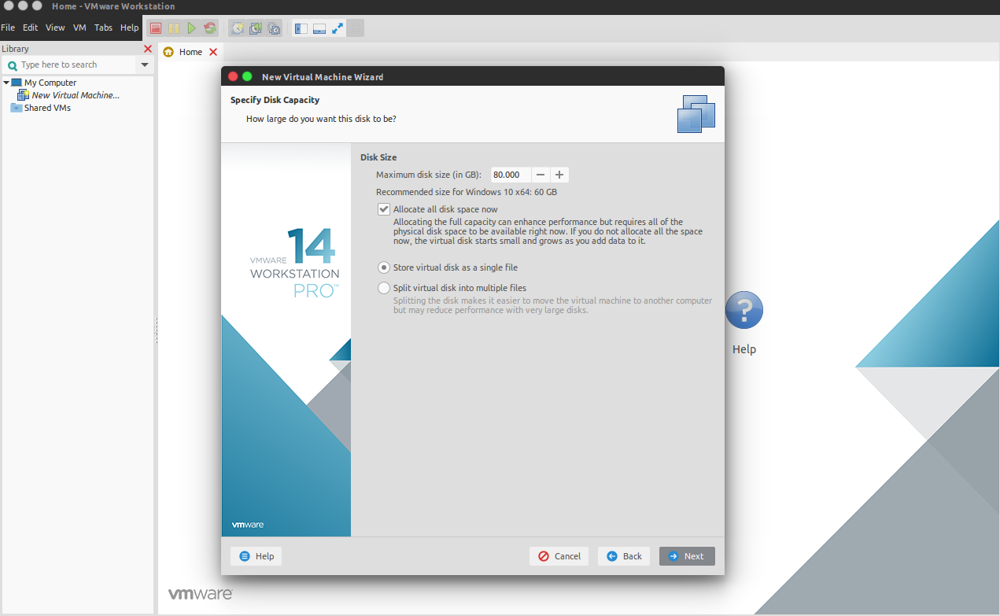
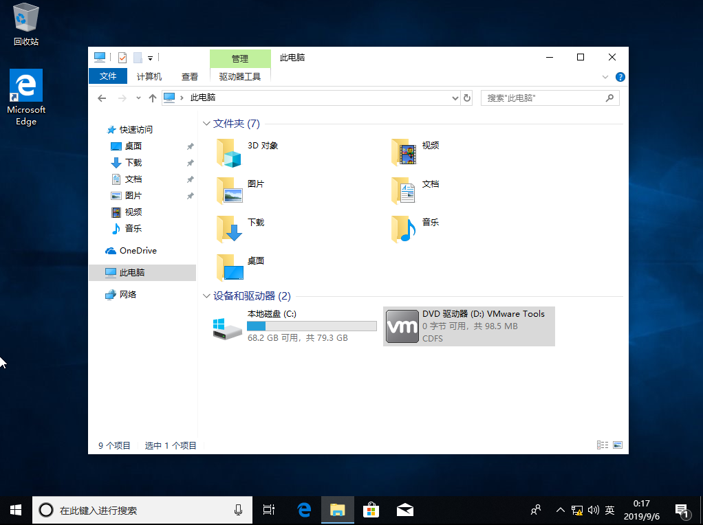

# 安装虚拟机版本Windows

一般情况下研发团队人员使用的主要开发操作系统为Ubuntu，为了方便办公需要在Ubuntu操作系统上安装虚拟机版本的Windows

## 安装VMWare Worksation

```bash
# 进入下载文件所在目录

# 启动安装脚本
./VMware-Workstation-Full-14.1.1-7528167.x86_64.bundle
```

一路按照默认配置下一步就行，中间需要输入许可证序列号：FF590-2DX83-M81LZ-XDM7E-MKUT4，如果认证失败可以参考[该文档](https://www.jianshu.com/p/c86ec93eb796)。

## 使用现有虚拟机

* [Windows10_x64](http://192.168.210.37:8001/#group/2/lib/dd98714a-5002-40a2-bc37-d3621c15e58d/%E8%99%9A%E6%8B%9F%E6%9C%BA%E8%BD%AF%E4%BB%B6/%E8%99%9A%E6%8B%9F%E6%9C%BA/Windows10_x64)

!!! note "下载注意事项"
    从文件服务器下载大文件时需要通知文件服务器管理员开启高速下载

下载完成后直接通过VMware-Workstation菜单`File` -> `Open...`打开

## 新建虚拟机

下面以安装`Windows10 64位操作系统`为例展示如何在Ubuntu主机上新安装一个Windows虚拟机


在VMware-Workstation首页点击`Create a New Virtaul Machine`按钮创建新的虚拟机，选择相应的操作系统




选择`Use ISO image`然后选择下载到电脑的Windows10镜像包








办公网络条件下推荐选择桥接方式(即Use bridged networking)



因为我使用的电脑是NVME的固态硬件，所以磁盘类型选择NVMe，一般情况下选择`SCSI`即可


接下来选择创建一个新的磁盘



磁盘参数设置需要注意如下几点：

* 磁盘大小尽量分配大一些，因为后期不方便进行扩容
* 必须选择`Allocate all disk space now`，立即分配磁盘空间可以大大提高虚拟机的磁盘使用效率
* 必须选择`Split virtual disk as a single gile`，单个文件也可以提高虚拟机的磁盘使用效率



选择完这些参数后最后点击Finish按钮开始虚拟机的安装

!!! note "注意事项"
    在开启虚拟机进行WIndows安装操作前需要在BIOS设置中关闭主机的`Secure boot`选项，否则会出现类似如下错误：

    ```bash
    /dev/vmmon no such file or directory
    ```

按照流程正常安装完Windows后，点击VMware-Workstation的菜单`VM` -> `Install VMWare tool`，后虚拟机内出现如下界面，双击安装


