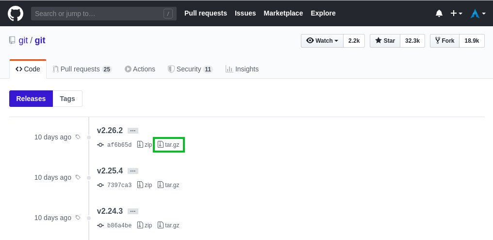

## 一、使用 Apt 安装 Git

Git 软件包被包含在 Ubuntu 默认的软件源仓库中，并且可以使用 apt 包管理工具安装。这是在 Ubuntu 上安装 Git 最便利，最简单的方式。

如果你想要从 Git 源码上编译安装最新的 Git 版本，请关注『从源码安装 Git』一节。

安装非常直接，仅仅以 sudo 权限用户身份运行下面的命令：

```shell
sudo apt update
sudo apt install git
```

运行下面的命令，打印 Git 版本，验证安装过程：

```shell
git --version
```

就在写作这篇文章的时候，在 Ubuntu 20.04 下 Git 当前可用版本是 `2.25.1`:

```shell
git version 2.25.1
```

就这些。你已经成功地在你的 Ubuntu 上安装 Git，你可以开始使用它。

## 二、从源码安装 Git

从源码安装 Git 的最大优势就是你可以编译最新的 Git 发行版，并且定制编译选项。不管怎样，你将不能通过`apt`软件管理器维护你的 Git 安装过程。

开始安装依赖软件包，用来在你的 Ubuntu 系统上构建 Git：

```shell
sudo apt update
sudo apt install dh-autoreconf libcurl4-gnutls-dev libexpat1-dev make gettext libz-dev libssl-dev libghc-zlib-dev
```

下一步，打开你的浏览器，浏览 [Github 上的 Git 项目镜像](https://github.com/git/git/releases) 并且 拷贝最新的 以`.tar.gz`结尾的发行版链接 URL。就在写作这篇文章的时候，Git 最新稳定版本是`2.26.2`：



我们将会下载，并且解压 Git 源码到 `/usr/src`目录。这个目录通常被用来放置源代码。

```shell
wget -c https://github.com/git/git/archive/v2.26.2.tar.gz -O - | sudo tar -xz -C /usr/src
```


当下载完成时，切换源码目录，并且运行下面的命令来编译和安装 Git：

```shell
cd /usr/src/git-*
sudo make prefix=/usr/local all
sudo make prefix=/usr/local install
```

编译过程会花费几分钟。一旦完成，验证安装过程，运行：

```shell
git --version
```

输出如下：

```shell
git version 2.26.2
```

稍后，当你想升级到一个 Git 新版本，使用同样的过程。

## 三、配置 Git

在你安装 Git 之后第一件事情，就是配置你的 Git 用户名和邮件地址。 Git 在每一次 commit 代码时关联你的身份。

想要设置全局的 commit 名字和邮件地址，运行下面的命令：

```shell
git config --global username "Your Name"
git config --global user.email "youremail@yourdomain.com"
```

你可以验证配置，输入：

```shell
git config --list
```

输出看起来应该像这样：

```shell
user.name=Your Name
user.email=youremail@yourdomain.com
```

配置文件被存储在`~/.gitconfig`文件：

```shell
[user]
    name = Your Name
    email = youremail@yourdomain.com
```

如果对 Git 配置做进一步修改，你可以使用`git config`命令（推荐方式）或者手动编辑`~/.gitconfig`文件。

## 四、总结

在 Ubuntu 上安装 Git 就是简简单单运行一个`apt`命令的事情。如果你想使用最新的 Git 发行版，你可以从源码编译它。