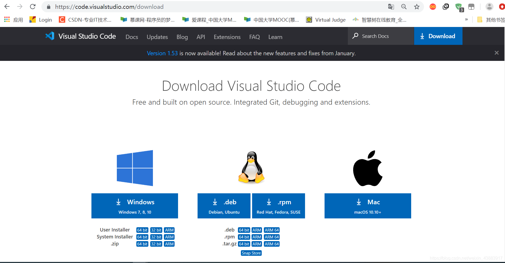
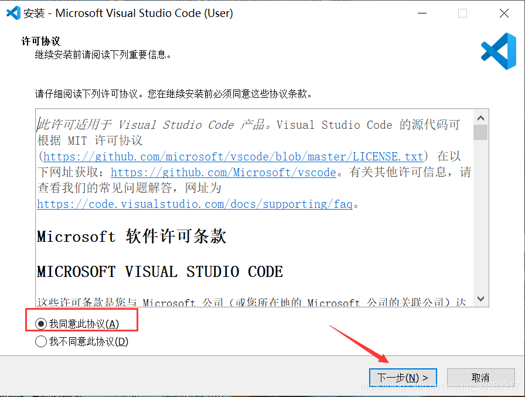
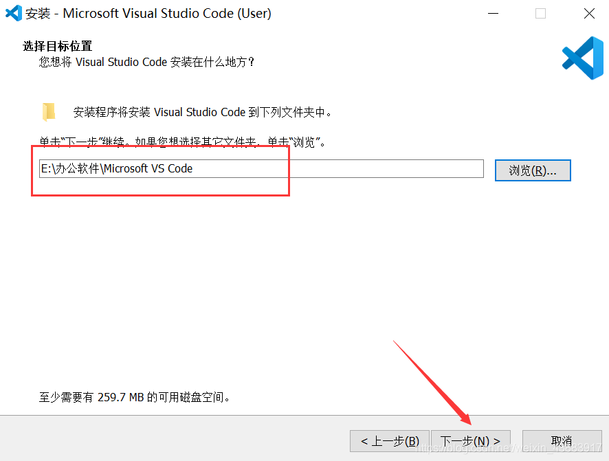
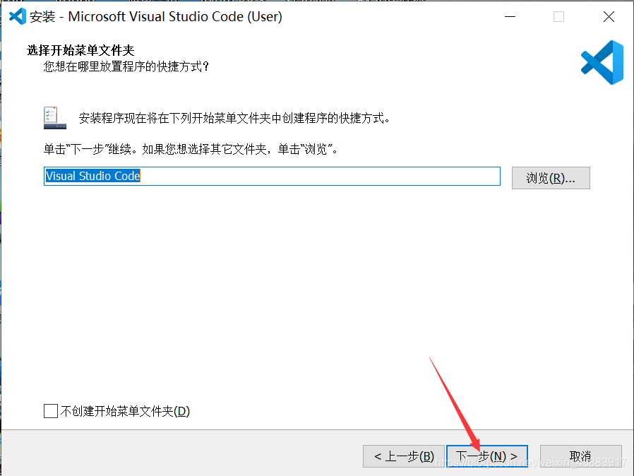
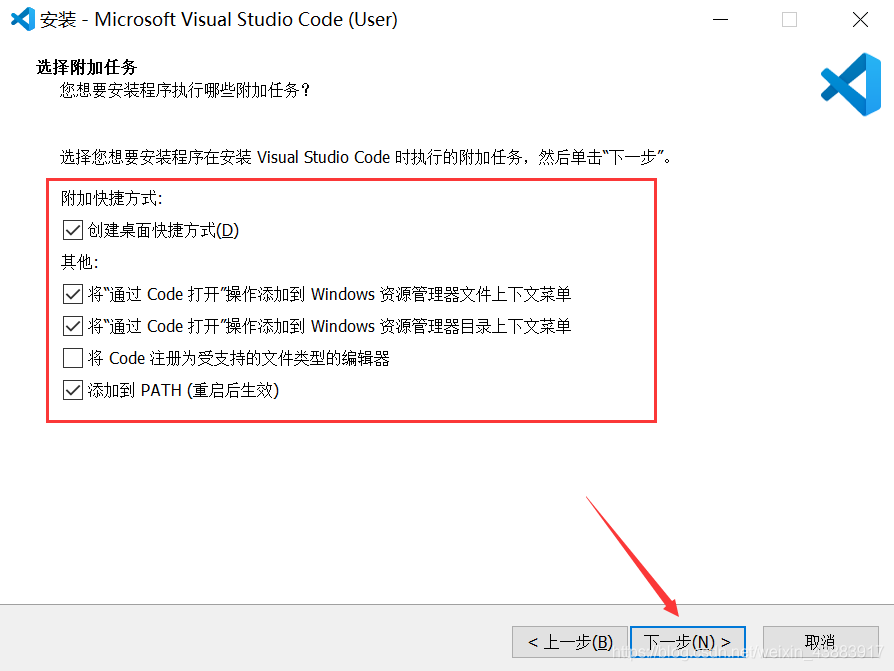
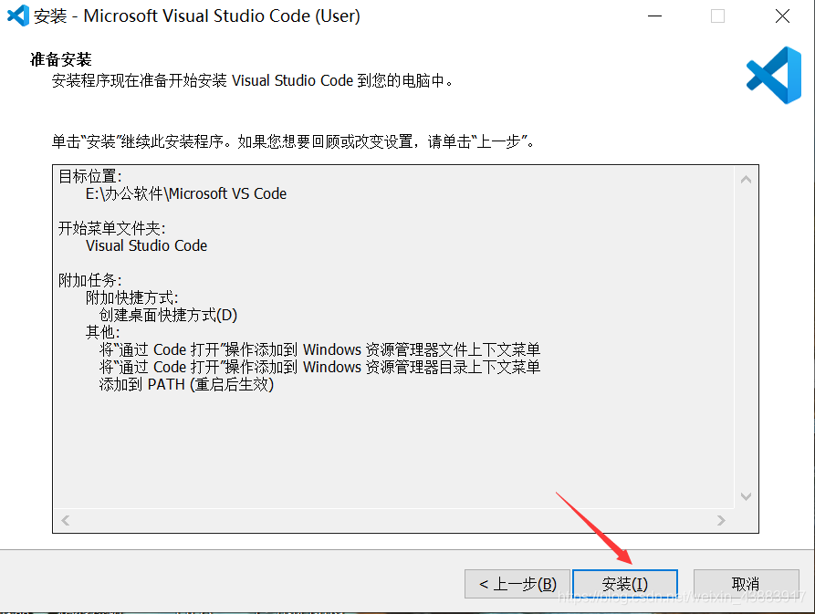
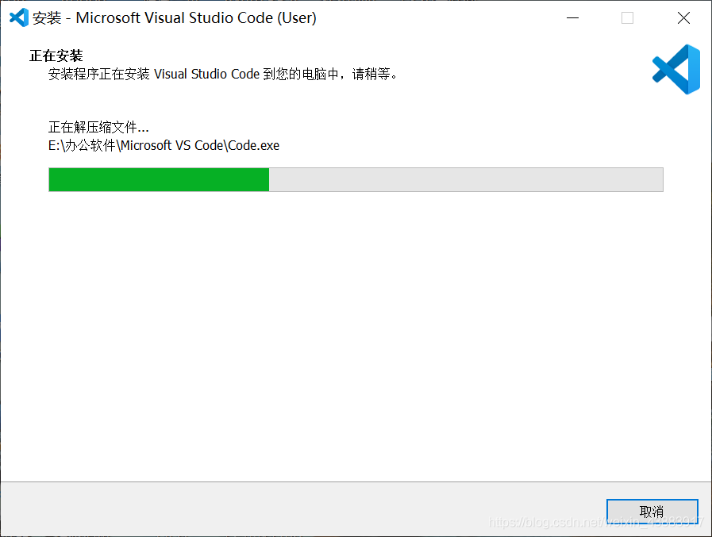
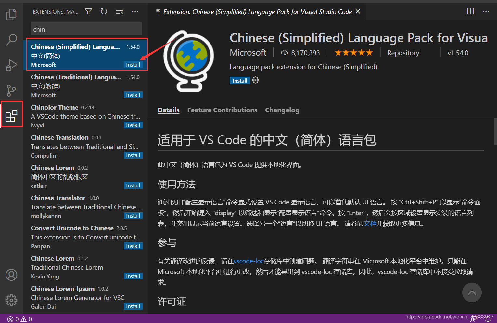
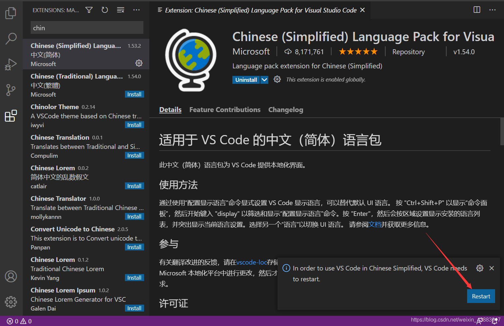
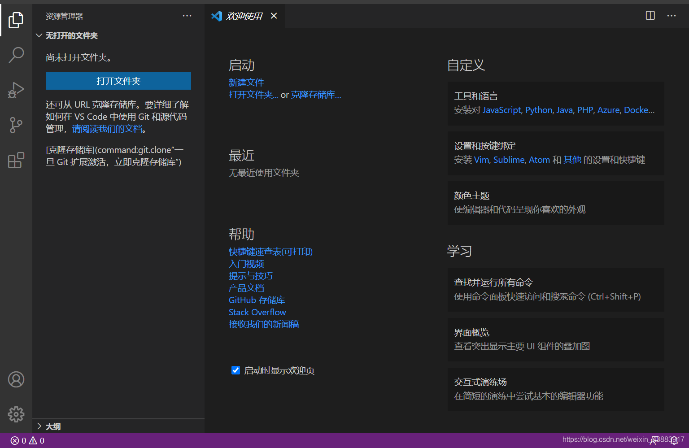

# VSCode安装教程（超详细）

## 下载

下载地址：[Download Visual Studio Code](https://code.visualstudio.com/download)

选择相应的版本下载。

## 安装

跟着图一步步走，简单明了。

## 一、同意协议（废话了我）

## 二、选择合适的安装位置，下一步

## 三、下一步

## 四、这里注意下，进行相关的选择

1、通过code 打开“操作添加到windows资源管理器文件上下文菜单 ：把这个两个勾选上，可以对文件使用鼠标右键，选择VSCode 打开。

2、将code注册为受支持的文件类型的编辑器：不建议勾选，这样会默认使用VSCode打开支持的相关文件，文件图标也会改变。

3、添加到PATH（重启后生效）：建议勾选，这样可以使用控制台打开VSCode 了。

## 五、点击安装

## 六、等待安装完成，很快

## 配置中文界面

上面安装完成后会出现下面的界面，我们搜索Chinese，点击install

## 然后Restart

## 重启后就ok了，中文界面

以上就是VSCode安装教程（超详细）的全部内容。