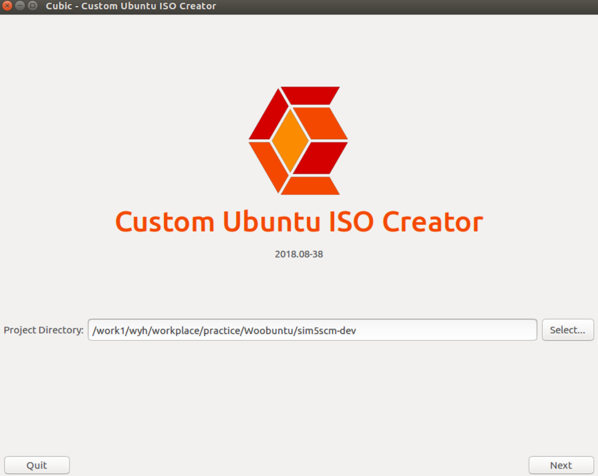
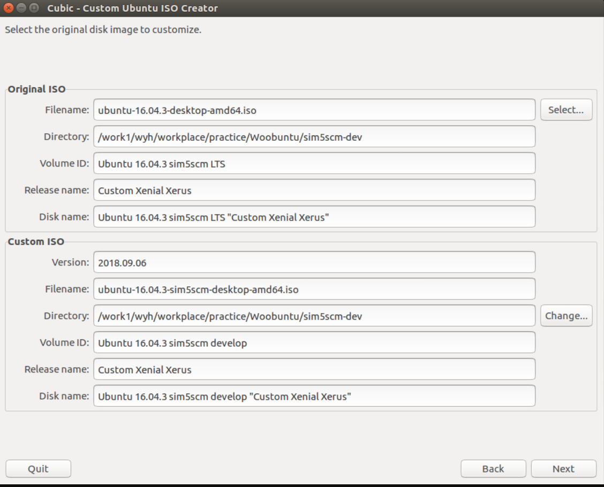
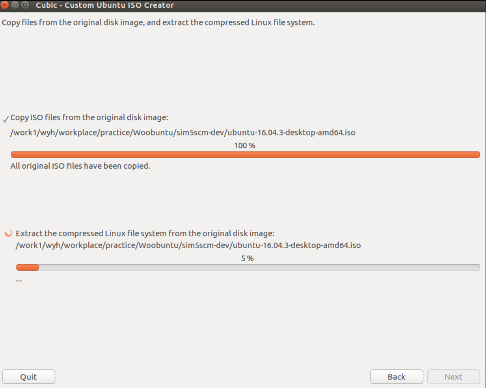
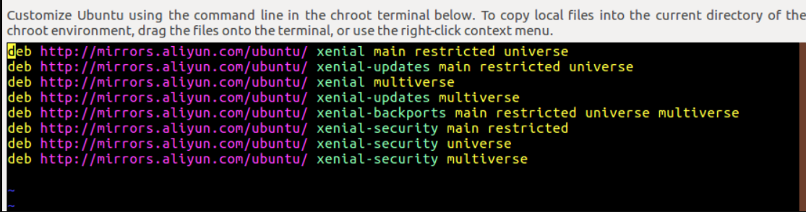
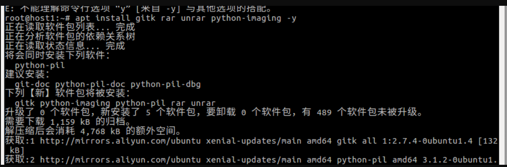
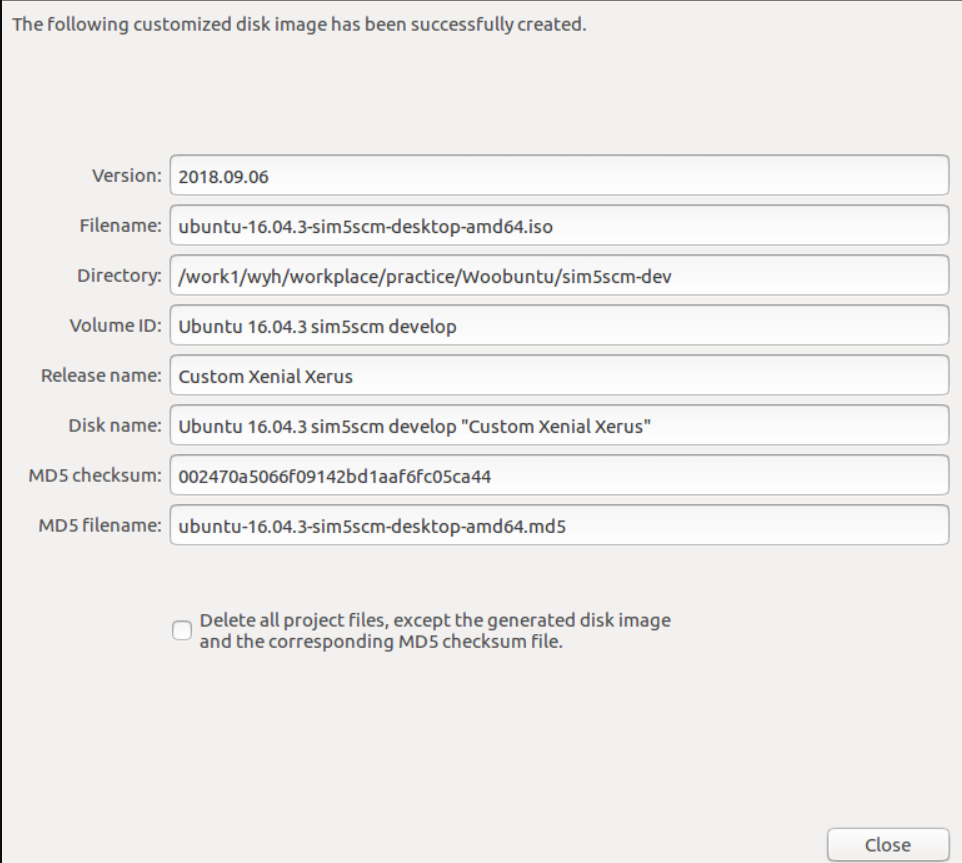
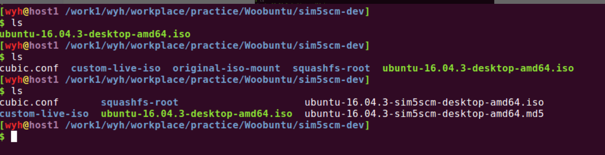
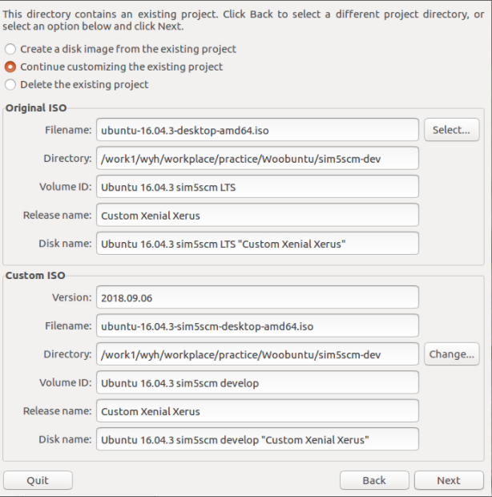

Cubic工具提供了许多选项可以方便管理员轻松地创建一个定制的 Ubuntu Live CD ，它有一个集成的 chroot 命令行环境(chroot:Change Root), 在那里你可以定制各种需求，比如安装新的软件包、内核，添加更多的背景，壁纸，以及一些自定义的文件，脚本，文件夹等。说明：此处是在 Ubuntu 16.04 系统下操作的，其他系统类似。

### **1. 安装cubic软件**

```shell
sudo apt-add-repository ppa:cubic-wizard/release
sudo apt-key adv --keyserver keyserver.ubuntu.com --recv-keys 6494C6D6997C215E
sudo apt update
sudo apt install cubic
```

**2. 启动cubic并安装相关应用（cubic 不能以root权限启动,只能以普通用户权限启动）**

安装完成后，从应用程序菜单或 `dock` 启动 `Cubic`。<说明：`Cubic` 不是对当前系统构建`ghost`，而是利用 `Ubuntu` 的安装` CD` 来创建一个定制的` Live CD`，因此，你应该有一个对应的` ISO` 镜像。

第一步：开启服务，此处需要配置原始`iso`镜像存放的路径。因我将其放到 `/work1/wyh/workplace/practice/Woobuntu/sim5scm-dev`路径下，故如图：



第二步：配置iso相关信息。此处可根据需要进行相关修改，如`volume`卷信息，生成的镜像信息等.



第三步：完成配置后，点击Next，此时就会对原始iso镜像进行解压，提取相关文件。之后我们就会看到一个模拟的linux终端。此时，我们就可以在里面进行工具的安装等.



第四步：安装相关应用工具。

**默认是root用户，因此我们执行的任何命令无需在添加 sudo 权限**

了方便下载软件，此处我将默认的镜像源修改为国内源 **因为我使用的是ubuntu 16.04 因此镜像版本为 xenial**

```shell
$ vim /etc/apt/sources.list
   deb http://mirrors.aliyun.com/ubuntu/ xenial main restricted universe
   deb http://mirrors.aliyun.com/ubuntu/ xenial-updates main restricted universe
   deb http://mirrors.aliyun.com/ubuntu/ xenial multiverse
   deb http://mirrors.aliyun.com/ubuntu/ xenial-updates multiverse
   deb http://mirrors.aliyun.com/ubuntu/ xenial-backports main restricted universe multiverse
   deb http://mirrors.aliyun.com/ubuntu/ xenial-security main restricted
   deb http://mirrors.aliyun.com/ubuntu/ xenial-security universe
   deb http://mirrors.aliyun.com/ubuntu/ xenial-security multiverse
   $ apt upgrade && apt update
```



如果我们需要将本地某个文件copy到Live CD中，只需要直接拖动文件即可。接下来，就是根据需要安装自己的软件了。



第五步：当我们安装完相关工具后，点击右下角 Next，就可以进入到制作压缩我们自己的iso镜像了。选择kernel版本和开机引导向(boot),此处因为我的只有一个，就直接默认了。继续Next


此时，系统会重新计算系统大小，生成MD5校验码等信息。至于需要的时间根据镜像大小和自己电脑硬件决定。



**如果你想在将来修改刚刚创建的自定义 Live 镜像，不要选择“ Delete all project files, except the generated disk image and the corresponding MD5 checksum file”（除了生成的磁盘映像和相应的 MD5 校验和文件之外，删除所有的项目文件） ，Cubic 将在项目的工作目录中保留自定义图像，方便后期进行修改。**

此时在 `/work1/wyh/workplace/practice/Woobuntu/sim5scm-dev` 目录下面就可以看到之前相关生成的文件和MD5，iso镜像等



**3. 利用 Cubic 修改 Ubuntu Live CD 的定制镜像**

从菜单中启动 Cubic ，并选择一个现有的项目目录。单击 “Next” 按钮，将看到以下三个选项：

1）Create a disk image from the existing project. （从现有项目创建一个磁盘映像，允许从现有项目中使用之前所做的自定义设置创建一个新的 Live ISO 镜像。如果之前丢失了 ISO 镜像，可以使用第一个选项来创建一个新的)

2）Continue customizing the existing project.（继续定制现有项目，允许在现有项目中进行任何其他更改）

3）Delete the existing project.（删除当前项目，将删除现有的项目，一切从头开始）

