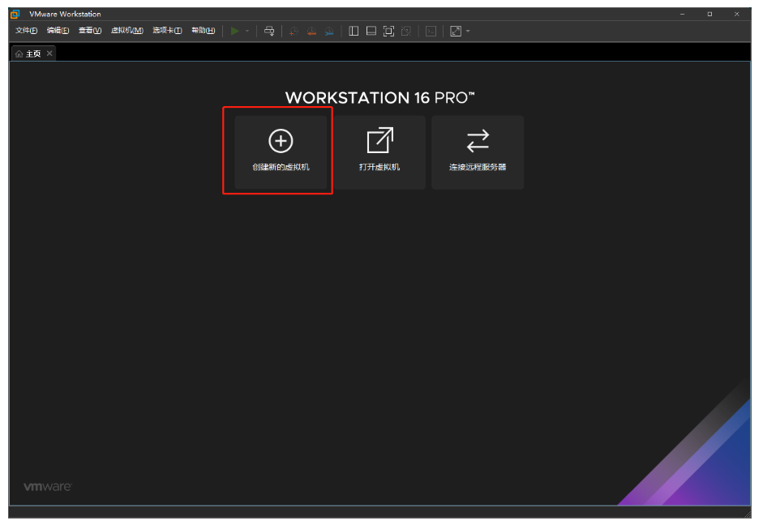
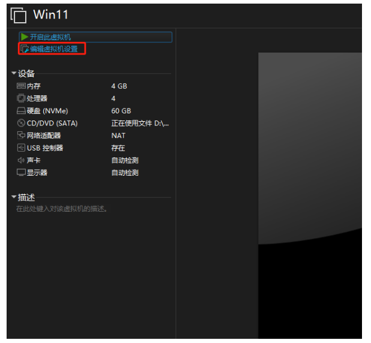
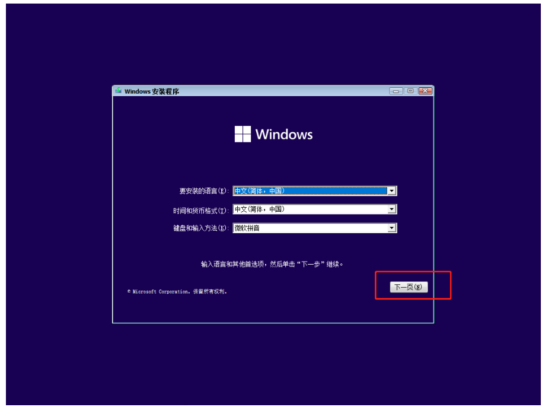
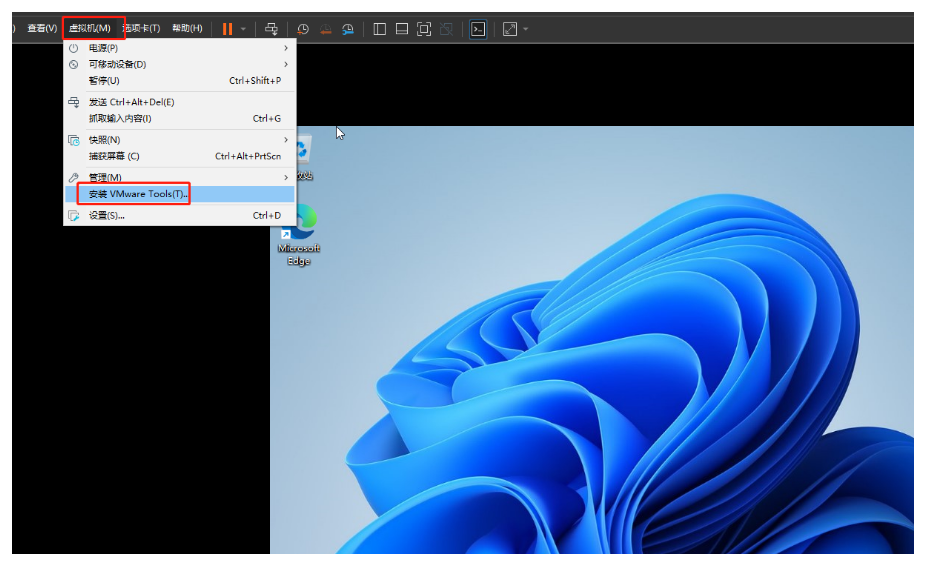

# VMware16安装Win11虚拟机

### 准备工作

1、虚拟机：[VMware](https://so.csdn.net/so/search?q=VMware)16.2.1（建议使用VMware16版本，15可能不兼容）

2、Windows11镜像

### 下载镜像

1、浏览器打开网址：[*I tell you*](https://next.itellyou.cn/Original/Index?spm=a2c6h.12873639.article-detail.14.43b88450sStI1X&id=7ab5f0cb-7607-4bbe-9e88-50716dc43de6)


可以看到有三个Win11的iso镜像，那么下载哪一个呢？

从大的笼统层面来说，Windows 11主要分为 Consumer Editions（消费者版） 和 Business Editions（商业版） 两大版本。

Consumer Editions（消费者版）：含家庭版+专业版+教育版+专业教育版+专业工作站版

Business Editions（商业版）：含专业版+企业版+教育版+专业教育版+专业工作站版

Consumer editions 和 Business editions 两大版本区别并不大，里面都包含了专业版和教育版，可以随意下载使用。

我们选择下载Consumer（消费者）版，然后安装Win11专业版


复制BT链接，然后使用迅雷下载

下载好以后就可以开始安装啦

### 安装镜像

1、打开VMware，选择`创建新的虚拟机`



2、选择`典型`


3、选择`稍后安装操作系统`


4、客户机操作系统选择`Microsoft Windows`

版本选择`Windows 10 x64`

（因为VMware16还没有Win11，所以我们这里选择Win10就好啦）


5、虚拟机名称自己修改

自己创建一个安装位置

**安装位置不要默认**！（默认是安装在C盘的）


6、选择把虚拟磁盘存储为`单个文件`

我这里大小给的`60GB`，其实`30GB`就够了


7、选择`自定义硬件`

 

8、虚拟机硬件设置

移除`打印机`（虚拟机要这玩意儿没用，占空间）


内存给到`4GB


处理器给到`2p 2c`


把`iso`镜像添加上


然后选择`关闭`—`完成`

9、选择`编辑虚拟机设置`



```
选项` —> `访问控制` —> `加密
```


密码随便设置一个

（为什么要设置这个呢？因为我们等会儿添加信任模块的时候，必须要先给虚拟机加密，才能添加）


选择`高级` —> `UEFI`并启用`安全引导`


切换到`硬件` —> `添加` —> `可信平台模块` —> `完成`


然后就可以开启虚拟机了


### 开启虚拟机

1、出现这样`Time out`

别慌，等一等


接下来按ESC（这个可能会根据自己主板改变，视情况而定），打开BIOS

选择第二个，回车


当出现下面这样时，请迅速按一下回车，然后就成功启动了

然后你会发现，win11就可以成功安装了


成功


可能有很多小伙伴没有出现这个画面：


别慌，等一等，就会直接进入下面的画面

（我第二次安装的时候，就没有出现蓝色的选择项，直接进入win11的安装了）

### 安装虚拟机

1、选择下一页



2、直接下一步


3、选择安装`Win11专业版`


3、选择自定义


4、选择新建


应用


然后就开始安装了


安装中


### 安装Win11

地区选择中国


这后面的步骤就不过多阐述了

就和新电脑买回来开机设置一样的

需要那些功能就添加，不需要就不添加

安装好以后，我们发现屏幕不是全屏，而且操作起来还有点卡顿！


我们还需要安装一个`VMware Tools`



点击安装以后，打开我的电脑，双击运行这个文件


直接下一步，选择典型安装


安装好以后，发现已经是全屏了，然后重启电脑即可