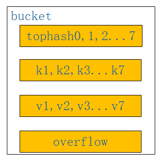

# 1. Map实现原理

**本章不属于基础部分但是面试经常会问到建议学学**

### 1.1.1. 什么是Map

#### key，value存储

最通俗的话说Map是一种通过key来获取value的一个数据结构，其底层存储方式为数组，在存储时key不能重复，当key重复时，value进行覆盖，我们通过key进行hash运算（可以简单理解为把key转化为一个整形数字）然后对数组的长度取余，得到key存储在数组的哪个下标位置，最后将key和value组装为一个结构体，放入数组下标处，看下图：

```go
    length = len(array) = 4
    hashkey1 = hash(xiaoming) = 4
    index1  = hashkey1% length= 0
    hashkey2 = hash(xiaoli) = 6
    index2  = hashkey2% length= 2
```


#### hash冲突

如上图所示，数组一个下标处只能存储一个元素，也就是说一个数组下标只能存储一对key，value, hashkey(xiaoming)=4占用了下标0的位置，假设我们遇到另一个key，hashkey(xiaowang)也是4，这就是hash冲突（不同的key经过hash之后得到的值一样），那么key=xiaowang的怎么存储？ hash冲突的常见解决方法

开放定址法：也就是说当我们存储一个key，value时，发现hashkey(key)的下标已经被别key占用，那我们在这个数组中空间中重新找一个没被占用的存储这个冲突的key，那么没被占用的有很多，找哪个好呢？常见的有线性探测法，线性补偿探测法，随机探测法，这里我们主要说一下线性探测法

线性探测，字面意思就是按照顺序来，从冲突的下标处开始往后探测，到达数组末尾时，从数组开始处探测，直到找到一个空位置存储这个key，当数组都找不到的情况下会扩容（事实上当数组容量快满的时候就会扩容了）；查找某一个key的时候，找到key对应的下标，比较key是否相等，如果相等直接取出来，否则按照顺寻探测直到碰到一个空位置，说明key不存在。如下图：首先存储key=xiaoming在下标0处，当存储key=xiaowang时，hash冲突了，按照线性探测，存储在下标1处，（红色的线是冲突或者下标已经被占用了） 再者key=xiaozhao存储在下标4处，当存储key=xiaoliu是，hash冲突了，按照线性探测，从头开始，存储在下标2处 （黄色的是冲突或者下标已经被占用了）


拉链法：何为拉链，简单理解为链表，当key的hash冲突时，我们在冲突位置的元素上形成一个链表，通过指针互连接，当查找时，发现key冲突，顺着链表一直往下找，直到链表的尾节点，找不到则返回空，如下图：


开放定址（线性探测）和拉链的优缺点

- 由上面可以看出拉链法比线性探测处理简单
- 线性探测查找是会被拉链法会更消耗时间
- 线性探测会更加容易导致扩容，而拉链不会
- 拉链存储了指针，所以空间上会比线性探测占用多一点
- 拉链是动态申请存储空间的，所以更适合链长不确定的

### 1.1.2. Go中Map的使用

直接用代码描述，直观，简单，易理解

```go
//直接创建初始化一个mao
var mapInit = map[string]string {"xiaoli":"湖南", "xiaoliu":"天津"}
//声明一个map类型变量,
//map的key的类型是string，value的类型是string
var mapTemp map[string]string
//使用make函数初始化这个变量,并指定大小(也可以不指定)
mapTemp = make(map[string]string,10)
//存储key ，value
mapTemp["xiaoming"] = "北京"
mapTemp["xiaowang"]= "河北"
//根据key获取value,
//如果key存在，则ok是true，否则是flase
//v1用来接收key对应的value,当ok是false时，v1是nil
v1,ok := mapTemp["xiaoming"]
fmt.Println(ok,v1)
//当key=xiaowang存在时打印value
if v2,ok := mapTemp["xiaowang"]; ok{
    fmt.Println(v2)
}
//遍历map,打印key和value
for k,v := range mapTemp{
    fmt.Println(k,v)
}
//删除map中的key
delete(mapTemp,"xiaoming")
//获取map的大小
l := len(mapTemp)
fmt.Println(l)
```

看了上面的map创建，初始化，增删改查等操作，我们发现go的api其实挺简单易学的

### 1.1.3. Go中Map的实现原理

知其然，更得知其所以然，会使用map了，多问问为什么，go底层map到底怎么存储呢?接下来我们一探究竟。map的源码位于 src/runtime/map.go中 笔者go的版本是1.12在go中，map同样也是数组存储的的，每个数组下标处存储的是一个bucket,这个bucket的类型见下面代码，每个bucket中可以存储8个kv键值对，当每个bucket存储的kv对到达8个之后，会通过overflow指针指向一个新的bucket，从而形成一个链表,看bmap的结构，我想大家应该很纳闷，没看见kv的结构和overflow指针啊，事实上，这两个结构体并没有显示定义，是通过指针运算进行访问的。

```
//bucket结构体定义 b就是bucket
type bmap{
    // tophash generally contains the top byte of the hash value
    // for each key  in this bucket. If tophash[0] < minTopHash,
    // tophash[0] is a bucket               evacuation state instead.
    //翻译：top hash通常包含该bucket中每个键的hash值的高八位。
    如果tophash[0]小于mintophash，则tophash[0]为桶疏散状态    //bucketCnt 的初始值是8
    tophash [bucketCnt]uint8
    // Followed by bucketCnt keys and then bucketCnt values.
    // NOTE: packing all the keys together and then all the values together makes the    // code a bit more complicated than alternating key/value/key/value/... but it allows    // us to eliminate padding which would be needed for, e.g., map[int64]int8.// Followed by an overflow pointer.    //翻译：接下来是bucketcnt键，然后是bucketcnt值。
    注意：将所有键打包在一起，然后将所有值打包在一起，    使得代码比交替键/值/键/值/更复杂。但它允许//我们消除可能需要的填充，    例如map[int64]int8./后面跟一个溢出指针}
```

看上面代码以及注释，我们能得到bucket中存储的kv是这样的，tophash用来快速查找key值是否在该bucket中，而不同每次都通过真值进行比较；还有kv的存放，为什么不是k1v1，k2v2..... 而是k1k2...v1v2...，我们看上面的注释说的 map[int64]int8,key是int64（8个字节），value是int8（一个字节），kv的长度不同，如果按照kv格式存放，则考虑内存对齐v也会占用int64，而按照后者存储时，8个v刚好占用一个int64,从这个就可以看出go的map设计之巧妙。



最后我们分析一下go的整体内存结构，阅读一下map存储的源码，如下图所示，当往map中存储一个kv对时，通过k获取hash值，hash值的低八位和bucket数组长度取余，定位到在数组中的那个下标，hash值的高八位存储在bucket中的tophash中，用来快速判断key是否存在，key和value的具体值则通过指针运算存储，当一个bucket满时，通过overfolw指针链接到下一个bucket。


go的map存储源码如下，省略了一些无关紧要的代码

```go
func mapassign(t *maptype, h *hmap, key unsafe.Pointer) unsafe.Pointer {
    //获取hash算法
    alg := t.key.alg
    //计算hash值
    hash := alg.hash(key, uintptr(h.hash0))
    //如果bucket数组一开始为空，则初始化
    if h.buckets == nil {
        h.buckets = newobject(t.bucket) // newarray(t.bucket, 1)
    }
again:
    // 定位存储在哪一个bucket中
    bucket := hash & bucketMask(h.B)
    //得到bucket的结构体
    b := (*bmap)(unsafe.Pointer(uintptr(h.buckets) +bucket*uintptr(t.bucketsize)))
    //获取高八位hash值
    top := tophash(hash)
    var inserti *uint8
    var insertk unsafe.Pointer
    var val unsafe.Pointer
bucketloop:
    //死循环
    for {
        //循环bucket中的tophash数组
        for i := uintptr(0); i < bucketCnt; i++ {
            //如果hash不相等
            if b.tophash[i] != top {
             //判断是否为空，为空则插入
                if isEmpty(b.tophash[i]) && inserti == nil {
                    inserti = &b.tophash[i]
                    insertk = add(unsafe.Pointer(b), dataOffset+i*uintptr(t.keysize))
                    val = add( unsafe.Pointer(b), 
                    dataOffset+bucketCnt*uintptr(t.keysize)+i*uintptr(t.valuesize) )
                }
              //插入成功，终止最外层循环
                if b.tophash[i] == emptyRest {
                    break bucketloop
                }
                continue
            }
            //到这里说明高八位hash一样，获取已存在的key
            k := add(unsafe.Pointer(b), dataOffset+i*uintptr(t.keysize))
            if t.indirectkey() {
                k = *((*unsafe.Pointer)(k))
            }
            //判断两个key是否相等，不相等就循环下一个
            if !alg.equal(key, k) {
                continue
            }
            // 如果相等则更新
            if t.needkeyupdate() {
                typedmemmove(t.key, k, key)
            }
            //获取已存在的value
            val = add(unsafe.Pointer(b), dataOffset+bucketCnt*uintptr(t.keysize)+i*uintptr(t.valuesize))
            goto done
        }
        //如果上一个bucket没能插入，则通过overflow获取链表上的下一个bucket
        ovf := b.overflow(t)
        if ovf == nil {
            break
        }
        b = ovf
    }

    if inserti == nil {
        // all current buckets are full, allocate a new one.
        newb := h.newoverflow(t, b)
        inserti = &newb.tophash[0]
        insertk = add(unsafe.Pointer(newb), dataOffset)
        val = add(insertk, bucketCnt*uintptr(t.keysize))
    }

    // store new key/value at insert position
    if t.indirectkey() {
        kmem := newobject(t.key)
        *(*unsafe.Pointer)(insertk) = kmem
        insertk = kmem
    }
    if t.indirectvalue() {
        vmem := newobject(t.elem)
        *(*unsafe.Pointer)(val) = vmem
    }
    typedmemmove(t.key, insertk, key)
    //将高八位hash值存储
    *inserti = top
    h.count++
    return val
}
```