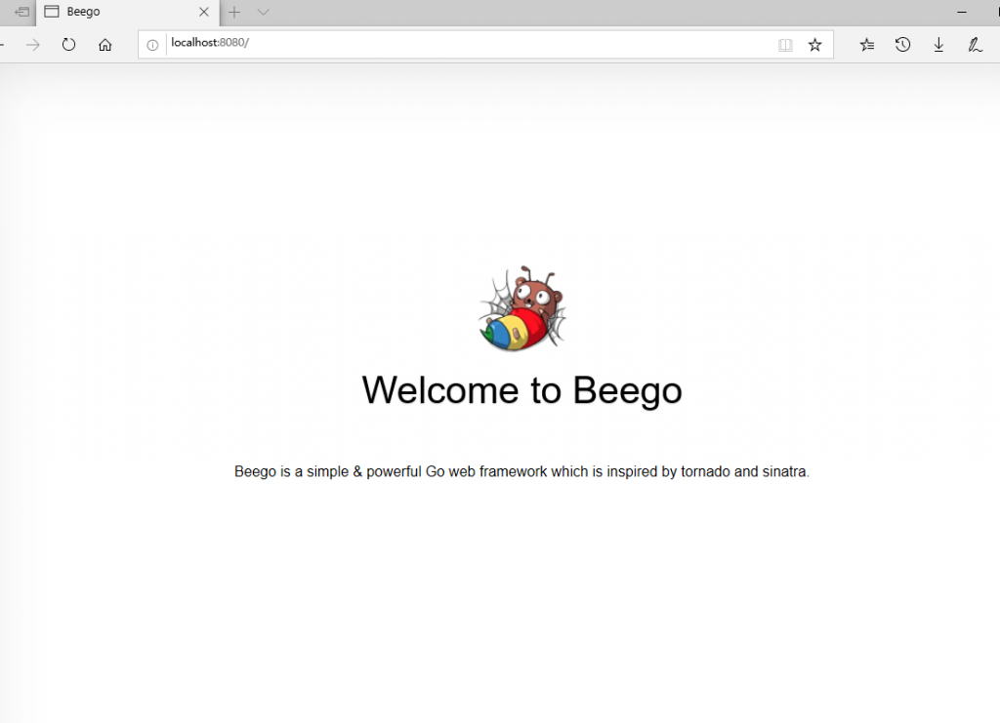

# Beego快速入门教程

beego 是一个快速开发 Go 应用的 HTTP 框架，可以用来快速开发 API、Web 及后端服务等各种应用，是一个 RESTful 的框架，相对于echo框架仅包含路由和控制器核心模块，beego是一个完整的MVC框架包括路由&控制器、model 数据库ORM封装、view模板处理。

下面一步步的介绍如何快速开始一个项目。

## 1.beego的流程设计


 流程图说明：

1. http请求从左侧main入口函数开始进入框架
2. UrL路由解析然后确定执行那个控制器(controller)
3. 执行请求前的过滤器 （过滤器一般用来拦截请求，例如做api签名校验，session处理，安全验证等等）
4. 执行控制器 （控制器根据需要调用model，session, 日志等模块）
5. 执行请求后的过滤器
6. 视图输出返回给用户

## 2.安装包

安装beego核心包

```go
go get -u github.com/beego/beego/v2
```

安装orm包用于操作数据库，beego的orm包是独立的模块需要单独安装

```go
go get github.com/beego/beego/v2/client/orm
```

安装mysql驱动, 必须安装mysql驱动,orm包才能工作

```go
go get github.com/go-sql-driver/mysql
```

安装bee工具包，这个是beego开发的辅助工具，用于快速创建项目，运行项目以及打包项目

```go
go get -u github.com/beego/bee/v2
```

> 提示：安装bee包后，需要将$GOPATH/bin路径添加到环境变量path中, 否则会提示找不到bee命令，$GOPATH代表的就是你的GOPATH路径，如果你不知道GOPATH路径在哪里，执行下go env命令，会列出所有go相关的环境变量，从里面找到GOPATH路径。

## 3.使用bee创建项目

下面使用bee快速创建一个新的项目, 打开命令窗口，进入$GOPATH/src目录，然后执行bee命令。

```go
bee new tizi365
```

bee工具在当前目录创建了一个tizi365的目录，里面包含了beego项目的基本结构。

> 提示: 如果你熟悉beego项目结构也可以手动创建项目，当然为了效率还是建议用bee快速创建。

## 4.项目结构

下面介绍下项目结构

```go
tizi365
├── conf            - 配置文件存放目录
│   └── app.conf    - beego应用配置文件，里面包含一些默认的配置包括启动端口、运行模式等等
├── controllers     - 控制器目录
│   └── default.go
├── main.go         - 入口文件
├── models          - model目录，存放我们的业务逻辑和数据库相关的操作
├── routers         - 路由配置目录，主要存放我们各个业务模块的路由设置
│   └── router.go
├── static          - 静态资源目录，默认静态资源访问url为 "http://域名/static/资源路径"
│   ├── css
│   ├── img
│   └── js
├── tests           - 单元测试脚本目录
│   └── default_test.go
└── views           - 视图模板目录
    └── index.tpl
```

## 5.运行项目

前面已经创建了项目，现在可以把项目运行起来看看效果.

通过bee工具运行项目, 首先在命令创建进入 "项目根目录"。

```go
bee run
```

> 提示：bee运行项目，支持热编译，就是如果你修改了go文件，bee会自动重新编译，你只要刷新页面就可以看到最新的效果，不需要手动编译。

然后通过浏览器访问: [http://localhost:8080](http://localhost:8080/) , 可以看到如下效果：



> 提示：你也可以直接运行main.go文件， 例如： go run main.go，这种方式每次修改文件，需要手动编译。

## 6.控制器逻辑

我们看下beego控制器怎么写？
文件: tizi365/controllers/default.go

```go
package controllers

import (
	beego "github.com/beego/beego/v2/server/web"
)

// 定义一个控制器结构体
// 我们一般一个模块定义一个控制器
type MainController struct {
    // 嵌套beego基础控制器，在go语言中嵌套struct，就类似继承的概念。
    // 这里就相当于，继承了beego.Controller的方法和属性。
	beego.Controller 
}

// 覆盖beego.Controller的Get方法，用于处理RESTful请求中的get请求
// beego.Controller默认支持多种RESTful方法，例如：Post、Put、Delete等等
func (c *MainController) Get() {
    // Data是继承过来的属性，是map类型，可以保存任意类型数据，主要用于保存请求响应数据
    // 我们可以通过Data将参数，传入视图模板文件。
	// 这里设置了两个参数
	c.Data["Website"] = "tizi365.com"
	c.Data["Email"] = "tizi365@demo.com"
	
	// 设置需要渲染的模板文件，框架会去views目录查找这个模板文件
	c.TplName = "index.tpl"
}
```

## 7.设置Url路由

下面看看怎么设置路由。

```go
package routers

import (
	"tizi365/controllers"
	beego "github.com/beego/beego/v2/server/web"
)

// go 包初始化函数，go语言中在导入一个包的时候，如果被导入包存在init函数，会执行init函数
// 因此这里可以使用init函数初始化路由设置
func init() {
    // 使用beego.Router函数，注册路由规则。
    // 第一个参数是url路由，第二个参数是控制器
    // 这里的意思就是将访问 / 这个url的请求，交给controllers.MainController控制器处理。
    beego.Router("/", &controllers.MainController{})
}
```

如果我们增加下面路由设置:

```go
beego.Router("/tizi365", &controllers.MainController{})
```

访问:http://localhost:8080/tizi365 和 http://localhost:8080/ 得到的结果一样，因为这两个url地址都是由同一个控制器处理。

路由规则说明：
大家可能发现上面的路由注册规则，只是定义了，那个url由那个控制器执行，但是没有说明url请求由控制器的那个函数执行， 一个控制器可以包含多个函数;

beego RESTful路由规则，默认是通过 **请求方法** 确认由那个控制器方法执行，例如get请求，由Get方法执行，POST请求由Post方法执行。

## 8.编写model逻辑

这里我们看一个mysql数据库操作的例子。

### 8.1.定义表结构:

```go
CREATE TABLE `users` (
  `id` int(10) unsigned NOT NULL AUTO_INCREMENT COMMENT '自增ID',
  `username` varchar(30) NOT NULL COMMENT '账号',
  `password` varchar(100) NOT NULL COMMENT '密码',
   PRIMARY KEY (`id`)
  ) ENGINE=InnoDB DEFAULT CHARSET=utf8
```

大家可以使用自己熟悉的工具将mysql表创建好。

### 8.2.初始化数据库连接

一般初始化数据库连接都是在main.go入口的地方设置一次就行，下面看下main.go文件改成什么样了。

```go
package main

import (
	beego "github.com/beego/beego/v2/server/web"
	"github.com/beego/beego/v2/client/orm"
	_ "tizi365/routers"
	//导入mysql驱动，这是必须的
	_ "github.com/go-sql-driver/mysql"
)

//初始化应用设置， 我们通过init函数初始化数据库连接，go语言中这个函数会优先执行
func init() {
    // 这里注册一个default默认数据库，数据库驱动是mysql.
    // 第三个参数是数据库dsn, 配置数据库的账号密码，数据库名等参数
    //  dsn参数说明：
    //      username    - mysql账号
    //      password    - mysql密码
    //      db_name     - 数据库名
    //      127.0.0.1:3306 - 数据库的地址和端口
	orm.RegisterDataBase("default", "mysql", "username:password@tcp(127.0.0.1:3306)/db_name?charset=utf8")
}

func main() {
	beego.Run()
}
```

为了初始化mysql连接，在入口main.go文件，增加init函数初始化数据库设置。

### 8.3.创建model

然后创建一个user model, 文件路径：tizi365/models/user.go , 代码如下

```go
package models

import (
	"github.com/beego/beego/v2/client/orm"
)

// 定义User模型，绑定users表结构, 其实就是用来保存sql查询结果。
type User struct {
	Id int
	Username string
	Password string
}

// 定义User 模型绑定那个表？
func (u *User) TableName() string {
    // 返回mysql表名
	return "users"
}

//初始化函数，可以用来向orm注册model
func init() {
    // 向orm注册user模型
	orm.RegisterModel(&User{})
}

// 根据id查询用户信息
func GetUserById(id int) *User {
	if  id == 0 {
		return  nil
	}
    
    // 创建orm对象, 后面都是通过orm对象操作数据库
	o := orm.NewOrm()
	
	// 初始化一个User模型对象
	user := User{}
	// 设置查询参数
	user.Id = id
	
	// 调用Read方法，根据user设置的参数，查询一条记录，结果保存到user结构体变量中
	// 默认是根据主键进行查询
	// 等价sql： SELECT `id`, `username`, `password` FROM `users` WHERE `id` = 1
	err := o.Read(&user)
	
	// 检测查询结果，
	if err == orm.ErrNoRows {
		// 找不到记录
		return nil
	} else if err == orm.ErrMissPK {
		// 找不到住建
		return nil
	}
	
	return &user
}
```

> 提示： 具体的orm用法，后续教程有详细说明，这里大概了解下大概的用法。

### 8.4.通过控制器调用model

下面修改控制器代码
文件: tizi365/controllers/default.go

```go
func (c *MainController) Get() {
	c.Data["Website"] = "tizi365.com"
	c.Data["Email"] = "tizi365@demo.com"
	
	// 调用model，查询用户id为1 的用户信息
    user := models.GetUserById(1)
	
	// 然后将user数据保存到Data中, 将参数传给后面的views视图模板处理
	c.Data["user"] = user
	
	// 使用新的视图模板user.tpl
	c.TplName = "user.tpl"
}
```

## 9.编写view视图逻辑

这里编写一个新的视图模板, 代码如下:
文件: tizi365/views/user.tpl

```go
<!DOCTYPE html>
<html lang="zh-CN">
<head>
	<title>Demo</title>
	<meta charset="utf-8">
</head>
<body>
<h1>网站: {{.Website}}</h1>
{{ if .user }}
用户名: {{.user.Username}}
{{else}}
查找不到用户
{{ end }}
</body>
</html>
```

访问url: [http://localhost:8080](http://localhost:8080/), 如果查询的用户存在，则显示用户名，否则显示查找不到用户。

> 提示: beego使用的是go自带的模板引擎，如果暂时看不懂，大家可以先忽略具体的模板语法，后续的教程会有讲解。

## 10.项目打包

项目完成后需要将代码打包发布到线上，这里依然推荐使用bee工具打包，bee工具可以一键将项目需要的相关文件一起打包成一个压缩包，只需要到线上解压即可。

下面是bee打包的例子， 首先将命令窗口的目录切换到 "项目根目录", 然后执行下面命令

```go
bee pack
```

打包成功后再项目根目录下生成一个tizi365.tar.gz的压缩包，命名格式: **${项目名}.tar.gz**

我们可以解压缩，看看压缩包包含什么内容：

```go
tizi365.tar.gz
├── conf            - 配置文件存放目录,这里包含我们的配置文件
├── static          - 静态资源目录，包含我们静态资源文件
├── views           - 视图模板目录，包含模板文件
└── tizi365         - 这个就是我们的项目打包后的可执行程序，按我们项目命名 
```