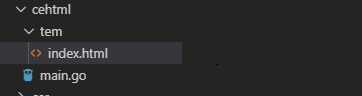
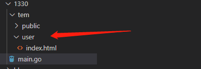
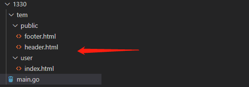

# 1. HTML模板渲染

- gin支持加载HTML模板, 然后根据模板参数进行配置并返回相应的数据，本质上就是字符串替换
- LoadHTMLGlob()方法可以加载模板文件

```go
package main

import (
    "net/http"

    "github.com/gin-gonic/gin"
)

func main() {
    r := gin.Default()
    r.LoadHTMLGlob("tem/*")
    r.GET("/index", func(c *gin.Context) {
        c.HTML(http.StatusOK, "index.html", gin.H{"title": "我是测试", "ce": "123456"})
    })
    r.Run()
}
<!DOCTYPE html>
<html lang="en">
<head>
    <meta charset="UTF-8">
    <meta name="viewport" content="width=device-width, initial-scale=1.0">
    <meta http-equiv="X-UA-Compatible" content="ie=edge">
    <title>{{.title}}</title>
</head>
    <body>
        fgkjdskjdsh{{.ce}}
    </body>
</html>
```

目录结构:



- 如果你的目录结构是下面的情况



代码如下：

```go
package main

import (
    "net/http"

    "github.com/gin-gonic/gin"
)

func main() {
    r := gin.Default()
    r.LoadHTMLGlob("tem/**/*")
    r.GET("/index", func(c *gin.Context) {
        c.HTML(http.StatusOK, "user/index.html", gin.H{"title": "我是测试", "address": "www.5lmh.com"})
    })
    r.Run()
}
{{ define "user/index.html" }}
<!DOCTYPE html>
<html lang="en">
<head>
    <meta charset="UTF-8">
    <meta name="viewport" content="width=device-width, initial-scale=1.0">
    <meta http-equiv="X-UA-Compatible" content="ie=edge">
    <title>{{.title}}</title>
</head>
    <body>
        fgkjdskjdsh{{.address}}
    </body>
</html>
{{ end }}
```

- 如果你想进行头尾分离就是下面这种写法了：



```go
package main

import (
    "net/http"

    "github.com/gin-gonic/gin"
)

func main() {
    r := gin.Default()
    r.LoadHTMLGlob("tem/**/*")
    r.GET("/index", func(c *gin.Context) {
        c.HTML(http.StatusOK, "user/index.html", gin.H{"title": "我是测试", "address": "www.5lmh.com"})
    })
    r.Run()
}
```

`user/index.html`文件代码：

```html
{{ define "user/index.html" }}
{{template "public/header" .}}
        fgkjdskjdsh{{.address}}
{{template "public/footer" .}}
{{ end }}
```

`public/header.html`文件代码：

```html
{{define "public/header"}}
<!DOCTYPE html>
<html lang="en">
<head>
    <meta charset="UTF-8">
    <meta name="viewport" content="width=device-width, initial-scale=1.0">
    <meta http-equiv="X-UA-Compatible" content="ie=edge">
    <title>{{.title}}</title>
</head>
    <body>

{{end}}
```

`public/footer.html`文件代码：

```html
{{define "public/footer"}}
</body>
</html>
{{ end }}
```

- 如果你需要引入静态文件需要定义一个静态文件目录

```go
    r.Static("/assets", "./assets")
```