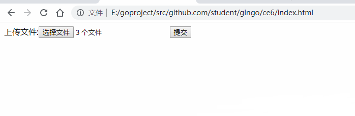
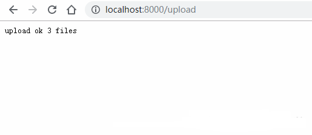

# 1. 上传多个文件

```html
<!DOCTYPE html>
<html lang="en">
<head>
    <meta charset="UTF-8">
    <meta name="viewport" content="width=device-width, initial-scale=1.0">
    <meta http-equiv="X-UA-Compatible" content="ie=edge">
    <title>Document</title>
</head>
<body>
    <form action="http://localhost:8000/upload" method="post" enctype="multipart/form-data">
          上传文件:<input type="file" name="files" multiple>
          <input type="submit" value="提交">
    </form>
</body>
</html>
```

```go
package main

import (
   "github.com/gin-gonic/gin"
   "net/http"
   "fmt"
)

// gin的helloWorld

func main() {
   // 1.创建路由
   // 默认使用了2个中间件Logger(), Recovery()
   r := gin.Default()
   // 限制表单上传大小 8MB，默认为32MB
   r.MaxMultipartMemory = 8 << 20
   r.POST("/upload", func(c *gin.Context) {
      form, err := c.MultipartForm()
      if err != nil {
         c.String(http.StatusBadRequest, fmt.Sprintf("get err %s", err.Error()))
      }
      // 获取所有图片
      files := form.File["files"]
      // 遍历所有图片
      for _, file := range files {
         // 逐个存
         if err := c.SaveUploadedFile(file, file.Filename); err != nil {
            c.String(http.StatusBadRequest, fmt.Sprintf("upload err %s", err.Error()))
            return
         }
      }
      c.String(200, fmt.Sprintf("upload ok %d files", len(files)))
   })
   //默认端口号是8080
   r.Run(":8000")
}
```

效果演示：



