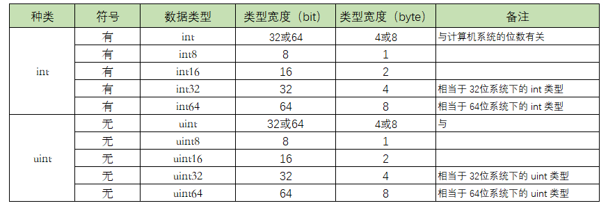
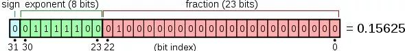
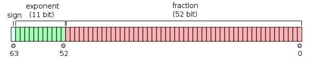

# 数据类型-整形与浮点型

## 01. 整形

Go 语言中，整数类型可以再细分成10个类型



int 和 uint 的区别就在于一个 `u`，有 `u` 说明是无符号，没有 `u` 代表有符号。

**解释这个符号的区别**

以 `int8` 和 `uint8` 举例，8 代表 8个bit，能表示的数值个数有 2^8 = 256。

uint8 是无符号，能表示的都是正数，0-255，刚好256个数。

int8 是有符号，既可以正数，也可以负数，那怎么办？对半分呗，-128-127，也刚好 256个数。

int8 int16 int32 int64 这几个类型的最后都有一个数值，这表明了它们能表示的数值个数是固定的。

而 int 没有并没有指定它的位数，说明它的大小，是可以变化的，那根据什么变化呢？

- 当你在32位的系统下，int 和 uint 都占用 4个字节，也就是32位。
- 若你在64位的系统下，int 和 uint 都占用 8个字节，也就是64位。

出于这个原因，在某些场景下，你应当避免使用 int 和 uint ，而使用更加精确的 int32 和 int64，比如在二进制传输、读写文件的结构描述（为了保持文件的结构不会受到不同编译目标平台字节长度的影响）

**不同进制的表示方法**

出于习惯，在初始化数据类型为整形的变量时，我们会使用10进制的表示法，因为它最直观，比如这样，表示整数10.

```go
var num int = 10
```

不过，你要清楚，你一样可以使用其他进制来表示一个整数，这里以比较常用的2进制、8进制和16进制举例。

2进制：以`0b`或`0B`为前缀

```go
var num01 int = 0b1100
```

8进制：以`0o`或者 `0O`为前缀

```go
var num02 int = 0o14
```

16进制：以`0x` 为前缀

```go
var num03 int = 0xC
```

下面用一段代码分别使用二进制、8进制、16进制来表示 10 进制的数值：12

```go
package main

import (
    "fmt"
)

func main() {
    var num01 int = 0b1100
    var num02 int = 0o14
    var num03 int = 0xC

    fmt.Printf("2进制数 %b 表示的是: %d \n", num01, num01)
    fmt.Printf("8进制数 %o 表示的是: %d \n", num02, num02)
    fmt.Printf("16进制数 %X 表示的是: %d \n", num03, num03)
}
```

输出如下

```go
2进制数 1100 表示的是: 12 
8进制数 14 表示的是: 12 
16进制数 C 表示的是: 12 
```

以上代码用过了 fmt 包的格式化功能，你可以参考这里去看上面的代码

```go
普通占位符
占位符     说明                           举例                   输出
%v      相应值的默认格式。            Printf("%v", people)   {zhangsan}，
%+v     打印结构体时，会添加字段名     Printf("%+v", people)  {Name:zhangsan}
%#v     相应值的Go语法表示            Printf("#v", people)   main.Human{Name:"zhangsan"}
%T      相应值的类型的Go语法表示       Printf("%T", people)   main.Human
%%      字面上的百分号，并非值的占位符  Printf("%%")            %
```

```go
布尔占位符
占位符       说明                举例                     输出
%t          true 或 false。     Printf("%t", true)       true
```

```go
整数占位符
占位符     说明                                  举例                       输出
%b      二进制表示                             Printf("%b", 5)             101
%c      相应Unicode码点所表示的字符              Printf("%c", 0x4E2D)        中
%d      十进制表示                             Printf("%d", 0x12)          18
%o      八进制表示                             Printf("%d", 10)            12
%q      单引号围绕的字符字面值，由Go语法安全地转义 Printf("%q", 0x4E2D)        '中'
%x      十六进制表示，字母形式为小写 a-f         Printf("%x", 13)             d
%X      十六进制表示，字母形式为大写 A-F         Printf("%x", 13)             D
%U      Unicode格式：U+1234，等同于 "U+%04X"   Printf("%U", 0x4E2D)         U+4E2D
```

```go
浮点数和复数的组成部分（实部和虚部）
占位符     说明                              举例            输出
%b      无小数部分的，指数为二的幂的科学计数法，
        与 strconv.FormatFloat 的 'b' 转换格式一致。例如 -123456p-78
%e      科学计数法，例如 -1234.456e+78        Printf("%e", 10.2)     1.020000e+01
%E      科学计数法，例如 -1234.456E+78        Printf("%e", 10.2)     1.020000E+01
%f      有小数点而无指数，例如 123.456        Printf("%f", 10.2)     10.200000
%g      根据情况选择 %e 或 %f 以产生更紧凑的（无末尾的0）输出 Printf("%g", 10.20)   10.2
%G      根据情况选择 %E 或 %f 以产生更紧凑的（无末尾的0）输出 Printf("%G", 10.20+2i) (10.2+2i)
```

```go
字符串与字节切片
占位符     说明                              举例                           输出
%s      输出字符串表示（string类型或[]byte)   Printf("%s", []byte("Go语言"))  Go语言
%q      双引号围绕的字符串，由Go语法安全地转义  Printf("%q", "Go语言")         "Go语言"
%x      十六进制，小写字母，每字节两个字符      Printf("%x", "golang")         676f6c616e67
%X      十六进制，大写字母，每字节两个字符      Printf("%X", "golang")         676F6C616E67
```

```go
指针
占位符         说明                      举例                             输出
%p      十六进制表示，前缀 0x          Printf("%p", &people)             0x4f57f0
```

```go
其它标记
占位符      说明                             举例          输出
+      总打印数值的正负号；对于%q（%+q）保证只输出ASCII编码的字符。 
                                           Printf("%+q", "中文")  "\u4e2d\u6587"
-      在右侧而非左侧填充空格（左对齐该区域）
#      备用格式：为八进制添加前导 0（%#o）      Printf("%#U", '中')      U+4E2D
       为十六进制添加前导 0x（%#x）或 0X（%#X），为 %p（%#p）去掉前导 0x；
       如果可能的话，%q（%#q）会打印原始 （即反引号围绕的）字符串；
       如果是可打印字符，%U（%#U）会写出该字符的
       Unicode 编码形式（如字符 x 会被打印成 U+0078 'x'）。
' '    (空格)为数值中省略的正负号留出空白（% d）；
       以十六进制（% x, % X）打印字符串或切片时，在字节之间用空格隔开
0      填充前导的0而非空格；对于数字，这会将填充移到正负号之后
```

## 02. 浮点型

浮点数类型的值一般由整数部分、小数点“`.`”和小数部分组成。

其中，整数部分和小数部分均由10进制表示法表示。不过还有另一种表示方法。那就是在其中加入指数部分。指数部分由“E”或“e”以及一个带正负号的10进制数组成。比如，`3.7E-2`表示浮点数`0.037`。又比如，`3.7E+1`表示浮点数`37`。

有时候，浮点数类型值的表示也可以被简化。比如，`37.0`可以被简化为`37`。又比如，`0.037`可以被简化为`.037`。

有一点需要注意，在Go语言里，浮点数的相关部分只能由10进制表示法表示，而不能由8进制表示法或16进制表示法表示。比如，`03.7`表示的一定是浮点数`3.7`。

### float32 和 float64

Go语言中提供了两种精度的浮点数 float32 和 float64。

**float32**，也即我们常说的单精度，存储占用4个字节，也即4*8=32位，其中1位用来符号，8位用来指数，剩下的23位表示尾数



**float64**，也即我们熟悉的双精度，存储占用8个字节，也即8*8=64位，其中1位用来符号，11位用来指数，剩下的52位表示尾数



**那么精度是什么意思？有效位有多少位？**

精度主要取决于尾数部分的位数。

对于 float32（单精度）来说，表示尾数的为23位，除去全部为0的情况以外，最小为2^-23，约等于1.19*10^-7，所以float小数部分只能精确到后面6位，加上小数点前的一位，即有效数字为7位。

同理 float64（单精度）的尾数部分为 52位，最小为2^-52，约为2.22*10^-16，所以精确到小数点后15位，加上小数点前的一位，有效位数为16位。

通过以上，可以总结出以下几点：

**1. float32 和 float64 可以表示的数值很多**

浮点数类型的取值范围可以从很微小到很巨大。浮点数取值范围的极限值可以在 math 包中找到：

- 常量 math.MaxFloat32 表示 float32 能取到的最大数值，大约是 3.4e38；
- 常量 math.MaxFloat64 表示 float64 能取到的最大数值，大约是 1.8e308；
- float32 和 float64 能表示的最小值分别为 1.4e-45 和 4.9e-324。

**2. 数值很大但精度有限**

人家虽然能表示的数值很大，但精度位却没有那么大。

- float32的精度只能提供大约6个十进制数（表示后科学计数法后，小数点后6位）的精度
- float64的精度能提供大约15个十进制数（表示后科学计数法后，小数点后15位）的精度

这里的精度是什么意思呢？

比如 10000018这个数，用 float32 的类型来表示的话，由于其有效位是7位，将10000018 表示成科学计数法，就是 1.0000018 * 10^7，能精确到小数点后面6位。

此时用科学计数法表示后，小数点后有7位，刚刚满足我们的精度要求，意思是什么呢？此时你对这个数进行+1或者-1等数学运算，都能保证计算结果是精确的

```go
import "fmt"
var myfloat float32 = 10000018
func main()  {
    fmt.Println("myfloat: ", myfloat)
    fmt.Println("myfloat: ", myfloat+1)
}
```

输出如下

```go
myfloat:  1.0000018e+07
myfloat:  1.0000019e+07
```

上面举了一个刚好满足精度要求数据的临界情况，为了做对比，下面也举一个刚好不满足精度要求的例子。只要给这个数值多加一位数就行了。

换成 100000187，同样使用 float32类型，表示成科学计数法，由于精度有限，表示的时候小数点后面7位是准确的，但若是对其进行数学运算，由于第八位无法表示，所以运算后第七位的值，就会变得不精确。

这里我们写个代码来验证一下，按照我们的理解下面 myfloat01 = 100000182 ，对其`+5` 操作后，应该等于 myfloat02 = 100000187，

```go
import "fmt"

var myfloat01 float32 = 100000182
var myfloat02 float32 = 100000187

func main() {
    fmt.Println("myfloat: ", myfloat01)
    fmt.Println("myfloat: ", myfloat01+5)
    fmt.Println(myfloat02 == myfloat01+5)
}
```

但是由于其类型是 float32，精度不足，导致最后比较的结果是不相等（从小数点后第七位开始不精确）

```go
myfloat:  1.00000184e+08
myfloat:  1.0000019e+08
false
```

由于精度的问题，就会出现这种很怪异的现象，`myfloat == myfloat +1` 会返回 `true` 。