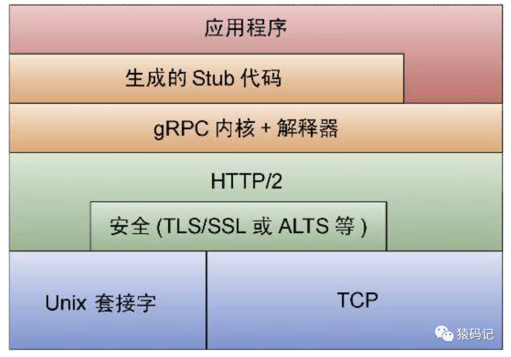

# gRPC快速入门

## 1.什么是gRPC

gRPC 是一个高性能、开源、通用的`RPC`框架，由`Google`推出，基于HTTP2协议标准设计开发，默认采用Protocol Buffers数据序列化协议，支持多种开发语言。`gRPC`提供了一种简单的方法来精确的定义服务，并且为客户端和服务端自动生成可靠的功能库。

## 2.gRPC技术栈



> 最底层为`TCP`或`Unix`套接字协议，在此之上是`HTTP/2`协议的实现，然后在`HTTP/2`协议之上又构建了针对`Go`语言的`gRPC`核心库（`gRPC`内核+解释器）。应用程序通过`gRPC`插件生成的`Stub`代码和`gRPC`核心库通信，也可以直接和`gRPC`核心库通信。

## 3. 前置准备

### 3.1 安装`protoc`

> 下面示例是在`mac环境`中安装。

```go
# 安装
➜ brew install protobuf
# 查看安装后版本
➜ protoc --version
libprotoc 3.17.3
```

### 3.2 安装插件

>  **安装插件的目的是为了将`protobuf`文件，生成`Go`代码**  

```go
$ go install google.golang.org/protobuf/cmd/protoc-gen-go@v1.26
$ go install google.golang.org/grpc/cmd/protoc-gen-go-grpc@v1.1
```

### 3.3 设置插件环境变量

```go
$ export PATH="$PATH:$(go env GOPATH)/bin"
```

### 3.4 验证插件是否成功

```go
# 查看protoc-gen-go版本
$ protoc-gen-go --version                                      
protoc-gen-go v1.26.0

# 查看protoc-gen-go-grpc版本
$ protoc-gen-go-grpc --version
protoc-gen-go-grpc 1.1.0
```

## 4. 快速使用

### 4.1 定义`protobuf`文件

 **文件名: `hello.proto`**  

```go
syntax = "proto3";
package hello;

// 定义go生成后的包名
option go_package = "server/hello";

// 定义入参
message Request {
  string name =1;
}
// 定义返回
message Response {
  string result = 1;
}

// 定义接口
service UserService {
  rpc Say(Request) returns (Response);
}
```

### 4.2 生成`GO`代码

```go
# 同时生成hello.pb.go 和 hello_grpc.pb.go
$ protoc --go-grpc_out=. --go_out=. hello.proto
```

### 4.3 查看生成代码

#### 1. `hello.pb.go`部分代码

```go
// Code generated by protoc-gen-go. DO NOT EDIT.
// versions:
//  protoc-gen-go v1.26.0
//  protoc        v3.17.3
// source: grpc/hello.proto

package hello

import (
 protoreflect "google.golang.org/protobuf/reflect/protoreflect"
 protoimpl "google.golang.org/protobuf/runtime/protoimpl"
 reflect "reflect"
 sync "sync"
)

const (
 // Verify that this generated code is sufficiently up-to-date.
 _ = protoimpl.EnforceVersion(20 - protoimpl.MinVersion)
 // Verify that runtime/protoimpl is sufficiently up-to-date.
 _ = protoimpl.EnforceVersion(protoimpl.MaxVersion - 20)
)

// 定义入参
type Request struct {
 state         protoimpl.MessageState
 sizeCache     protoimpl.SizeCache
 unknownFields protoimpl.UnknownFields

 Name string `protobuf:"bytes,1,opt,name=name,proto3" json:"name,omitempty"`
}

func (x *Request) GetName() string {
 if x != nil {
  return x.Name
 }
 return ""
}

// 定义返回
type Response struct {
 state         protoimpl.MessageState
 sizeCache     protoimpl.SizeCache
 unknownFields protoimpl.UnknownFields

 Result string `protobuf:"bytes,1,opt,name=result,proto3" json:"result,omitempty"`
}
func (x *Response) GetResult() string {
 if x != nil {
  return x.Result
 }
 return ""
}
```

#### 2. `hello_grpc.pb.go`部分代码

```go
// Code generated by protoc-gen-go-grpc. DO NOT EDIT.

package hello

import (
 context "context"
 "fmt"
 grpc "google.golang.org/grpc"
)

// ---------- 客户端相关代码 --------
// 客户端接口
type UserServiceClient interface {
 Say(ctx context.Context, in *Request, opts ...grpc.CallOption) (*Response, error)
}
// 实现客户端接口
type userServiceClient struct {
 cc grpc.ClientConnInterface
}
// 实例化客户端
func NewUserServiceClient(cc grpc.ClientConnInterface) UserServiceClient {
 return &userServiceClient{cc}
}
// 客户端调用Say方法
func (c *userServiceClient) Say(ctx context.Context, in *Request, opts ...grpc.CallOption) (*Response, error) {
 out := new(Response)
 err := c.cc.Invoke(ctx, "/hello.UserService/Say", in, out, opts...)
 if err != nil {
  return nil, err
 }
 return out, nil
}

// ---------- 服务端相关代码 ------------------
// 定义服务端接口
type UserServiceServer interface {
 Say(context.Context, *Request) (*Response, error)
 mustEmbedUnimplementedUserServiceServer()
}

// 实现服务端接口
type UnimplementedUserServiceServer struct {
}

// 实现方法
func (UnimplementedUserServiceServer) Say(ctx context.Context, r *Request) (*Response, error) {
  // 自己编写代码
 reply := &Response{
  Result: fmt.Sprintf("%s say hello word!", r.Name),
 }
 return reply, nil
}
// 注册服务
func RegisterUserServiceServer(s grpc.ServiceRegistrar, srv UserServiceServer) {
 s.RegisterService(&UserService_ServiceDesc, srv)
}
```

### 4.4 下载`grpc`包

```go
$ go get -u google.golang.org/grpc
```

### 4.5 编写服务端代码

 **`server.go`**  

```go
package main

import (
 "52lu/go-study-example/grpc/server/hello"
 "fmt"
 "google.golang.org/grpc"
 "net"
)

func main() {
 // 创建grpc服务
 grpcServer := grpc.NewServer()
 // 注册服务
 hello.RegisterUserServiceServer(grpcServer, new(hello.UnimplementedUserServiceServer))
 // 监听端口
 listen, err := net.Listen("tcp", ":1234")
 if err != nil {
  fmt.Println("服务启动失败", err)
  return
 }
 grpcServer.Serve(listen)
}
```

### 4.6 编写客户端代码

 **`client.go`**  

```go
package main

import (
 "52lu/go-study-example/grpc/server/hello"
 "fmt"
 "golang.org/x/net/context"
 "google.golang.org/grpc"
)

func main() {
 // 建立链接
 conn, err := grpc.Dial("127.0.0.1:1234", grpc.WithInsecure())
 if err != nil {
  fmt.Println("Dial Error ", err)
  return
 }
 // 延迟关闭链接
 defer conn.Close()
 // 实例化客户端
 client := hello.NewUserServiceClient(conn)
 // 发起请求
 reply, err := client.Say(context.TODO(), &hello.Request{Name: "张三"})
 if err != nil {
  return
 }
 fmt.Println("返回:", reply.Result)
}
```

### 4.7 启动 & 请求

```go
# 启动服务端
$ go run server.go
# 启动客户端
$ go run client.go   
返回: 张三 say hello word!
```
