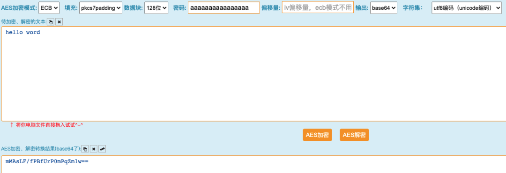
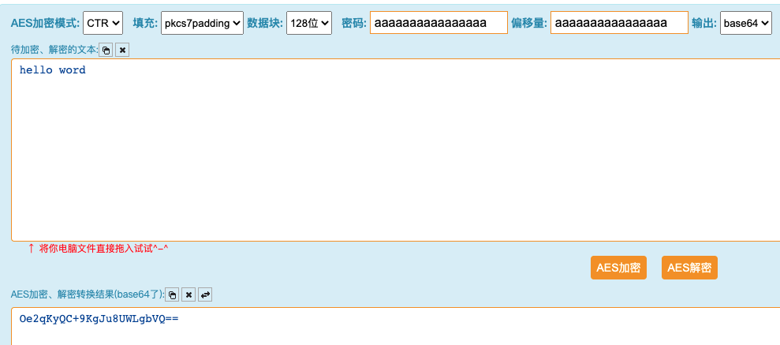

# crypto之AES加解密实现

### 1.介绍

**高级加密标准**（英语：**A**dvanced **E**ncryption **S**tandard，缩写：AES），又称**Rijndael加密法**（荷兰语发音：[ˈrɛindaːl]，音似英文的“Rhine doll”），是美国联邦政府采用的一种区块加密标准。这个标准用来替代原先的DES，已经被多方分析且广为全世界所使用。经过五年的甄选流程，高级加密标准由美国国家标准与技术研究院（NIST）于2001年11月26日发布于FIPS PUB 197，并在2002年5月26日成为有效的标准。现在，高级加密标准已然成为对称密钥加密中最流行的算法之一。

该算法为比利时密码学家Joan Daemen和Vincent Rijmen所设计，结合两位作者的名字，以Rijndael为名投稿高级加密标准的甄选流程。

### 2. 电码本模式(`ECB`)

#### 2.1 加密

##### a.代码

```go
// 加密
func AesEncryptByECB(data, key string) string {
 // 判断key长度
 keyLenMap := map[int]struct{}{16: {}, 24: {}, 32: {}}
 if _,ok := keyLenMap[len(key)]; !ok {
  panic("key长度必须是 16、24、32 其中一个")
 }
 // 密钥和待加密数据转成[]byte
 originByte := []byte(data)
 keyByte := []byte(key)
 // 创建密码组，长度只能是16、24、32字节
 block, _ := aes.NewCipher(keyByte)
 // 获取密钥长度
 blockSize := block.BlockSize()
 // 补码
 originByte = PKCS7Padding(originByte, blockSize)
 // 创建保存加密变量
 encryptResult := make([]byte, len(originByte))
 // CEB是把整个明文分成若干段相同的小段，然后对每一小段进行加密
 for bs, be := 0, blockSize; bs < len(originByte); bs, be = bs+blockSize, be+blockSize {
  block.Encrypt(encryptResult[bs:be], originByte[bs:be])
 }
 return base64.StdEncoding.EncodeToString(encryptResult)
}
// 补码
func PKCS7Padding(originByte []byte, blockSize int) []byte {
 // 计算补码长度
 padding := blockSize - len(originByte)%blockSize
 // 生成补码
 padText := bytes.Repeat([]byte{byte(padding)}, padding)
 // 追加补码
 return append(originByte, padText...)
}
```

##### b.测试

```go
package crypto
import (
 "52lu/go-study-example/package/crypto"
 "fmt"
 "strings"
 "testing"
)
// 加密
func TestECBEncrypt(t *testing.T) {
 key := strings.Repeat("a", 16)
 data := "hello word"
 s := crypto.AesEncryptByECB(data, key)
 fmt.Printf("加密密钥: %v \n", key)
 fmt.Printf("加密数据: %v \n", data)
 fmt.Printf("加密结果: %v \n", s)
}
/** 输出
=== RUN   TestECBEncrypt
加密密钥: aaaaaaaaaaaaaaaa 
加密数据: hello word 
加密结果: mMAsLF/fPBfUrP0mPqZm1w== 
--- PASS: TestECBEncrypt (0.00s)
PASS
*/
```

##### c.第三方加密验证



#### 2.2 解密

##### a.代码

```go
// 解密
func AesDecryptByECB(data, key string) string {
 // 判断key长度
 keyLenMap := map[int]struct{}{16: {}, 24: {}, 32: {}}
 if _,ok := keyLenMap[len(key)]; !ok {
  panic("key长度必须是 16、24、32 其中一个")
 }
 // 反解密码base64
 originByte, _ := base64.StdEncoding.DecodeString(data)
 // 密钥和待加密数据转成[]byte
 keyByte := []byte(key)
 // 创建密码组，长度只能是16、24、32字节
 block, _ := aes.NewCipher(keyByte)
 // 获取密钥长度
 blockSize := block.BlockSize()
 // 创建保存解密变量
 decrypted := make([]byte, len(originByte))
 for bs, be := 0, blockSize; bs < len(originByte); bs, be = bs+blockSize, be+blockSize {
  block.Decrypt(decrypted[bs:be], originByte[bs:be])
 }
 // 解码
 return string(PKCS7UNPadding(decrypted))
}
// 解码
func PKCS7UNPadding(originDataByte []byte) []byte {
 length := len(originDataByte)
 unpadding := int(originDataByte[length-1])
 return originDataByte[:(length-unpadding)]
}
```

##### b.测试

```go
// 解密
func TestECBDecrypt(t *testing.T) {
 key := strings.Repeat("a", 16)
 data := "mMAsLF/fPBfUrP0mPqZm1w=="
 s := crypto.AesDecryptByECB(data, key)
 fmt.Printf("解密密钥: %v \n", key)
 fmt.Printf("解密数据: %v \n", data)
 fmt.Printf("解密结果: %v \n", s)
}
/** 输出
=== RUN   TestECBDecrypt
解密密钥: aaaaaaaaaaaaaaaa 
解密数据: mMAsLF/fPBfUrP0mPqZm1w== 
解密结果: hello word 
--- PASS: TestECBDecrypt (0.00s)
PASS
*/
```

### 3. 密码分组链模式(`CBC`)

#### 3.1 加密

##### a.代码

```go
// AES加密
func AesEncryptByCBC(str, key string) string {
 // 判断key长度
 keyLenMap := map[int]struct{}{16: {}, 24: {}, 32: {}}
 if _,ok := keyLenMap[len(key)]; !ok {
  panic("key长度必须是 16、24、32 其中一个")
 }
 // 待加密字符串转成byte
 originDataByte := []byte(str)
 // 秘钥转成[]byte
 keyByte := []byte(key)
 // 创建一个cipher.Block接口。参数key为密钥，长度只能是16、24、32字节
 block, _ := aes.NewCipher(keyByte)
 // 获取秘钥长度
 blockSize := block.BlockSize()
 // 补码填充
 originDataByte = PKCS7Padding(originDataByte, blockSize)
 // 选用加密模式
 blockMode := cipher.NewCBCEncrypter(block, keyByte[:blockSize])
 // 创建数组，存储加密结果
 encrypted := make([]byte, len(originDataByte))
 // 加密
 blockMode.CryptBlocks(encrypted, originDataByte)
 // []byte转成base64
 return base64.StdEncoding.EncodeToString(encrypted)
}
// 补码
func PKCS7Padding(originByte []byte, blockSize int) []byte {
 // 计算补码长度
 padding := blockSize - len(originByte)%blockSize
 // 生成补码
 padText := bytes.Repeat([]byte{byte(padding)}, padding)
 // 追加补码
 return append(originByte, padText...)
}
```

##### b.测试

```go
package crypto
import (
 "52lu/go-study-example/package/crypto"
 "fmt"
 "strings"
 "testing"
)
// AES加密
func TestAesEncryptByCBC(t *testing.T) {
 key := strings.Repeat("a", 16)
 fmt.Printf("key: %v 长度: %d \n", key, len(key))
 text := "abc"
 fmt.Printf("带加密文案: %v \n", text)
 encrypt := crypto.AesEncryptByCBC(text, key)
 fmt.Printf("加密结果: %v \n", encrypt)
}
/** 输出
=== RUN   TestAesEncryptByCBC
key: aaaaaaaaaaaaaaaa 长度: 16 
带加密文案: abc 
加密结果: rMX6r9x+PnTOhfgDH4jjXg== 
--- PASS: TestAesEncryptByCBC (0.00s)
PASS
*/
```

##### c.第三方验证


#### 3.2 解密

##### a.代码

```go
// 解密
func AesDecryptByCBC(encrypted,key string) string  {
 // 判断key长度
 keyLenMap := map[int]struct{}{16: {}, 24: {}, 32: {}}
 if _,ok := keyLenMap[len(key)]; !ok {
  panic("key长度必须是 16、24、32 其中一个")
 }
 // encrypted密文反解base64
 decodeString, _ := base64.StdEncoding.DecodeString(encrypted)
 // key 转[]byte
 keyByte := []byte(key)
 // 创建一个cipher.Block接口。参数key为密钥，长度只能是16、24、32字节
 block, _ := aes.NewCipher(keyByte)
 // 获取秘钥块的长度
 blockSize := block.BlockSize()
 // 选择加密模式
 blockMode := cipher.NewCBCDecrypter(block, keyByte[:blockSize])
 // 创建数组，存储解密结果
 decodeResult := make([]byte, blockSize)
 // 解密
 blockMode.CryptBlocks(decodeResult,decodeString)
 // 解码
 padding := PKCS7UNPadding(decodeResult)
 return string(padding)
}
// 解码
func PKCS7UNPadding(originDataByte []byte) []byte {
 length := len(originDataByte)
 unpadding := int(originDataByte[length-1])
 return originDataByte[:(length-unpadding)]
}
```

##### b.测试

```go
package crypto
import (
 "52lu/go-study-example/package/crypto"
 "fmt"
 "strings"
 "testing"
)
// AES解密
func TestAesDecryptByCBC(t *testing.T) {
 key := strings.Repeat("a", 16)
 fmt.Printf("key: %v 长度: %d \n", key, len(key))
 text := "rMX6r9x+PnTOhfgDH4jjXg=="
 fmt.Printf("待解密文案: %v \n", text)
 decrypt := crypto.AesDecryptByCBC(text, key)
 fmt.Printf("解密结果: %v \n", decrypt)
}

/** 输出
=== RUN   TestAesDecryptByCBC
key: aaaaaaaaaaaaaaaa 长度: 16 
待解密文案: rMX6r9x+PnTOhfgDH4jjXg== 
解密结果: abc 
--- PASS: TestAesDecryptByCBC (0.00s)
PASS
*/
```

### 4. 计算器模式(`CTR`)

#### 4.1 加密

##### a.代码

```go
// 加密,分别返回 hex格式和base64 结果
func AesEncryptByCTR(data, key string) (string,string) {
 // 判断key长度
 keyLenMap := map[int]struct{}{16: {}, 24: {}, 32: {}}
 if _,ok := keyLenMap[len(key)]; !ok {
  panic("key长度必须是 16、24、32 其中一个")
 }
 // 转成byte
 dataByte := []byte(data)
 keyByte := []byte(key)
 // 创建block
 block, err := aes.NewCipher(keyByte)
 if err != nil {
  panic(fmt.Sprintf("NewCipher error:%s",err))
 }
 blockSize := block.BlockSize()
 // 创建偏移量iv,取秘钥前16个字符
 iv := []byte(key[:blockSize])
 // 补码
 padding := PKCS7Padding(dataByte, blockSize)
 // 加密模式
 stream := cipher.NewCTR(block, iv)
 // 定义保存结果变量
 out := make([]byte,len(padding))
 stream.XORKeyStream(out,padding)
 // 处理加密结果
 hexRes := fmt.Sprintf("%x",out)
 base64Res := base64.StdEncoding.EncodeToString(out)
 return hexRes,base64Res
}
// 补码
func PKCS7Padding(originByte []byte, blockSize int) []byte {
 // 计算补码长度
 padding := blockSize - len(originByte)%blockSize
 // 生成补码
 padText := bytes.Repeat([]byte{byte(padding)}, padding)
 // 追加补码
 return append(originByte, padText...)
}
```

##### b.测试

```go
package crypto
import (
 "52lu/go-study-example/package/crypto"
 "fmt"
 "strings"
 "testing"
)
// 测试AES-CTR加密
func TestAesEncryptByCTR(t *testing.T) {
 key := strings.Repeat("a", 16)
 data := "hello word"
 hex, base64 := crypto.AesEncryptByCTR(data, key)
 fmt.Printf("加密key: %v \n", key)
 fmt.Printf("加密key长度: %v \n", len(key))
 fmt.Printf("加密数据: %v \n", data)
 fmt.Printf("加密结果(hex): %v \n", hex)
 fmt.Printf("加密结果(base64): %v \n", base64)
}
/** 输出
=== RUN   TestAesEncryptByCTR
加密key: aaaaaaaaaaaaaaaa 
加密key长度: 16 
加密数据: hello word 
加密结果(hex): 39edaa2b2402fbd2a026ef1458b81b55 
加密结果(base64): Oe2qKyQC+9KgJu8UWLgbVQ== 
--- PASS: TestAesEncryptByCTR (0.00s)
PASS
*/
```

##### c.第三方加密验证



#### 4.2 解密

##### a.代码

```go
// 解密
func AesDecryptByCTR(dataBase64,key string)  string {
 // 判断key长度
 keyLenMap := map[int]struct{}{16: {}, 24: {}, 32: {}}
 if _,ok := keyLenMap[len(key)]; !ok {
  panic("key长度必须是 16、24、32 其中一个")
 }
 // dataBase64转成[]byte
 decodeStringByte, err := base64.StdEncoding.DecodeString(dataBase64)
 if err != nil {
  panic(fmt.Sprintf("base64 DecodeString error: %s",err))
 }
 // 创建block
 block, err := aes.NewCipher([]byte(key))
 if err != nil {
  panic(fmt.Sprintf("NewCipher error: %s",err))
 }
 blockSize := block.BlockSize()
 // 创建偏移量iv,取秘钥前16个字符
 iv := []byte(key[:blockSize])
 // 创建Stream
 stream := cipher.NewCTR(block, iv)
 // 声明变量
 out := make([]byte,len(decodeStringByte))
 // 解密
 stream.XORKeyStream(out,decodeStringByte)
 // 解密加密结果并返回
 return string(PKCS7UNPadding(out))
}
```

##### b.测试

```go
package crypto
import (
 "52lu/go-study-example/package/crypto"
 "fmt"
 "strings"
 "testing"
)
// 测试AES-CTR解密
func TestAesDecryptByCTR(t *testing.T) {
 key := strings.Repeat("a", 16)
 data := "Oe2qKyQC+9KgJu8UWLgbVQ=="
 res := crypto.AesDecryptByCTR(data, key)
 fmt.Printf("解密key: %v \n", key)
 fmt.Printf("解密数据: %v \n", data)
 fmt.Printf("解密结果: %v \n", res)
}
/** 输出
=== RUN   TestAesDecryptByCTR
解密key: aaaaaaaaaaaaaaaa 
解密数据: Oe2qKyQC+9KgJu8UWLgbVQ== 
解密结果: hello word 
--- PASS: TestAesDecryptByCTR (0.00s)
PASS
*/
```

### 5. CFB、OFB

```go
// CFB
...
stream := cipher.NewCFBDecrypter(block, iv)
...
// OFB
...
stream := cipher.NewOFB(block, iv)
...
```

> 不理解的点: 在学习使用中,发现CFB/OFB/CTR 在加密很短的字符串时，发现加密结果一致。

```go
func TestAesEncryptByOFB(t *testing.T) {
 key := strings.Repeat("a", 16)
 data := "123"
 _, base64 := crypto.AesEncryptByOFB(data, key)
 _, base642 := crypto.AesEncryptByCTR(data, key)
 _, base643 := crypto.AesEncryptByCFB(data, key)
 fmt.Printf("加密key: %v \n", key)
 fmt.Printf("加密key长度: %v \n", len(key))
 fmt.Printf("加密数据: %v \n", data)
 fmt.Printf("加密结果(OFB): %v \n", base64)
 fmt.Printf("加密结果(CTR): %v \n", base642)
 fmt.Printf("加密结果(CFB): %v \n", base643)
}
/** 输出
=== RUN   TestAesEncrypt
加密key: aaaaaaaaaaaaaaaa 
加密key长度: 16 
加密数据: 123 
加密结果(OFB): YLr1SkYvgbDfT+QfU7MQXg== 
加密结果(CTR): YLr1SkYvgbDfT+QfU7MQXg== 
加密结果(CFB): YLr1SkYvgbDfT+QfU7MQXg== 
--- PASS: TestAesEncrypt (0.00s)
PASS
```

### 6.AES-GCM

`GCM` 全称为`Galois/Counter Mode`，可以看出 `G` 是指 `GMAC`，`C` 是指 `CTR`。它在 `CTR` 加密的基础上增加`GMAC` 的特性，解决了 `CTR` 不能对加密消息进行完整性校验的问题。

#### 6.1 加密

```go
// 加密(GCM 不需要补码)
func AesEncryptByGCM(data, key string) string {
 block, err := aes.NewCipher([]byte(key))
 if err != nil {
  panic(fmt.Sprintf("NewCipher error:%s", err))
 }
 gcm, err := cipher.NewGCM(block)
 if err != nil {
  panic(fmt.Sprintf("NewGCM error:%s", err))
 }
 // 生成随机因子(这里固定取密钥指定位数)
 //nonce := make([]byte, gcm.NonceSize())
 //if _,err := io.ReadFull(rand.Reader,nonce); err != nil {
 // panic(fmt.Sprintf("make rand nonce error:%s", err))
 //}
 nonceStr := key[:gcm.NonceSize()]
 nonce := []byte(nonceStr)
 fmt.Printf("nonceStr = %v \n", nonceStr)
 seal := gcm.Seal(nonce, nonce, []byte(data), nil)
 return base64.StdEncoding.EncodeToString(seal)
}
```

#### 6.2 解密

```go
// 解密(GCM 不需要解码)
func AesDecryptByGCM(data, key string) string {
 // 反解base64
 dataByte,err := base64.StdEncoding.DecodeString(data)
 if err != nil {
  panic(fmt.Sprintf("base64 DecodeString error:%s", err))
 }
 block, err := aes.NewCipher([]byte(key))
 if err != nil {
  panic(fmt.Sprintf("NewCipher error:%s", err))
 }
 gcm, err := cipher.NewGCM(block)
 if err != nil {
  panic(fmt.Sprintf("NewGCM error:%s", err))
 }
 nonceSize := gcm.NonceSize()
 if len(dataByte) < nonceSize {
  panic("dataByte to short")
 }
 nonce, ciphertext := dataByte[:nonceSize], dataByte[nonceSize:]
 open, err := gcm.Open(nil, nonce, ciphertext, nil)
 if err != nil {
  panic(fmt.Sprintf("gcm Open error:%s", err))
 }
 return string(open)
}
```

#### 6.3 测试

```go
package crypto
import (
 "52lu/go-study-example/package/crypto"
 "fmt"
 "strings"
 "testing"
)
func TestAesGCM(t *testing.T) {
 key := strings.Repeat("a",16)
 data := "hello word!"
 // 加密
 gcm := crypto.AesEncryptByGCM(data, key)
 fmt.Printf("密钥key: %s \n",key)
 fmt.Printf("加密数据: %s \n",data)
 fmt.Printf("加密结果: %s \n",gcm)
 // 解密
 byGCM := crypto.AesDecryptByGCM(gcm, key)
 fmt.Printf("解密结果: %s \n",byGCM)
}
/** 输出
=== RUN   TestAesGCM
nonceStr = aaaaaaaaaaaa 
密钥key: aaaaaaaaaaaaaaaa 
加密数据: hello word! 
加密结果: YWFhYWFhYWFhYWFhhi5dsHDfOdUFfno08BMWWI4iESBd0CF6zE9C 
解密结果: hello word! 
--- PASS: TestAesGCM (0.00s)
PASS
*/
```