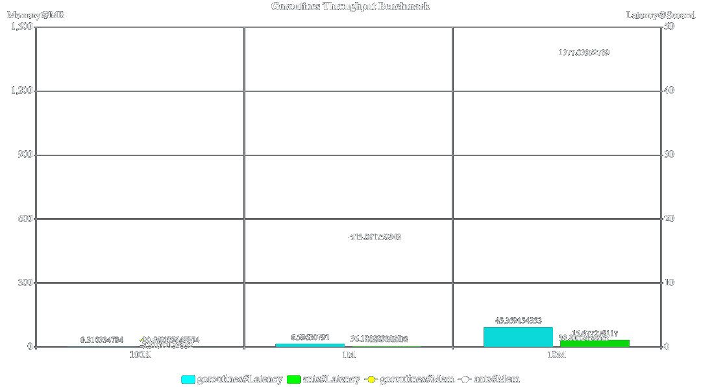
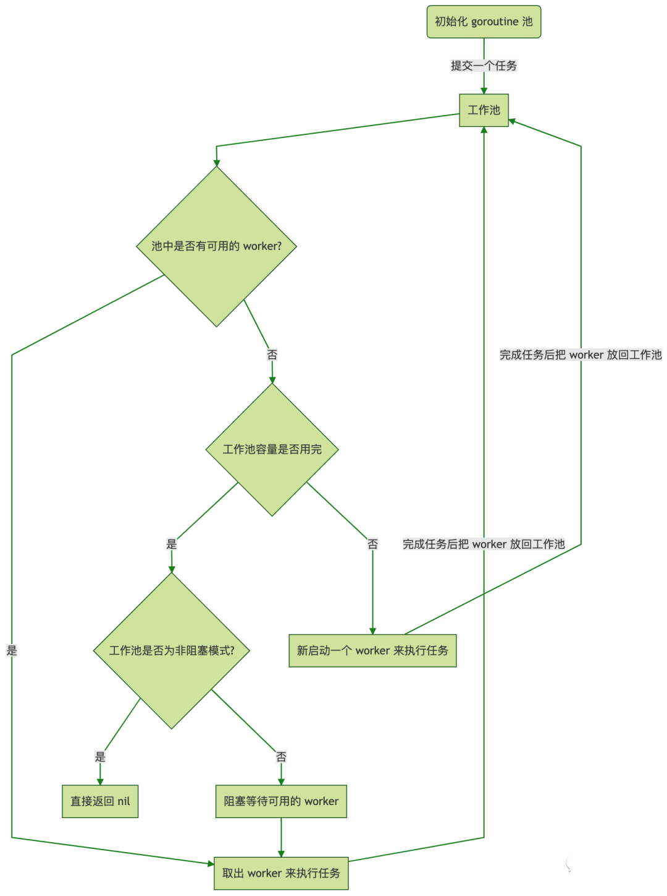

# 高性能goroutine池ants

## 1.介绍

`ants`是一个高性能的 `goroutine` 池，实现了对大规模 `goroutine` 的调度管理、`goroutine` 复用，允许使用者在开发并发程序的时候限制 `goroutine` 数量，复用资源，达到更高效执行任务的效果。

**github:** https://github.com/panjf2000/ants

### 1.1 实现功能列表

- 自动调度海量的 `goroutines`，复用 `goroutines`
- 定期清理过期的 `goroutines`，进一步节省资源
- 提供了大量有用的接口：任务提交、获取运行中的 `goroutine` 数量、动态调整` Pool` 大小、释放 `Pool`、重启 `Pool`
- 优雅处理 `panic`，防止程序崩溃
- 资源复用，极大节省内存使用量；在大规模批量并发任务场景下比原生 `goroutine` 并发具有更高的性能
- 非阻塞机制

### 1.2  和原生协程性能对比




**从该 demo 测试吞吐性能对比可以看出，使用`ants`的吞吐性能相较于原生 goroutine 可以保持在 2-6 倍的性能压制，而内存消耗则可以达到 10-20 倍的节省优势。**

### 1.3 测试通过版本

目前测试通过的 `Golang` 版本：**从 `Go 1.8.` 到 `Go 1.16.x` 的所有版本。**

### 1.4  `ants` 是运行流程



## 2. 安装

### 使用 `ants` v1 版本:

```go
go get -u github.com/panjf2000/ants
```

### 使用 `ants` v2 版本 (开启 GO111MODULE=on):

```go
go get -u github.com/panjf2000/ants/v2
```

## 3. 快速使用

### 3.1 使用默认协程池

```go
func TestAntsRun(t *testing.T) {
 // 延迟关闭默认池
 defer ants.Release()
 // 提交任务
 for i := 0; i < 2; i++ {
  n := i
    // 提交任务
  err := ants.Submit(func() {
   time.Sleep(time.Second * 3)
   // 故意抛出错误
   if n > 0 {
    panic("运行遇到错误~")
   }
   fmt.Println("time: ", time.Now().Format("2006-01-02 15:04:05"))
  })
  if err != nil {
   fmt.Println("err:", err)
  }
 }
 // 打印当前运行的协程数量
 fmt.Println("run go num: ", ants.Running())
 // 主动等待协程运行完成
 time.Sleep(time.Second * 10)
 fmt.Println("finish")
}

/**运行输出
=== RUN   TestAntsRun
run go num:  2
time:  2022-04-28 17:58:57
2022/04/28 17:58:57 worker exits from a panic: 运行遇到错误~
2022/04/28 17:58:57 worker exits from panic: goroutine 9 [running]:
....

finish
--- PASS: TestAntsRun (10.00s)
PASS
*/
```

> **从上面实例可以看出，即便协程内出现`panic`也不会终止程序。**

### 3.2 自定义协程池大小

```go
func TestAntsWithCustomGo(t *testing.T) {
 // 创建自定义协程池
 pool, _ := ants.NewPool(2)
 defer pool.Release()
 for i := 0; i < 6; i++ {
    // 提交任务
  _ = pool.Submit(func() {
   time.Sleep(time.Second * 1)
   fmt.Println("time: ", time.Now().Format("2006-01-02 15:04:05"))
  })
  fmt.Println("i=", i, "当前运行协程数量: ", pool.Running())
 }
 time.Sleep(time.Second * 3)
 fmt.Println("finish")
}
/**运行输出
=== RUN   TestAntsWithCustomGo
i= 0 当前运行协程数量:  1
i= 1 当前运行协程数量:  2
time:  2022-04-28 19:09:52
i= 2 当前运行协程数量:  2
time:  2022-04-28 19:09:52
i= 3 当前运行协程数量:  2
time:  2022-04-28 19:09:53
i= 4 当前运行协程数量:  2
time:  2022-04-28 19:09:53
i= 5 当前运行协程数量:  2
time:  2022-04-28 19:09:54
time:  2022-04-28 19:09:54
finish
--- PASS: TestAntsWithCustomGo (5.00s)
PASS
*/
```