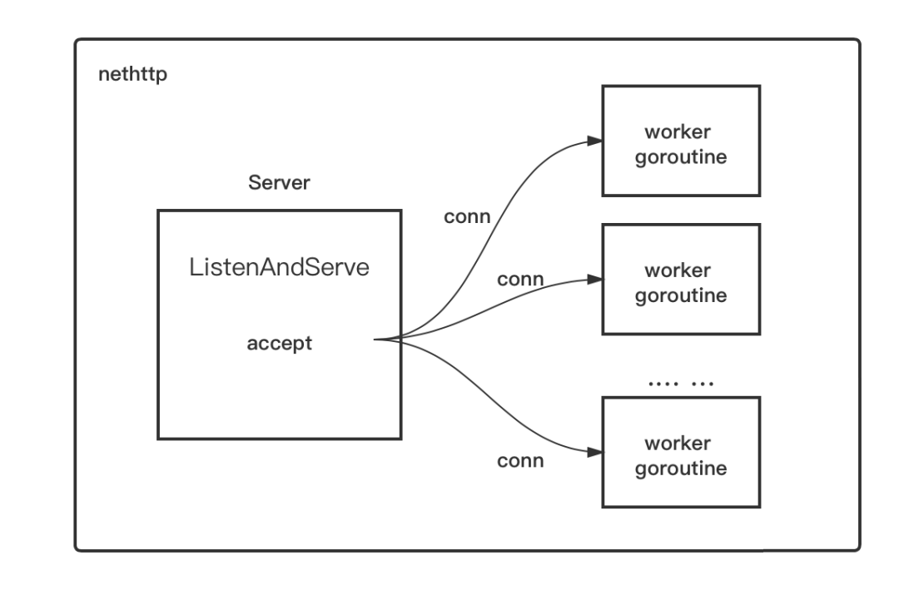
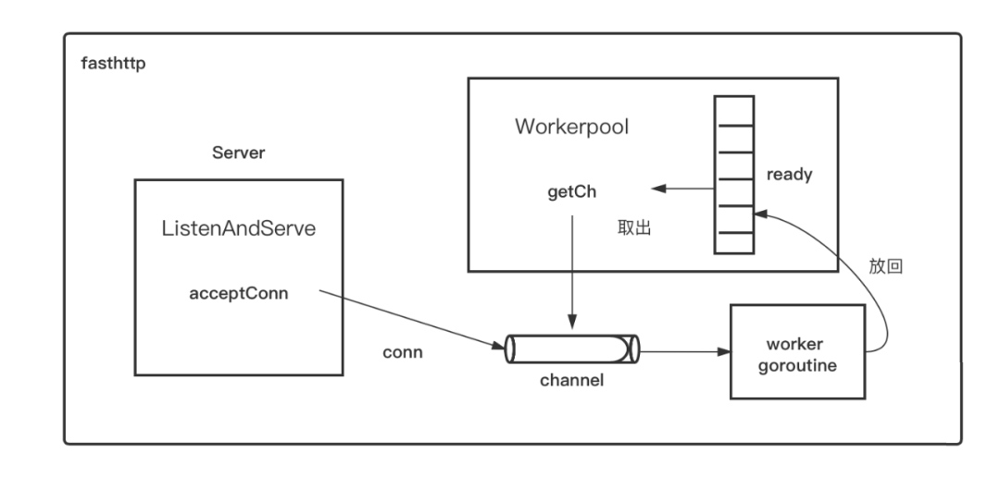

# 高性能http客户端fasthttp

## 1. 介绍

**fasthttp**是由`valyala`编写,并宣称比`Go`官方标准库`net/http`快十倍。`fasthttp`采用了许多性能优化上的最佳实践，尤其是在内存对象的重用上，大量使用sync.Pool以降低对`Go GC`的压力。

## 2.工作原理

### 2.1 `net/http`工作原理示意图



#### a. 流程说明

`http`包作为`server`端的原理很简单，那就是`accept`到一个连接(`conn`)之后，将这个`conn`甩给一个`worker goroutine`去处理，后者一直存在，直到该`conn`的生命周期结束：即连接关闭。

### 2.2 `fasthttp`工作原理示意图




> `fasthttp`高性能主要源自于 **复用** ，`fasthttp`设计了一套机制，目的是尽量复用`goroutine`，而不是每次都创建新的`goroutine`。

#### a. 流程说明

当`fasthttp`的`Server`接到一个`conn`之后，会尝试从`workerpool`中的`ready`切片中 **取出** 一个`channel`，该`channel`与某个`worker goroutine`一一对应。

一旦 **取出** `channel`，就会将`accept`到的`conn`写到该`channel`里，而`channel`另一端的`worker goroutine`就会处理该`conn`上的数据读写。

当处理完该`conn`后，该`worker goroutine`不会退出，而是会将自己对应的那个`channel`重新 **放回** workerpool中的`ready`切片中，等待这下一次被 **取出** 。

## 3. 安装

```go
go get -u github.com/valyala/fasthttp
```

## 4. 使用

### 4.1 自定义客户端配置

```go
/**
 * @Description: 获取http客户端
 * @Author: LiuQHui
 * @Date 2022-04-13 18:53:22
**/
func getFastReqClient() *fasthttp.Client {
 reqClient := &fasthttp.Client{
  // 读超时时间,不设置read超时,可能会造成连接复用失效
  ReadTimeout: time.Second * 5,
  // 写超时时间
  WriteTimeout: time.Second * 5,
  // 5秒后，关闭空闲的活动连接
  MaxIdleConnDuration: time.Second * 5,
  // 当true时,从请求中去掉User-Agent标头
  NoDefaultUserAgentHeader: true,
  // 当true时，header中的key按照原样传输，默认会根据标准化转化
  DisableHeaderNamesNormalizing: true,
  //当true时,路径按原样传输，默认会根据标准化转化
  DisablePathNormalizing: true,
  Dial: (&fasthttp.TCPDialer{
   // 最大并发数，0表示无限制
   Concurrency: 4096,
   // 将 DNS 缓存时间从默认分钟增加到一小时
   DNSCacheDuration: time.Hour,
  }).Dial,
 }
 return reqClient
}
```

### 4.2 发起`GET`请求

```go
/**
 * @Description: 发起Get请求
 * @Author: LiuQHui
 * @Date 2022-04-13 19:08:33
**/
func FastGetWithDo() string {
 // 获取客户端
 client := getFastReqClient()
 // 从请求池中分别获取一个request、response实例
 req, resp := fasthttp.AcquireRequest(), fasthttp.AcquireResponse()
 // 回收实例到请求池
 defer func() {
  fasthttp.ReleaseRequest(req)
    fasthttp.ReleaseResponse(resp)
 }()
 // 设置请求方式
 req.Header.SetMethod(fasthttp.MethodGet)
 // 设置请求地址
  req.SetRequestURI("http://127.0.0.1/test")
 // 设置参数
 var arg fasthttp.Args
 arg.Add("name", "张三")
 arg.Add("id", "10001")
 req.URI().SetQueryString(arg.String())
 // 设置header信息
 req.Header.Add(HAppIdKey, HAppIdVal)
 // 设置Cookie信息
 req.Header.SetCookie("key", "val")
 // 发起请求
 if err := client.Do(req, resp); err != nil {
  fmt.Println("req err ", err)
  return err.Error()
 }
 // 读取结果
 return string(resp.Body())
}
```

### 4.3 发起`POST`请求

```go
// post请求参数
type postParamExample struct {
 Id   int    `json:"id,omitempty"`
 Name string `json:"app_id_list,omitempty"`
}

/**
 * @Description: post请求
 * @Author: LiuQHui
 * @Return string
 * @Date 2022-04-14 18:23:06
**/
func FastPostRawWithDo() string {
 // 获取客户端
 client := getFastReqClient()
 // 从请求池中分别获取一个request、response实例
 req, resp := fasthttp.AcquireRequest(), fasthttp.AcquireResponse()
 // 回收到请求池
 defer func() {
  fasthttp.ReleaseRequest(req)
  fasthttp.ReleaseResponse(resp)
 }()
 // 设置请求方式
 req.Header.SetMethod(fasthttp.MethodPost)
 // 设置请求地址
  req.SetRequestURI("http://127.0.0.1/test")
 // 设置请求ContentType
 req.Header.SetContentType("application/json")
 // 设置参数
 param := postParamExample{
  Id:  10001,
  Name: "小明",
 }
 marshal, _ := json.Marshal(param)
 req.SetBodyRaw(marshal)
 // 发起请求
 if err := client.Do(req, resp); err != nil {
  fmt.Println("req err ", err)
  return err.Error()
 }
 // 读取结果
 return string(resp.Body())
}
```