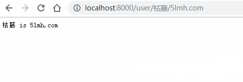

# 1. API参数

- 可以通过Context的Param方法来获取API参数
- localhost:8000/xxx/zhangsan

```go
package main

import (
    "net/http"
    "strings"

    "github.com/gin-gonic/gin"
)

func main() {
    r := gin.Default()
    r.GET("/user/:name/*action", func(c *gin.Context) {
        name := c.Param("name")
        action := c.Param("action")
        //截取/
        action = strings.Trim(action, "/")
        c.String(http.StatusOK, name+" is "+action)
    })
    //默认为监听8080端口
    r.Run(":8000")
}
```

输出结果：

