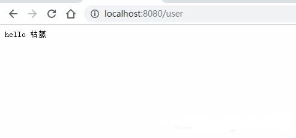
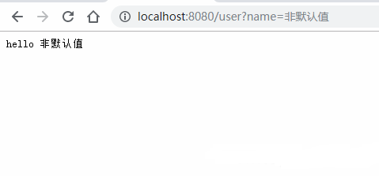

# 1. URL参数

- URL参数可以通过DefaultQuery()或Query()方法获取
- DefaultQuery()若参数不村则，返回默认值，Query()若不存在，返回空串
- API ? name=zs

```go
package main

import (
    "fmt"
    "net/http"

    "github.com/gin-gonic/gin"
)

func main() {
    r := gin.Default()
    r.GET("/user", func(c *gin.Context) {
        //指定默认值
        //http://localhost:8080/user 才会打印出来默认的值
        name := c.DefaultQuery("name", "枯藤")
        c.String(http.StatusOK, fmt.Sprintf("hello %s", name))
    })
    r.Run()
}
```

不传递参数输出的结果：



传递参数输出的结果：

