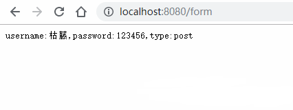

# 1. 表单参数

- 表单传输为post请求，http常见的传输格式为四种：
  - application/json
  - application/x-www-form-urlencoded
  - application/xml
  - multipart/form-data
- 表单参数可以通过PostForm()方法获取，该方法默认解析的是x-www-form-urlencoded或from-data格式的参数

```html
<!DOCTYPE html>
<html lang="en">
<head>
    <meta charset="UTF-8">
    <meta name="viewport" content="width=device-width, initial-scale=1.0">
    <meta http-equiv="X-UA-Compatible" content="ie=edge">
    <title>Document</title>
</head>
<body>
    <form action="http://localhost:8080/form" method="post" action="application/x-www-form-urlencoded">
        用户名：<input type="text" name="username" placeholder="请输入你的用户名">  <br>
        密&nbsp;&nbsp;&nbsp;码：<input type="password" name="userpassword" placeholder="请输入你的密码">  <br>
        <input type="submit" value="提交">
    </form>
</body>
</html>
```

```go
package main
import (
    "fmt"
    "net/http"

    "github.com/gin-gonic/gin"
)

func main() {
    r := gin.Default()
    r.POST("/form", func(c *gin.Context) {
        types := c.DefaultPostForm("type", "post")
        username := c.PostForm("username")
        password := c.PostForm("userpassword")
        // c.String(http.StatusOK, fmt.Sprintf("username:%s,password:%s,type:%s", username, password, types))
        c.String(http.StatusOK, fmt.Sprintf("username:%s,password:%s,type:%s", username, password, types))
    })
    r.Run()
}
```

输出结果：


