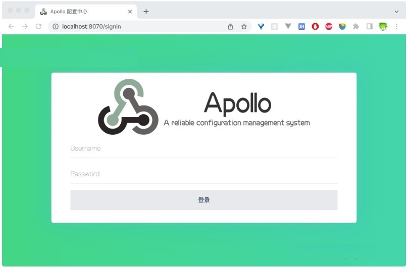

# Go操作Apollo

### 1.概述

Apollo（阿波罗）是携程开源的一款可靠的分布式配置管理中心，它能够集中化管理应用不同环境、不同集群的配置，配置修改后能够实时推送到应用端，并且具备规范的权限、流程治理等特性，适用于微服务配置管理场景。

### 2.环境搭建

Apollo 官方提供了一个方便学习使用的[docker-quick-start](https://link.zhihu.com/?target=https%3A//github.com/apolloconfig/apollo/tree/master/scripts/docker-quick-start)环境。我们只需要git clone 官方仓库，就可以在项目中的scripts目录下找到这个docker-quick-start文件夹。

```bash
git clone https://github.com/apolloconfig/apollo.git

cd apollo/scripts/docker-quick-start/
```

在docker-quick-start目录下执行下面的命令启动容器。

```bash
docker-compose up
```

等镜像下载完，容器启动之后，就可以访问本地的[http://localhost:8070](https://link.zhihu.com/?target=http%3A//localhost%3A8070/)查看Apollo管理后台了。



image.png

输入用户名apollo，密码admin后登录管理后台。


image.png

Apollo支持4个维度管理Key-Value格式的配置：

- application (应用)
- environment (环境)
- cluster (集群)
- namespace (命名空间)

十分推荐大家看一下官方的[Apollo使用指南](https://link.zhihu.com/?target=https%3A//www.apolloconfig.com/%23/zh/usage/apollo-user-guide)，文档读到位，必定事半功倍。

### 3.go接入Apollo（基本使用）

社区中有很多 [Go语言Apollo客户端](https://link.zhihu.com/?target=https%3A//www.apolloconfig.com/%23/zh/usage/third-party-sdks-user-guide%3Fid%3D_1-go)可供选择，本文以[https://github.com/philchia/agollo](https://link.zhihu.com/?target=https%3A//github.com/philchia/agollo)为例讲解如何使用Go语言接入Apollo获取配置。此外，也可以使用[https://github.com/shima-park/agollo](https://link.zhihu.com/?target=https%3A//github.com/shima-park/agollo)支持搭配 Viper 来使用。 **安装**

```bash
go get -u github.com/philchia/agollo/v4
```

**使用**

```go
package main

import (
  "fmt"
  "log"

  "github.com/philchia/agollo/v4"
)

func main() {
  agollo.Start(&agollo.Conf{
    AppID:           "SampleApp",
    Cluster:         "dev",
    NameSpaceNames:  []string{"application.properties", "shopping_cart.yaml"},
    MetaAddr:        "http://localhost:8080",
    AccesskeySecret: "b8ceb3ec62f34030b1b1fd9a431e420b",
  })

  agollo.OnUpdate(func(event *agollo.ChangeEvent) {
    // 监听配置变更
    log.Printf("event:%#v\n", event)
  })
  log.Println("初始化Apollo配置成功")

  // 从默认的application.properties命名空间获取key的值
  val := agollo.GetString("timeout")
  log.Println(val)
  // 获取命名空间下所有key
  keys := agollo.GetAllKeys(agollo.WithNamespace("shopping_cart.yaml"))
  fmt.Println(keys)
  // 获取指定一个命令空间下key的值
  other := agollo.GetString("content", agollo.WithNamespace("shopping_cart.yaml"))
  log.Println(other)
  // 获取指定命名空间下的所有内容
  namespaceContent := agollo.GetContent(agollo.WithNamespace("shopping_cart.yaml"))
  log.Println(namespaceContent)
}
```

### 4.实践

根据以下应用的key获取value值


image.png

示例代码：

```go
package main

import (
  "bytes"
  "fmt"
  "github.com/spf13/viper"
  "github.com/zouyx/agollo/v4"
  "github.com/zouyx/agollo/v4/env"
  "github.com/zouyx/agollo/v4/env/config"
)
var Conf  ApolloConfig

type ApolloConfig struct {
  Kimi string                `json:"kimi"`
  Zhaoxiaoxiong string        `json:"zhaoxiaoxiong"`
}


//apollo Client方法
func GetConfClient() *agollo.Client {

  c, err := env.InitConfig(nil)  //获取apollo连接信息，默认从app.propeorties读取
  if err != nil {
    panic(err)
  }
  client, err := agollo.StartWithConfig(
    func() (*config.AppConfig, error) {
      return c, nil
    })

  if err != nil {
    fmt.Println("err:", err)
    panic(err)
  }
  return client
}


//加载apollo配置
func LoadApolloConfig() *agollo.Client {
  client := GetConfClient()
  content := client.GetConfig("application").GetContent() //获取相关命名空间下的所有配置信息
  conf := viper.New()
  conf.SetConfigType("properties")
  err := conf.ReadConfig(bytes.NewBufferString(content))
  if err != nil {
    panic(fmt.Sprintf("viper加载配置文件错误: %s", err.Error()))
  }

  err = conf.Unmarshal(&Conf)
  if err != nil {
    panic(fmt.Sprintf("\"配置解析错误: %s", err))
  }


  return client
}


func InitOpsConfig() ApolloConfig {
  LoadApolloConfig()

  return Conf
}


func main() {
  data := InitOpsConfig()  //获取配置信息
  fmt.Println(data.Kimi,data.Zhaoxiaoxiong)
}
```

运行结果：

```bash
deman happy every day
```