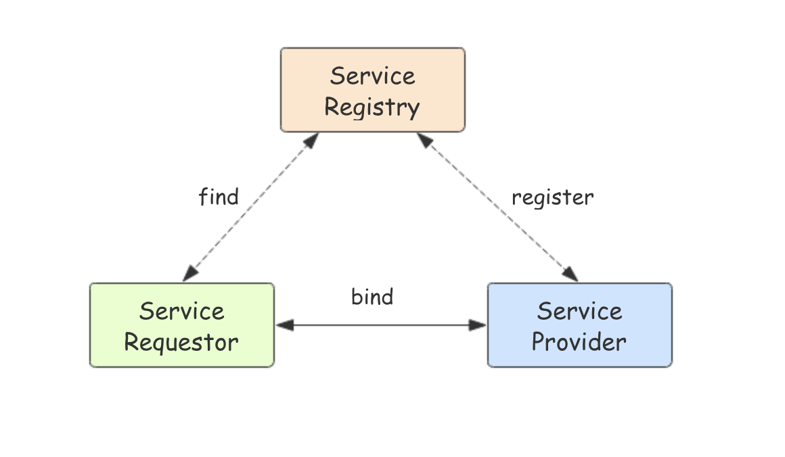
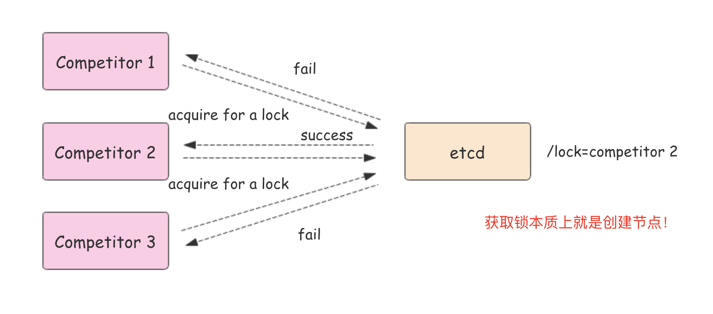

# 1. ETCD介绍

### 1.1.1. etcd介绍

etcd是使用Go语言开发的一个开源的、高可用的分布式key-value存储系统，可以用于配置共享和服务的注册和发现。

类似项目有zookeeper和consul。

etcd具有以下特点：

- 完全复制：集群中的每个节点都可以使用完整的存档
- 高可用性：Etcd可用于避免硬件的单点故障或网络问题
- 一致性：每次读取都会返回跨多主机的最新写入
- 简单：包括一个定义良好、面向用户的API（gRPC）
- 安全：实现了带有可选的客户端证书身份验证的自动化TLS
- 快速：每秒10000次写入的基准速度
- 可靠：使用Raft算法实现了强一致、高可用的服务存储目录

### 1.1.2. etcd应用场景

#### 服务发现

服务发现要解决的也是分布式系统中最常见的问题之一，即在同一个分布式集群中的进程或服务，要如何才能找到对方并建立连接。本质上来说，服务发现就是想要了解集群中是否有进程在监听 udp 或 tcp 端口，并且通过名字就可以查找和连接。

#### 配置中心

将一些配置信息放到 etcd 上进行集中管理。

这类场景的使用方式通常是这样：应用在启动的时候主动从 etcd 获取一次配置信息，同时，在 etcd 节点上注册一个 Watcher 并等待，以后每次配置有更新的时候，etcd 都会实时通知订阅者，以此达到获取最新配置信息的目的。

#### 分布式锁

因为 etcd 使用 Raft 算法保持了数据的强一致性，某次操作存储到集群中的值必然是全局一致的，所以很容易实现分布式锁。锁服务有两种使用方式，一是保持独占，二是控制时序。

- 保持独占即所有获取锁的用户最终只有一个可以得到。etcd 为此提供了一套实现分布式锁原子操作 CAS（CompareAndSwap）的 API。通过设置prevExist值，可以保证在多个节点同时去创建某个目录时，只有一个成功。而创建成功的用户就可以认为是获得了锁。
- 控制时序，即所有想要获得锁的用户都会被安排执行，但是获得锁的顺序也是全局唯一的，同时决定了执行顺序。etcd 为此也提供了一套 API（自动创建有序键），对一个目录建值时指定为POST动作，这样 etcd 会自动在目录下生成一个当前最大的值为键，存储这个新的值（客户端编号）。同时还可以使用 API 按顺序列出所有当前目录下的键值。此时这些键的值就是客户端的时序，而这些键中存储的值可以是代表客户端的编号。

### 1.1.3. 为什么用 etcd 而不用ZooKeeper？

etcd 实现的这些功能，ZooKeeper都能实现。那么为什么要用 etcd 而非直接使用ZooKeeper呢？

### 1.1.4. 为什么不选择ZooKeeper？

- 部署维护复杂，其使用的Paxos强一致性算法复杂难懂。官方只提供了Java和C两种语言的接口。
- 使用Java编写引入大量的依赖。运维人员维护起来比较麻烦。
- 最近几年发展缓慢，不如etcd和consul等后起之秀。

### 1.1.5. 为什么选择etcd？

- 简单。使用 Go 语言编写部署简单；支持HTTP/JSON API,使用简单；使用 Raft 算法保证强一致性让用户易于理解。
- etcd 默认数据一更新就进行持久化。
- etcd 支持 SSL 客户端安全认证。

最后，etcd 作为一个年轻的项目，正在高速迭代和开发中，这既是一个优点，也是一个缺点。优点是它的未来具有无限的可能性，缺点是无法得到大项目长时间使用的检验。然而，目前 CoreOS、Kubernetes和CloudFoundry等知名项目均在生产环境中使用了etcd，所以总的来说，etcd值得你去尝试。

### 1.1.6. etcd集群

etcd 作为一个高可用键值存储系统，天生就是为集群化而设计的。由于 Raft 算法在做决策时需要多数节点的投票，所以 etcd 一般部署集群推荐奇数个节点，推荐的数量为 3、5 或者 7 个节点构成一个集群。

### 1.1.7. 搭建一个ETCD集群示例

参考 [部署一套完整的Kubernetes高可用集群](https://docs.wsh-study.com/Kubernetes%E5%BC%80%E5%8F%91%E6%8A%80%E6%9C%AF/Kubernetes%E9%83%A8%E7%BD%B2/%E9%83%A8%E7%BD%B2%E4%B8%80%E5%A5%97%E5%AE%8C%E6%95%B4%E7%9A%84Kubernetes%E9%AB%98%E5%8F%AF%E7%94%A8%E9%9B%86%E7%BE%A4/) 第二节