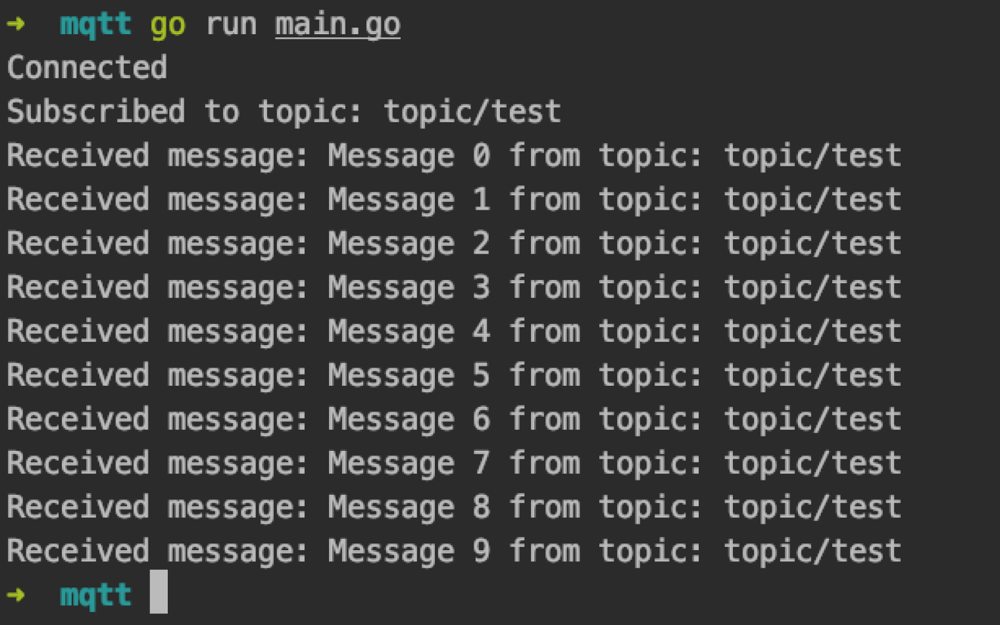

# MQTT编程

[MQTT](https://mqtt.org/) 是一种基于发布/订阅模式的 **轻量级物联网消息传输协议** ，可以用极少的代码和带宽为联网设备提供实时可靠的消息服务，它广泛应用于物联网、移动互联网、智能硬件、[车联网](https://www.emqx.com/zh/blog/category/internet-of-vehicles)、电力能源等行业。

本文主要介绍如何在 Golang 项目中使用 **paho.mqtt.golang** 客户端库 ，实现 [MQTT 客户端](https://www.emqx.com/zh/mqtt-client-sdk)与服务器的连接、订阅、收发消息等功能。

## 项目初始化

本项目基于 `go1.13.12` 进行开发测试

```vim
go version
go version go1.13.12 darwin/amd64
```

本项目使用 [paho.mqtt.golang](https://github.com/eclipse/paho.mqtt.golang) 作为 MQTT 客户端库，安装：

```vim
go get github.com/eclipse/paho.mqtt.golang
```

## Go MQTT 使用

本文将使用 EMQX 提供的 [免费公共 MQTT 服务器](https://www.emqx.com/zh/mqtt/public-mqtt5-broker)，该服务基于 EMQX 的 [MQTT 物联网云平台](https://www.emqx.com/zh/cloud) 创建。服务器接入信息如下：

- Broker: **broker.emqx.io**
- TCP Port: **1883**
- Websocket Port: **8083**

### 连接 MQTT 服务器

```go
package main

import (
    "fmt"
    mqtt "github.com/eclipse/paho.mqtt.golang"
    "time"
)

var messagePubHandler mqtt.MessageHandler = func(client mqtt.Client, msg mqtt.Message) {
    fmt.Printf("Received message: %s from topic: %s\n", msg.Payload(), msg.Topic())
}

var connectHandler mqtt.OnConnectHandler = func(client mqtt.Client) {
    fmt.Println("Connected")
}

var connectLostHandler mqtt.ConnectionLostHandler = func(client mqtt.Client, err error) {
    fmt.Printf("Connect lost: %v", err)
}

func main() {
    var broker = "broker.emqx.io"
    var port = 1883
    opts := mqtt.NewClientOptions()
    opts.AddBroker(fmt.Sprintf("tcp://%s:%d", broker, port))
    opts.SetClientID("go_mqtt_client")
    opts.SetUsername("emqx")
    opts.SetPassword("public")
    opts.SetDefaultPublishHandler(messagePubHandler)
    opts.OnConnect = connectHandler
    opts.OnConnectionLost = connectLostHandler
    client := mqtt.NewClient(opts)
    if token := client.Connect(); token.Wait() && token.Error() != nil {
        panic(token.Error())
  }
}
```

- ClientOptions：用于设置 broker，端口，客户端 id ，用户名密码等选项
- messagePubHandler：全局 MQTT pub 消息处理
- connectHandler：连接的回调
- connectLostHandler：连接丢失的回调

如果想使用 TLS 连接，可以如下设置：

```go
func NewTlsConfig() *tls.Config {
    certpool := x509.NewCertPool()
    ca, err := ioutil.ReadFile("ca.pem")
    if err != nil {
        log.Fatalln(err.Error())
    }
    certpool.AppendCertsFromPEM(ca)
    // Import client certificate/key pair
    clientKeyPair, err := tls.LoadX509KeyPair("client-crt.pem", "client-key.pem")
    if err != nil {
        panic(err)
    }
    return &tls.Config{
        RootCAs: certpool,
        ClientAuth: tls.NoClientCert,
        ClientCAs: nil,
        InsecureSkipVerify: true,
        Certificates: []tls.Certificate{clientKeyPair},
    }
}
```

如果不设置客户端证书，可以如下设置：

```stata
func NewTlsConfig() *tls.Config {
    certpool := x509.NewCertPool()
    ca, err := ioutil.ReadFile("ca.pem")
    if err != nil {
        log.Fatalln(err.Error())
    }
    certpool.AppendCertsFromPEM(ca)
    return &tls.Config{
        RootCAs: certpool,
}
```

然后设置 TLS

```stylus
var broker = "broker.emqx.io"
var port = 8883
opts := mqtt.NewClientOptions()
opts.AddBroker(fmt.Sprintf("ssl://%s:%d", broker, port))
tlsConfig := NewTlsConfig()
opts.SetTLSConfig(tlsConfig)
// other options
```

### 订阅

```perl
func sub(client mqtt.Client) {
    topic := "topic/test"
    token := client.Subscribe(topic, 1, nil)
    token.Wait()
    fmt.Printf("Subscribed to topic %s", topic)
}
```

### 发布消息

```css
func publish(client mqtt.Client) {
    num := 10
    for i := 0; i < num; i++ {
        text := fmt.Sprintf("Message %d", i)
        token := client.Publish("topic/test", 0, false, text)
        token.Wait()
        time.Sleep(time.Second)
    }
}
```

### 测试

我们使用以下代码进行测试

```go
package main

import (
    "fmt"
    mqtt "github.com/eclipse/paho.mqtt.golang"
    "log"
    "time"
)

var messagePubHandler mqtt.MessageHandler = func(client mqtt.Client, msg mqtt.Message) {
    fmt.Printf("Received message: %s from topic: %s\n", msg.Payload(), msg.Topic())
}

var connectHandler mqtt.OnConnectHandler = func(client mqtt.Client) {
    fmt.Println("Connected")
}

var connectLostHandler mqtt.ConnectionLostHandler = func(client mqtt.Client, err error) {
    fmt.Printf("Connect lost: %v", err)
}

func main() {
    var broker = "broker.emqx.io"
    var port = 1883
    opts := mqtt.NewClientOptions()
    opts.AddBroker(fmt.Sprintf("tcp://%s:%d", broker, port))
    opts.SetClientID("go_mqtt_client")
    opts.SetUsername("emqx")
    opts.SetPassword("public")
    opts.SetDefaultPublishHandler(messagePubHandler)
    opts.OnConnect = connectHandler
    opts.OnConnectionLost = connectLostHandler
    client := mqtt.NewClient(opts)
    if token := client.Connect(); token.Wait() && token.Error() != nil {
        panic(token.Error())
    }

    sub(client)
    publish(client)

    client.Disconnect(250)
}

func publish(client mqtt.Client) {
    num := 10
    for i := 0; i < num; i++ {
        text := fmt.Sprintf("Message %d", i)
        token := client.Publish("topic/test", 0, false, text)
        token.Wait()
        time.Sleep(time.Second)
    }
}

func sub(client mqtt.Client) {
    topic := "topic/test"
    token := client.Subscribe(topic, 1, nil)
    token.Wait()
  fmt.Printf("Subscribed to topic: %s", topic)
}
```

运行代码，可以看到 MQTT 连接、订阅成功，并能成功收到订阅 topic 的消息

