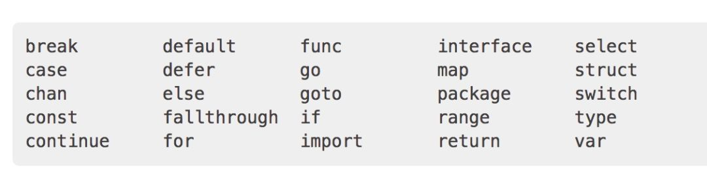

1.下面属于关键字的是`（）`

- `A.func`
- `B.struct`
- `C.class`
- `D.defer`

2.下面这段代码输出什么？

```go
func main() {  
    i := -5
    j := +5
    fmt.Printf("%+d %+d", i, j)
}
```

- `A. -5 +5`
- `B. +5 +5`
- `C. 0  0`

3.下面这段代码输出什么？

```go
type People struct{}

func (p *People) ShowA() {
    fmt.Println("showA")
    p.ShowB()
}
func (p *People) ShowB() {
    fmt.Println("showB")
}

type Teacher struct {
    People
}

func (t *Teacher) ShowB() {
    fmt.Println("teacher showB")
}

func main() {
    t := Teacher{}
    t.ShowB()
}
```

1. 参考答案及解析：`ABD`。知识点：`Go `语言的关键字。`Go `语言有 `25 `个关键字，看下图：



2. 参考答案及解析：`A`。`%d`表示输出十进制数字，`+`表示输出数值的符号。这里不表示取反。

3. 参考答案及解析：`teacher showB`。知识点：结构体嵌套。在嵌套结构体中，`People `称为内部类型，`Teacher `称为外部类型；通过嵌套，内部类型的属性、方法，可以为外部类型所有，就好像是外部类型自己的一样。此外，外部类型还可以定义自己的属性和方法，甚至可以定义与内部相同的方法，这样内部类型的方法就会被“屏蔽”。这个例子中的` ShowB() `就是同名方法。