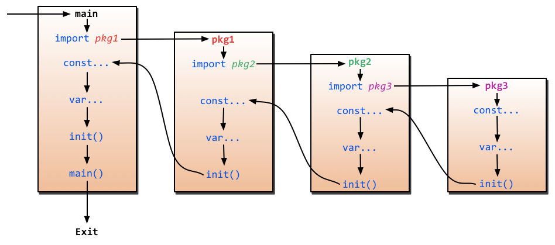

1.关于`init`函数，下面说法正确的是()

- `A. 一个包中，可以包含多个 init 函数；`
- `B. 程序编译时，先执行依赖包的 init 函数，再执行 main 包内的 init 函数；`
- `C. main 包中，不能有 init 函数；`
- `D. init 函数可以被其他函数调用；`

2.下面这段代码输出什么以及原因？

```go
 func hello() []string {  
     return nil
 }
 
 func main() {  
     h := hello
     if h == nil {
         fmt.Println("nil")
     } else {
        fmt.Println("not nil")
    }
}
```

- `A. nil`
- `B. not nil`
- `C. compilation error  `

3.下面这段代码能否编译通过？如果可以，输出什么？

```go
 func GetValue() int {
     return 1
 }
 
 func main() {
     i := GetValue()
     switch i.(type) {
     case int:
         println("int")
    case string:
        println("string")
    case interface{}:
        println("interface")
    default:
        println("unknown")
    }
}
```

1.参考答案及解析：`AB`。关于 `init()` 函数有几个需要注意的地方：

1. `init() `函数是用于程序执行前做包的初始化的函数，比如初始化包里的变量等;
2. 一个包可以出线多个` init() `函数,一个源文件也可以包含多个 `init() `函数；
3. 同一个包中多个` init() `函数的执行顺序没有明确定义， **但是不同包的`init`函数是根据包导入的依赖关系决定的** （看下图）;
4. `init()` 函数在代码中不能被显示调用、不能被引用（赋值给函数变量），否则出现编译错误;
5. 一个包被引用多次，如 `A import B`,`C import B`,`A import C`，`B `被引用多次，但 `B `包只会初始化一次；
6. 引入包，不可出现死循坏。即` A import B,B import A`，这种情况编译失败；

