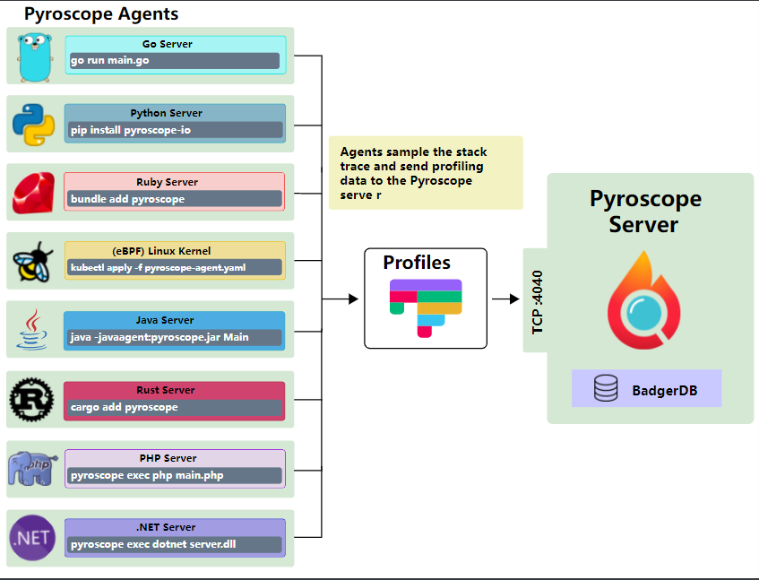

# pyroscope性能分析

## 背景

当服务上线后，流量增加或短暂功能故障，都会造成用户体验变差，而这时怎样才能快速找到性能瓶颈呢？这次将会介绍一套实时性能分析工具——[pyroscope](https://pyroscope.io/)，让开发者可以快速定位到造成性能瓶颈的代码，而且目前还支持在 Python、Rust 或 Go 的环境。下面将主要针对 Go 环境做介绍。

## 什么是 Pyroscope ？

`Pyroscope` 是一套开源的实时性能监控平台，简单的 `Agent-Server `框架，让开发者可以轻松监控服务的性能，不管是要找`10`秒还或是多年的性能数据，都可以快速的实时呈现。由于采样分析技术，`CPU` 开销较低，开发者用不用在意安装此监控会不会造成任何性能上的负担。`Pyroscope`后台使用的存储采用[Badger](https://github.com/dgraph-io/badger)这套`Key-Value`数据库，能高效的压缩，降低的磁盘空间需求和成本。支持多种语言：`Go`, `Python`, `Rust`, `Java` 等，支持多平台，多种部署方式。假设还没有导入任何新能分析工具或或平台，那`Pyroscope`会是最佳的选择。

## Pyroscope 框架



`Pyroscope`框架只分为`Server`和`Agent`而已，可以参考以上架构图，除了`GO`语言之外，`Python`、`Ruby`都是通过`pyroscope`命令启动相关`APP`来监控系统性能的。

## 启动 Pyroscope Server

除了直接安装部署在本机或服务器上，还可以通过`docker`、`k8s`进行安装部署。

```go
# MacOs
brew install pyroscope-io/brew/pyroscope
brew services start pyroscope-server

# Ubuntu/Debian
wget https://dl.pyroscope.io/release/pyroscope_"${pyroscope_version}"_amd64.deb
sudo apt-get install ./pyroscope_"${pyroscope_version}"_amd64.deb

# CentOS
wget https://dl.pyroscope.io/release/pyroscope-"${pyroscope_version}"-1-x86_64.rpm
sudo yum localinstall pyroscope-"${pyroscope_version}"-1-x86_64.rpm

# Use systemctl to enable boot start and start the service
sudo systemctl enable pyroscope-server
sudo systemctl start pyroscope-server
```

以`docker`为例，安装部署方式有两种，第一种直接用`docker`指令部署：

```go
docker run -it -p 4040:4040 pyroscope/pyroscope:latest server
```

但像这样部署的话，许多配置不能使用的，比如数据页面直接展示不需要登录，也不能限制`API`上报（允许某些机器通过`Key`来限制上报），容器销毁后监控数据会丢失。
另一种方式是通过`docker-compose`启动，首先配置`docker-compose.yaml`内容如下：

```go
version: "3"
services:
  pyroscope:
    image: "pyroscope/pyroscope:latest"
    ports:
      - "4040:4040"
    command:
      - "server"
    environment:
      ## 限制必须使用 API 秘钥上传
      - PYROSCOPE_AUTH_INGESTION_ENABLED=true
      ## 设置账号密码登录后台
      - PYROSCOPE_AUTH_INTERNAL_ENABLED=true
    volumes:
      ## 设置数据共享目录
      - $PWD/data:/var/lib/pyroscope
```

配置好后，在当前目录下创建`data`目录保存监控数据:

```go
mkdir data
```

目录结构如下：

```go
.
├── data
└── docker-compose.yaml

1 directory, 1 file
```

然后输入以下命令拉起服务：

```go
docker-compose up -d
```

访问`http://127.0.0.1:4040`进入登录页面进行验证服务是否拉起成功。


通过登录页面输入默认账号密码（`admin`:`admin`）进入系统后可以自行修改账号密码。

然后添加密匙（设置->API Keys），需要注意的是`Role`必须选择`Agent`才可以正常上报数据。


## 在 Go 项目中使用 Agent

`Go`提供有两种模式，拉取(`pull`)模式类似`Prometheus`，个人更偏向推送(`push`)模式。

推送模式，首先在项目中添加依赖:

```go
import "github.com/pyroscope-io/pyroscope/pkg/agent/profiler"
```

接着在`main.go`中添加`Pyroscope`相关上报代码即可：

```go
package main

import (
	"github.com/pyroscope-io/pyroscope/pkg/agent/profiler"
)

func main() {
	profiler.Start(profiler.Config{
		// 项目名字, 只能英文不能中文
		ApplicationName: "go.pyroscope.example.app",
		// 按实际自己 pyroscope 服务的地址
		ServerAddress: "http://127.0.0.1:4040",
		// 如果开启了 PYROSCOPE_AUTH_INGESTION_ENABLED,
		// 按照以上步骤添加了 Key, 那么把 Key 放到此处即可
		AuthToken: "xxx", 
	})

	// your code goes here
}
```

最后放一张效果图：


### 字段解释

|    字段名     |                  含义                  |
| :-----------: | :------------------------------------: |
| inuse_objects |       已分配但尚未释放的对象数量       |
| alloc_objects |  已分配的对象总数（无论已释放的对象）  |
|  inuse_space  |       已分配但尚未释放的内存数量       |
|  alloc_space  | 分配的内存总量（无论已释放了多少内存） |

## 总结

这套工具相当方便，在`Go`语言虽然可以使用`pprof`快速找到问题，但是难免还是需要手动操作的步骤才能查找出性能瓶颈。有了这套平台，就可以将全部的`App`都进行监控，当出现任何问题时，就可以快速通过`Pyroscope`查看是哪里的代码出了问题。