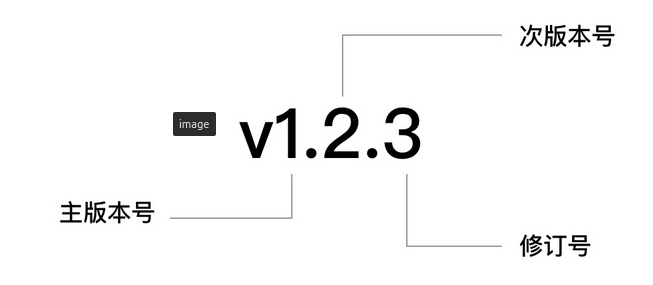
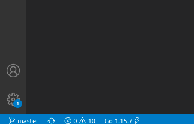

# 模块管理

## 参考文档

1. [https://goproxy.cn/](https://goproxy.cn/)
2. [Go Modules 终极入门](https://studygolang.com/articles/26836)
3. [解决 go get 访问私有仓库的问题](https://blog.csdn.net/qq_32828933/article/details/108118905)
4. [Go填坑之将Private仓库用作module依赖](https://segmentfault.com/a/1190000021127791?utm_source=tag-newest)
5. [Go Modules 官方文档(需翻墙)](https://golang.org/ref/mod)
6. [Go Github 官方Wiki](https://github.com/golang/go/wiki/Modules)
7. [谈谈go.sum](http://www.zyiz.net/tech/detail-97723.html)

## 开启Go Modules

执行如下指令开启Go Modules并设置代理

```bash
go env -w GO111MODULE=on
go env -w GOPROXY=https://goproxy.cn,direct
```

Go Modules相关功能会涉及到如下两个文件：

1. go.mod：存储所有的依赖信息，放置在模块的根目录下，可以表明该目录是一个Go Modules模块仓库
2. go.sum：记录所依赖的项目的版本的锁定，保证团队内所有人的依赖包版本是统一，同时保证编译过程的一致性。[官方解释在这里](https://github.com/golang/go/wiki/Modules#should-i-commit-my-gosum-file-as-well-as-my-gomod-file)

> 注意事项：理论上 go.mod 和 go.sum 文件都应该提交到Git仓库中

## 初始化模块

```bash
# 模块名称可以根据自己的需求来填写
go mod init gitlab.wsh-study.com/Utils/Common
```

## 更新模块

当完成代码的编写之后可以通过调用如下命令来更新依赖

```bash
go mod tidy
```

## 引用私有仓库模块

如果其他高层模块想要引用Gitlab私有仓库的模块，例如：

```mod
module gitlab.wsh-study.com/Iot/DevOpsService

go 1.15

require (
    gitlab.wsh-study.com/Utils/Common v0.1.0-20210127
)
```

需要进行如下设置

```bash
go env -w GOPRIVATE=gitlab.wsh-study.com
```

!!! note "注意事项"
    **如果GOPRIVATE设置完毕之后，仍然出现 "unrecognized import path" 或者 "connection refused" 的错误，则进行如下设置 go env -w GOINSECURE=gitlab.wsh-study.com 则可以解决问题**

## 引用模块

### 指定分支

#### 场景1 本地修改代码已经提交推送到远端

1. 将 go.mod 文件`require`中分支的标签信息替换成指定分支名。
   例如：假如需要将Tool仓库的分支由 `master` 分支切换到指定分支 `feature/调整阿里云日志上传流程`
   将已有的 **`gitlab.wsh-study.com/Device/Tool v0.0.0-20210414054903-d368e8de4644`**
   替换成
    **`gitlab.wsh-study.com/Device/Tool feature/调整阿里云日志上传流程`**

2. 执行 `go mod tidy` 更新相关依赖库。

    如果出现错误，可以先使用 `go clean --modcache` 清除 go mod 缓存文件，再使用`go mod tidy` 更新依赖库

  > GO111MODULE=on 开启以后，下载的模块内容会缓存在 `$GOPATH/pkg/mod` 目录中，可以使用命令 `go clean --modcache` 清空 go mod 缓存文件

#### 场景2 本地修改代码还未提交推送到远端

1. 将 go.mod 文件 `replace` 中相关分支重定向到本地分支。
   例如：将Tool仓库重定向到本地Tool分支（本地分支的代码已经修改，还未推送到远端）

    ```bash
    gitlab.wsh-study.com/Device/Tool => ../Tool
    ```

2. 编译相关代码进行测试

## 模块版本管理

Go Modules是使用Github或Gitlab的标签功能来做版本管理，但是`go get`和`go mod`相关命令对版本号有严格规定，只能使用标准的"语义化版本号"



其版本格式为"主版本号.次版本号.修订号"，版本号的递增规则如下：

1. 主版本号：当你做了不兼容的 API 修改
2. 次版本号：当你做了向下兼容的功能性新增
3. 修订号：当你做了向下兼容的问题修正

假设你是先行版本号或特殊情况，可以将版本信息追加到“主版本号.次版本号.修订号”的后面作为延伸(中间必须加短横线)，如下：


!!! note "注意事项"
    **我们介绍了 Go modules 所支持的两类版本号方式，在我们发布新版本打 tag 的时候，需要注意遵循，否则不遵循语义化版本规则的版本号无法进行拉取**

## 将一个现有工程转换为Go Modules工程

```bash
# 模块名称可以根据自己的需求来填写
go mod init gitlab.wsh-study.com/Utils/Common

go mod tidy
```

## 更新VS Code插件

为了支持Go Modules，需要将VS Code的Go语言插件至少升级到 `0.23.0`版本，这个版本默认开启了 Gopls 语言服务器功能。更新完成后 VS Code 的左下角如下图所示

