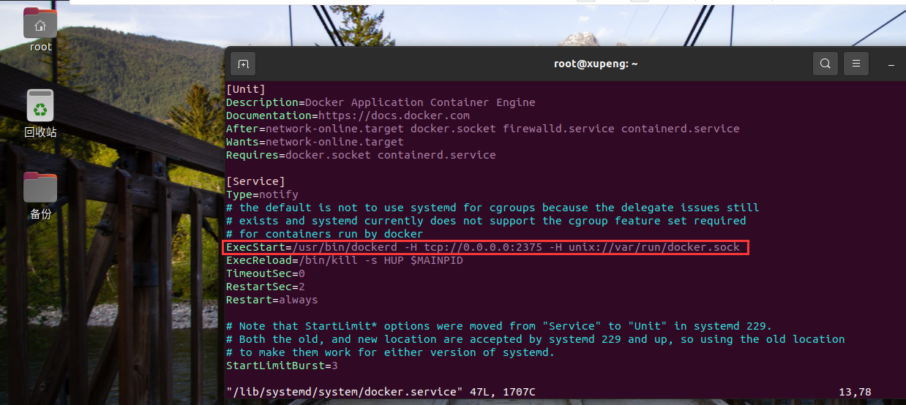
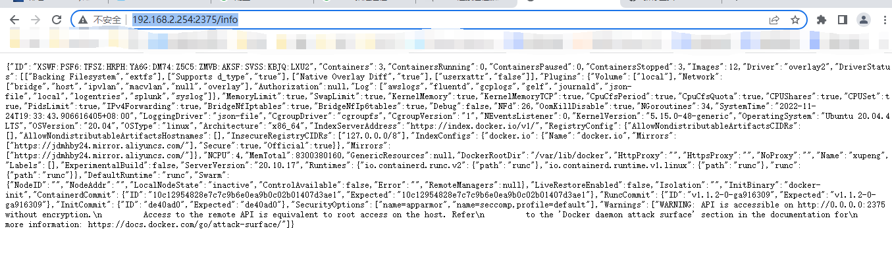
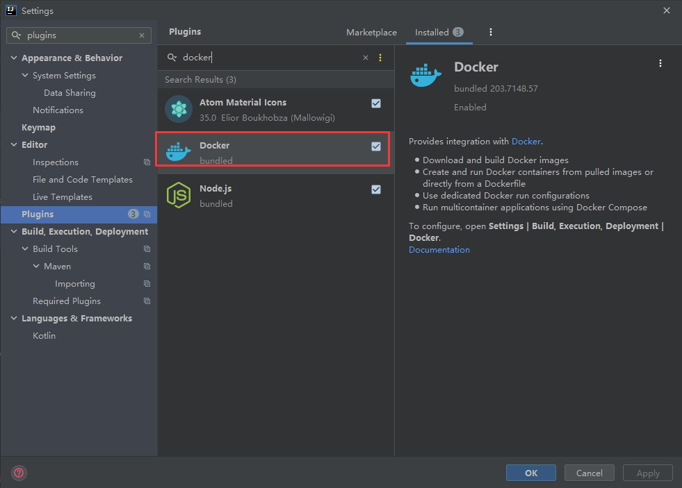
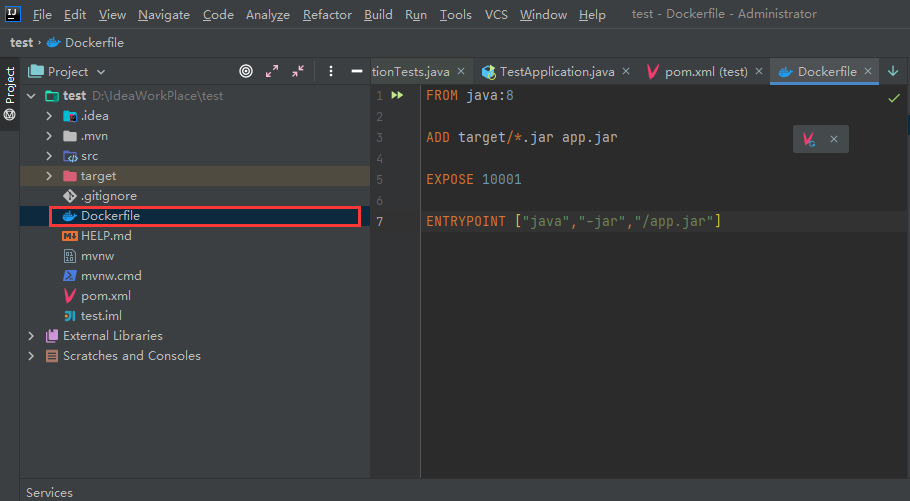
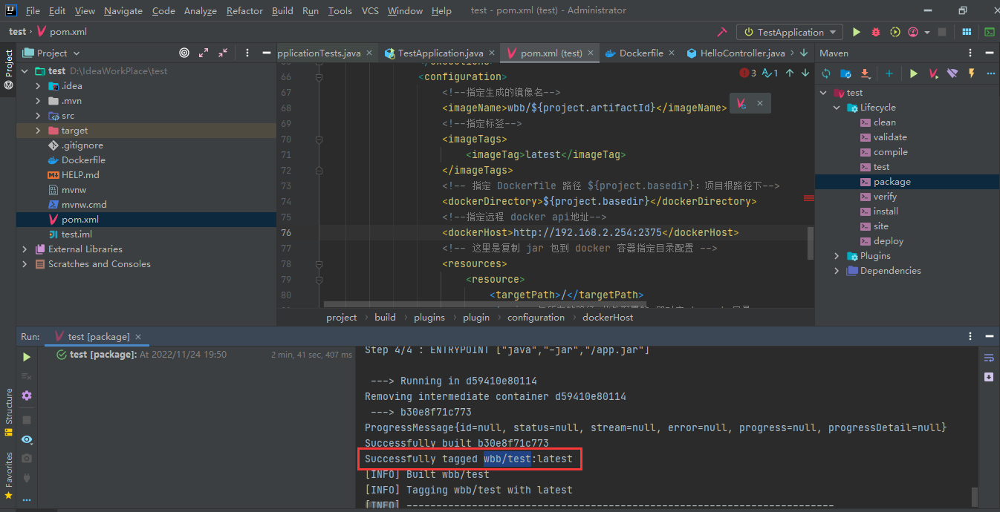
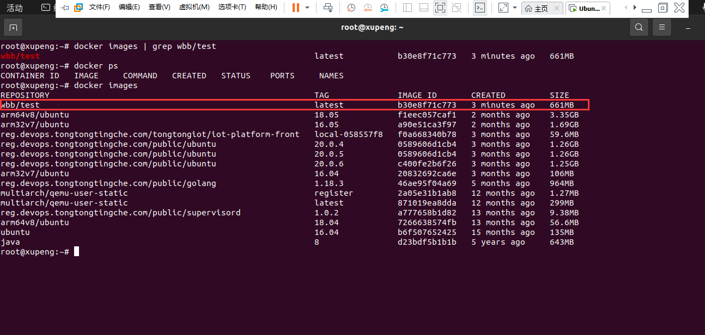
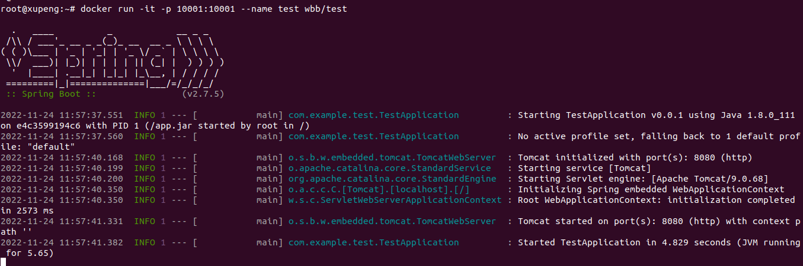
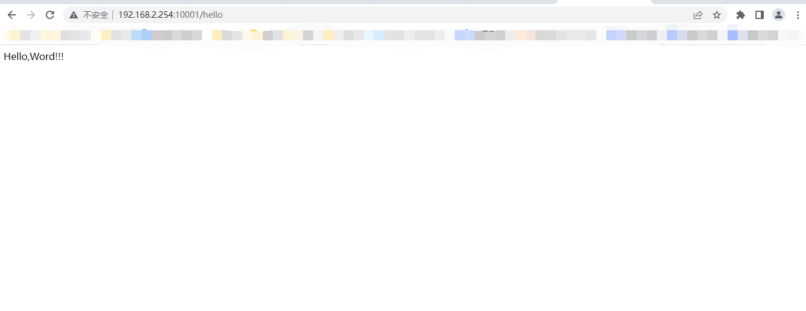

# IDEA连接远程服务器Docker部署Spring Boot项目

### 开始前的准备工作

本文档使用的远程Docker是本地虚拟机Ubuntu20.04众的Docker，Docker版本为 `20.10.17`

### 正式开始工作

第一步：配置Docker，开启远程访问（注：仅供学习参考，实际生产环境万万不可，会产生很大的安全风险），默认端口是2375，也可以修改为其他端口

1、修改/lib/systemd/system/docker.service文件

```shell
vim /lib/systemd/system/docker.service
```

在`ExecStart`后面追加 `-H tcp://0.0.0.0:2375 -H unix://var/run/docker.sock`



修改完记得写保存退出命令 :wq

2、重新加载配置文件，重启docker，使得刚才的配置生效

```shell
#重新加载配置文件
systemctl daemon-reload
#重启docker服务
systemctl restart docker
```

3、使用curl命令检查是否开启

```shell
#curl下载docker的服务信息
curl http://127.0.0.1:2375/info
```

如果有返回说明，就证明开启成功了，可以看到我的Docker版本，镜像加速器地址等其他信息


5、检查端口是否可以远程访问，在本地浏览器输入：http://虚拟机:2375/info



 第二步：对项目进行配置，连接远程docker

1、安装Docker插件，去Plugins搜索Docker，然后直接安装就行了，如果，这是我已经安装过的，安装完成后重启IDEA，就有docker插件了



2、配置连接远程docker，打开Docker插件，新建连接，在Engine API URL处输入服务器IP地址:2375，然后，不出意外，下方都会出现Connection successful，这样连接远程服务器的Docker就成功了


3、编辑项目pom.xml文件，在Spring Boot项目中添加`docker-maven-plugin`插件

```json
<plugin>
                <groupId>com.spotify</groupId>
                <artifactId>docker-maven-plugin</artifactId>
                <version>1.0.0</version>
                <!--将插件绑定在某个phase执行-->
                <executions>
                    <execution>
                        <id>build-image</id>
                        <!--将插件绑定在package这个phase上。也就是说，用户只需执行mvn package ，就会自动执行mvn docker:build-->
                        <phase>package</phase>
                        <goals>
                            <goal>build</goal>
                        </goals>
                    </execution>
                </executions>
                <configuration>
                    <!--指定生成的镜像名-->
                    <imageName>wbb/${project.artifactId}</imageName>
                    <!--指定标签-->
                    <imageTags>
                        <imageTag>latest</imageTag>
                    </imageTags>
                    <!-- 指定 Dockerfile 路径 ${project.basedir}：项目根路径下-->
                    <dockerDirectory>${project.basedir}</dockerDirectory>
                    <!--指定远程 docker api地址-->
                    <dockerHost>http://192.168.2.254:2375</dockerHost>
                    <!-- 这里是复制 jar 包到 docker 容器指定目录配置 -->
                    <resources>
                        <resource>
                            <targetPath>/</targetPath>
                            <!--jar 包所在的路径 此处配置的 即对应 target 目录-->
                            <directory>${project.build.directory}</directory>
                            <!-- 需要包含的 jar包 ，这里对应的是 Dockerfile中添加的文件名　-->
                            <include>${project.build.finalName}.jar</include>
                        </resource>
                    </resources>
                    <!-- 以下两行是为了docker push到DockerHub使用的。 -->
                    <!--<serverId>docker-hub</serverId>-->
                    <!--<registryUrl>https://index.docker.io/v1</registryUrl>-->
                </configuration>
            </plugin>
```

4、在项目根目录下创建Dockerfile文件



Dockerfile文件内容

```shell
FROM java:8

ADD target/*.jar app.jar

EXPOSE 10001

ENTRYPOINT ["java","-jar","/app.jar"]
```

这个Dockerfile文件的内容大概是：

第一行：当前要创建的镜像是基于java:8这个镜像的，也就是JDK8，也就是基本的Java运行开发环境肯定要有，这个也可以提前docker pull

第二行：在构建的时候把target目录下的jar包添加到镜像中，并改名为app.jar

第三行：镜像对外开放的端口是8888，这个在后面进行端口映射的时候还要用，一定要记住，当然，没记住，也可以使用docker history命令去看

第四行：启动镜像实例容器时会自动执行：java -jar /app.jar命令，也就是启动容器时，就启动了项目，而且不会被启动容器时添加的命令参数覆盖

另外其他没指定的参数，就是默认的，比如登录容器时默认的路径是根目录

5、打包项目，同时会自动构建镜像，点击右侧的Maven Projects，然后双击package


看到如果的信息就表示构建成功了，现在就可以去虚拟机查看构建的镜像了



第三步：启动镜像实例容器，远程访问项目，接下来的步骤可以在IDEA中直接进行，也可以在虚拟机上进行



如图所示，刚刚构建的镜像wbb/shop镜像已经存在了

2、启动容器：docker run -it -p 10001:10001--name shop wbb/shop



4、远程访问项目：http://192.168.2.254:1001/hello



5、将镜像推送到harbor需要做如下修改:

* maven增加如下配置

  ```shell
      <server>
    	 	<id>docker-harbor-registry</id>
       	    <username>admin</username>
      	    <password>admin123</password>
      </server>
  ```

* `docker-maven-plugin` 插件增加如下配置

```shell
        <serverId>docker-harbor-registry</serverId>
        <registryUrl>https://harbor.wsh-study.com</registryUrl>
        <pushImage>true</pushImage>
```

