# 使用IDEA创建第一个SpringBoot程序(maven)

打开idea，新建一个项目，右面选择 `Spring lnitializr` 配置各项参数，点击下一步

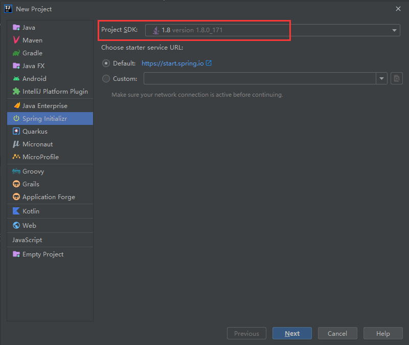

### 选择工程类型和java版本

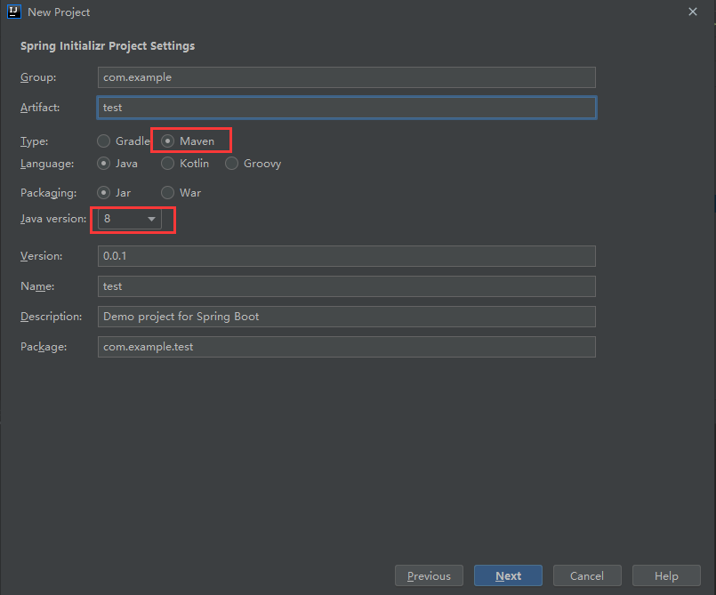

### 选择依赖

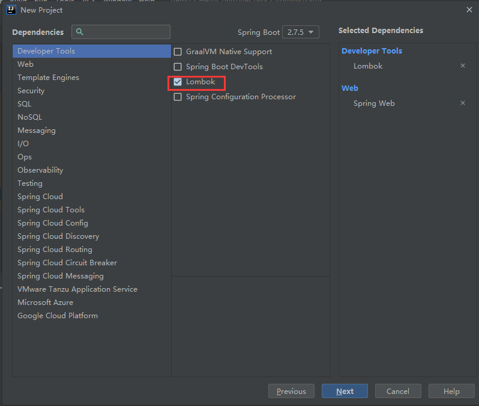

Spring Boot 版本默认即可，依次在依赖项中添加以下依赖

```
Developer Tools` > `Lombok
Web` > `Spring Web 
```

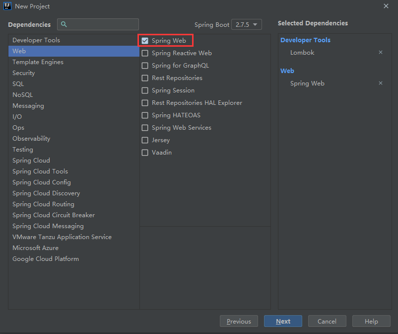

添加之后点击完成

### 测试搭建环境

打开 `src > main > java > com.example.test` ，里面有一个 `SpringBootDemoApplication`文件

这个文件其实可以直接运行，运行这个main入口，出现以下画面

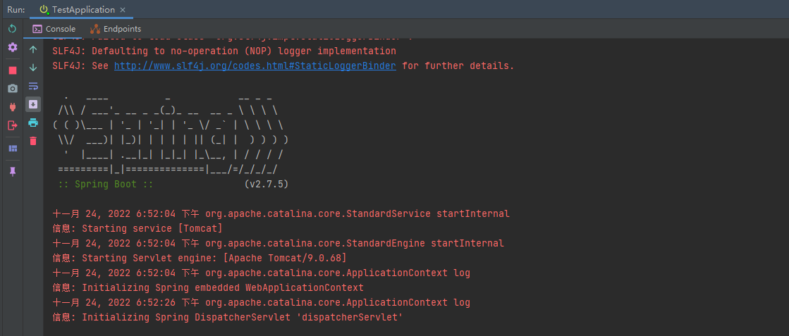

这时就可以访问 `http://127.0.0.1:8080/`（上图红框标出来的，告诉我们Tomcat服务在8080端口上启动了，所以我们访问8080端口）查看我们的项目是否成功，出现下图就代表成功

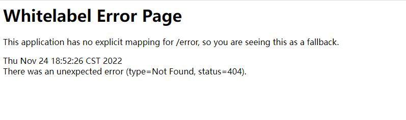

### 编写一个简单的Spring Boot程序

1.在 `SpringBootDemoApplication` 的同级目录建立一个名为 `controller` 的包

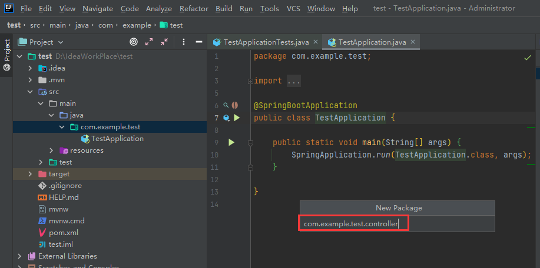

2.在 `controller`包下新建一个 `HelloController` 的类，然后在类上方写上,如下图：

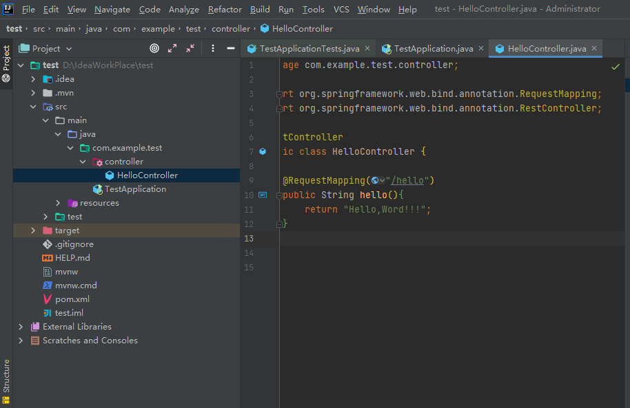

5.这时直接运行，访问`http://127.0.0.1:8080/hello `即可看到我们写的Hello，Word！！！（访问之后记得结束运行）

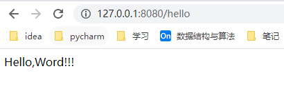

### 打包程序

打开右侧的Maven， 打开生命周期，双击package，就进入了打包，如果打包失败，请检查maven是否安装配置成功

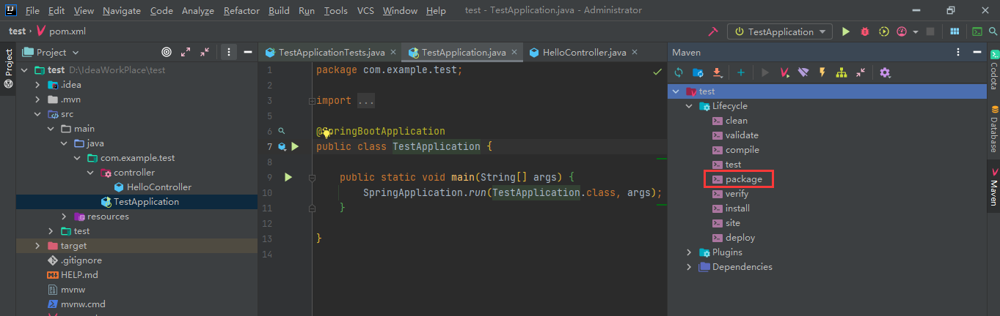

等待打包，出现 `BUILD SUCCESS`即打包成功

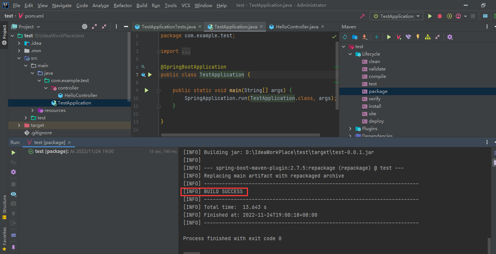

### 运行构建的包

构建成功的包在 `target`目录下，后缀名为 `jar`

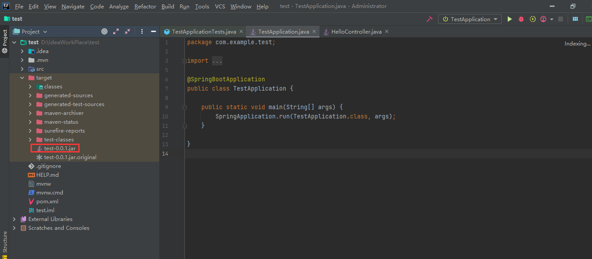

打开CMD，进入项目目录，运行jar包,然后在浏览器访问,可访问到如下页面:
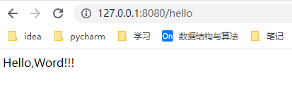