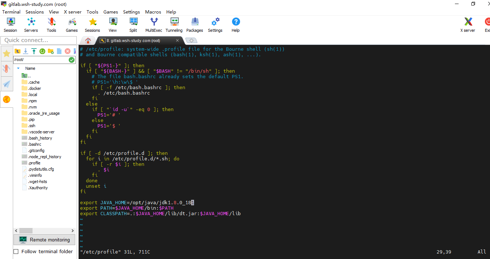
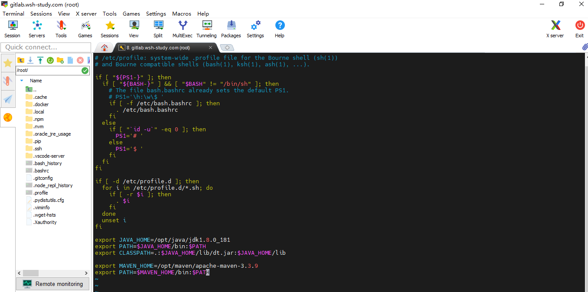
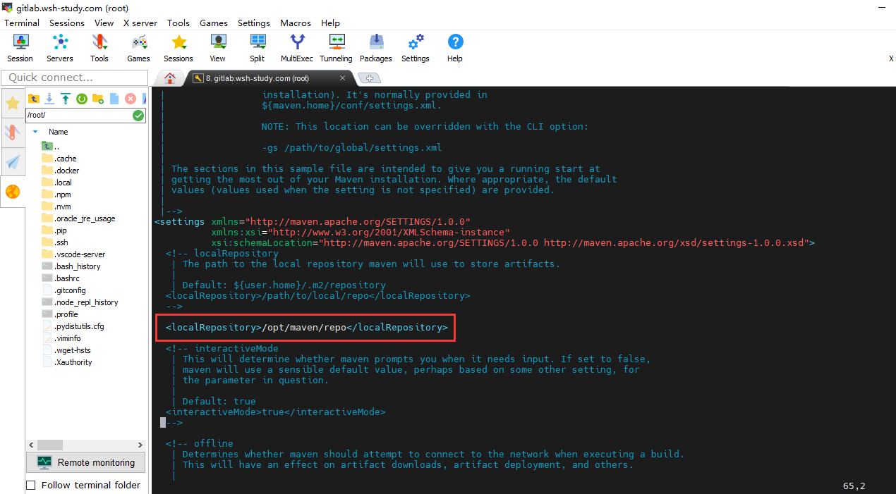
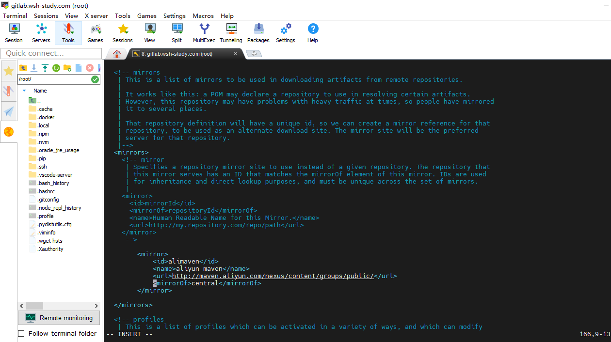

# Ubuntu20.04下配置Maven环境

### 1、下载maven包

```shell
wget http://mirrors.tuna.tsinghua.edu.cn/apache/maven/maven-3/3.3.9/binaries/apache-maven-3.3.9-bin.tar.gz
```

如果提示 `wget: 未找到命令`，请尝试如下指令安装 `wget`

```shell
apt-get install wget
```

### 2、解压下载的maven压缩包

```shell
tar -xzvf apache-maven-3.3.9-bin.tar.gz
```

- -x：从备份文件中还原文件
- -z：处理备份文件
- -v：显示指令执行过程
- -f：指定备份文件

### 3、配置系统maven环境

编辑系统环境文件`profile`，该文件类似于windows里的环境变量。

```shell
vim /etc/profile
```



> 注意，配置的变量，请指向自己解压的maven路径：



`:wq`，退出保存，然后重新加载一下配置：

```shell
source /etc/profile
```

查看maven版本，测试配置生效：

```shell
mvn -v
```

### 4、配置镜像加速+指定仓库地址

配置jar包下载路径，路径指向自己的。

```shell
<localRepository>/opt/maven/repo</localRepository>
```



配置阿里镜像加速，默认是从中央仓库拉取。

```shell
<mirrors>
 <mirror>
   <id>alimaven</id>
   <name>aliyun maven</name>
   <url>http://maven.aliyun.com/nexus/content/groups/public/</url>
   <mirrorOf>central</mirrorOf>        
 </mirror>
</mirrors>
```


`:wq`，退出保存。
