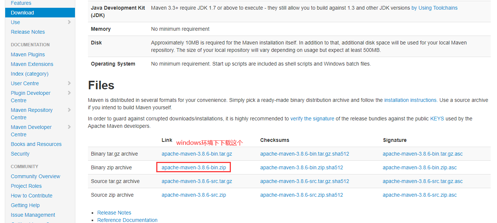
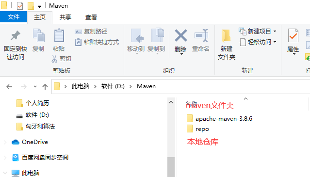
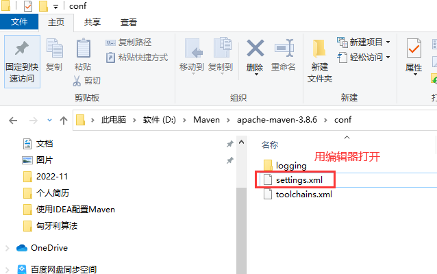
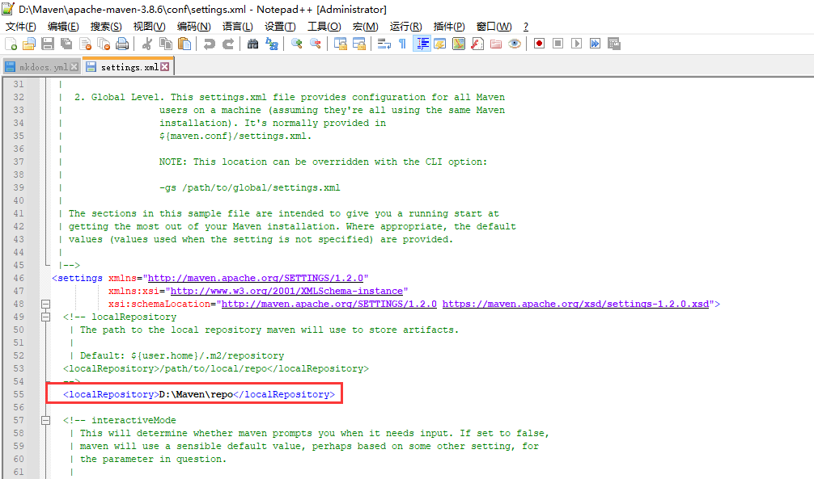
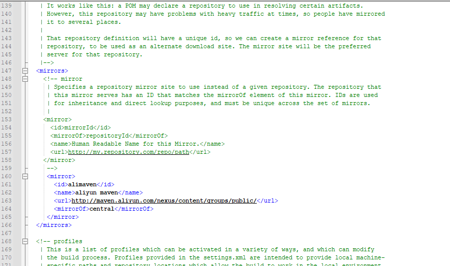
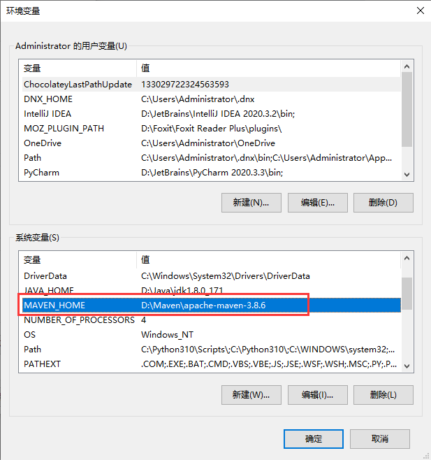
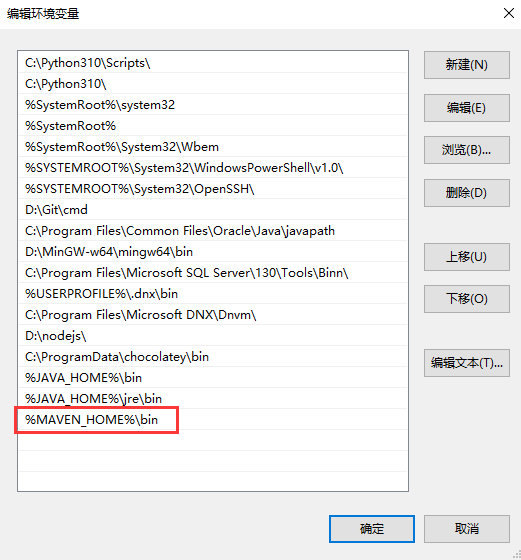
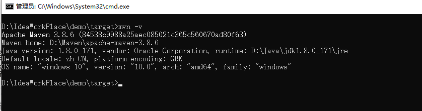
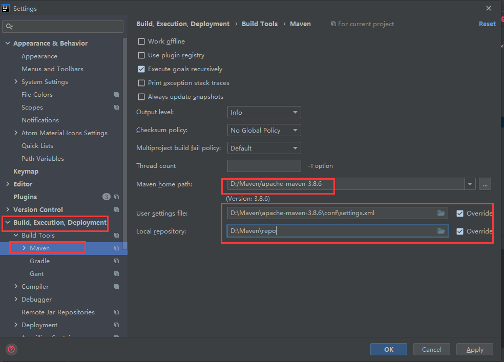

# 使用IntelliJ IDEA 配置Maven

**1. 下载Maven**

官方地址：`https://maven.apache.org/download.cgi` 



解压并新建一个本地仓库文件夹



**2.配置maven**

配置jar包下载路径，路径指向自己的。

```shell
<localRepository>/opt/maven/repo</localRepository>
```






配置阿里镜像加速，默认是从中央仓库拉取。

```shell
<mirrors>
 <mirror>
   <id>alimaven</id>
   <name>aliyun maven</name>
   <url>http://maven.aliyun.com/nexus/content/groups/public/</url>
   <mirrorOf>central</mirrorOf>        
 </mirror>
</mirrors>
```



**3.配置maven环境变量**







**4.在IntelliJ IDEA中配置maven**

打开-File-Settings，按照下图方式配置

