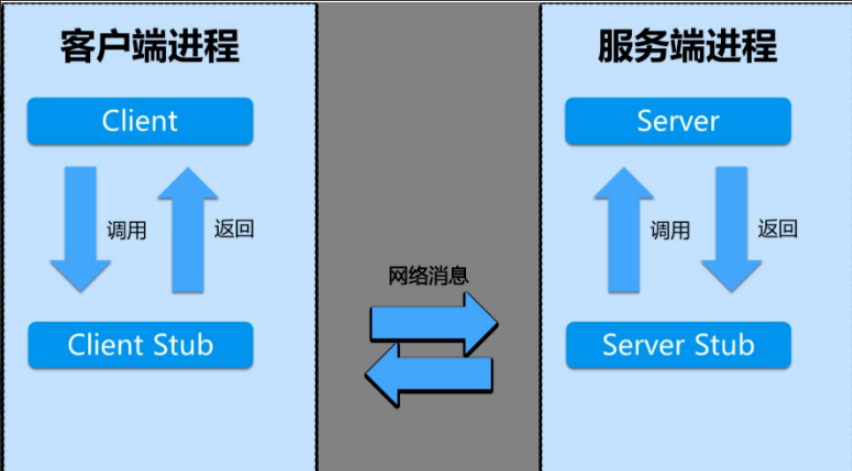

# HTTP和RPC的区别

>  HTTP接口和RPC接口都是生产上常用的接口，顾名思义，HTTP接口使用基于HTTP协议的URL传参调用，而RPC接口则基于远程过程调用。

**RPC（即Remote Procedure Call，远程过程调用）和HTTP（HyperText Transfer Protocol，超文本传输协议）**，两者前者是一种方法，后者则是一种协议。两者都常用于实现服务，在这个层面最本质的区别是RPC服务主要工作在TCP协议之上（也可以在HTTP协议），而HTTP服务工作在HTTP协议之上。由于HTTP协议基于TCP协议，所以RPC服务天然比HTTP更轻量，效率更胜一筹。

两者都是基于网络实现的，从这一点上，都是基于**Client/Server架构**。

### RPC（Remote Procedure Call）服务

RPC服务基本架构包含了四个核心的组件，分别是`Client`,`Server`,`Clent Stub`以及`Server Stub`。



 **Client （客户端）**：服务调用方。

 **Server（服务端）**：服务提供方。

 **Client Stub（客户端存根）**：存放服务端的地址消息，负责将客户端的请求参数打包成网络消息，然后通过网络发送给服务提供方。 

**Server Stub（服务端存根）**：接收客户端发送的消息，再将客户端请求参数打包成网络消息，然后通过网络远程发送给服务方。

RPC效率优势明显，在实际开发中，客户端和服务端在技术方案中约定客户端的调用参数和服务端的返回参数之后就可以各自开发，任何客户端只要按照接口定义的规范发送入参都可以调用该RPC服务，服务端也能按接口定义的规范出参返回计算结果。这样既实现了客户端和服务端之间的解耦，也使得RPC接口可以在多个项目中重复利用。

RPC调用分为同步方式和异步方式。同步调用即客户端等待调用完成并返回结果；异步调用即客户端不等待调用执行完成返回结果，变成单向调用或者通过回调函数等待接收到返回结果的通知。

#### 流行的RPC框架

> 目前流行的RPC框架有很多，下面介绍常见的三种。

1. `gRPC`：gRPC是Google公布的开源项目，基于HTTP2.0协议，并支持常见的众多编程语言。HTTP 2.0协议是基于二进制的HTTP协议的升级版本，gRPC底层使用了Netty框架。

2. `Thrift`：Thrift是Facebook的一个开源项目，主要是一个跨语言的服务开发框架。它有一个代码生成器来对它所定义的IDL文件自动生成服务代码框架。Thrift对于底层的RPC通讯都是透明的，用户只需要对其进行二次开发即可，省去了一系列重复的前置基础开发工作。
3. `Dubbo`：Dubbo是阿里集团开源的一个极为出名的RPC框架，在很多互联网公司和企业应用中广泛使用。协议和序列化框架都可以插拔是及其鲜明的特色。

### HTTP服务

>  通过HTTP URL调用的服务，浏览器访问本质上也算HTTP服务，不同的是需要客户端浏览器渲染服务端返回的结果。

HTTP服务开发即开发ERESTful风格的服务接口。在接口不多、系统之间交互较少的情况下，是一种信息传递的常用通信手段。HTTP接口的优点是简单、直接、开发方便，利用现成的HTTP协议进行传输。在服务开发的时候，约定一个接口文档，严格定义输入和输出，明确每一个接口的请求方法和需要的请求参数及其格式。

在内部子系统较多、接口较多的情况下，RPC框架的好处就凸显出现了，首先是长连接，不必每次通信都要像HTTP那样三次握手，减少了网络开销；其次是RPC框架一般都有 **注册中心**，有丰富的监控发布方法；RPC接口的发布、下线、动态扩展等对调用方是无感知的、统一化的操作。

#### Restful

**Restful web service**是一种常见的rest应用，统一用于命名遵循rest风格的web服务。Restful服务是一种ROA（Resource-Oriented Architecture，面向资源的架构）。举一个例子就可以理解了：

Restful出现之前的HTTP接口：

```shell
    http://127.0.0.1/user/query   GET  根据用户id查询用户数据
    http://127.0.0.1/user/save    POST 新增用户
    http://127.0.0.1/user/update POST 修改用户信息
    http://127.0.0.1/user/delete  GET/POST 删除用户信息
```

Restful式HTTP接口:

```shell
	http://127.0.0.1/user  GET  根据用户id查询用户数据
    http://127.0.0.1/user  POST 新增用户
    http://127.0.0.1/user  PUT 修改用户信息
    http://127.0.0.1/user  DELETE 删除用户信息
```

### RPC接口和HTTP接口的区别与联系

**RPC接口**即相当于调用本地接口一样调用远程服务的接口；**HTTP接口**是基于http协议的post接口和get接口（等等，2.0版本协议子支持更多）。

#### 传输协议

- RPC：可以基于TCP协议，也可以基于HTTP协议。
- HTTP：基于HTTP协议。

#### 传输效率

- RPC：使用自定义的TCP协议，可以让请求报文体积更小，或者使用HTTP2.0协议，也可以很好地减少报文体积，提高传输效率。
- HTTP：如果时基于HTTP1.1的协议，请求中会包含很多无用的内容；如果是基于HTTP2.0，那么简单地封装一下还是可以作为一个RPC使用的，这时标准RPC框架更多是服务治理。

#### 性能消耗

- RPC：可以基于thrift实现高效的二进制传输
- HTTP：大部分是通过json实现的，字节大小和序列化耗时都比thrift要更消耗性能

#### 负载均衡

- RPC：基本都自带了负载均衡策略
- HTTP：需要配置Nginx，HAProxy实现

#### 服务治理（下游服务新增，重启，下线时如何不影响上游调用者）

- RPC：能做到自动通知，不影响上游
- HTTP：需要事先通知，修改Nginx/HAProxy配置

**RPC主要用于公司内部服务调用，性能消耗低，传输效率高，服务治理方便**。**HTTP主要用于对外的异构环境，浏览器调用，APP接口调用，第三方接口调用等等。**

#### RPC和HTTP都可以用于实现远程过程调用，如何选择

- 从**速度**上看，RPC比HTTP更快，虽然底层都是TCP，但是http协议的信息往往比较臃肿，不过可以采用gzip压缩
- 从**难度**上看，RPC实现较为复杂，http相对简单
  - 从**灵活性**上看，HTTP更胜一筹，因为它不关心实现细节，跨平台，跨语言

两者有不同的使用场景：

- 如果对**效率**要求更高，并且开发过程使用**统一的技术栈**，那么RPC还是不错的
- 如果需要更加**灵活**，**跨语言**、**跨平台**，显然HTTP更合适