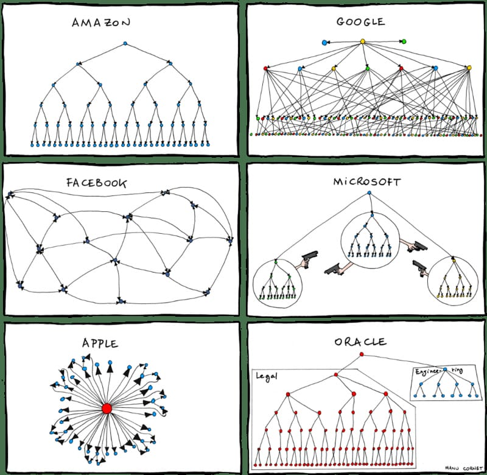
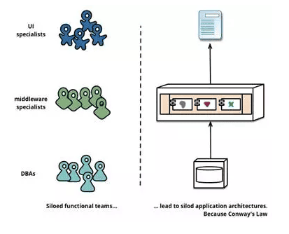
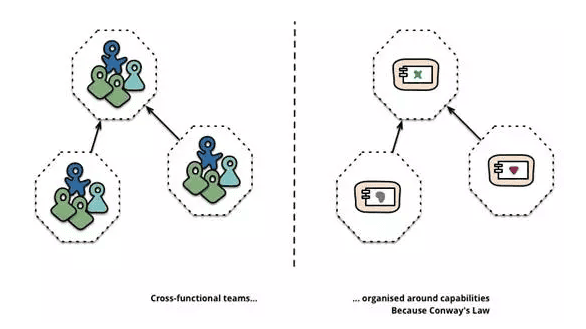

# 康威定律

康威定律是马尔文·康威1967提出的：

> “设计系统的架构受制于产生这些设计的组织的沟通结构。”

通俗的来讲：**产品必然是其（人员）组织沟通结构的缩影**。

跨部门沟通是非常难的，系统各个模块的接口也反映了它们之间的信息流动和合作方式。

康威定律可谓软件架构设计中的第一定律，起初只是在杂志上的发表，后经过《人月神话》这本软件界圣经的引用，并命名为康威定律（Conway’s law），因此得以推广。

只通过简单的描述可能无法理解康威定律的精髓所在，原文中康威定律可总结为四个定律：

> 第一定律 组织沟通方式会通过系统设计表达出来。
> 第二定律 时间再多一件事情也不可能做的完美，但总有时间做完一件事情。
> 第三定律 线型系统和线型组织架构间有潜在的异质同态特性。
> 第四定律 大的系统组织总是比小系统更倾向于分解。

## 第一定律

> Communication dictates design。
> 组织沟通方式决定系统设计。

这条定律重点是讲组织架构和沟通对系统设计的影响。组织的沟通和系统的设计之间紧密相连，特别是复杂系统，解决好人与人的沟通才能有一个更好的系统设计。

《人月神话》中总结出了随着人员的增加沟通成本呈指数增长的规律：沟通成本 = n(n-1)/2。举例说明一下：

5人项目组，需要沟通的渠道是 5*(5–1)/2 = 10

15人项目组，需要沟通的渠道是15*(15–1)/2 = 105

50人项目组，需要沟通的渠道是50*(50–1)/2 = 1,225

150人项目组，需要沟通的渠道是150*(150–1)/2 = 11,175

**这也是为什么互联网公司都追求小团队的原因之一。

沟通的问题会带来系统设计的问题，进而影响整个系统的开发效率和最终产品结果。**

## 第二定律

> There is never enough time to do something right, but there is always enough time to do it over。
> 时间再多一件事情也不可能做的完美，但总有时间做完一件事情。

人手永远是不够的，事情永远是做不完的，但可以一件一件来。这不就是软件行业中“敏捷开发”模式所解决的问题吗。面对这样的状况，敏捷开发可以做到不断迭代、持续交付、快速验证和反馈，并持续改进。

再牛的开发也会写出bug，再全面的测试覆盖率也无法测出所有的问题。解决方案不是消灭这些问题，是容忍一些问题的存在，然后通过适当的设计（冗余、监控、高可用设计）当问题发生时能够快速解决。

**几个开发人员的小公司，去追求微服务、去追求中台架构，这是追求完美吗？不是，是找死。**

**好的架构不是买来的，也不是设计出来的，而是根据业务落地生根长期演化来的。**

> 在系统真正地投入生产使用之前，再好的架构都只是假设，产品越晚被使用者使用，失败的成本和风险就越高，而小步行进，通过MVP快速实验，获取客户反馈，迭代演化产品，能有效地减少失败的成本和风险。

> 另外，多年的经验告诉我，架构，平台不是买来的，也不是用一个开源就能获得的，也不是设计出来，而是长期演化才能落地生根的。

## 第三定律

> There is a homomorphism from the linear graph of a system to the
> linear graph of its design organization。 线型系统和线型组织架构间有潜在的异质同态特性。

这一定律是第一定律的具体应用。想象一下如果公司的组织架构是这样的：团队是分布式，每个团队都包含产品、研发、测试、运维等角色。而此时系统是单块的，项目沟通和协调的成本是巨大的，弄不好还会打起来。

如果将单块的系统拆分成微服务，每个团队负责自己的部分，对外提供对应的接口即可，互不干扰。系统效率将得到提升。这与软件设计中的高内聚、低耦合是相通的。

**直白的说就是想要什么的系统就搭建什么样的团队，有什么样的团队就搭建什么样的系统。**需要前后端分离的系统就搭建前后端分离的团队，反之，拥有前后端分离的团队，可以设计前后端分离的系统。当然，如果能统筹管理，拥有重组团队或设计系统架构的权利，那就再好不过了。通常情况下让两者形成1：1的映射关系，更加高效。

## 第四定律

> The structures of large systems tend to disintegrate during development, qualitatively more so than with small systems。
> 大的系统组织总是比小系统更倾向于分解。

**“话说天下大势，分久必合，合久必分。”**

系统越复杂，越需要增加人手，人手越多，沟通成本也呈指数增长。分而治之便是大多数公司选择的解决方案。分不同的层级，分不同的小团队，让团队内部完成自治理，然后统一对外沟通。

**架构不仅仅需要技术，在大公司尤其需要政治，所谓的架构的政治。**

杨波老师曾在他的文章《每个架构师都应该研究下康威定律》中提到：

> “政治指的是和他人协作将事情搞定的艺术，架构是一种社交活动，在技术的世界里，个人主义很容易被打败，即使你的目的是好的技术是最优的，技术决策是政治决策（technical decisions are political decisions），一个技术产品，一波人可以做，另一波人也可以做，到底谁做的好，真不好说，不管谁做，都给业务套上了一副手铐。”

> 我刚入软件开发这个行业之初，谈的架构主要是性能，高可用等等。现在，见过无数遗留系统，特别是国内企业 IT 的现状，无数高耦合的遗留系统，不良的架构像手铐一样牢牢地限制住业务，升级替换成本非常巨大， 所以我更加关注可理解，可维护性，可扩展性，成本 。我想补充一句，创业公司创业之初获得好的架构师或技术 CTO 非常重要。

## 总结

- 架构是由组织关系来决定的。
- 架构不仅要服务于技术，更要服务于人。
- 没有最好的架构，只有最合适的架构。