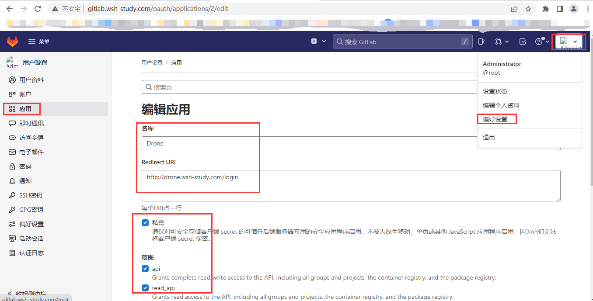
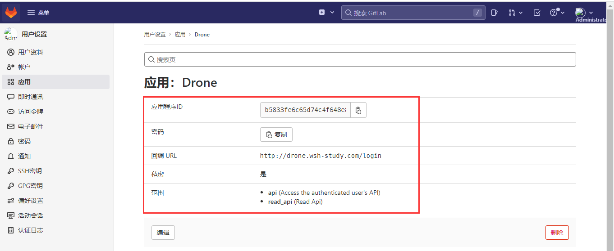
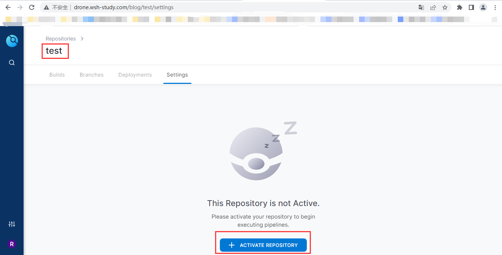
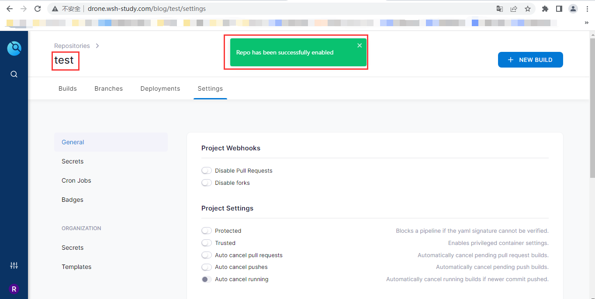
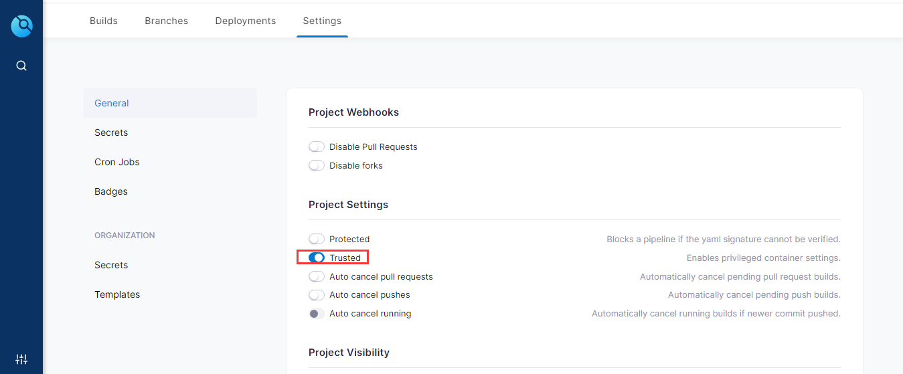
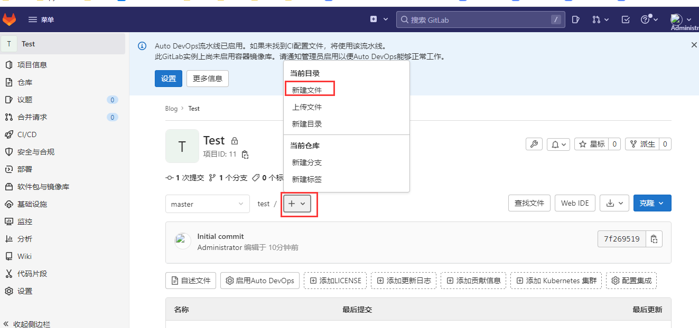
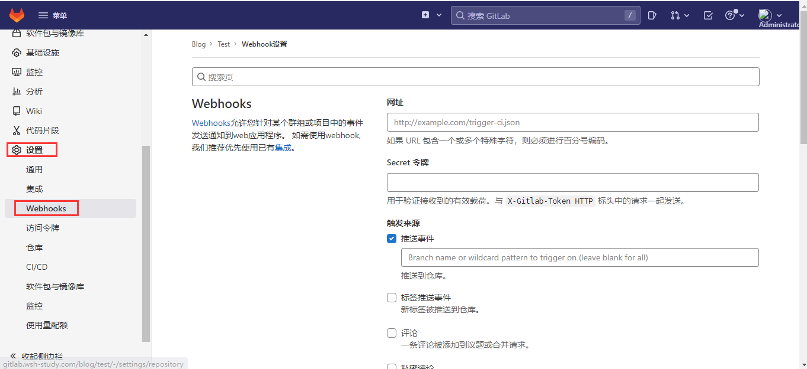
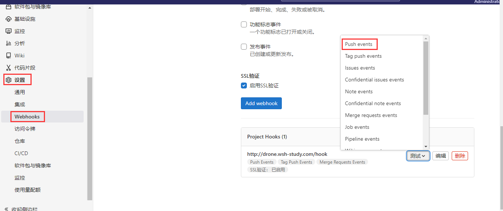
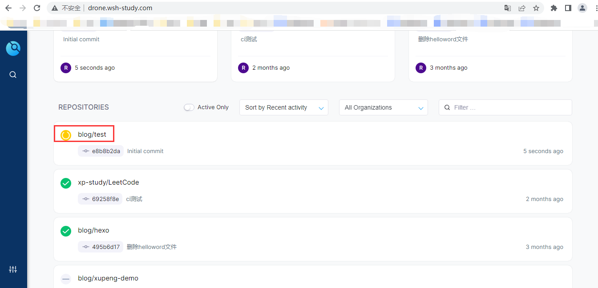
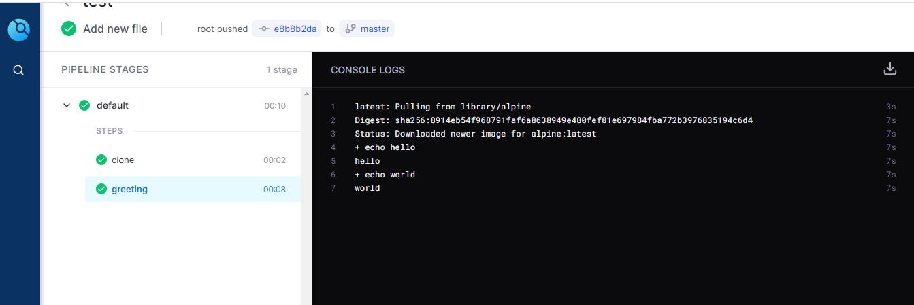

## gitlab+drone环境搭建

### 概述

drone是一个持续集成化工具，能够使用强大的云原生管道引擎自动化他们的构建、测试和发布工作流；
**简单来说**：类似写shell脚本，只是脚本内容不一样；
其他持续集成工具，如：jenkins、gitlab-cicd；

### 环境准备

- linux系统
- docker

### 动手操作

#### 容器部署gitlab

[**gitlab详细安装步骤,点击这里**](http://docs.wsh-study.com/%E5%BC%80%E5%8F%91%E7%8E%AF%E5%A2%83%E6%90%AD%E5%BB%BA/Gitlab%E7%8E%AF%E5%A2%83%E6%90%AD%E5%BB%BA/%E4%BD%BF%E7%94%A8Docker%E9%83%A8%E7%BD%B2Gitlab/)

#### 创建 OAuth 应用程序（ Application）

* 创建一个 GitLab OAuth 应用程序。Consumer Key 和 Consumer Secret `用于授权Drone访问 GitLab 资源`。

> 注意：这里我提前在gitlab创建好了test仓库（空仓库），用于我们下面的演示；

* `Application URL`地址是`Drone服务地址后必须跟一个/login`。例：`http://drone.wsh-study.com/login`



- Application生成的Consumer ID和 Consumer Secret，下面我们会用于安装Drone，gitlab授权drone：



#### 容器部署Drone

Drone部署需要安装`drone-server`（Drone与流行的源代码控制管理提供商无缝集成） WEB界面和`docker-runner`守护进程执行器

- 创建一个`共享密钥`，用于drone-runner和drone-server之间的通信：

```
[root@master drone]# openssl rand -hex 16
8172cd9155d16593d4f6a445b70e2d6e
```

- 部署drone-server：

```shell
  docker run  --volume=/opt/drone:/data \
  --env=DRONE_GITLAB_SERVER=http://gitlab.wsh-study.com/ \ 
  --env=DRONE_GITLAB_CLIENT_ID=b5833fe6c65d74c4f648e893c1426e9e66d97304d56bad86360eddeb59371713 \ 
  --env=DRONE_GITLAB_CLIENT_SECRET=6fdffd3de1b66e1053d482830e690df630bdf624490b4312e15a81879acfc14e \ 
  --env=DRONE_RPC_SECRET=1160fe98c5fcf55a3ddcdba21bae59a8 \ 
  --env=DRONE_SERVER_HOST=drone.wsh-study.com \ 
  --env=DRONE_SERVER_PROTO=http \  
  --publish=8780:80 \
  --publish=8743:443 \
  --restart=always \
  --detach=true \
  --name=drone \
  --env=DRONE_USER_CREATE=username:root,admin:true drone/drone:2
```

```shell
  * drone启动参数很多，下面解释下：
    + DRONE_GITLAB_SERVER： GitLab 服务器 url，默认https://github.com
    + DRONE_GITLAB_CLIENT_ID： GitLab oauth 客户端 ID（必填项）
    + DRONE_GITLAB_CLIENT_SECRET： GitLab oauth 客户端密码 （必填项）
    + DRONE_RPC_SECRET： 验证服务器和运行器之间的 rpc 连接（drone-server和drone-runner连接时必填项）
    + DRONE_SERVER_HOST： 提供drone服务主机名或 IP 地址 （必填项）
    + DRONE_SERVER_PROTO： drone服务使用的协议 （必填项）
    + DRONE_USER_CREATE： Drone管理员用户创建
```

- 部署drone-runner

```shell
  docker run --detach \  
  --volume=/var/run/docker.sock:/var/run/docker.sock \
  --env=DRONE_RPC_PROTO=http \ 
  --env=DRONE_RPC_HOST=drone.wsh-study.com \
  --env=DRONE_RPC_SECRET=1160fe98c5fcf55a3ddcdba21bae59a8 \ 
  --env=DRONE_RUNNER_CAPACITY=2 \   
  --env=DRONE_RUNNER_NAME=drone-runner \   
  --publish=3000:3000 \
  --restart=always \
  --name=runner \
  drone/drone-runner-docker:1
```

```
  * drone-runner启动参数很多，下面解释下：
    + DRONE_RPC_PROTO： 用于连接 Drone 服务器的协议
    + DRONE_RPC_HOST： 提供 Drone 服务器的主机名
    + DRONE_RPC_SECRET： 用于向 Drone 服务器进行身份验证的共享密钥
    + DRONE_RUNNER_CAPACITY： 限制运行器可以执行的并发管道的数量
    + DRONE_RUNNER_NAME： 设置runner的名字
```

- 验证drone-runner是否连接上drone-server（`successfully pinged the remote server`）：

```shell
[root@master drone]# docker logs -ft runner
2022-05-10T05:21:02.637256271Z time="2022-05-10T05:21:02Z" level=info msg="starting the server" addr=":3000"
2022-05-10T05:21:02.640121666Z time="2022-05-10T05:21:02Z" level=info msg="successfully pinged the remote server"
2022-05-10T05:21:02.640157924Z time="2022-05-10T05:21:02Z" level=info msg="polling the remote server" arch=amd64 capacity=2 endpoint="http://192.168.200.30:82" kind=pipeline os=linux type=docker
```

- 浏览器访问drone-server Web界面(`http://drone.wsh-study.com/`)，点击继续：


- 点解继续后，会跳转到这个Application URL地址（`http://drone.wsh-study.com/`）gitlab给Drone（Application）授权

- 注册drone用户

- 点击Drone右上角SYNC（同步），进入我们的test仓库下激活存储库





* 并`开启Trusted`特权容器(docker-runner在使用docker执行器时，类似使用root权限)



> ```
> 注意`：这里还有一个问题，如果出现没有Trusted选项的情况，需要在启动运行drone-server服务是添加：`--env=DRONE_USER_CREATE=username:root,admin:true
> ```

#### 流水线脚本编写.drone.yml

- 在gitlab依次点击，创建`.drone.yml`文件：

  

- .drone.yml文件内容（写的比较简单，`主要了解流水线操作流程`），如下：

```shell
kind: pipeline
type: docker
name: default

steps:
- name: greeting
  image: alpine
  commands:
  - echo hello
  - echo world
```

> .drone.yml文件属性解释：
>
> - kind：定义了对象的种类，此示例定义了一个pipeline（管道）对象；
> - type：定义pipeline（管道）的类型，此示例定义了一个 Docker 管道，其中每个管道步骤都在 Docker 容器内执行；
> - name：定义了pipeline（管道）的名称；
> - steps：定义了一系列串行执行的pipeline（管道）步骤，出现一个步骤失败，立即退出；

> ```
> * name：定义管道步骤的名称；
> * image：定义了一个执行 shell 命令的 Docker 镜像；
> * commands：在docker容器内执行shell命令；
> ```

#### 流水线触发

- 在自己项目下（test）点击：`settings-->webhooks`:



- 这里不需要再次创建webhooks（挂钩），Drone连接后会`自动创建一个默认的webhooks`：



- 回到drone会看到,我们编写的流水线文件被`自动触发`（之后gitlab仓库代码更新或上传新代码都会自动触发）.drone.yml：



- 点击我们的流水线，可以查看流水线`详细步骤、步骤的状态和步骤的logs`：

