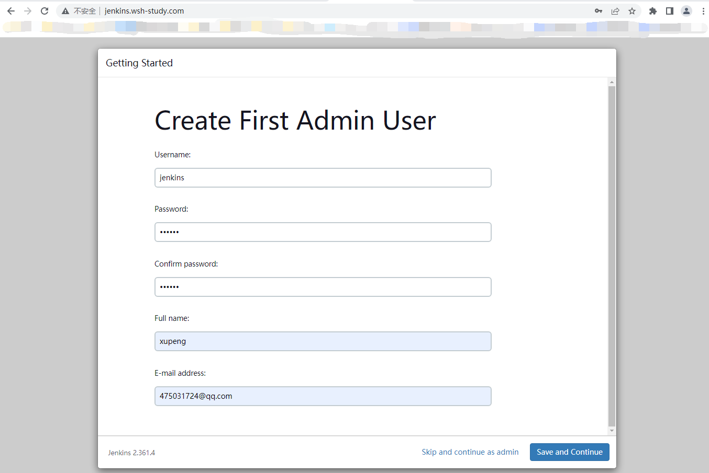

#### 通过本文可以了解哪些

- 通过Docker部署Jenkins
- 使用Jenkins一键部署Springboot项目
- 整合GitLab实现上传代码自动部署项目

#### 如下Jenkins安装及配置过程

##### 1、拉取代码

```shell
docker pull jenkins/jenkins:lts
```


##### 2、创建并启动容器：

在构建的过程，由于我本身`Ubuntu20.04`已经安装`JDK`、`Maven`了，所以在这我就直接指定本地环境变量了，当然，如果你不指定的话，安装完Jenkins后还是可以在`全局工具配置`中修改的：

```shell
docker run --name=jenkins --privileged=true \
-u root \
-d \
-p 10001:8080 \
-p 10002:50000 \
-v /var/run/docker.sock:/var/run/docker.sock \
-v /usr/bin/docker:/usr/bin/docker \
-v $(which docker):/usr/bin/docker \
-v /etc/sysconfig/docker:/etc/sysconfig/docker \
-v /opt/java/jdk1.8.0_181:/usr/java/jdk1.8.0_181 \
-v /opt/maven/apache-maven-3.3.9:/usr/local/maven \
-v /opt/maven/repo:/usr/local/maven_repository \
-v /opt/jenkins/jenkins-data:/var/jenkins_home \
jenkins/jenkins:lts
```


为保证能够在公网上访问jenkins,这里做了nginx代理

```shell
server {
        listen       80;
        server_name jenkins.wsh-study.com;
        location ^~ {
                proxy_set_header HOST $host;
                proxy_set_header X-Forwarded-Proto $scheme;
                proxy_set_header X-Real-IP $remote_addr;
                proxy_set_header X-Forwarded-For $proxy_add_x_forwarded_for;
                proxy_pass http://127.0.0.1:10001;
        }
  }
```

nginx代理配置放在`/etc/nginx/conf.d`目录下，实际配置如下图:


执行`nginx -t`指令校验nginx语法是否有错误,出现下图所示结构,就重载nginx配置了


重载nginx配置,执行指令`nginx -s reload`

修改完nginx配置后在浏览器输入：http:/jenkins.wsh-study.com 访问。

管理员密码需要我们在`log`中查询：

```shell
docker logs jenkins
```


##### 3、安装推荐的插件

输入密码登陆后，会弹出插件安装提示，我们在这选择**安装推荐的插件**：


接下来就进入漫长的等待状态~


##### 4、创建管理员账号

安装之后，接下来创建一个账号：



进行实例地址配置，该地址将作为将来`Jenkins`的访问地址：


至此，保存并完成，会重启`Jenkins`，然后我们可以通过刚刚创建的账户登录「使用管理员root也可以」：


##### 5、Maven配置修改

之前我们创建容器时复用了本地宿主机的`Maven环境变量`，但是安装完`Jenkins`后还是要指定一下`Maven`目录的，依次进入：`系统管理` > `全局工具配置`


首先是顶部的`Maven`，我们选择`文件系统中的setting`文件，`文件路径`使用创建容器时指定的`Maven`路径 `usr/local/maven`：`/usr/local/maven/conf/settings.xml`


然后拉到最下边`Maven`节点，点击`新增Maven`，起一个名字，然后指定`maven路径`，去掉`自动安装`的选项，然后`应用>保存`：


##### 6、新建一个任务

然后我们新建一个任务，选择构建一个`自由风格的软件项目`：


点击确定之后会跳入配置界面，接下来就是配置我们的自动化操作，首先是配置项目的拉取地址，在这我是基于Gitlab的，


点击添加GitLab的账户密码，不添加时会报红，是没法在GitLab中拉取代码的：

接着我们选择一下构建指令`执行shell`：


```shell
#!/bin/bash 
result=$(docker ps | grep "harbor.wsh-study.com/public/xupeng-demo")
if [[ "$result" != "" ]];then
    echo "stop harbor.wsh-study.com/public/xupeng-demo" 
    docker stop harbor.wsh-study.com/public/xupeng-demo
fi

result1=$(docker ps -a | grep "harbor.wsh-study.com/public/xupeng-demo")
if [[ "$result1" != "" ]];then
    echo "rm harbor.wsh-study.com/public/xupeng-demo" 
    docker rm harbor.wsh-study.com/public/xupeng-demo
fi

result2=$(docker images | grep "harbor.wsh-study.com/public/xupeng-demo")
if [[ "$result2" != "" ]];then
    echo "rmi harbor.wsh-study.com/public/xupeng-demo:latest" 
    docker rmi harbor.wsh-study.com/public/xupeng-demo:latest
fi
```

这个地方解释一下为啥要用到shel脚本，这个脚本有两个操作，首先是通过 `docker ps | grep "harbor.wsh-study.com/public/xupeng-demo"`查询是否存在容器，如果存在的话则`stop`停止容器，然后再`rm`删除容器，第二步是通过 `docker images | grep "harbor.wsh-study.com/public/xupeng-demo"`查看是否存在该镜像，如果存在则 `rmi` 删除该镜像，为啥要删除镜像+容器？其实这样是帮助我们把每次自动化构建镜像、容器之前都把旧的给删除掉。

> `"harbor.wsh-study.com/public/xupeng-demo" 是我项目打包后的镜像名称，组成规则为：镜像地址/项目名称`

然后添加Maven指令，用于构建项目，简单说一下这个地方，我在项目的 `pom.xml`，文件中使用了 `docker-maven-plugin` 插件，同时替换了 `mvn pavkage` 指令，当每次执行该命令时就会自动提交至harbor仓库。


```shell
clean package
```

如下是SpringBoot项目 `pom.xml` 文件中的插件编写，已经把注释写的很清楚了：

```xml
<?xml version="1.0" encoding="UTF-8"?>
<project xmlns="http://maven.apache.org/POM/4.0.0" xmlns:xsi="http://www.w3.org/2001/XMLSchema-instance"
         xsi:schemaLocation="http://maven.apache.org/POM/4.0.0 https://maven.apache.org/xsd/maven-4.0.0.xsd">
    <modelVersion>4.0.0</modelVersion>
    <parent>
        <groupId>org.springframework.boot</groupId>
        <artifactId>spring-boot-starter-parent</artifactId>
        <version>2.7.5</version>
        <relativePath/> <!-- lookup parent from repository -->
    </parent>
    <groupId>com.example</groupId>
    <artifactId>xupeng-demo</artifactId>
    <version>latest</version>
    <name>xupeng-demo</name>
    <description>Demo project for Spring Boot</description>
    <properties>
        <java.version>1.8</java.version>
    </properties>
    <dependencies>
        <dependency>
            <groupId>org.springframework.boot</groupId>
            <artifactId>spring-boot-starter-web</artifactId>
        </dependency>

        <dependency>
            <groupId>org.springframework.boot</groupId>
            <artifactId>spring-boot-starter-test</artifactId>
            <scope>test</scope>
        </dependency>
    </dependencies>

    <build>
        <plugins>
            <plugin>
                <groupId>org.springframework.boot</groupId>
                <artifactId>spring-boot-maven-plugin</artifactId>
            </plugin>

            <plugin>
                <groupId>com.spotify</groupId>
                <artifactId>docker-maven-plugin</artifactId>
                <version>1.0.0</version>
                <!--将插件绑定在某个phase执行-->
                <executions>
                    <execution>
                        <id>build-image</id>
                        <!--将插件绑定在package这个phase上。也就是说，用户只需执行mvn package ，就会自动执行mvn docker:build-->
                        <phase>package</phase>
                        <goals>
                            <goal>build</goal>
                        </goals>
                    </execution>
                </executions>
                <configuration>
                    <!--指定生成的镜像名-->
                    <imageName>harbor.wsh-study.com/public/${project.artifactId}</imageName>
                    <!--指定标签-->
                    <imageTags>
                        <imageTag>${project.version}</imageTag>
                    </imageTags>
                    <!-- 指定 Dockerfile 路径 ${project.basedir}：项目根路径下-->
                    <dockerDirectory>${project.basedir}</dockerDirectory>
                    <!--指定远程 docker api地址-->
                    <dockerHost>http://172.17.0.1:2375</dockerHost>
                    <!-- 这里是复制 jar 包到 docker 容器指定目录配置 -->
                    <resources>
                        <resource>
                            <targetPath>/</targetPath>
                            <!--jar 包所在的路径 此处配置的 即对应 target 目录-->
                            <directory>${project.build.directory}</directory>
                            <!-- 需要包含的 jar包 ，这里对应的是 Dockerfile中添加的文件名　-->
                            <include>${project.build.finalName}.jar</include>
                        </resource>
                    </resources>
                    <!-- 以下两行是为了docker push到DockerHub使用的。 -->
                    <serverId>docker-harbor-registry</serverId>
                    <registryUrl>https://harbor.wsh-study.com</registryUrl>
                    <pushImage>true</pushImage>
                </configuration>
            </plugin>
        </plugins>


    </build>

</project>

```

接下来再添加一个`执行shell`，用来执行构建容器：

```shell
docker run --rm  -d -p 4000:4000 --name xupeng-demo  harbor.wsh-study.com/public/xupeng-demo:latest
```


到这，我们就可以运行一下了，点击`立即构建`，然后通过点击 `Build History` 中的 `控制台输出`


等待一会，最后看到下图所示，`BUILD SUCCESS` 就可以了


然后我们在`harbor`私有镜像仓库看一下是否推送：


在服务器端使用nginx代理端口后,就可以在浏览器访问了。


##### 7、创建Gitlab钩子

我们要实现的最终效果是一上传代码就帮我们自动执行如上整个过程~，那么我们需要配合Gitlab的钩子实现，首先我们先去`系统管理` > `插件管理` 安装 `GitLab` 插件。


安装后我们进入项目配置界面，切换至`构建触发器`：


选择高级->复制密钥


我们复制这个链接和密钥，然后进入GitLab项目中的 `setting` > `Webhooks` 「注意，这里是项目中的，非GitLab的setting配置」：


然后我们再回到之前界面重新添加一下链接，点击`Add webhook`配置之后测试一下,出现200则说明成功了：


到这基本就完成自动化创建了，只要上传代码就能完成构建了，比如我们通过Idea上传代码至GitLab，那么Jenkins就会帮我们实现自动化部署了。